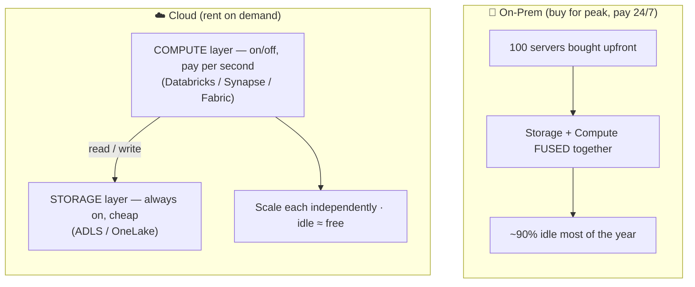

# Topic 1 — Why Cloud for Data Engineering

> **Azure Cloud · Phase 0 · Fundamentals · Lesson 1 of 4.** Before any Azure
> service, understand the *one idea* that makes cloud data engineering possible:
> **separating compute from storage.** Miss this and everything else is memorization.

> 🎯 **First principle (DE-2026):** you don't own this until you can **BUILD** (spin
> up a free Azure account and see the service catalog), **BREAK** (reason through
> what happens to an on-prem cluster during OrderIQ's Black Friday spike), and
> **EXPLAIN** compute/storage separation in plain words. [`practice.md`](./practice.md) drives it.

---

## 0. WHY this exists

Your SQL, Python, Spark, and data models all have to **run somewhere**. That
"somewhere" used to be servers a company bought and kept in a room. Today it's the
cloud. Understanding *why* the industry moved — and the single architectural idea
that made big-data cloud possible — is what turns you from "someone who clicks
Azure buttons" into "someone who designs data platforms."

🗣️ **In plain words:** the cloud is just *renting* someone else's computers by the
minute instead of *buying* your own. But that one change — rent vs buy — rewires
how you build everything.

**Where a DE uses this:** every architecture decision. Why is data in a lake and
not the warehouse? Why does the cluster shut off at night? Why do we pay for
storage and compute separately? All of it flows from this lesson.

---

## 1. The old world — on-premises ("on-prem")

A company bought physical servers, put them in a data center, and ran everything on them.

To handle OrderIQ's busiest day (Black Friday), they had to buy enough machines for
**peak** load — say 100 servers. The other 360 days a year, those 100 servers sat
~90% idle, still costing money, power, cooling, and staff.

**The on-prem pain list:**

| Problem | What it means |
|---------|---------------|
| **Capacity planning** | Guess your peak years ahead. Guess low → you crash on Black Friday. Guess high → you burn money on idle machines. |
| **Huge upfront cost** | ₹ crores of hardware *before* processing a single row (CapEx). |
| **Slow to scale** | Need more power? Order servers, wait weeks, rack them, configure them. |
| **You maintain everything** | Failed disk at 2 AM? Your team fixes it. Power, cooling, security — all yours. |
| **Wasted capacity** | You pay for peak 24/7 but use it a few days a year. |

🗣️ **In plain words:** on-prem is like buying a 100-seat wedding hall because you
throw one big wedding a year — and paying rent, cleaning, and electricity on all
100 seats every single day even when nobody's there.

---

## 2. The cloud shift — rent, don't buy

The cloud (Azure, AWS, GCP) rents you computers, storage, and services **on demand,
by the minute**. You run 100 machines for Black Friday's 6 hours, then shut 90 off.
You pay only for what you use.

| On-prem | Cloud |
|---------|-------|
| Buy hardware (CapEx, upfront ₹crores) | Rent by the minute (OpEx, pay-as-you-go) |
| Fixed capacity — plan for peak | **Elastic** — scale up and down on demand |
| Weeks to add servers | Seconds to add servers |
| You maintain hardware | Cloud provider maintains it |
| Pay for idle 24/7 | Pay only when running |

### The four cloud superpowers a DE relies on

1. **Elasticity** — grow and shrink resources to match load automatically.
2. **Pay-as-you-go** — cost follows usage, not peak capacity.
3. **Managed services** — the provider runs the hard parts (patching, replication, uptime) so you build pipelines, not babysit servers.
4. **Global + durable storage** — store unlimited data cheaply, replicated so it (almost) never gets lost.

🗣️ **In plain words:** cloud = rent the wedding hall only on the wedding day, in
exactly the size you need, and the owner handles cleaning and power. You focus on
the wedding (the data pipeline), not the building.

---

## 3. The ONE big idea — separating compute from storage ⭐

This is the concept the whole lesson exists for. Learn it cold.

**On-prem and old databases tied compute and storage together.** The same machines
that *stored* your data also *processed* it. To store more data, you were forced to
buy more processing power too — even if you didn't need it. And vice versa.

**The cloud separates them into two independent layers:**

- **Storage layer** (e.g., Azure Data Lake / OneLake) — holds the data. Cheap.
  Scales on its own. Always there, even when nothing is running.
- **Compute layer** (e.g., Databricks / Synapse Spark) — the engines that *read*
  the storage, process it, and write results. You turn these **on** to run a job
  and **off** when done.

```
        ┌─────────────── COMPUTE (turn on/off, pay per second) ───────────────┐
        │   Databricks cluster   Synapse pool   Fabric engine   ...            │
        └───────────────┬───────────────┬───────────────┬─────────────────────┘
                        │ read/write     │               │
        ┌───────────────▼───────────────▼───────────────▼─────────────────────┐
        │        STORAGE — ADLS Gen2 / OneLake (cheap, always-on, durable)     │
        │        OrderIQ bronze/silver/gold data lives here                    │
        └──────────────────────────────────────────────────────────────────────┘
```

**Why this changes everything for a DE:**

- **Store 50 TB cheaply, compute only when needed.** OrderIQ's full history sits in
  storage for pennies; you spin up a cluster for the nightly job, then it shuts off.
- **Scale each independently.** Data doubled but jobs are the same? Grow storage,
  leave compute alone. Job too slow but data's the same? Grow compute for that job only.
- **Many engines, one copy of data.** Databricks, Synapse, and Power BI can all read
  the *same* files in the lake. No copying data into each tool.
- **Idle = nearly free.** Storage costs a little; compute costs *nothing* when off.
  This is why cloud jobs are designed to run and then terminate.

🗣️ **In plain words:** old systems were like a fridge with the cook built in — want
more food storage, you're forced to buy another cook. Cloud splits them: a big
cheap fridge (storage) that's always on, and cooks (compute) you hire by the hour
and send home when the meal's done.

> This separation is the reason the **medallion architecture** (Bronze/Silver/Gold
> in the lake) and **lakehouse** designs exist — you'll build exactly this in Azure.

---

## 4. Cloud service models — IaaS / PaaS / SaaS (know the ladder)

How much does the provider manage vs you?

| Model | You manage | Provider manages | Data-eng example |
|-------|-----------|------------------|------------------|
| **IaaS** (Infrastructure) | OS, runtime, app, data | Just the hardware/VM | A raw Azure VM you install Spark on |
| **PaaS** (Platform) | Your code + data | OS, runtime, scaling, patching | **Azure Databricks, ADF, Synapse** |
| **SaaS** (Software) | Just your data/usage | Everything else | **Microsoft Fabric**, Power BI |

🗣️ **In plain words:** IaaS = rent an empty kitchen, you bring everything. PaaS =
rent a kitchen with appliances installed, you just cook. SaaS = order the finished
meal. Most Azure DE work lives at **PaaS** (Databricks/ADF/Synapse), and Microsoft
is pushing hard toward **SaaS** with Fabric.

---

## 5. The 3-step example — from idea to OrderIQ to production

### Step 1 — the tiny mechanic (rent vs buy, one number)

> You need 100 servers for 6 hours once a year.
> - **On-prem:** buy 100 servers, pay 365 days. Utilization ≈ 6h/8760h ≈ **0.07%**.
> - **Cloud:** rent 100 servers × 6 hours. Pay for **6 hours**. Same work, ~1500× less waste.

### Step 2 — OrderIQ e-commerce (a real workload shape)

```
OrderIQ nightly ETL:
  • Storage (ADLS): 8 TB of order history — sits there 24/7, cheap.
  • Compute (Databricks): spins up at 2 AM, processes yesterday's orders
    (bronze → silver → gold), writes results back to storage, SHUTS OFF at 2:40 AM.
  → You pay ~40 minutes of compute/day + cheap always-on storage. Not 24h of servers.
```

### Step 3 — production spike (elasticity in action)

```
Black Friday: order volume 20× normal.
  • Storage: unchanged — just holds more files.
  • Compute: autoscale the Databricks cluster 5 → 100 nodes for the evening,
    back to 5 by midnight. Storage never had to change.
This is compute/storage separation + elasticity doing the work. On-prem could not
do this without buying 100 nodes permanently.
```

---

## 6. Diagram — on-prem vs cloud



---

## 7. 🗣️ Plain-words recap

- **On-prem** = buy servers for peak, pay 24/7, maintain everything, wait weeks to scale.
- **Cloud** = rent by the minute, scale in seconds, provider maintains it, pay for what you use.
- **Four superpowers:** elasticity, pay-as-you-go, managed services, cheap durable storage.
- **The big idea — separate compute from storage:** cheap always-on storage holds
  the data; compute engines turn on to process it and off when done. Scale each
  alone; many engines read one copy; idle is nearly free.
- **Service models:** IaaS (you manage most) → PaaS (Databricks/ADF/Synapse) → SaaS (Fabric). Azure DE lives mostly at PaaS, moving toward SaaS.

---

## 8. Revision — read before closing

The cloud didn't just move servers to someone else's building — it **split storage
from compute**, and that split is the foundation of every modern data platform. On
old systems, storing more forced you to buy more processing and vice versa. In the
cloud, a cheap always-on storage layer (ADLS/OneLake) holds your data while compute
engines (Databricks/Synapse/Fabric) spin up to process it and shut down after,
costing nothing when idle. That's why cloud jobs run-then-terminate, why one copy
of lake data can feed many engines, and why elasticity (5 → 100 nodes for Black
Friday, back to 5) is possible at all. Pair this with the service-model ladder
(IaaS → PaaS → SaaS) and you can already read any Azure architecture diagram and
say what's storage, what's compute, and who manages what. Next lesson grounds this
in Azure's actual structure: subscriptions, resource groups, regions, and the cost model.

---

## 9. Test yourself — 10 questions (answers hidden — think first)

<details><summary>1. In one line, what is "the cloud"?</summary>
Renting computers, storage, and services on demand by the minute instead of buying and maintaining your own.
</details>
<details><summary>2. Give two concrete pains of on-prem for a spiky workload.</summary>
You must buy for peak (idle capacity 24/7), and scaling up takes weeks (order + rack + configure hardware).
</details>
<details><summary>3. What does "separating compute from storage" mean?</summary>
Data lives in a cheap always-on storage layer; separate compute engines turn on to read/process it and off when done — the two scale and are billed independently.
</details>
<details><summary>4. Why is idle "nearly free" in the cloud but not on-prem?</summary>
Cloud compute can be turned off (you stop paying); storage is cheap. On-prem hardware costs money 24/7 whether used or not.
</details>
<details><summary>5. Name the four cloud superpowers.</summary>
Elasticity, pay-as-you-go, managed services, cheap durable storage.
</details>
<details><summary>6. During Black Friday, what scales and what stays the same for OrderIQ?</summary>
Compute autoscales (5→100 nodes); storage just holds more files, unchanged. Because they're separated.
</details>
<details><summary>7. IaaS vs PaaS vs SaaS in one line each.</summary>
IaaS = rent hardware, you install everything. PaaS = managed platform, you bring code/data (Databricks/ADF). SaaS = finished software, you just use it (Fabric/Power BI).
</details>
<details><summary>8. Which model do most Azure DE tools sit in?</summary>
PaaS (Databricks, ADF, Synapse) — with Microsoft pushing toward SaaS via Fabric.
</details>
<details><summary>9. Why can Databricks, Synapse, and Power BI all use the same lake data?</summary>
Because storage is separated from compute — many compute engines can read one copy of the data in the lake, no duplication.
</details>
<details><summary>10. CapEx vs OpEx — which is on-prem, which is cloud?</summary>
On-prem = CapEx (big upfront hardware buy). Cloud = OpEx (ongoing pay-as-you-go).
</details>

---

## 10. Practice

👉 [`practice.md`](./practice.md) — create your **free Azure account**, explore the
service catalog, and do reasoning drills that make the compute/storage split and
elasticity concrete on OrderIQ workloads. BUILD → BREAK → EXPLAIN.

---

*Next: [Topic 2 — Azure Basics (subscriptions, resource groups, regions, cost model)](../topic-2-azure-basics/).*
