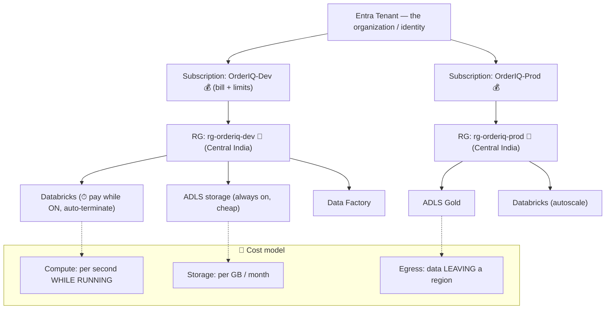

# Topic 2 — Azure Basics: Subscriptions, Resource Groups, Regions & the Cost Model

> **Azure Cloud · Phase 0 · Fundamentals · Lesson 2 of 4.** Before you build a
> single pipeline, you must understand how Azure is *organized* — because every
> resource you create lives inside this hierarchy, and every rupee you spend is
> tracked through it.

> 🎯 **First principle:** you don't own this until you can **BUILD** (create a
> resource group in the correct region for OrderIQ), **BREAK** (reason through a
> surprise bill from a cluster left running / wrong-region data transfer), and
> **EXPLAIN** the tenant→subscription→RG→resource hierarchy in plain words.
> [`practice.md`](./practice.md) drives it.

---

## 0. WHY this exists

In the last lesson you learned cloud = rent compute + storage. But *where* do those
rented things live, *who pays* for them, and *how do you keep them organized* so a
company with 500 resources doesn't descend into chaos?

Azure answers this with a strict **hierarchy** and a **cost model**. Get these wrong
and you get two classic disasters: a **surprise ₹-lakh bill**, and a **mess of
un-findable resources** nobody can clean up.

🗣️ **In plain words:** think of Azure like a big office building. There are floors
(subscriptions), rooms (resource groups), and furniture (resources). And there's a
meter on everything you switch on. This lesson is the building map + the electricity bill.

**Where a DE uses this:** every day. You create resources into resource groups, you
pick regions for latency and cost, and you get asked "why did our Azure bill jump?"

---

## 1. The Azure hierarchy (top to bottom)

```
Microsoft Entra Tenant   (your organization's identity boundary)
        │
        ▼
   Management Groups      (optional: group many subscriptions for big orgs)
        │
        ▼
   Subscription           (the BILLING + limits boundary — one invoice)
        │
        ▼
   Resource Group (RG)    (a folder for related resources; share lifecycle)
        │
        ▼
   Resource               (the actual thing: storage account, Databricks, ADF…)
```

### Each level, in one line

| Level | What it is | DE mental model |
|-------|-----------|-----------------|
| **Tenant (Entra ID)** | Your org's identity home — all users/logins live here | The company itself + its ID system |
| **Management Group** | Groups subscriptions, applies policy across them | Whole departments (only big orgs need this) |
| **Subscription** | The **billing boundary** — usage here = one bill; also holds quotas/limits | A budget/cost-center with a spending limit |
| **Resource Group (RG)** | A container/folder for related resources with a shared lifecycle | A project folder — delete it, everything inside goes |
| **Resource** | A single service instance | One storage account, one Databricks workspace |

🗣️ **In plain words:** **Subscription = the wallet** (where the bill lands).
**Resource Group = the project folder** (keeps a project's stuff together and lets
you delete it all at once). Everything you create must go into *some* RG inside
*some* subscription.

### Why Resource Groups matter to a DE (more than they look)

- **Lifecycle:** delete the RG → all resources inside are deleted together. Perfect
  for "spin up the whole OrderIQ dev environment, tear it all down after testing."
- **Organization:** group by project + environment: `rg-orderiq-dev`,
  `rg-orderiq-prod`. Findable, auditable.
- **Access control (RBAC):** grant a team access to a whole RG at once (next lesson).
- **Cost tracking:** filter the bill by RG to see "how much does OrderIQ-prod cost?"

---

## 2. Regions — where your data physically lives

A **region** is a physical set of data centers in a geography — e.g. **Central India
(Pune)**, **South India (Chennai)**, **East US**, **West Europe**.

When you create a resource, you choose its region. That decision matters for four reasons:

| Factor | Why region matters |
|--------|--------------------|
| **Latency** | Data close to users/compute = faster. OrderIQ serving Indian users → Central India. |
| **Data residency / law** | Indian regulations may require data stay in India. Region = legal compliance. |
| **Cost** | Prices differ by region. Some services cheaper in East US than Central India. |
| **Availability** | Not every service/feature is in every region. Newer features hit US/Europe first. |

### 🔴 The co-location rule (a real cost + speed trap)

**Keep compute and storage in the *same* region.** If your data lake is in Central
India but your Databricks cluster is in East US, every job pulls data *across
regions* — which is **slow** and **charges egress (data-transfer) fees**. Same-region
= fast + no cross-region transfer cost.

🗣️ **In plain words:** don't keep your fridge in Pune and your kitchen in New York.
Put the data and the engine that reads it in the same city (region). You'll pay a
courier bill and wait forever otherwise.

> **Availability Zones:** within a region, there are usually 3 physically separate
> zones. Spreading across zones survives one data-center failure. (Deeper in Phase 5.)

---

## 3. The cost model — how Azure charges you ⭐

This is where DEs get burned. Azure is **pay-as-you-go**, metered per resource.

### What you pay for (the big buckets)

| You pay for… | Example | Key point |
|--------------|---------|-----------|
| **Compute time** | Databricks cluster, Synapse pool, VM | Billed per second/hour **while running**. **Off = ₹0.** |
| **Storage** | ADLS Gen2, blobs | Per GB per month. Cheap, but always on. |
| **Data transfer (egress)** | Data leaving a region / the cloud | Ingress (in) usually free; **egress (out) costs money**. |
| **Operations / requests** | API calls, reads/writes | Tiny per unit, adds up at scale |
| **Premium features** | Managed services, higher tiers | Convenience has a price |

🗣️ **In plain words:** the meter runs hardest on **compute that's switched on**.
Storage is a slow trickle. Moving data *out* of a region costs extra. The #1 way to
waste money in cloud DE is **a cluster left running overnight doing nothing.**

### The rule that saves your credit

> **Compute off = you stop paying. Storage stays (cheap). Always auto-terminate
> idle clusters.**

Every Databricks/Synapse compute has an **auto-terminate / auto-pause** setting.
Turn it on (e.g., 20 min idle → shut down). This one habit prevents 90% of surprise bills.

### Tools Azure gives you to control cost

- **Cost Management + Billing** (portal) — see spend broken down by subscription, RG, resource, tag.
- **Budgets + Alerts** — "email me if this subscription passes ₹5,000 this month."
- **Azure Pricing Calculator** — estimate cost *before* creating anything.
- **Tags** — key-value labels (`project=orderiq`, `env=dev`) on resources → filter the bill by them.

🗣️ **In plain words:** set a **budget alert** on day one, tag your resources, and
turn on auto-terminate. Those three habits are what separate a DE who controls cost
from one who gets a scary email from finance.

---

## 4. The 3-step example — from concept to OrderIQ to production

### Step 1 — the tiny mechanic (one resource, placed correctly)

> Create a storage account → it must go **inside a Resource Group** → which lives in
> a **Subscription** → in a **Region**. You cannot create a "floating" resource.
> Every resource has all four coordinates.

### Step 2 — OrderIQ dev environment (organize it right)

```
Subscription: "OrderIQ-Dev"  (budget alert set at ₹5,000/month)
└── Resource Group: rg-orderiq-dev   (Region: Central India)
    ├── storage account: storderiqdevlake   (ADLS Gen2 — the data lake)
    ├── Databricks workspace: dbx-orderiq-dev  (auto-terminate 20 min)
    └── Data Factory: adf-orderiq-dev
    tags on all: project=orderiq, env=dev
```

Everything OrderIQ-dev is in one RG, one region (co-located = fast + no egress),
tagged and budget-alerted. Delete the RG → whole dev environment gone in one click.

### Step 3 — production shape (dev/prod separation + cost visibility)

```
Subscription: OrderIQ-Prod   (separate wallet → prod spend never mixes with dev)
└── rg-orderiq-prod  (Central India)   ← same region as dev's lake, co-located
    ├── storderiqprodlake  (Gold data served to Power BI)
    ├── dbx-orderiq-prod   (autoscale 5→50, auto-terminate)
    └── adf-orderiq-prod
Cost Management: filter by tag project=orderiq → see dev vs prod spend split.
```

The pattern real teams use: **separate subscriptions (or at least RGs) per
environment**, **one region per project**, **tags + budgets** for cost visibility.

---

## 5. Diagram — the hierarchy + the meter



---

## 6. 🗣️ Plain-words recap

- **Hierarchy:** Tenant → (Management Group) → **Subscription (the wallet/bill)** →
  **Resource Group (the project folder)** → **Resource (the actual service)**.
- Every resource must live in an RG, inside a subscription, in a region.
- **Resource Group** = group by project+env (`rg-orderiq-dev`); delete it → all
  contents gone; use it for access + cost tracking.
- **Region** = physical location. Pick for latency, data-residency law, cost,
  availability. **Keep compute + storage in the same region** (co-location) to avoid
  slow, paid cross-region transfer.
- **Cost model:** compute bills **while running** (off = ₹0), storage per GB/month,
  **egress (data out) costs money**. Save money with **auto-terminate + budget alerts
  + tags**.

---

## 7. Revision — read before closing

Azure is organized as a strict hierarchy, and two levels matter most to a DE. The
**subscription** is the billing boundary — everything created under it lands on one
bill and shares its limits. The **resource group** is the project folder — you group
related resources (per project and environment), and deleting the RG deletes
everything inside, which is how you cleanly tear down a dev environment. Every
resource also picks a **region** (physical location), and the golden habit is
**co-locating compute and storage in the same region** so jobs are fast and you
don't pay cross-region egress. On cost: **compute is the expensive meter and only
runs while switched on**, storage is a cheap constant, and **data leaving a region
(egress) is charged**. The three habits that keep you out of trouble —
**auto-terminate idle clusters, set budget alerts, tag resources** — are exactly
what a professional DE does on day one. Next lesson: identity and security (Entra
ID, RBAC, managed identities, Key Vault) — who is allowed to touch these resources.

---

## 8. Test yourself — 10 questions (answers hidden — think first)

<details><summary>1. Which level of the hierarchy is the billing boundary?</summary>
The **subscription** — usage under it becomes one bill and shares quotas/limits.
</details>
<details><summary>2. What happens when you delete a Resource Group?</summary>
Every resource inside it is deleted together. Great for tearing down a whole environment at once.
</details>
<details><summary>3. Name two good reasons to organize resources into RGs.</summary>
Shared lifecycle (delete together), plus access control (RBAC) and cost tracking scoped per RG.
</details>
<details><summary>4. Give three factors that should drive your region choice.</summary>
Latency (closeness), data-residency law, cost, and service availability (any three).
</details>
<details><summary>5. What is the co-location rule and why?</summary>
Keep compute and storage in the same region — cross-region access is slow and incurs egress (data-transfer) charges.
</details>
<details><summary>6. What is the single biggest source of surprise cloud bills for DEs?</summary>
Compute (a cluster/pool) left running idle. Compute bills while ON; off = ₹0.
</details>
<details><summary>7. Ingress vs egress — which typically costs money?</summary>
Egress (data leaving a region/cloud) usually costs money; ingress (data in) is usually free.
</details>
<details><summary>8. Name three tools/habits to control Azure cost.</summary>
Auto-terminate idle compute, budget alerts, and tags (plus Cost Management + pricing calculator).
</details>
<details><summary>9. What are tags and why use them?</summary>
Key-value labels (project=orderiq, env=dev) on resources; let you filter the bill and organize resources across RGs.
</details>
<details><summary>10. Why separate dev and prod into different subscriptions (or RGs)?</summary>
Isolates cost, access, and blast radius — dev spend/mistakes never mix with or affect prod.
</details>

---

## 9. Practice

👉 [`practice.md`](./practice.md) — in your free Azure account, **create a resource
group in Central India, set a budget alert, tag it**, and reason through two
surprise-bill scenarios (idle cluster, cross-region transfer). BUILD → BREAK → EXPLAIN.

---

*Next: [Topic 3 — Identity & Security: Entra ID, RBAC, Managed Identities, Key Vault](../topic-3-identity-security/).*
