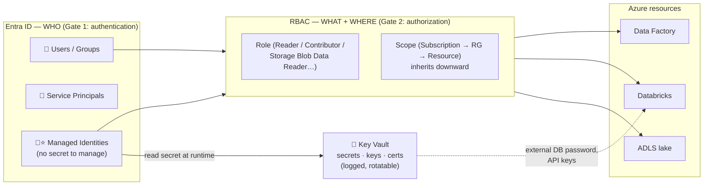

# Topic 3 — Identity & Security: Entra ID · RBAC · Managed Identities · Key Vault

> **Azure Cloud · Phase 0 · Fundamentals · Lesson 3 of 4.** Every pipeline you ever
> build must answer two questions before it touches a single byte: **who are you?**
> and **what are you allowed to do?** This lesson is how Azure answers them.

> 🎯 **First principle:** you don't own this until you can **BUILD** (grant a
> scoped role in your own account), **BREAK** (explain the leaked-connection-string
> disaster and the "Owner on everything" anti-pattern), and **EXPLAIN**
> authentication vs authorization in plain words. [`practice.md`](./practice.md) drives it.

---

## 0. WHY this exists

Your OrderIQ pipeline is code running on a schedule with nobody watching. It must
read the lake, write to the warehouse, and call APIs — **without a human typing a
password**. And when something goes wrong (a leaked key, a fired employee, an
intern with too much access), the damage is decided by how identity and access were
set up *before* the incident.

🗣️ **In plain words:** security in the cloud is two gates. Gate 1: *prove who you
are* (authentication). Gate 2: *check what you're allowed to do* (authorization).
Everything in this lesson is one of those two gates, plus a safe box for secrets.

**Where a DE uses this:** every single connection. Databricks reading ADLS, ADF
calling Databricks, your notebook reading a database password — all identity + access.
Interviews love this too: "how does your pipeline authenticate to the lake?"

---

## 1. Microsoft Entra ID — the identity system (Gate 1: who are you?)

**Entra ID** (formerly **Azure AD** — jobs/docs still say both) is Azure's
identity directory. It holds every identity in your organization:

| Identity type | What it is | Example |
|---------------|-----------|---------|
| **User** | A human with a login | you@orderiq.com |
| **Group** | A set of users, managed together | `data-engineering-team` |
| **Service Principal** | An identity for an **application/automation** — a "robot account" | the identity ADF uses to act |
| **Managed Identity** | A service principal that **Azure creates and manages for a resource automatically** — no password/secret for you to handle ⭐ | the Databricks workspace's own identity |

**Authentication** = proving you are who you claim (password + MFA for humans;
certificates/tokens for apps). Entra ID issues a **token** after you prove it;
services then trust that token.

🗣️ **In plain words:** Entra ID is the office's ID-card desk. Humans get ID cards
(users), teams get shared badges (groups), and robots — your pipelines — get robot
badges (service principals). A **managed identity** is a robot badge Azure prints,
renews, and guards *for you*, so there's no badge for you to lose.

### Why Managed Identity is the star ⭐

The old way: create a service principal, get a **client secret** (a password
string), paste it into pipeline config. Now that secret can leak — in code, in git,
in a screenshot. It also **expires**, breaking pipelines at 2 AM.

**Managed Identity kills the secret entirely.** Azure gives the resource (ADF,
Databricks, a VM) its own identity and handles the credentials internally. Your
code just says "authenticate as myself" — nothing to store, leak, rotate, or expire.

> **Rule you'll follow all series:** resource-to-resource auth (ADF → ADLS,
> Databricks → Key Vault) uses **Managed Identity** whenever supported. Secrets are
> the fallback, not the default.

---

## 2. RBAC — Role-Based Access Control (Gate 2: what can you do?)

Once Entra ID knows *who* you are, **RBAC** decides *what you may do*. An RBAC
grant is always three parts:

```
WHO           +        WHAT ROLE          +       WHERE (scope)
(user/group/         (a bundle of                (management group /
 service principal/    permissions)                subscription / RG / resource)
 managed identity)
```

Example: *"the `data-engineering-team` group has **Storage Blob Data Reader** on
the `storderiqprodlake` storage account."*

### Roles you'll actually meet

| Role | Allows | DE usage |
|------|--------|----------|
| **Owner** | Everything, including granting access to others | Almost nobody. Admins only. |
| **Contributor** | Create/manage resources, but **cannot grant access** | Engineers building infra |
| **Reader** | View only | Auditors, analysts browsing |
| **Storage Blob Data Reader** | Read the *data* inside storage | Pipelines/analysts that read the lake |
| **Storage Blob Data Contributor** | Read/write the *data* inside storage | Pipelines that write to the lake |

> ⚠️ Classic trap: **Contributor on a storage account does NOT let you read the
> data inside it.** Managing the *resource* (settings, keys) and accessing the
> *data* are separate permission planes. For data access you need the
> `...Blob Data...` roles. This confuses everyone once.

### Inheritance and least privilege

Scope **inherits downward**: a role at subscription level applies to every RG and
resource inside. Powerful — and dangerous. Grant `Owner` at subscription level and
that person can touch everything, forever.

**The principle of least privilege:** give the *smallest* role at the *narrowest*
scope that gets the job done. Reader beats Contributor. RG scope beats subscription
scope. Group grants beat individual grants (people change; groups persist).

🗣️ **In plain words:** RBAC is the building's key policy. A key can open one room
(resource), one floor (RG), or the whole building (subscription) — and master keys
(Owner) open everything *and* can cut new keys. Least privilege = give the cleaner
the store-room key, not the master key. When someone quits, you take back one badge
from one group — not hunt 50 individual keys.

---

## 3. Key Vault — the safe for secrets that must exist

Managed Identity removes *most* secrets — but not all. Some things are still
secrets by nature: a database password for an external system, a third-party API
key, a certificate. Those must live **somewhere safe** — never in code, never in
git, never in a notebook cell.

**Azure Key Vault** is that safe. It stores three kinds of things:

- **Secrets** — passwords, connection strings, API keys
- **Keys** — encryption keys
- **Certificates** — TLS/SSL certs

### How a pipeline uses it (the pattern to memorize)

```
1. Databricks/ADF authenticates to Key Vault AS ITS MANAGED IDENTITY  (no secret needed to get secrets!)
2. RBAC/access policy checks: is this identity allowed to READ secrets?
3. Key Vault hands over the secret at runtime, in memory
4. Code uses it, never writes it anywhere
```

```python
# Databricks example — the secret never appears in code or git:
password = dbutils.secrets.get(scope="orderiq-kv", key="postgres-password")
# Even print(password) shows [REDACTED] in Databricks
```

Bonus: Key Vault **logs every access** (who read what, when) and supports
**rotation** (change the secret in one place; every pipeline picks up the new value).

🗣️ **In plain words:** Key Vault is the office safe. Nobody carries passwords in
their pockets (code); they walk to the safe, show their badge (managed identity),
take what they need for the task, and the safe writes down who took what. Change a
password? Change it in the safe once — everyone automatically gets the new one.

---

## 4. How the three work together — the full picture

```
ORDERIQ NIGHTLY PIPELINE, 2 AM, zero humans awake:

ADF (managed identity #1)
 ├─ RBAC: Data Factory Contributor-ish rights to trigger Databricks
 ▼
Databricks job (managed identity #2)
 ├─ RBAC: Storage Blob Data Contributor on storderiqprodlake  → reads bronze, writes silver/gold
 ├─ Key Vault access: reads "postgres-password" to pull reference data from an external DB
 ▼
Writes gold → Power BI reads it (analysts' AD group has Reader on the workspace)

Secrets in code: ZERO.  Passwords in git: ZERO.  Every access: logged.
```

That block is the answer to the interview question *"how do your pipelines
authenticate?"* — managed identities for Azure-to-Azure, Key Vault for unavoidable
external secrets, RBAC with least privilege everywhere, groups not individuals.

---

## 5. The 3-step example — from mechanic to OrderIQ to production

### Step 1 — tiny mechanic (the two gates on one action)

> You run `spark.read.parquet("abfss://bronze@storderiqdevlake...")`.
> **Gate 1:** the cluster presents its managed identity token — Entra ID says "this
> is dbx-orderiq-dev, genuine."
> **Gate 2:** RBAC checks — does dbx-orderiq-dev have *Storage Blob Data Reader* on
> that account? Yes → bytes flow. No → `403 This request is not authorized`.

### Step 2 — OrderIQ team setup (groups + least privilege)

```
Entra groups:            RBAC grants (at RG scope):
  de-team          →      Contributor on rg-orderiq-dev
  de-team          →      Storage Blob Data Contributor on the dev lake
  analysts         →      Storage Blob Data Reader on GOLD container only
  interns          →      Reader on rg-orderiq-dev  (look, don't touch)
New joiner? Add to one group — inherits exactly the right access. Leaver? Remove
from group — all access gone at once.
```

### Step 3 — production incident (why this design saves you)

```
An intern's laptop is stolen. Damage assessment:
  • Intern was in `interns` group → Reader only → thief can VIEW dev configs, not
    data (no Blob Data role), not prod (no grant), can't create or delete anything.
  • Remove intern from the group → every access revoked in one action.
  • Key Vault logs show the account read zero secrets.
Compare: if the intern had Owner at subscription scope "because it was easier",
the same theft = full prod data access + ability to grant themselves more. The
security you set up on a boring Tuesday decides the size of the disaster.
```

---

## 6. Diagram — the two gates + the safe



---

## 7. 🗣️ Plain-words recap

- **Two gates:** authentication (*prove who you are* — Entra ID) then authorization
  (*check what you may do* — RBAC).
- **Entra ID** holds all identities: humans (users/groups) and robots (service
  principals). A **managed identity** is a robot identity Azure runs for you — no
  secret to store, leak, or expire. **Default choice** for Azure-to-Azure auth.
- **RBAC = who + role + scope.** Scope inherits downward. **Least privilege:**
  smallest role, narrowest scope, granted to **groups** not individuals.
- ⚠️ Contributor on a storage account ≠ access to the data inside — data access
  needs the `Storage Blob Data ...` roles.
- **Key Vault** = the safe for secrets that must exist (external passwords, API
  keys). Pipelines read it *using their managed identity* at runtime; nothing in
  code or git; every access logged; rotate in one place.

---

## 8. Revision — read before closing

Cloud security for a DE reduces to two gates and a safe. **Gate 1 — Entra ID**
answers "who are you": humans as users in groups, automation as service principals,
and best of all **managed identities**, where Azure owns the robot's credentials so
there is no secret for you to leak or rotate. **Gate 2 — RBAC** answers "what may
you do" as *who + role + scope*, where scope inherits downward and the discipline is
**least privilege granted to groups**. Remember the trap: managing a resource
(Contributor) and reading its *data* (`Storage Blob Data Reader`) are different
permission planes. Finally, secrets that must exist live in **Key Vault**, fetched
at runtime by managed identity, logged and rotatable — never in code or git. Wire
these three together and your 2 AM pipeline authenticates with zero stored
passwords, and a stolen laptop is an inconvenience instead of a breach. Next
lesson closes Phase 0: the **Azure data stack map** — how ADLS, ADF, Databricks,
Synapse, and Fabric snap together into one platform.

---

## 9. Test yourself — 10 questions (answers hidden — think first)

<details><summary>1. Authentication vs authorization — one line each.</summary>
Authentication = proving who you are (Entra ID, tokens). Authorization = checking what you're allowed to do (RBAC).
</details>
<details><summary>2. What is a service principal, and how is a managed identity different?</summary>
A service principal is an identity for an app/automation ("robot account"). A managed identity is a service principal Azure creates and credential-manages for a resource automatically — no secret for you to store, rotate, or leak.
</details>
<details><summary>3. Why prefer managed identity over a client secret for ADF → ADLS?</summary>
No secret exists to leak into code/git, nothing expires and breaks the 2 AM run, Azure rotates credentials internally.
</details>
<details><summary>4. Name the three parts of every RBAC grant.</summary>
Who (identity) + what role (permission bundle) + where (scope: management group/subscription/RG/resource).
</details>
<details><summary>5. What does "scope inherits downward" mean and why is it risky?</summary>
A role granted at subscription level applies to every RG/resource inside. Broad grants (Owner on subscription) give sweeping access everywhere below — huge blast radius.
</details>
<details><summary>6. Contributor on a storage account — can you read the files inside? Why?</summary>
No. Contributor manages the resource (settings/keys) but data access is a separate plane — you need Storage Blob Data Reader/Contributor.
</details>
<details><summary>7. State the principle of least privilege in one line.</summary>
Grant the smallest role at the narrowest scope that gets the job done — to groups, not individuals.
</details>
<details><summary>8. Why grant roles to groups instead of individual users?</summary>
Joiners/leavers are one group-membership change instead of hunting per-resource grants; access stays consistent and auditable.
</details>
<details><summary>9. What belongs in Key Vault, and what removed the need for most other secrets?</summary>
External DB passwords, API keys, certificates — secrets that must exist. Managed identities removed the need for Azure-to-Azure secrets.
</details>
<details><summary>10. How does a Databricks job read a Key Vault secret without any stored credential?</summary>
It authenticates to Key Vault as its managed identity; RBAC/access policy allows it to read; the secret is delivered at runtime in memory (e.g. dbutils.secrets.get) — never written to code or git.
</details>

---

## 10. Practice

👉 [`practice.md`](./practice.md) — in your free account you'll **inspect your own
identity + grants and assign a scoped role**, then run reasoning drills: pick the
right role/scope for each OrderIQ actor, and a Hard incident drill (leaked
connection string vs the managed-identity design). BUILD → BREAK → EXPLAIN.

---

*Next: [Topic 4 — The Azure Data Stack Map](../topic-4-azure-data-stack-map/) — finishes Phase 0.*
