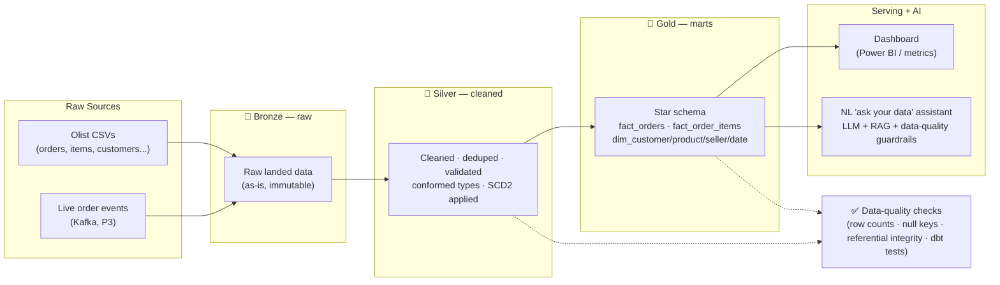

# 🏗️ Flagship Project — "OrderIQ": India E-Commerce Order Intelligence Platform

> DE-2026 · **In-depth project blueprint** · Grounded in real 2026 hiring research
> **ONE end-to-end data platform, built in 3 stages (P1 → P2 → P3) as skills are learned.**
> Final result: a senior-level, real, hiring-ready portfolio centerpiece with batch + streaming + an AI layer.

---

## 0. The One-Liner

> *OrderIQ ingests messy raw e-commerce orders, cleans and models them into a lakehouse, and serves trustworthy analytics + a natural-language "ask your data" assistant — with data-quality guardrails so the numbers (and the AI) can be trusted.*

This is deliberately shaped to **look like real production work**, because the 2026 research says that is exactly what gets hired: *messy data → ingestion → lakehouse → tests → orchestration → documentation → a business-ready output*, with **trade-off reasoning** written up.

---

## 1. The Business Problem (why this platform exists)

You are the (first) data engineer at a growing India e-commerce marketplace. Leadership can't answer basic questions reliably:

- *"What's our revenue trend, and which cities/sellers/categories drive it?"*
- *"Are customers coming back, or do we churn them after one order?"*
- *"Is our delivery getting faster or slower, and where?"*
- *"Can I just **ask** these questions in plain English and trust the answer?"*

Raw data is scattered, messy, and duplicated. Your job: build the platform that turns raw orders into **trusted, queryable, real-time answers** — without bad data silently corrupting decisions (or an LLM hallucinating on it).

> 🗣️ **In plain words:** the company is flying blind on messy data. You build the system that makes the data clean, trustworthy, fast, and easy to ask questions of.

---

## 2. Business Questions the Platform Must Answer (the KPIs)

These drive the whole design — every table exists to answer one of these:

| # | Question | Metric | SQL skill it exercises |
|---|----------|--------|------------------------|
| 1 | Revenue over time | Daily / monthly revenue + **running total** | Window functions |
| 2 | Who are the top sellers/products? | **Top-N per city / category** | `ROW_NUMBER` / `RANK` partitioned |
| 3 | Do customers come back? | **Cohort retention** (repeat-purchase by signup month) | Self-joins + date logic |
| 4 | Is delivery improving? | On-time % · avg delivery days by region | Aggregations + `CASE` |
| 5 | Payment mix | % by payment type over time | `GROUP BY` + windows |
| 6 | New vs returning revenue split | first-order vs repeat revenue | `LAG` / first_value |

---

## 3. The Dataset

- **Source:** the public **Olist e-commerce dataset** (real, messy, ~100k orders, 8 related tables) — or a synthetic India-flavoured order generator for the streaming stage.
- **Raw tables:** `orders`, `order_items`, `customers`, `products`, `sellers`, `payments`, `reviews`, `geolocation`.
- **Why it's good:** genuinely messy (nulls, duplicates, late-arriving rows, inconsistent categories) → you get to demonstrate real cleaning, dedup, and data-quality handling. Rich enough for a proper star schema.

---

## 4. Target Data Model (the Gold layer)

**Dimensional model (Kimball star schema).** Two fact tables at different grains + conformed dimensions. This is where your **Data Modeling** series pays off.

### Fact tables
```
fact_order_items   -- GRAIN: one row per order line item (most granular)
  order_item_sk (PK) · order_id · product_sk · seller_sk · customer_sk · date_sk
  price · freight_value · quantity

fact_orders        -- GRAIN: one row per order
  order_sk (PK) · order_id · customer_sk · order_date_sk · delivered_date_sk
  order_status · order_value · payment_type · delivery_days · is_delivered_on_time
```

### Dimensions
```
dim_customer (SCD Type 2)   -- tracks history when a customer moves city
  customer_sk (PK, surrogate) · customer_id (natural) · city · state · region
  effective_from · effective_to · is_current

dim_product                 -- category, weight, dimensions
dim_seller                  -- seller city/state
dim_date                    -- full calendar: day, month, quarter, year, is_weekend
```

**Key modeling decisions to showcase (and write up):**
- **Grain** chosen explicitly (line-item vs order — and *why both*).
- **Surrogate keys** on every dimension (not natural keys) — why.
- **SCD Type 2** on `dim_customer` — so historical orders keep the city the customer had *at order time*.
- Star (not snowflake) for query speed — and where you'd normalize if needed.

---

## 5. Overall Architecture



The **medallion** (Bronze/Silver/Gold) spine is constant across all stages — only the *tools* that implement each layer change as you learn them.

---

## 6. Stage P1 — Batch Analytics Core

> **Build after:** SQL Phase 0–2 · Data Modeling Phase 0–2 · Python foundations.
> **This is your first real, buildable milestone.**

**What you build:**
1. **Ingest** raw CSVs with **Python** (pandas/Polars) → land as Bronze (Parquet).
2. **Clean & validate** → Silver: dedupe, fix types, standardize categories, and route bad rows to a **dead-letter file** (bad_records/).
3. **Model** → Gold: build the star schema in **PostgreSQL / DuckDB**; implement **SCD Type 2** on `dim_customer` with surrogate keys.
4. **Load incrementally** — watermark on `order_purchase_timestamp` so re-runs only process new data (**idempotent** — safe to re-run).
5. **Analyze** with **analytical SQL** — answer all 6 KPI questions (window functions, cohorts, top-N).
6. **Data-quality checks** in SQL — row counts, no null surrogate keys, referential integrity (every fact FK exists in its dim).

**Tech:** Python · PostgreSQL/DuckDB · SQL · (optionally dbt-core later).
**Deliverables:** GitHub repo · README · **ER diagram** · the SQL · an insights writeup (charts optional).
**Proves:** SQL depth · dimensional modeling · Python ETL · data quality thinking.

**Definition of Done (P1):**
- [ ] Raw → Bronze → Silver → Gold runs end to end with one command
- [ ] Re-running does NOT duplicate data (idempotent) and only picks up new rows (incremental)
- [ ] Bad rows land in a dead-letter file, not silently dropped
- [ ] SCD2 verified: a customer's city change creates a new row, old row closed
- [ ] All 6 KPI queries return correct results
- [ ] DQ checks pass; README explains **why** each modeling decision was made

---

## 7. Stage P2 — Cloud Lakehouse

> **Build after:** Spark · Azure Cloud.

**What you build:**
1. Move storage to **ADLS Gen2**; Bronze/Silver/Gold as **Delta** tables (medallion on the lake).
2. Rebuild transforms in **Azure Databricks + Spark**; Silver→Gold uses **Delta `MERGE`** for incremental upserts + SCD2 at scale.
3. Ingest with **Azure Data Factory** — Copy activity for batch + an incremental/CDC pattern.
4. Serve via **Fabric / Synapse** + a **Power BI** dashboard on the Gold marts.
5. Partition Gold by date; use **broadcast joins** for small dims (your Spark skills).

**Tech:** ADLS Gen2 · Databricks · Spark · Delta Lake · ADF · Fabric/Synapse · Power BI.
**Proves:** cloud lakehouse · Spark at scale · Delta · orchestrated ingestion · enterprise architecture.

**Definition of Done (P2):**
- [ ] Medallion Delta tables on ADLS, incremental MERGE working
- [ ] ADF pipeline ingests on a schedule
- [ ] Power BI dashboard answers the 6 KPIs live off Gold
- [ ] Writeup: **why Databricks over Synapse** for the transform layer (trade-off)

---

## 8. Stage P3 — Production + Streaming + AI-Era

> **Build after:** Airflow · dbt · Kafka.

**What you build:**
1. **Orchestrate** the whole batch flow with **Airflow** — DAG dependencies, **bounded retries**, failure **alerts**, backfills.
2. **Transform + test** with **dbt** — staging → marts models, `dbt test` (not-null, unique, relationships) as your data-quality gate, `dbt docs`.
3. **Streaming layer** — **Kafka** emits live order events → **Spark Structured Streaming** (micro-batch) updates a real-time Gold metrics table (e.g., live revenue, orders/min). Write up **why micro-batch over pure streaming** (cost vs latency).
4. **AI-era layer** — a **natural-language "ask your data" assistant**: LLM + RAG over the Gold marts, with **data-quality guardrails** that block bad/failed-test data from reaching the model (so it can't hallucinate on garbage).
5. Wrap with **CI/CD**, cost monitoring, and a strong architecture doc.

**Tech:** Airflow · dbt · Kafka · Spark Structured Streaming · an LLM API + RAG · CI/CD.
**Proves:** production orchestration · testing/observability · streaming · **AI-era DE** · trade-off reasoning.

**Definition of Done (P3):**
- [ ] Airflow DAG runs the pipeline with retries + alerting
- [ ] dbt tests gate the pipeline (a failing test stops bad data)
- [ ] Live order stream updates a real-time metric
- [ ] NL assistant answers a business question correctly AND refuses/flags when data quality fails
- [ ] One-page architecture doc with all trade-off decisions

---

## 9. Engineering Decisions to Showcase (the writeup gold)

The 2026 research is explicit: **how you explain it is tested as much as the code.** Document each of these:

- **Idempotent + incremental loads** (watermarks) — safe re-runs, no duplicates
- **Dead-letter queue** for bad records — nothing silently dropped
- **Bounded retries** + alerting — graceful failure, not silent
- **SCD2** — why history matters for point-in-time correctness
- **Grain & surrogate keys** — why the model looks the way it does
- **Micro-batch vs streaming** — cost/latency trade-off
- **Databricks vs Synapse vs Fabric** — why you chose each where you did
- **Data-quality guardrails for AI** — why bad data must never reach the LLM

---

## 10. Project Repo Structure (separate repo, referenced here)

```
orderiq/
  README.md               ← architecture diagram + trade-off decisions + how to run
  data/                   ← sample raw + dead-letter output
  ingestion/              ← Python ingest scripts (Bronze)
  transform/              ← Silver/Gold logic (SQL → dbt → Spark as it grows)
  models/                 ← dbt models + tests (P3)
  orchestration/          ← Airflow DAGs (P3)
  streaming/              ← Kafka producer + Structured Streaming (P3)
  ai/                     ← NL assistant (RAG + guardrails, P3)
  docs/                   ← ER diagram, architecture, decisions log
```

---

## 11. Interview Talking Points (rehearse these)

- "Walk me through your pipeline." → the medallion flow end to end.
- "How do you handle bad data?" → dead-letter + dbt tests + guardrails.
- "Why a star schema here?" → grain, surrogate keys, SCD2, query speed.
- "How do you avoid reprocessing everything?" → watermark + incremental MERGE + idempotency.
- "Why did you pick X over Y?" → your documented trade-offs.
- "How do you make the AI trustworthy?" → data-quality gates before the LLM.

---

## 12. 📍 What To Do Right Now (honest)

You are **mid-foundations** (~11 lessons; roadmaps built). The full platform is **not buildable yet — and shouldn't be faked.**

- **Now:** keep learning. Priority = finish **SQL Phase 0–2** + **Data Modeling Phase 0–2** (+ enough Python).
- **First milestone:** **P1 — Batch Analytics Core.** Start it the moment those foundations are done.
- Then grow the **same** repo into P2 → P3 as each skill lands.
- **Do NOT** build separate throwaway projects. Grow ONE. By P3 you have a single, senior-level, end-to-end system.

---

*Sister roadmaps: [Python](../python/) · [Spark](../spark/) · [SQL](../sql/) · [Data Modeling](../data-modeling/) · [Azure Cloud](../azure-cloud/)*
