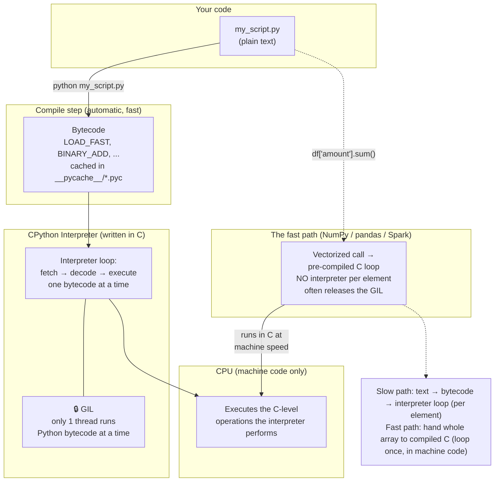

# Phase 0 · Topic 1 — How Python Actually Runs

> **Before you write better Python, understand what happens when you press Run.**
> This one lesson explains WHY Python is slow, WHY pandas/NumPy are fast, and WHY the GIL exists — three things every DE must know.

---

## Why This Exists

You've written Python for years. But have you ever asked:

- *Why is Python "slow" compared to Java or C?*
- *Why does NumPy run 100x faster than a plain Python loop doing the same math?*
- *Why can't Python use all my CPU cores for one task (the famous "GIL")?*
- *What does "interpreted language" actually mean?*

As a Data Analyst, you didn't need these answers. As a Data Engineer, you do — because you'll process huge datasets where these facts decide whether your pipeline takes 2 minutes or 2 hours. The DE who knows *why* Python behaves this way writes fast code. The one who doesn't writes slow code and can't explain it.

This lesson opens the hood.

---

## What "Running Python" Actually Means

When you run `python my_script.py`, it feels instant. But several steps happen under the hood. Let's trace them.

### Step 1 — Your code is just text

`my_script.py` is a plain text file. The computer's CPU cannot run text. CPUs only understand **machine code** — raw binary instructions specific to your processor. So something must translate your text into something runnable.

### Step 2 — Python compiles to "bytecode"

When you run your script, Python first **compiles** it — but NOT to machine code. It compiles to an intermediate form called **bytecode**.

Bytecode is a set of simple instructions for a "fake" computer called the **Python Virtual Machine**. It's not human-readable text, but it's not raw machine code either — it sits in between.

You can actually see it:

```python
import dis

def add(a, b):
    return a + b

dis.dis(add)
```

Output (the bytecode):
```
  2           0 LOAD_FAST                0 (a)
              2 LOAD_FAST                1 (b)
              4 BINARY_ADD
              6 RETURN_VALUE
```

Those `LOAD_FAST`, `BINARY_ADD` lines are bytecode instructions. Your simple `a + b` became 4 steps.

This bytecode is cached in `.pyc` files inside `__pycache__/` folders — that's why the second run of a program is slightly faster (compilation already done).

### Step 3 — The interpreter executes bytecode, one instruction at a time

Now the **Python interpreter** (a program written in C, called **CPython**) reads the bytecode and executes each instruction. It's a giant loop: read an instruction, do it, read the next, do it, forever — until the program ends.

This read-instruction-then-do-it loop is what "**interpreted**" means. Compare:

- **Compiled language (C, Go):** Your whole program is translated to machine code ONCE, ahead of time. The CPU runs that machine code directly. Very fast.
- **Interpreted language (Python):** Your program is translated to bytecode, then the interpreter reads and runs bytecode instructions one at a time, while the program runs. Flexible, but slower.

---

## The Restaurant Translator Analogy

Imagine you (the CPU) only speak machine code. A chef hands you a recipe written in Python.

- **Compiled approach (C):** Before cooking starts, a translator converts the ENTIRE recipe into your language, hands you the finished translation, and leaves. You cook at full speed from the translated copy. Fast.

- **Interpreted approach (Python):** A translator (the interpreter) stands next to you. They read ONE line of the Python recipe, translate it to you, you do it. Then they read the next line, translate, you do it. Line by line, the whole time you cook.

The Python way is more flexible — you can change the recipe mid-cook, the translator handles surprises. But there's a translator standing between you and every single step, adding overhead to each one. That overhead, multiplied over millions of data rows, is **why Python is slower** than compiled languages.

---

## Why Python Is "Slow" — The Real Reasons

It's not one thing. Three costs stack up:

**1. Interpretation overhead.** Every operation goes through the interpreter loop (fetch bytecode, decode, execute). A C program skips all this — it's already machine code.

**2. Dynamic typing.** In Python, `x = 5` doesn't fix `x` as an integer. You could later do `x = "hello"`. So every time Python uses `x`, it must check "what type is this right now?" at runtime. In C, the type is known ahead of time — no check needed. This per-operation type-checking is expensive.

**3. Everything is an object.** Even the number `5` is a full Python object with a type, a reference count, and memory overhead (~28 bytes for a small int, vs 4–8 bytes in C). Working with millions of these objects means lots of memory and pointer-chasing.

For a Data Engineer, this matters concretely: a plain Python loop summing 10 million numbers is slow because of all three costs, on every single number.

---

## Why NumPy & pandas Are Fast — The Key DE Insight

Here's the most important practical takeaway of this lesson.

If Python is slow, how do NumPy and pandas process millions of rows in milliseconds?

**Because they don't actually do the work in Python.** Under the hood, NumPy and pandas are written in **C** (and Cython). When you call `df["amount"].sum()`, you are NOT running a Python loop. You're handing the whole column to a pre-compiled C function that loops at machine-code speed, with no interpreter overhead, no per-element type checks, and data stored compactly (not as millions of Python objects).

Compare these two ways to sum 10 million numbers:

```python
import numpy as np
import time

data = list(range(10_000_000))

# WAY 1 — pure Python loop (slow: interpreter runs 10M times)
start = time.time()
total = 0
for x in data:
    total += x
print(f"Python loop: {time.time() - start:.3f}s")   # ~0.5–1.0 seconds

# WAY 2 — NumPy (fast: one call into compiled C)
arr = np.array(data)
start = time.time()
total = arr.sum()
print(f"NumPy: {time.time() - start:.3f}s")          # ~0.01 seconds — 50-100x faster
```

Same result. NumPy is 50–100x faster — **not because NumPy is magic, but because it pushes the loop down into compiled C and stores data as a tight block instead of millions of Python objects.**

**The DE rule this gives you:** *Never write a Python loop over millions of rows. Push the work into vectorized NumPy/pandas/Spark operations* — they run in compiled code, not the slow interpreter. This single principle, which comes straight from understanding how Python runs, is one of the biggest performance levers in all of data engineering.

---

## The GIL — Why One Python Process Uses One Core

Now the famous one: the **GIL (Global Interpreter Lock)**.

**What it is:** CPython has a single lock — the GIL — and a thread must hold it to execute Python bytecode. Only ONE thread can hold the GIL at a time. So **only one thread runs Python code at any instant, even on a 16-core machine.**

This means: if you start 8 Python threads to do 8 CPU-heavy calculations, they do NOT run in parallel. They take turns holding the GIL — effectively one core's worth of work, not eight.

**Why does CPython have this lock?** It makes CPython's memory management (reference counting) simple and safe without complex locking everywhere. It was a reasonable trade-off in the 1990s when machines had one core. Today it's the most criticized part of Python — but it's deeply baked in.

**Why a DE must know this:**

- **CPU-bound work** (heavy math/computation in pure Python) does NOT speed up with threads, because of the GIL. To use multiple cores, you need **multiprocessing** (separate processes, each with its own GIL) — or push the work into NumPy/Spark (which release the GIL in their C code).

- **I/O-bound work** (waiting on network, API calls, disk, database) DOES benefit from threads, because a thread waiting on I/O *releases* the GIL, letting other threads run. So for "call 1,000 APIs," threads (or async) help a lot.

You'll go deep on the GIL, threading, multiprocessing, and async in Phase 4. For now, lock in the headline: **one Python process = one core for pure-Python CPU work. The GIL is why.**

> **2026 note:** Python 3.13+ introduced an experimental **free-threaded build (PEP 703)** that can disable the GIL. It's not yet the default and most data tools don't rely on it. The GIL still governs the Python you'll use in production for the next few years.

---

## CPython vs Other Pythons

The "Python" you almost always use is **CPython** — the reference implementation written in C. But know that others exist:

| Implementation | What It Is | DE Relevance |
|---|---|---|
| **CPython** | The standard one (python.org). Written in C. Has the GIL. | What you use 99% of the time |
| **PyPy** | Python with a JIT compiler — much faster for pure-Python loops | Occasionally used for CPU-heavy pure-Python jobs |
| **Jython / IronPython** | Python on the JVM / .NET | Rare in modern DE |
| **Cython** | Lets you compile Python-like code to C for speed | Used inside pandas/NumPy internals |

When someone says "Python," assume CPython unless told otherwise.

---

## Diagram — From Your Code to the CPU



---

## Revision

### Python Runs as Bytecode Through an Interpreter

When you run a `.py` file, Python first compiles it to **bytecode** — simple instructions for the Python Virtual Machine (not machine code, not source text — in between). Then the **CPython interpreter** (a C program) runs a loop: fetch one bytecode instruction, decode it, execute it, repeat. This per-instruction loop is what "interpreted" means. Compiled languages translate everything to machine code once, ahead of time, and skip this loop — which is why they're faster.

### Why Python Is Slow — Three Stacked Costs

Python is slow for three reasons that hit on every operation: (1) **interpretation overhead** — every step goes through the interpreter loop; (2) **dynamic typing** — Python must check a variable's type at runtime because it can change; (3) **everything is an object** — even the number 5 is a heavy object (~28 bytes) with type info and a reference count. Multiply these costs over millions of data rows and pure-Python data processing becomes very slow.

### Why NumPy/pandas Are Fast — The Biggest DE Lever

NumPy and pandas are fast because they **don't do the work in Python** — they hand whole arrays to pre-compiled **C** functions that loop at machine speed, with no interpreter overhead, no per-element type checks, and compact data storage. `arr.sum()` on 10M numbers is 50–100x faster than a Python `for` loop doing the same thing. The DE rule: **never loop in Python over millions of rows — vectorize into NumPy/pandas/Spark**, which run in compiled code. This is one of the highest-impact performance principles in data engineering.

### The GIL — One Core for Pure-Python CPU Work

CPython has a Global Interpreter Lock: only one thread can run Python bytecode at a time, even on many cores. So CPU-bound pure-Python work does NOT speed up with threads — you need **multiprocessing** (separate processes) or to push work into NumPy/Spark (which release the GIL in their C code). I/O-bound work (network, APIs, disk) DOES benefit from threads/async, because a thread waiting on I/O releases the GIL. Headline: one Python process = one core for pure-Python CPU work.

### CPython Is "Python"

The standard Python (python.org) is **CPython**, written in C, and it's what has the GIL. Other implementations exist — PyPy (JIT, faster loops), Cython (compiles to C, used inside pandas/NumPy), Jython/IronPython (JVM/.NET) — but unless told otherwise, "Python" means CPython, and everything above applies to it.

---

## Practice Questions

### 🟢 Easy

**E1. What is bytecode, and how is it different from both your source code and machine code?**

<details>
<summary>▶ Answer</summary>

**Bytecode** is an intermediate form of your program — a set of simple instructions for the Python Virtual Machine, produced when Python compiles your `.py` file.

It sits between two things:
- **Source code** (`my_script.py`) — human-readable text. The CPU can't run it.
- **Machine code** — raw binary instructions the CPU runs directly.

Bytecode is neither: it's not human-readable text, and it's not machine code the CPU runs directly. Instead, the **interpreter** reads bytecode instructions one at a time and executes them.

You can see bytecode with `dis.dis(your_function)`. It's cached in `__pycache__/*.pyc` files, which is why a program's second run skips the compile step.

</details>

---

**E2. In one or two sentences each, give the three reasons Python is slower than C.**

<details>
<summary>▶ Answer</summary>

1. **Interpretation overhead:** Every operation goes through the interpreter loop (fetch bytecode → decode → execute). C is already machine code and skips this entirely.

2. **Dynamic typing:** A Python variable's type can change at runtime (`x = 5` then `x = "hi"`), so Python checks the type on every use. C knows types ahead of time — no runtime check.

3. **Everything is an object:** Even a small integer is a full object (~28 bytes) with type info and a reference count, versus 4–8 raw bytes in C. Millions of these objects mean heavy memory use and pointer-chasing.

</details>

---

**E3. Your colleague writes a `for` loop in pure Python to add a tax column to 5 million rows, and it's slow. What's the one-line DE principle they violated, and what should they use instead?**

<details>
<summary>▶ Answer</summary>

**Principle violated:** *Never write a Python loop over millions of rows — vectorize instead.*

A pure-Python loop pays the interpreter overhead, type-checking, and object cost on every single one of the 5 million rows.

**Use instead:** a vectorized pandas/NumPy operation, which pushes the whole loop down into pre-compiled C:

```python
# SLOW — Python loop, 5M interpreter iterations
df["tax"] = [amount * 0.18 for amount in df["amount"]]

# FAST — vectorized, runs in compiled C
df["tax"] = df["amount"] * 0.18
```

The vectorized version runs the multiplication across the whole column in C at machine speed — typically 50–100x faster — because the loop happens in compiled code, not the Python interpreter.

</details>

---

### 🟡 Medium

**M1. Explain WHY NumPy's `arr.sum()` is ~50–100x faster than a Python `for` loop summing the same numbers. Give at least two distinct reasons.**

<details>
<summary>▶ Answer</summary>

NumPy is faster because the actual summing does NOT happen in Python — it happens in pre-compiled C. Specifically:

1. **No interpreter overhead per element:** A Python loop runs the interpreter loop (fetch/decode/execute bytecode) for each of the 10M numbers. `arr.sum()` makes ONE call into a C function that loops internally at machine-code speed — the interpreter is involved once, not 10 million times.

2. **No per-element type checking:** In the Python loop, each `+=` must check the operand types at runtime. NumPy arrays are **homogeneously typed** (e.g., all int64), so the C code knows the type once and skips all per-element checks.

3. **Compact contiguous memory:** A Python `list` is an array of pointers to scattered integer objects (each ~28 bytes). A NumPy array stores raw numbers in one tight contiguous block (8 bytes each). The C loop walks sequential memory — cache-friendly and fast — instead of chasing pointers to scattered objects.

4. **(Bonus) SIMD / vectorization:** The contiguous layout lets the CPU apply vectorized instructions (process multiple numbers per CPU cycle), which is impossible with scattered Python objects.

All of these come from the same root: NumPy hands the work to compiled C operating on a tight data block, bypassing everything that makes pure Python slow.

</details>

---

**M2. You have a CPU-heavy pure-Python function (lots of math, no NumPy). You run it across 8 threads on an 8-core machine expecting an 8x speedup. You get almost no speedup. Why? What should you have used?**

<details>
<summary>▶ Answer</summary>

**Why no speedup:** the **GIL (Global Interpreter Lock)**. Only one thread can execute Python bytecode at a time in CPython. So your 8 threads don't run in parallel — they take turns holding the GIL. For CPU-bound pure-Python work, 8 threads do roughly the work of 1 core, plus some overhead from switching between them. The GIL serializes them.

**What to use instead:**

1. **multiprocessing** — spawn separate *processes* instead of threads. Each process has its own Python interpreter and its own GIL, so they genuinely run in parallel across cores:
   ```python
   from multiprocessing import Pool
   with Pool(8) as p:
       results = p.map(my_cpu_function, chunks)
   ```

2. **Push the work into NumPy/pandas/Spark** — their heavy C code releases the GIL while computing, so it can use multiple cores.

3. **(2026) Free-threaded Python 3.13+** — experimental no-GIL build, but not yet production-default.

**Key distinction:** threads fail for **CPU-bound** work because of the GIL, but threads (or async) DO help **I/O-bound** work (API calls, DB queries) because a thread waiting on I/O releases the GIL. Match the tool to the bottleneck.

</details>

---

**M3. Why does the SECOND run of a Python program sometimes start slightly faster than the first? What's happening on disk?**

<details>
<summary>▶ Answer</summary>

Because of **bytecode caching**.

The first time you run a module, Python compiles its source code to bytecode. To avoid redoing this every time, Python writes the compiled bytecode to a `.pyc` file inside a `__pycache__/` folder next to the source.

On the next run, Python checks: has the source `.py` file changed since the `.pyc` was created (it compares timestamps/hashes)? If not, it **loads the cached bytecode directly** and skips the compile step. That saves the compilation time, so startup is slightly faster.

Notes:
- This mainly affects **imported modules**, not the top-level script you run directly (the entry script's bytecode generally isn't cached the same way).
- The speedup is only in the *compile-to-bytecode* step. The actual execution (the interpreter loop) is identical either way — so this does NOT make your program run faster, only start faster.
- If you edit the source, Python detects the change and recompiles. You never need to manage `__pycache__` manually.

</details>

---

**M4. A teammate says: "Python is interpreted, C is compiled — that's the whole difference." Why is that an oversimplification? Mention bytecode and CPython.**

<details>
<summary>▶ Answer</summary>

It's an oversimplification for a few reasons:

1. **Python compiles too — just not to machine code.** Python first *compiles* your source to **bytecode** (you can see it with `dis`). So it's not "no compilation vs compilation" — it's "compiled to bytecode then interpreted" vs "compiled to machine code then run directly." The line between "interpreted" and "compiled" is blurry.

2. **"Python" is really CPython, a specific C program.** The behavior people call "Python being interpreted" is actually how *CPython* works. Other implementations behave differently — **PyPy** uses a JIT compiler that compiles hot code paths to machine code at runtime, making pure-Python loops much faster. So "Python is interpreted" is a statement about CPython, not the language itself.

3. **The real performance story is richer than interpreted-vs-compiled:** dynamic typing, everything-is-an-object, and the GIL all contribute to Python's speed characteristics — not just "it's interpreted." And the fast libraries (NumPy/pandas) sidestep the whole thing by running in compiled C.

So a more accurate statement: *"CPython compiles to bytecode and interprets it instruction-by-instruction, with dynamic typing and object overhead — which makes pure-Python slower than C, though compiled C extensions like NumPy reclaim most of that speed."*

</details>

---

### 🔴 Hard

**H1. A DE pipeline reads a 2 GB CSV, then does `df.apply(lambda row: complex_python_function(row), axis=1)` over 8 million rows. It's painfully slow. Using what you know about how Python runs, explain WHY `.apply()` with a Python function is slow, and give the order of solutions you'd try.**

<details>
<summary>▶ Answer</summary>

**Why `.apply(..., axis=1)` with a Python function is slow:**

`df.apply(func, axis=1)` calls your Python `func` **once per row** — 8 million times. Even though pandas is C under the hood, the moment you hand it a Python function to run per row, you're back in the slow path: for each of the 8M rows, Python pays interpreter overhead, type checks, and object creation/teardown. `apply` with `axis=1` is essentially a disguised Python `for` loop — it defeats the entire point of vectorization. The compiled-C engine is reduced to calling slow Python 8 million times.

**Order of solutions (fastest/best first):**

1. **Vectorize it.** Rewrite the logic using pandas/NumPy column operations that run entirely in C — no per-row Python. This is almost always possible for arithmetic, comparisons, string ops, conditionals (`np.where`, `.str` methods, boolean masks). 10–100x faster.
   ```python
   # instead of apply, express it as column math:
   df["result"] = np.where(df["amount"] > 1000, df["amount"] * 0.9, df["amount"])
   ```

2. **If logic is too complex to vectorize directly,** break it into vectorizable pieces, or use `np.select` / masks for the branching.

3. **Use a faster engine for genuinely row-wise custom logic:** `numba` (JIT-compiles numeric Python to machine code), or a vectorized `.str`/`.dt` accessor if it's string/date work.

4. **If the data is big enough,** move to **Spark** — distribute the work across a cluster (and even there, prefer built-in functions over Python UDFs for the same reason — Py4J serialization + per-row Python is slow; you saw this in the Spark series).

5. **Last resort — parallelize the apply** across cores with multiprocessing (e.g., split the DataFrame, process chunks in separate processes). This sidesteps the GIL but is still per-row Python; only worth it if you truly can't vectorize.

**The root insight:** `.apply` with a Python function reintroduces all three of Python's slow costs per row. The fix is always to push the loop down into compiled code (vectorize) rather than run Python per row.

</details>

---

**H2. Explain precisely how the GIL can be "released," and why this means a multi-threaded program that calls `requests.get()` 1,000 times benefits from threads, while a multi-threaded program doing pure-Python prime-number math does not.**

<details>
<summary>▶ Answer</summary>

**How the GIL gets released:**

A thread must hold the GIL to execute Python bytecode. But the GIL is *released* in two key situations:

1. **During blocking I/O:** When a thread makes a system call that waits — reading a file, a network request, a database query — CPython **releases the GIL** before blocking and re-acquires it after. While that thread waits (doing nothing useful), other threads can grab the GIL and run.

2. **Inside C extensions that explicitly release it:** Well-written C code (NumPy, many DB drivers, `requests`' underlying socket calls) releases the GIL around long operations that don't touch Python objects.

CPython also periodically forces a thread to drop the GIL (every few milliseconds) so threads share time — but that's just time-slicing one core, not parallelism.

**Why `requests.get()` × 1,000 benefits from threads (I/O-bound):**

Each `requests.get()` spends almost all its time *waiting* on the network (sending the request, waiting for the server, receiving bytes). During that wait, the thread **releases the GIL**. So with 50 threads, while thread 1 waits on its API response (GIL released), threads 2–50 can fire off their own requests. The waiting overlaps. 1,000 sequential calls that each wait 200ms (= 200 seconds total) can finish in a few seconds when overlapped. The GIL is barely contended because everyone is mostly waiting, not running Python.

**Why pure-Python prime math does NOT benefit (CPU-bound):**

Computing primes is constant Python bytecode execution — no I/O, no waiting, no C extension releasing the GIL. Every thread wants the GIL all the time to run its math. Since only one can hold it, the threads serialize: they take turns on one core. You get ~1 core's throughput (minus switching overhead), not 8. To parallelize this you need **multiprocessing** (each process has its own GIL) or to express the math in NumPy (which releases the GIL in C).

**The clean rule:** Threads help when work is **I/O-bound** (lots of waiting → GIL released during waits → overlap). Threads do NOT help **CPU-bound pure-Python** work (constant bytecode execution → GIL held → serialized). Use multiprocessing or vectorized C for CPU-bound; use threads or async for I/O-bound. (You'll build both in Phase 4.)

</details>

---

**H3. CPython stores even small integers as objects (~28 bytes each). A NumPy `int64` array stores them as 8 raw bytes each. Beyond memory savings, explain TWO deeper performance consequences of this difference for a DE processing a billion-row column.**

<details>
<summary>▶ Answer</summary>

The object-vs-raw-bytes difference has consequences far beyond just using less RAM:

**Consequence 1 — CPU cache efficiency (the big one):**

Modern CPUs are wildly faster than RAM, so they rely on small fast **caches** (L1/L2/L3). Performance depends on **data locality** — whether the next piece of data you need is already in cache.

- A Python `list` of ints is really an array of **pointers** to integer objects scattered all over the heap. To sum them, the CPU jumps to a random memory location for each value — constant **cache misses**, each stalling the CPU for ~100+ cycles while it fetches from RAM. This "pointer chasing" wastes most of the CPU's time waiting.
- A NumPy `int64` array stores values **contiguously** — value after value in one block. Summing walks sequential memory, so each cache line load brings in the next 8 values too. Near-zero cache misses. The CPU stays fed.

For a billion rows, this is the difference between the CPU computing vs. the CPU spending most of its time stalled waiting for scattered memory. It can be a 10x+ effect on its own.

**Consequence 2 — SIMD / vectorized CPU instructions:**

Modern CPUs have **SIMD** instructions (SSE/AVX) that perform the same operation on multiple values in a single instruction — e.g., add 8 int64s at once. This requires the values to be packed contiguously in memory with a known uniform type.

- NumPy's contiguous, homogeneously-typed `int64` block is exactly what SIMD needs → NumPy/compiled code can add 4–8 numbers per instruction.
- Python's scattered, individually-typed objects **cannot** use SIMD — each is a separate object of unknown-until-checked type at a random address.

So the NumPy layout unlocks hardware parallelism *within a single core* that Python objects make impossible.

**Bonus — garbage collection & allocation pressure:**
A billion Python int objects means a billion allocations, a billion reference counts to maintain, and heavy garbage-collector work. The NumPy array is a single allocation with no per-element GC. This removes enormous overhead and GC pauses.

**The unifying point:** "everything is an object" isn't just a memory cost — it destroys data locality, blocks SIMD, and floods the allocator/GC. NumPy's raw contiguous storage is fast because it's friendly to how CPUs and memory *physically* work. This is the deep reason vectorization wins, and why every serious DE pushes big-data math into NumPy/pandas/Spark rather than Python objects.

</details>

---

*Next: [Topic 2 — Variables, Memory & the Mutable/Immutable Trap](../topic-2-variables-memory-mutability/)*
