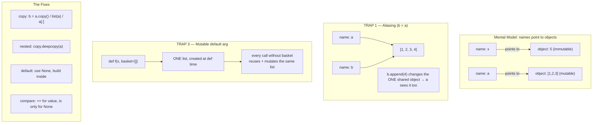

# Phase 0 · Topic 2 — Variables, Memory & the Mutable/Immutable Trap

> **The #1 source of silent, hard-to-find bugs in Python data code.**
> Two engineers look at the same code; one knows this, one doesn't. The one who doesn't ships a bug that corrupts data and can't explain why.

---

## Why This Exists

You've used variables for years. So why a whole lesson?

Because Python variables do NOT work the way most people think. They behave differently from C, Java, or what your intuition says. And that gap causes bugs that are:

- **Silent** — no error, the code runs fine, the data is just *wrong*
- **Spooky** — changing one variable mysteriously changes another
- **Hard to debug** — they only show up with certain data, deep in a pipeline

For a Data Engineer this is dangerous, because your code touches data that other teams trust. A mutable-default-argument bug or an accidental shared reference can quietly corrupt a dataset and nobody notices for weeks.

This lesson rewires your mental model so these bugs become impossible for you.

---

## The Core Idea — Variables Are Labels, Not Boxes

Most people imagine a variable as a **box** that holds a value:

```
WRONG mental model:   x = 5    →   [ x: 5 ]   (a box named x containing 5)
```

That's how C works. **Python is different.** In Python, a variable is a **label (a name) that points to an object in memory.**

```
RIGHT mental model:   x = 5

   x ──────►  ( 5 )      x is a label; 5 is an object somewhere in memory; x points to it
```

When you write `x = 5`:
1. Python creates an integer **object** `5` somewhere in memory
2. The name `x` is made to **point at** (reference) that object

`x` doesn't *contain* 5. `x` is just a name tag tied to the object 5.

This one shift — **names point to objects, they don't hold values** — explains every "weird" thing in this lesson.

### Reassignment just re-points the label

```python
x = 5      # x points to object 5
x = 10     # x now points to a DIFFERENT object, 10. The object 5 is untouched.
```

You didn't change the object 5. You moved the label `x` to point at a new object 10.

---

## `id()` and `is` — Seeing the Pointer

Python gives you tools to see this directly.

- `id(obj)` returns the object's identity — think of it as its memory address.
- `a is b` is True when `a` and `b` point to the **same object** (same `id`).
- `a == b` is True when they have the **same value** (could be two different objects).

```python
x = 5
y = 5
print(id(x), id(y))   # SAME id — both names point to the same 5 object
print(x is y)         # True  — same object
print(x == y)         # True  — same value

a = [1, 2, 3]
b = [1, 2, 3]
print(a is b)         # False — two DIFFERENT list objects in memory
print(a == b)         # True  — but same value/contents
```

**`is` = same object. `==` = same value.** Confusing these is a common bug (more soon).

---

## The Big Divide — Mutable vs Immutable

Every Python object is one of two kinds. This is THE distinction that drives everything.

| Kind | Meaning | Types |
|------|---------|-------|
| **Immutable** | Cannot be changed after creation. Any "change" makes a NEW object. | `int`, `float`, `str`, `bool`, `tuple`, `frozenset`, `bytes` |
| **Mutable** | Can be changed in place. Same object, new contents. | `list`, `dict`, `set`, most custom objects |

### Immutable — "changing" creates a new object

```python
x = 5
print(id(x))     # e.g. 140234...

x = x + 1        # looks like we changed x
print(id(x))     # DIFFERENT id — Python made a new object 6, pointed x at it
```

The integer 5 was never modified — it *can't* be. `x + 1` built a new object `6` and moved the label. Same with strings:

```python
s = "hello"
s = s + " world"   # does NOT modify "hello"; builds a new string object
```

This is why strings are "immutable" — you never change a string, you always create a new one.

### Mutable — changing in place keeps the same object

```python
nums = [1, 2, 3]
print(id(nums))    # e.g. 140555...

nums.append(4)     # change the list IN PLACE
print(id(nums))    # SAME id — same object, new contents
print(nums)        # [1, 2, 3, 4]
```

The list object itself was modified. The label `nums` still points to the same object — but the object's contents changed.

**This in-place change is exactly where the dangerous bugs come from.**

---

## TRAP 1 — Two Labels, One Object (Aliasing)

Watch this carefully:

```python
a = [1, 2, 3]
b = a            # does NOT copy the list — b now points to the SAME object as a

b.append(4)      # change the object through b
print(a)         # [1, 2, 3, 4]   ← a "changed" too!
print(a is b)    # True — they were always the same object
```

`b = a` did NOT make a copy. It made `b` a **second label pointing at the same list object.** Changing the object through either name affects both, because there's only one object.

This is called **aliasing**, and it's a top cause of "why did my data change?!" bugs.

```
a ──┐
    ├──►  [1, 2, 3, 4]      one object, two labels
b ──┘
```

**With immutable objects this trap is harmless** (you can't change them in place), which is why people who only worked with numbers/strings never noticed — until they hit lists/dicts in data code.

### How to actually copy

```python
import copy

a = [1, 2, 3]

b = a.copy()            # shallow copy — new list object
b = list(a)             # also a shallow copy
b = a[:]                # also a shallow copy
b = copy.deepcopy(a)    # deep copy — copies nested objects too

b.append(4)
print(a)   # [1, 2, 3]  ← unaffected now
print(b)   # [1, 2, 3, 4]
```

---

## TRAP 2 — Shallow vs Deep Copy

A **shallow copy** makes a new outer object — but the *inner* objects are still shared.

```python
import copy

original = [[1, 2], [3, 4]]      # a list of lists
shallow  = original.copy()       # new outer list, but inner lists are SHARED

shallow[0].append(99)            # change an inner list
print(original)                  # [[1, 2, 99], [3, 4]]  ← original's inner list changed too!
```

The outer list was copied, but `shallow[0]` and `original[0]` still point to the **same inner list**. To copy everything top to bottom:

```python
deep = copy.deepcopy(original)   # copies outer AND all nested objects
deep[0].append(99)
print(original)                  # unchanged — fully independent
```

**DE relevance:** when you copy a config dict, a nested record, or a list of rows and then modify the copy, a shallow copy can silently mutate the original's nested data. For nested data, use `deepcopy`.

---

## TRAP 3 — The Mutable Default Argument (the famous one)

This is the bug that catches almost everyone, and it's a classic interview question.

```python
def add_item(item, basket=[]):     # ⚠️ DANGER: mutable default
    basket.append(item)
    return basket

print(add_item("apple"))    # ['apple']
print(add_item("banana"))   # ['apple', 'banana']   ← WHERE did apple come from?!
print(add_item("cherry"))   # ['apple', 'banana', 'cherry']   ← they accumulate!
```

You expected each call to start with a fresh empty basket. Instead they all share ONE list.

**Why:** the default value `[]` is created **once**, when the function is *defined* — not each time it's called. That single list object is reused on every call that doesn't pass `basket`. Because it's mutable, each call's `append` permanently changes the shared default.

**The fix — use `None` as the default, create the real object inside:**

```python
def add_item(item, basket=None):
    if basket is None:
        basket = []          # fresh list every call that needs one
    basket.append(item)
    return basket

print(add_item("apple"))    # ['apple']
print(add_item("banana"))   # ['banana']   ← correct, independent
```

**Rule:** never use a mutable object (`[]`, `{}`, `set()`) as a default argument. Default to `None` and build it inside the function.

---

## TRAP 4 — `is` vs `==` (and the integer caching surprise)

Use `==` to compare **values**. Use `is` only to check **identity** (same object) — in practice, almost only for `is None`.

```python
a = [1, 2, 3]
b = [1, 2, 3]
print(a == b)   # True  — same contents
print(a is b)   # False — different objects
```

Now the surprise that confuses people:

```python
x = 256
y = 256
print(x is y)   # True

x = 257
y = 257
print(x is y)   # False (often — depends on context)
```

Why? CPython **caches small integers** (−5 to 256) as shared singleton objects for efficiency. So two `256`s are literally the same cached object (`is` True). But `257` is outside the cache, so each gets its own object (`is` False).

**The lesson is NOT to memorize the cache range.** The lesson is: **never use `is` to compare values.** It sometimes works by accident (cached ints, interned short strings) and then breaks on different data — a nightmare bug. Use `==` for values, `is` only for `None`/`True`/`False` identity checks.

```python
if count == 256:      # ✅ correct — comparing value
if result is None:    # ✅ correct — checking identity with None
if count is 256:      # ❌ wrong — works sometimes, fails unpredictably
```

---

## How Python Cleans Up — Reference Counting (brief)

Since names just point to objects, how does Python free memory? Mainly **reference counting**: each object tracks how many names/containers point to it. When that count drops to zero (no one references it), the object is destroyed and its memory freed.

```python
a = [1, 2, 3]   # the list object has 1 reference (a)
b = a           # 2 references (a, b)
b = None        # back to 1 reference (a)
a = None        # 0 references → the list object is destroyed, memory freed
```

(There's also a cycle-detecting garbage collector for objects that reference each other — Phase 4 detail.) For now, just know: **objects live as long as something points to them; when nothing does, they're cleaned up.** This is why setting a big DataFrame variable to `None` (or letting it go out of scope) can free memory.

---

## Diagram — Names, Objects, and the Traps



---

## Revision

### Variables Are Labels Pointing to Objects

In Python a variable is not a box holding a value — it's a **name that points to an object in memory**. `x = 5` creates an integer object `5` and points the name `x` at it. Reassignment (`x = 10`) just moves the label to a different object; it doesn't change the old one. This single idea — names point to objects — explains every behavior in this lesson. Use `id(obj)` to see an object's identity and `a is b` to check if two names point to the same object.

### Mutable vs Immutable Is the Key Divide

Immutable objects (int, float, str, bool, tuple, frozenset) cannot be changed — any "change" builds a brand new object and re-points the label. Mutable objects (list, dict, set) can be changed **in place** — same object, new contents. This matters because in-place changes to a mutable object are visible through *every* name that points to it. Immutable types are safe from the sharing traps precisely because you can never modify them.

### Aliasing — `b = a` Shares, Doesn't Copy

Assigning one variable to another (`b = a`) does NOT copy a mutable object — it creates a second label pointing at the same object. Mutating through either name changes the one shared object, so `a` "mysteriously" changes when you edit `b`. To actually copy: `a.copy()`, `list(a)`, or `a[:]` for a shallow copy; `copy.deepcopy(a)` when the object has nested mutable objects (a shallow copy still shares the inner ones).

### The Mutable Default Argument Trap

A default argument value like `basket=[]` is created **once, at function definition time**, and reused on every call that doesn't supply it. Because the list is mutable, each call's mutation persists into the next call — values accumulate across calls. The fix: default to `None` and create the real mutable object inside the function (`if basket is None: basket = []`). Never use `[]`, `{}`, or `set()` as a default argument.

### `is` vs `==` — Identity vs Value

`==` compares **values**; `is` compares **identity** (same object in memory). Use `==` for value comparisons and reserve `is` for `None`/`True`/`False` checks. Never use `is` to compare numbers or strings: CPython caches small ints (−5 to 256) and interns some strings, so `is` *sometimes* returns True by accident and then fails on different data — an unpredictable, data-dependent bug. `result is None` is correct; `count is 256` is a bug waiting to happen.

---

## Practice Questions

### 🟢 Easy

**E1. In Python, is a variable a "box that holds a value" or a "label that points to an object"? Why does the distinction matter?**

<details>
<summary>▶ Answer</summary>

A Python variable is a **label (name) that points to an object** in memory — NOT a box that holds the value. `x = 5` creates an integer object `5` and makes the name `x` point at it; `x` does not contain 5.

**Why it matters:** it explains why `b = a` on a list makes both names point to the *same* object (so changing one changes the other), and why reassignment (`x = 10`) just moves the label rather than modifying the old object. Once you think "names point to objects," all of Python's "weird" variable behavior becomes predictable.

</details>

---

**E2. Which of these are mutable and which are immutable: `list`, `int`, `dict`, `str`, `tuple`, `set`?**

<details>
<summary>▶ Answer</summary>

**Mutable** (can change in place): `list`, `dict`, `set`

**Immutable** (any "change" makes a new object): `int`, `str`, `tuple`

Memory aid: the "container-ish" everyday ones you edit (list/dict/set) are mutable; numbers, text, and tuples are immutable. (Also immutable: `float`, `bool`, `frozenset`, `bytes`.)

</details>

---

**E3. What's the difference between `is` and `==`? Which one should you use to check if a variable is `None`?**

<details>
<summary>▶ Answer</summary>

- `==` compares **values** — True if two objects have the same contents (they can be different objects).
- `is` compares **identity** — True only if two names point to the **same object** in memory.

For checking `None`, use **`is`**: `if x is None:`. There is only ever one `None` object in Python, so identity is the correct, idiomatic check. Use `==` for everything else (comparing values).

</details>

---

### 🟡 Medium

**M1. Explain why this prints `[1, 2, 3, 99]` for BOTH lists, and how to fix it so only `b` changes.**

```python
a = [1, 2, 3]
b = a
b.append(99)
print(a)
print(b)
```

<details>
<summary>▶ Answer</summary>

**Why both change:** `b = a` does NOT copy the list. It makes `b` a second label pointing at the **same list object** as `a`. There is only one list in memory. `b.append(99)` mutates that one object in place, so both `a` and `b` (pointing to it) see `[1, 2, 3, 99]`. You can confirm with `a is b` → `True`.

**The fix — make an actual copy:**

```python
a = [1, 2, 3]
b = a.copy()        # or list(a), or a[:]
b.append(99)
print(a)            # [1, 2, 3]   ← unaffected
print(b)            # [1, 2, 3, 99]
```

Now `b` points to a separate list object, so mutating it doesn't touch `a`. (If the list contained nested mutable objects you wanted independent too, you'd use `copy.deepcopy(a)`.)

</details>

---

**M2. This function misbehaves. Explain exactly why, then fix it.**

```python
def append_row(row, batch=[]):
    batch.append(row)
    return batch

print(append_row("r1"))   # ['r1']
print(append_row("r2"))   # ['r1', 'r2']  ← why is r1 here?
```

<details>
<summary>▶ Answer</summary>

**Why:** The default value `batch=[]` is evaluated **once, when the function is defined** — not on each call. So a single list object becomes the default and is **reused** on every call that doesn't pass `batch`. Because lists are mutable, each call's `.append()` permanently mutates that one shared list, so values accumulate across calls.

**Fix — default to `None`, create a fresh list inside:**

```python
def append_row(row, batch=None):
    if batch is None:
        batch = []          # new list every call that needs one
    batch.append(row)
    return batch

print(append_row("r1"))   # ['r1']
print(append_row("r2"))   # ['r2']   ← correct, independent
```

**Rule:** never use a mutable object (`[]`, `{}`, `set()`) as a default argument. This is one of the most common real-world Python bugs and a frequent interview question.

</details>

---

**M3. What is the difference between a shallow copy and a deep copy? Give a code example where a shallow copy causes a surprise.**

<details>
<summary>▶ Answer</summary>

- **Shallow copy:** creates a new *outer* object, but the *inner* (nested) objects are still **shared** with the original.
- **Deep copy:** recursively copies the outer object AND all nested objects, producing a fully independent structure.

**The surprise:**

```python
import copy

original = [[1, 2], [3, 4]]     # list of lists
shallow  = original.copy()      # new outer list, inner lists SHARED

shallow[0].append(99)
print(original)                 # [[1, 2, 99], [3, 4]]  ← original's inner list changed!
```

The outer list was copied, but `shallow[0]` and `original[0]` still point to the same inner list — so mutating it shows up in both.

**Deep copy fixes it:**

```python
deep = copy.deepcopy(original)
deep[0].append(99)
print(original)                 # [[1, 2], [3, 4]]  ← fully independent
```

**DE relevance:** copying a nested config dict or a list of record dicts with a shallow copy, then editing the copy, can silently corrupt the original's nested data. Use `deepcopy` for nested structures.

</details>

---

**M4. Predict the output and explain:**

```python
x = 256
y = 256
print(x is y)

a = 1000
b = 1000
print(a is b)
```

<details>
<summary>▶ Answer</summary>

**Output:** `True` then (typically) `False`.

**Why:** CPython **caches small integers from −5 to 256** as shared singleton objects for efficiency. So `x` and `y` both point to the *same* cached `256` object → `x is y` is `True`.

`1000` is outside the cached range, so `a = 1000` and `b = 1000` each create their **own** integer object → `a is b` is `False` (in typical execution; it can vary by context, e.g. the same line in a compiled code block).

**The real lesson:** this is exactly why you must **never use `is` to compare values/numbers.** It returns `True` by accident for cached small ints and then fails for larger ones — a bug that depends on the actual data values and is brutal to track down. Use `==` to compare values; reserve `is` for `None`/`True`/`False`.

</details>

---

### 🔴 Hard

**H1. A DE writes a helper that builds per-campus default config. It corrupts data across campuses. Find the bug, explain the mechanism, and give the corrected version.**

```python
def build_config(campus, defaults={"retries": 3, "filters": []}):
    config = defaults
    config["campus"] = campus
    config["filters"].append(f"{campus}_active")
    return config

mumbai = build_config("mumbai")
delhi  = build_config("delhi")
print(mumbai)   # expected only mumbai stuff
print(delhi)
```

<details>
<summary>▶ Answer</summary>

**The bug:** TWO problems, both from mutable-sharing.

1. **Mutable default argument:** `defaults={...}` is created once at definition time and shared across all calls. The `"filters"` list inside it is also shared.

2. **Aliasing:** `config = defaults` does NOT copy — `config` is the same dict object as the shared default. So `config["campus"] = campus` and `config["filters"].append(...)` mutate the one shared default dict every call.

**What actually prints:**
```python
mumbai = {"retries": 3, "filters": ["mumbai_active", "delhi_active"], "campus": "delhi"}
delhi  = {"retries": 3, "filters": ["mumbai_active", "delhi_active"], "campus": "delhi"}
```
`mumbai` and `delhi` are literally the SAME dict object (the shared default), so both show "delhi" as campus and both filter lists accumulated across calls. Cross-campus corruption — exactly the kind of silent data bug that's dangerous in a pipeline.

**The fix — default to `None`, build a fresh dict inside:**

```python
def build_config(campus, defaults=None):
    if defaults is None:
        defaults = {"retries": 3, "filters": []}
    config = dict(defaults)              # copy so we don't mutate the passed-in dict
    config["filters"] = list(defaults["filters"])  # copy nested list too (avoid shallow share)
    config["campus"] = campus
    config["filters"].append(f"{campus}_active")
    return config

mumbai = build_config("mumbai")   # {'retries': 3, 'filters': ['mumbai_active'], 'campus': 'mumbai'}
delhi  = build_config("delhi")    # {'retries': 3, 'filters': ['delhi_active'], 'campus': 'delhi'}
```

Key points in the fix: (1) `None` default avoids the shared-default trap; (2) copying `defaults` into a new dict avoids mutating a caller-supplied dict; (3) copying the nested `filters` list avoids the shallow-copy share. For deeply nested config, `copy.deepcopy` is the safe general tool.

</details>

---

**H2. Strings are immutable. Explain why this loop is an O(n²) performance disaster on large data, and what to use instead.**

```python
result = ""
for row in ten_million_rows:
    result = result + str(row) + "\n"
```

<details>
<summary>▶ Answer</summary>

**Why it's O(n²):** strings are **immutable** — `result + ...` cannot modify `result` in place; it must build a **brand new string object** containing a full copy of everything so far, plus the new piece.

So on iteration *k*, Python copies the entire accumulated string (length ≈ proportional to *k*) to make the new one. Summing the copy work over 10 million iterations:

```
copy cost ≈ 1 + 2 + 3 + ... + n  =  n(n+1)/2  =  O(n²)
```

For 10 million rows, that's ~50 *trillion* character copies. The program crawls or appears to hang — not because the logic is wrong, but because immutability forces a full re-copy every iteration.

**The fix — collect pieces, join once:**

```python
parts = []
for row in ten_million_rows:
    parts.append(str(row))      # append to a list is O(1) amortized
result = "\n".join(parts)       # ONE pass builds the final string — O(n)
```

`list.append` mutates the list in place (cheap), and `str.join` allocates the final string exactly once. This is **O(n)** instead of O(n²) — the difference between seconds and "never finishes."

**Even better for DE / huge output:** don't build one giant string at all — **stream** rows straight to a file or use a generator:
```python
with open("out.txt", "w") as f:
    for row in ten_million_rows:
        f.write(str(row) + "\n")   # write incrementally, constant memory
```

**The principle:** because strings are immutable, repeated `+=` concatenation in a loop is quietly quadratic. Use `"".join(list_of_pieces)`, or stream output. This is a classic real-world DE performance trap and an interview favorite.

</details>

---

**H3. Tuples are "immutable." Yet this code runs and changes the tuple's contents. Explain this apparent contradiction precisely.**

```python
t = (1, 2, [3, 4])
t[2].append(5)
print(t)          # (1, 2, [3, 4, 5])  ← the "immutable" tuple changed?!
```

<details>
<summary>▶ Answer</summary>

There's no contradiction once you're precise about what "immutable" means for a tuple.

**What tuple immutability actually guarantees:** a tuple's **own contents are fixed** — meaning the *references it holds* cannot be changed. You cannot make `t[2]` point to a *different* object, and you cannot add/remove elements. This fails:

```python
t[2] = [9, 9]     # TypeError: 'tuple' object does not support item assignment
t.append(6)       # AttributeError: tuples have no append
```

**What it does NOT guarantee:** that the *objects the tuple points to* are themselves immutable. The tuple holds three references: to `1`, to `2`, and to a **list object** `[3, 4]`. The tuple faithfully keeps pointing to that same list object — that reference never changes. But the **list object itself is mutable**, so `t[2].append(5)` mutates *the list*, not the tuple. The tuple still points to the very same list object (`id(t[2])` is unchanged); only the list's internal contents grew.

**Precise statement:** the tuple is immutable (its set of references is frozen); the *list inside it* is mutable (its contents can change). Immutability is **shallow** — it applies to the container's own references, not transitively to the objects they reference.

**DE consequences:**
1. A tuple is only safe to use as a **dict key** or **set member** if it contains *only* immutable objects. `(1, 2, [3,4])` is unhashable and will raise `TypeError: unhashable type: 'list'` if used as a key — because it contains a mutable list.
   ```python
   d = {(1, 2): "ok"}            # fine — fully immutable tuple
   d = {(1, 2, [3, 4]): "bad"}  # TypeError: unhashable type: 'list'
   ```
2. "I used a tuple so my data can't change" is a false sense of safety if the tuple holds mutable objects. For true deep immutability, the nested objects must also be immutable (e.g., use a nested tuple instead of a list).

This is the same shallow-vs-deep theme as copying: immutability, like copying, stops at the first level unless the nested objects are themselves immutable.

</details>

---

*Next: [Topic 3 — Data Structures Deep: list / dict / set / tuple + collections](../topic-3-data-structures-deep/)*
