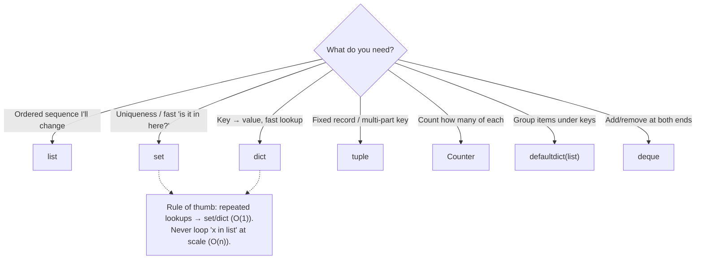

# Phase 0 · Topic 3 — Data Structures Deep (list · dict · set · tuple + collections)

> **The four containers you'll use every single day as a Data Engineer** — and knowing *which* to pick is the difference between a pipeline that runs in seconds and one that crawls.

---

## Why This Exists

As a DE you do four things to data all day long: **move it, group it, dedupe it, look it up.** Python gives you four core containers for this — `list`, `dict`, `set`, `tuple` — plus power tools in the `collections` module.

Picking the wrong one isn't just ugly — it makes your code **slow**. Checking "is this ID in my list?" a million times can take *minutes* with a `list` and *milliseconds* with a `set`. Same result, 1000x difference. That choice is on you.

🗣️ **In plain words:** these are the boxes you put data in. Right box → fast, clean code. Wrong box → slow, buggy code. This lesson makes you pick right every time.

---

## The 4 at a glance

| Structure | Ordered? | Can change? | Duplicates? | Fast lookup? | Use when |
|-----------|:--------:|:-----------:|:-----------:|:------------:|----------|
| **list** | ✅ | ✅ | ✅ | ❌ O(n) | an ordered sequence you'll add to / change |
| **dict** | ✅ (3.7+) | ✅ | keys unique | ✅ O(1) | key → value mapping, fast lookups |
| **set** | ❌ | ✅ | ❌ | ✅ O(1) | uniqueness / "is it in here?" checks |
| **tuple** | ✅ | ❌ | ✅ | ❌ | a fixed record, or a dict key |

> 🗣️ **In plain words — O(1) vs O(n):** O(1) (one-word: *instant*) = same speed no matter how big the data. O(n) (one-word: *scans-everything*) = slower as data grows. This one difference drives most of the lesson.

---

## 1. `list` — ordered, changeable sequence

**Mechanic first (tiny):**
```python
nums = [10, 20, 30]
nums.append(40)        # [10, 20, 30, 40]  ← add to end, instant (O(1))
print(nums[0])         # 10                ← get by position, instant (O(1))
print(20 in nums)      # True              ← BUT this SCANS item by item (O(n))
```

**Apply to e-commerce:**
```python
order_ids = [1001, 1002, 1003]
order_ids.append(1004)          # a new order arrives
print(order_ids[-1])            # 1004  ← last order
```

**Cost of common list operations (know these):**

| Operation | Cost | Why |
|-----------|------|-----|
| `lst.append(x)` | O(1) | adds to the end |
| `lst[i]` | O(1) | jumps to position |
| `x in lst` | **O(n)** | scans every item |
| `lst.insert(0, x)` | O(n) | shifts everything right |
| slicing `lst[a:b]` | O(k) | copies k items |

**List comprehension** (the Pythonic way to build a list):
```python
amounts = [1200, 800, 600, 2000]
big = [a for a in amounts if a > 1000]   # [1200, 2000]
```

**Use a list when:** order matters and you'll iterate or append. **Avoid it for repeated `in` checks** — that's what `set`/`dict` are for.

---

## 2. `dict` — the DE workhorse (key → value, instant lookup)

**Mechanic first (tiny):**
```python
prices = {"pen": 10, "book": 50}
print(prices["book"])        # 50   ← instant lookup, O(1)
```

**Why is it instant? (hashing)**
When you look up `prices["book"]`, Python computes `hash("book")` → a number → jumps *straight* to the slot where that value lives. It does **not** scan the other keys.

🗣️ **In plain words:** a dict is like the **index at the back of a book** — you jump straight to the right page instead of reading every page. That "jump straight" is why it's O(1) (instant).

**Safe access + key methods:**
```python
prices.get("pen")            # 10
prices.get("eraser")         # None   ← no crash (vs prices["eraser"] → KeyError)
prices.get("eraser", 0)      # 0      ← default if missing
"book" in prices             # True   ← checks KEYS, instant
list(prices.keys())          # ['pen', 'book']
list(prices.values())        # [10, 50]
list(prices.items())         # [('pen', 10), ('book', 50)]
```

**Apply to e-commerce — count orders per city (the classic DE move):**
```python
orders = [
    {"id": 1, "city": "Mumbai", "amount": 1200},
    {"id": 2, "city": "Delhi",  "amount": 800},
    {"id": 3, "city": "Mumbai", "amount": 600},
]

counts = {}
for o in orders:
    counts[o["city"]] = counts.get(o["city"], 0) + 1   # get-with-default pattern

print(counts)      # {'Mumbai': 2, 'Delhi': 1}
```

**Dict comprehension:**
```python
# city → total amount, in one line (small example)
prices = {"pen": 10, "book": 50}
with_gst = {item: price * 1.18 for item, price in prices.items()}
print(with_gst)    # {'pen': 11.8, 'book': 59.0}
```

**Use a dict when:** you need to look things up by a key, or map one thing to another. This is *the* most-used structure in data work.

---

## 3. `set` — uniqueness & instant membership

**Mechanic first (tiny):**
```python
s = {1, 2, 2, 3}     # {1, 2, 3}   ← duplicates automatically removed
print(2 in s)        # True         ← instant membership, O(1)
```

**Apply to e-commerce — get the unique cities (dedup):**
```python
cities = {o["city"] for o in orders}   # set comprehension
print(cities)                          # {'Mumbai', 'Delhi'}
```

**Set operations (powerful for "who did both/either" questions):**
```python
bought_electronics = {101, 102, 103}
bought_books       = {102, 103, 104}

bought_electronics & bought_books   # {102, 103}  ← intersection: bought BOTH
bought_electronics | bought_books   # {101,102,103,104} ← union: bought EITHER
bought_electronics - bought_books   # {101}       ← difference: electronics only
```

**Use a set when:** you need uniqueness, or you'll ask "is X in here?" many times. Converting a list to a set *once* turns slow O(n) lookups into instant O(1) ones.

---

## 4. `tuple` — the fixed record

**Mechanic first (tiny):**
```python
point = (12.97, 77.59)   # a lat/long — cannot be changed
lat, lng = point         # "unpacking" — lat=12.97, lng=77.59
```

**Three real uses for tuples:**

1. **Return multiple values** from a function:
   ```python
   def min_max(nums):
       return min(nums), max(nums)   # returns a tuple
   lo, hi = min_max([5, 2, 9])       # lo=2, hi=9
   ```
2. **A composite dict key** (because tuples are hashable — see Topic 2):
   ```python
   revenue = {}
   revenue[("Mumbai", "Electronics")] = 50000   # group by TWO things at once
   ```
3. **A fixed record** you don't want changed (a coordinate, an RGB color, a DB row).

🗣️ **In plain words:** a tuple is a **locked list** — same idea as a list, but its contents can't change. That "locked" property is exactly why it can be a dict key or set member (a list can't).

---

## 5. The Big-O insight — the DE performance lesson

This is the most practical takeaway. **Membership checks:**
- `x in list` → **scans every item** (O(n)) — slow, gets worse as data grows.
- `x in set` / `x in dict` → **jumps straight** (O(1)) — instant, no matter the size.

**See it — validating IDs against a lookup:**
```python
valid_ids_list = list(range(1_000_000))     # a list of 1M valid product IDs
valid_ids_set  = set(range(1_000_000))      # the same, as a set

999_999 in valid_ids_list   # works, but SCANS ~1,000,000 items → slow
999_999 in valid_ids_set    # instant — one hash jump
```

If you check membership in a loop over 10M orders, the list version can take **minutes** while the set version takes **seconds**. Same answer.

**The rule (memorize this):** *if you'll look something up more than once, put it in a `set` or `dict` first.* This is one of the most common real fixes for a slow Python data script.

---

## 6. `collections` — the DE power tools

The `collections` module gives you sharper versions of dict/list. DEs use these daily.

**`defaultdict` — no more `.get(k, 0)`:**
```python
from collections import defaultdict

counts = defaultdict(int)          # missing key auto-starts at 0
for o in orders:
    counts[o["city"]] += 1         # no get(), no KeyError
print(dict(counts))                # {'Mumbai': 2, 'Delhi': 1}

# group orders by city (missing key auto-starts as an empty list)
by_city = defaultdict(list)
for o in orders:
    by_city[o["city"]].append(o["id"])
print(dict(by_city))               # {'Mumbai': [1, 3], 'Delhi': [2]}
```

**`Counter` — counting in one line:**
```python
from collections import Counter

city_counts = Counter(o["city"] for o in orders)
print(city_counts)                 # Counter({'Mumbai': 2, 'Delhi': 1})
print(city_counts.most_common(1))  # [('Mumbai', 2)]  ← top-N built in
```

**`deque` — fast adds/removes at BOTH ends** (queues, sliding windows):
```python
from collections import deque
q = deque([1, 2, 3])
q.appendleft(0)     # [0, 1, 2, 3]  ← O(1) at the front (a list is O(n) here)
q.popleft()         # removes 0, O(1)
```

**`namedtuple` — a readable record** (`o.city` instead of `o[1]`):
```python
from collections import namedtuple
Order = namedtuple("Order", ["id", "city", "amount"])
o = Order(1, "Mumbai", 1200)
print(o.city, o.amount)            # Mumbai 1200  ← readable, still a tuple
```

---

## 7. Choosing the right structure — the decision guide

| I need to… | Use |
|------------|-----|
| Keep an ordered sequence I'll append to | `list` |
| Look up a value by a key, fast | `dict` |
| Keep only unique items / check membership fast | `set` |
| Store a fixed record, or a multi-part dict key | `tuple` |
| Count how many of each | `Counter` |
| Group items under keys | `defaultdict(list)` |
| Add/remove at both ends fast | `deque` |
| A readable, immutable record | `namedtuple` |

---

## Diagram — Which structure should I use?



---

## Revision

### The four containers, and the one question that picks them
`list` = ordered, changeable sequence. `dict` = key→value with instant lookup. `set` = unique items with instant membership. `tuple` = a fixed (locked) record. The single question that chooses for you: *what am I doing with this data?* Ordered + changing → list. Look up by key → dict. Uniqueness / "is it in here?" → set. Fixed record or multi-part key → tuple.

### dict and set are instant because of hashing
A `dict` lookup and a `set` membership check are O(1) — instant, regardless of size — because Python hashes the key and jumps straight to its slot (like a book's index). A `list` membership check (`x in lst`) is O(n) — it scans every item, so it slows down as the data grows. This is the single biggest performance idea in the lesson.

### The rule that fixes slow Python data code
If you'll look something up more than once, put it in a `set` or `dict` first. Looping `x in some_list` over millions of rows is a classic cause of slow scripts; converting `some_list` to a `set` once turns every check from O(n) to O(1) — minutes become seconds, same result.

### tuples are "locked lists" — and that's a feature
A tuple can't be changed after creation. That immutability is exactly why a tuple can be a **dict key** or a **set member** (a list cannot). Use tuples to return multiple values, to store fixed records, and to group by more than one field at once (`revenue[("Mumbai", "Electronics")]`).

### collections are the DE power tools
`defaultdict` removes the `.get(k, default)` boilerplate and is perfect for counting and grouping. `Counter` counts in one line and gives you `.most_common()` for free (top-N). `deque` adds/removes at both ends in O(1) (lists are O(n) at the front). `namedtuple` makes records readable (`o.city` not `o[1]`). You'll reach for these constantly in real pipelines.

---

## Practice Questions

### 🟢 Easy

**E1. For each task, which single structure is the best fit — list, dict, set, or tuple? (a) store a customer's lat/long, (b) map product_id → product_name, (c) get the unique set of cities from a list of orders, (d) keep the ordered list of items in a cart.**

<details>
<summary>▶ Answer</summary>

(a) **tuple** — a fixed 2-value record `(lat, lng)` that shouldn't change.
(b) **dict** — a key→value mapping (`product_id → name`) with fast lookup.
(c) **set** — automatically removes duplicates, gives unique cities.
(d) **list** — ordered and changeable (you add/remove cart items).

</details>

---

**E2. What does `orders.get("Mumbai", 0)` do, and why is it safer than `orders["Mumbai"]`?**

<details>
<summary>▶ Answer</summary>

`orders.get("Mumbai", 0)` returns the value for key `"Mumbai"` if it exists, or **`0`** if the key is missing — no error.

`orders["Mumbai"]` **crashes with a `KeyError`** if `"Mumbai"` isn't a key.

`.get(key, default)` is safer whenever the key might not exist — which is why the "count with a default" pattern (`counts[k] = counts.get(k, 0) + 1`) is so common. (Even cleaner: `defaultdict(int)`.)

</details>

---

**E3. Why can a tuple be used as a dictionary key but a list cannot?**

<details>
<summary>▶ Answer</summary>

Because dict keys must be **hashable**, and only **immutable** objects are hashable. A **tuple is immutable** (can't change) → hashable → valid key. A **list is mutable** (can change) → unhashable → `TypeError: unhashable type: 'list'` if you try to use it as a key.

```python
d = {("Mumbai", "Electronics"): 50000}   # ✅ tuple key
d = {["Mumbai", "Electronics"]: 50000}   # ❌ TypeError
```

This is why composite keys (grouping by two fields) use tuples.

</details>

---

### 🟡 Medium

**M1. You have a list of 5 million order dicts and a `list` of 2 million valid customer IDs. You loop through orders and check `if order["customer_id"] in valid_ids`. The script is painfully slow. What's the cause and the one-line fix?**

<details>
<summary>▶ Answer</summary>

**Cause:** `valid_ids` is a **list**, so `in` is **O(n)** — each check scans up to 2M items. Doing that 5M times = up to 10 *trillion* comparisons. That's why it crawls.

**One-line fix:** convert the lookup to a **set** once, before the loop:
```python
valid_ids = set(valid_ids)     # O(1) membership from now on
```
Now each `order["customer_id"] in valid_ids` is instant. The 5M checks go from minutes to well under a second — same result.

**The principle:** repeated membership checks → put the lookup in a `set` (or `dict`) first.

</details>

---

**M2. Given the orders below, produce total revenue per city using `defaultdict`. Then get the top city with `Counter`-style logic. Write the code.**

```python
orders = [
    {"id": 1, "city": "Mumbai", "amount": 1200},
    {"id": 2, "city": "Delhi",  "amount": 800},
    {"id": 3, "city": "Mumbai", "amount": 600},
    {"id": 4, "city": "Delhi",  "amount": 1500},
]
```

<details>
<summary>▶ Answer</summary>

```python
from collections import defaultdict

revenue = defaultdict(float)          # missing key auto-starts at 0.0
for o in orders:
    revenue[o["city"]] += o["amount"]

print(dict(revenue))                  # {'Mumbai': 1800.0, 'Delhi': 2300.0}

# top city by revenue
top_city = max(revenue, key=revenue.get)
print(top_city, revenue[top_city])    # Delhi 2300.0
```

**Why `defaultdict(float)`:** it removes the `if city not in revenue: revenue[city] = 0` boilerplate — the first `+=` on a new city starts from 0.0 automatically.

**Alternative with a plain dict:** `revenue[c] = revenue.get(c, 0) + amt`. Same result; `defaultdict` is cleaner when accumulating.

</details>

---

**M3. What's the difference between these two, and when would you use each?**
```python
a = [o["city"] for o in orders]
b = {o["city"] for o in orders}
```

<details>
<summary>▶ Answer</summary>

- `a = [...]` is a **list comprehension** → a **list** of cities, **with duplicates**, in order. e.g. `['Mumbai', 'Delhi', 'Mumbai', 'Delhi']`.
- `b = {...}` is a **set comprehension** → a **set** of **unique** cities, no order. e.g. `{'Mumbai', 'Delhi'}`.

**Use the list** when you need every occurrence (e.g., to count how many orders per city, or to keep order).
**Use the set** when you only want the distinct cities (dedup), or you'll do fast membership checks on them.

Quick tip: `len(b)` = number of *distinct* cities; `len(a)` = total number of orders.

</details>

---

**M4. Explain what `Counter(o["city"] for o in orders).most_common(2)` returns and why it's better than writing the counting loop yourself.**

<details>
<summary>▶ Answer</summary>

It returns the **2 most frequent cities** as a list of `(city, count)` tuples, sorted high→low. For our orders:
```python
[('Mumbai', 2), ('Delhi', 2)]   # (ties in insertion order)
```

**Why it's better than a manual loop:**
- `Counter(...)` counts everything in **one line** (no `defaultdict`, no `+= 1` loop).
- `.most_common(n)` gives you **top-N sorted** for free — writing that yourself means building the dict, then sorting `items()` by value descending, then slicing. `Counter` does all of it.
- It's also written in C internally → fast.

Use `Counter` any time the task is "count occurrences" or "top-N by frequency" — a *very* common DE ask (top products, top errors in logs, most-active users).

</details>

---

### 🔴 Hard

**H1. A colleague builds a `dict` mapping `order_id → order` for 10M orders to enable fast lookups, but the process runs out of memory. Meanwhile, another task only needs to check *whether* an order_id has been seen. Explain the memory difference between a `dict`, a `set`, and a `list` here, and which to use for each need.**

<details>
<summary>▶ Answer</summary>

🗣️ **In plain words:** store the *whole order* only if you need the whole order; if you just need "have I seen this ID?", store only the IDs in a set — far less memory.

**The memory difference:**
- **`dict` of `order_id → order`** holds **every full order object** (all its fields) *plus* the key and the hash-table overhead. For 10M rich orders, that's the heaviest — it can blow memory. Use it **only if you actually need to retrieve the full order by id**.
- **`set` of order_ids** holds **only the ids** (plus hash overhead) — dramatically less memory than storing full orders. Use it when you only need **membership** ("have I seen this id?"). O(1) checks, tiny footprint compared to the dict.
- **`list` of order_ids** holds only the ids too (slightly less overhead than a set), **but** membership is **O(n)** — useless for fast "have I seen it?" checks at scale.

**So:**
- Need to **look up the full order by id** → `dict` (accept the memory cost, or don't hold all 10M in RAM — stream/paginate instead).
- Need only **"seen or not"** → `set` of ids (fast + light).
- Never use a **list** for repeated membership at scale.

**The deeper DE lesson:** don't hold more than you need in memory. If you only need membership, store keys, not whole records. And if 10M full objects don't fit in RAM at all, that's the signal to **stream/chunk** the data or push it into a database/Spark — which is exactly why the later phases exist.

</details>

---

**H2. This code is supposed to group order IDs by city, but it crashes with `KeyError` on the first order. Fix it three different ways (plain dict, `.setdefault`, `defaultdict`) and say which you'd use in production and why.**
```python
by_city = {}
for o in orders:
    by_city[o["city"]].append(o["id"])   # 💥 KeyError
```

<details>
<summary>▶ Answer</summary>

🗣️ **In plain words:** the crash happens because the first time a city appears, there's no list to `.append` to yet. All three fixes make sure a list exists first.

**Fix 1 — plain dict with a check:**
```python
by_city = {}
for o in orders:
    if o["city"] not in by_city:
        by_city[o["city"]] = []
    by_city[o["city"]].append(o["id"])
```

**Fix 2 — `.setdefault`:**
```python
by_city = {}
for o in orders:
    by_city.setdefault(o["city"], []).append(o["id"])
```
`setdefault(key, [])` returns the existing list, or inserts `[]` and returns it — so `.append` always has a list.

**Fix 3 — `defaultdict(list)` (cleanest):**
```python
from collections import defaultdict
by_city = defaultdict(list)
for o in orders:
    by_city[o["city"]].append(o["id"])
```

**Which in production?** Usually **`defaultdict(list)`** — it's the most readable and removes all boilerplate, making the intent ("group into lists") obvious. One caveat to know: a `defaultdict` will *create* an entry on any access (even a read of a missing key), which can silently grow it — if that's a risk, use `.setdefault` or convert back with `dict(by_city)` when done. `setdefault` is a fine choice when you want a normal dict and no import.

**Interview tag:** "group X by Y" is one of the most common live-coding asks — knowing all three (and *why* `defaultdict` wins) shows real fluency.

</details>

---

**H3. You need to deduplicate 50M order records where a "duplicate" means the same `(customer_id, product_id, order_date)` — not the same object. Design an efficient approach, explain why a `set` of tuples works, and describe what breaks at 50M scale and how you'd handle it.**

<details>
<summary>▶ Answer</summary>

🗣️ **In plain words:** make a "fingerprint" tuple of the fields that define a duplicate, keep a set of fingerprints you've already seen, and skip any record whose fingerprint is already in the set.

**The approach:**
```python
seen = set()
unique = []
for r in records:
    key = (r["customer_id"], r["product_id"], r["order_date"])  # the dedup fingerprint
    if key not in seen:          # O(1) membership check
        seen.add(key)
        unique.append(r)
```

**Why a `set` of tuples works:**
- The **tuple** `(customer_id, product_id, order_date)` is a **hashable composite key** — it captures "same by these three fields," which is our definition of duplicate. (A list couldn't be a set member — unhashable.)
- The **set** gives **O(1)** "have I seen this fingerprint?" checks, so deduping 50M records is roughly O(n) overall instead of O(n²) (which comparing every pair would be).

**What breaks at 50M scale, and fixes:**
1. **Memory:** the `seen` set holds 50M tuples — that can exhaust RAM. Fixes: (a) store a **hash** of the key instead of the full tuple (smaller, tiny collision risk), (b) **sort** the data by the key and dedupe in a single streaming pass (only need to compare neighbors — constant memory), or (c) it doesn't fit on one machine → this is exactly a **Spark `dropDuplicates([...])`** or a SQL `GROUP BY` job (later phases).
2. **`None`/messy fields:** if any of the three fields is `None` or inconsistently typed, "same" records may not match. Normalize types/nulls first (data-quality step).
3. **order_date format:** `"2026-01-01"` vs a `datetime` object hash differently — standardize the type before building the key.

**Interview tag:** dedup-by-composite-key is a classic DE question. The set-of-tuples answer shows you understand hashing + O(1); the "what breaks at scale → sort-based or Spark" part shows senior thinking.

</details>

---

*Practice on the e-commerce dataset: see [`practice.md`](./practice.md).*

*Next: [Topic 4 — Control Flow & Comprehensions](../topic-4-control-flow-comprehensions/)*
