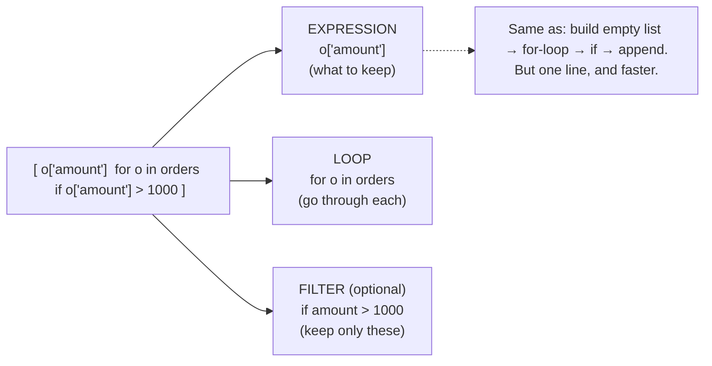

# Phase 0 · Topic 4 — Control Flow & Comprehensions

> **How Python makes decisions and repeats work** — plus the *comprehension*, the one-line pattern that separates beginner code from fluent Data-Engineer code.

---

## Why This Exists

Every pipeline does two things constantly: **makes decisions** ("if this row is bad, skip it") and **repeats work** ("for every order, do X"). That's control flow.

And **comprehensions** are how DEs write those loops in one clean, fast line. Writing the long verbose loop everywhere marks you as a beginner; reaching for a comprehension when it fits marks you as fluent. This lesson makes both automatic.

🗣️ **In plain words:** control flow = the "if this then that" and "do this for each" of your code. Comprehensions = the short, Pythonic way to build a list/dict/set from data.

---

## 1. `if / elif / else` + truthiness

**Mechanic first (tiny):**
```python
amount = 1500
if amount > 1000:
    tier = "high"
elif amount > 500:
    tier = "medium"
else:
    tier = "low"
print(tier)          # high
```

**Truthiness — what counts as "empty/false" (memorize this):**
These are all **falsy**: `0`, `0.0`, `""`, `[]`, `{}`, `set()`, `None`, `False`. **Everything else is truthy.**

```python
city = ""            # empty string is falsy
if not city:         # "if city is empty/missing"
    city = "UNKNOWN"
print(city)          # UNKNOWN
```

🗣️ **In plain words:** `if not x` means *"if x is empty, missing, zero, or None."* Super common for handling messy data.

---

## 2. Boolean operators + short-circuit

`and`, `or`, `not`. They **short-circuit** — stop as soon as the answer is known:
```python
# `a or b` → returns a if a is truthy, else b
city = order.get("city") or "UNKNOWN"     # default when city is "", None, missing

# `a and b` → returns a if a is falsy, else b
```

**The `x or default` pattern is everywhere in DE** — a one-liner to fill missing values.

> ⚠️ **Truthiness trap:** `amount or 0` treats a *real* `0` amount as "missing." If `0` is a valid value, check explicitly: `amount if amount is not None else 0`. (You'll meet this in the break-it problem.)

---

## 3. Ternary — the one-line `if`

```python
label = "paid" if amount > 0 else "free"
```
Read it as: *value_if_true `if` condition `else` value_if_false.* Great inside comprehensions.

---

## 4. `for` loops — the DE workhorse

**Mechanic first:**
```python
for x in [10, 20, 30]:
    print(x)             # 10, 20, 30
```

**Three tools you'll use constantly:**
```python
# enumerate → index + item
for i, o in enumerate(orders):
    print(i, o["id"])

# zip → walk two lists in parallel
cities  = ["Mumbai", "Delhi"]
amounts = [1200, 800]
for city, amt in zip(cities, amounts):
    print(city, amt)      # Mumbai 1200 / Delhi 800

# range → a sequence of numbers
for i in range(3):
    print(i)              # 0, 1, 2
```

**Apply to e-commerce — total revenue:**
```python
total = 0.0
for o in orders:
    total += o["amount"]
print(total)
```

---

## 5. `while` loops (retries & pagination)

Less common in DE than `for`, but essential for **API pagination** and **retries**:
```python
page = 1
while has_more_pages:      # loop until a condition flips
    data = fetch(page)
    page += 1
```
⚠️ Always make sure the condition eventually becomes false, or you get an infinite loop.

---

## 6. `break` / `continue` (skip and stop)

```python
for o in orders:
    if o["amount"] < 0:
        continue          # SKIP this bad row, go to next
    if o["amount"] > 100000:
        break             # STOP the whole loop
    process(o)
```
- `continue` → skip the rest of *this* iteration.
- `break` → exit the loop entirely.
`continue` is a clean way to filter out bad rows early.

---

## 7. Comprehensions — the Pythonic power move ⭐

This is the section that levels up your code.

**The anatomy:**
```
[  EXPRESSION   for ITEM in ITERABLE   if CONDITION  ]
   what to keep     the loop            optional filter
```

**List comprehension:**
```python
amounts = [o["amount"] for o in orders]                       # pull one field
big     = [o["amount"] for o in orders if o["amount"] > 1000] # with a filter
labels  = ["high" if o["amount"] > 1000 else "low" for o in orders]  # with a transform (ternary)
```

**The same thing as a plain loop (why the comprehension wins):**
```python
# verbose loop
big = []
for o in orders:
    if o["amount"] > 1000:
        big.append(o["amount"])

# comprehension — same result, one line, and slightly FASTER (optimized internally)
big = [o["amount"] for o in orders if o["amount"] > 1000]
```

**Dict comprehension:**
```python
id_to_amount = {o["id"]: o["amount"] for o in orders}    # build a lookup table
```

**Set comprehension:**
```python
cities = {o["city"] for o in orders}                     # unique cities
```

**Nested comprehension (flatten a list of lists — use sparingly):**
```python
orders_with_items = [
    {"id": 1, "items": ["P1", "P2"]},
    {"id": 2, "items": ["P3"]},
]
all_items = [item for o in orders_with_items for item in o["items"]]
print(all_items)     # ['P1', 'P2', 'P3']
```
Read the nested one **left to right** = the same order as the equivalent nested `for` loops.

---

## 8. Generator expressions — lazy, memory-light

Swap `[]` for `()` and you get a **generator** — it produces items one at a time instead of building a whole list in memory. Perfect for big data:
```python
total = sum(o["amount"] for o in orders)   # no intermediate list built → memory-light
```
🗣️ **In plain words:** a list comprehension builds the *whole list now*; a generator makes items *one at a time, on demand.* On 50M rows, that's the difference between fitting in memory and crashing. (Full topic: Iterators & Generators, Phase 1.)

---

## 9. Two modern extras (know they exist)

**Walrus `:=` (3.8+)** — assign *inside* an expression:
```python
while (line := f.readline()):     # read AND test in one step
    process(line)
```

**`match / case` (3.10+)** — clean multi-way branching:
```python
match status:
    case "delivered":            handle_delivered()
    case "cancelled" | "returned": handle_refund()
    case _:                       handle_other()      # _ = default
```

---

## 10. Comprehension vs loop — when to use which

| Use a **comprehension** when… | Use a **loop** when… |
|-------------------------------|----------------------|
| Building a list/dict/set from an iterable | You need side effects (writing to a file/DB) |
| Simple transform + filter | The logic is complex / multi-step |
| One clear expression | Readability would suffer if crammed into one line |

**Golden rule:** readability wins. If a comprehension needs a comment to understand, use a loop.

---

## Diagram — the comprehension, decoded



---

## Revision

### if / elif / else + truthiness
`if/elif/else` picks one branch. The key skill is **truthiness**: `0`, `0.0`, `""`, `[]`, `{}`, `set()`, `None`, `False` are all "falsy" (empty/false); everything else is truthy. `if not x` means "if x is empty/missing/zero" — a very common way to handle messy data. But beware the trap: a real `0` is falsy too, so `amount or 0` wrongly treats a `0` amount as missing.

### Loops and their helpers
`for` is the DE workhorse. `enumerate` gives you index + item, `zip` walks two lists in parallel, `range` gives a number sequence. `continue` skips the current iteration (great for skipping bad rows), `break` exits the loop. `while` is for retries and API pagination — always ensure its condition eventually turns false.

### Comprehensions are the Pythonic power move
`[expression for item in iterable if condition]` builds a list in one line — clearer and slightly faster than an append-loop. There are dict comprehensions (`{k: v for ...}`) and set comprehensions (`{x for ...}`) too. You can add a transform with a ternary (`"high" if a>1000 else "low"`). Nested comprehensions flatten lists-of-lists, read left-to-right like nested loops — but use them sparingly; readability first.

### Generator expressions save memory
Swapping `[...]` for `(...)` makes a generator that yields items one at a time instead of building the whole list. `sum(o["amount"] for o in orders)` never builds an intermediate list — essential when the data is too big to fit in memory. This is your first taste of lazy evaluation (full topic in Phase 1).

### When to use which
Use a comprehension to *build* a list/dict/set with a simple transform/filter. Use a plain loop when there are side effects, multi-step logic, or when a one-liner would hurt readability. The golden rule: if it needs a comment to understand, it's a loop, not a comprehension.

---

## Practice Questions

### 🟢 Easy

**E1. Which of these are falsy in Python: `0`, `"0"`, `[]`, `" "`, `None`, `{}`, `0.0`?**

<details>
<summary>▶ Answer</summary>

**Falsy:** `0`, `[]`, `None`, `{}`, `0.0`.
**Truthy:** `"0"` (a non-empty string — the *character* zero), `" "` (a space is a non-empty string).

The trap: `"0"` and `" "` look "empty-ish" but are non-empty strings, so they're **truthy**. Only a truly empty string `""` is falsy.

</details>

---

**E2. Rewrite this loop as a list comprehension:**
```python
result = []
for o in orders:
    if o["status"] == "delivered":
        result.append(o["id"])
```

<details>
<summary>▶ Answer</summary>

```python
result = [o["id"] for o in orders if o["status"] == "delivered"]
```

Anatomy: expression `o["id"]` · loop `for o in orders` · filter `if o["status"] == "delivered"`. Same result, one line, slightly faster.

</details>

---

**E3. What does `city = order.get("city") or "UNKNOWN"` do?**

<details>
<summary>▶ Answer</summary>

It sets `city` to the order's city — **unless** that value is falsy (`None`, `""`, or missing → `.get` returns `None`), in which case it falls back to `"UNKNOWN"`.

`a or b` returns `a` if `a` is truthy, otherwise `b`. It's a one-line way to supply a default for missing/empty values — extremely common when cleaning messy data.

</details>

---

### 🟡 Medium

**M1. Build a dict comprehension mapping each `customer_id` to their total spend from this data. (Careful — a customer appears in multiple orders.)**
```python
orders = [
    {"id": 1, "customer_id": 101, "amount": 1200},
    {"id": 2, "customer_id": 102, "amount": 800},
    {"id": 3, "customer_id": 101, "amount": 600},
]
```

<details>
<summary>▶ Answer</summary>

**Trap:** a plain dict comprehension `{o["customer_id"]: o["amount"] for o in orders}` **overwrites** — customer 101 would end up as just `600` (the last one wins), not `1800`. Dict comprehensions can't *accumulate*.

**Correct — use a loop (or defaultdict), because you're summing:**
```python
from collections import defaultdict
spend = defaultdict(float)
for o in orders:
    spend[o["customer_id"]] += o["amount"]
print(dict(spend))     # {101: 1800.0, 102: 800.0}
```

**Lesson:** comprehensions are for *building*, not *accumulating*. When you need to sum/count per key, use a loop with `defaultdict` (or `Counter`). Knowing *when NOT* to use a comprehension is as important as knowing how.

</details>

---

**M2. Explain the difference in memory between these two, and when each matters:**
```python
a = sum([o["amount"] for o in orders])
b = sum(o["amount"] for o in orders)
```

<details>
<summary>▶ Answer</summary>

Both give the same total. The difference is *how*:

- `a` — the **list comprehension** `[...]` first builds a full list of all amounts in memory, *then* sums it. For 50M orders, that's a 50M-element list sitting in RAM before summing.
- `b` — the **generator expression** `(...)` yields one amount at a time; `sum` adds them as they come. **No intermediate list** — constant memory.

**When it matters:** on small data, no difference. On big data, `b` (generator) avoids building a huge throwaway list and can be the difference between running and an out-of-memory crash. **Rule:** when you're just feeding a comprehension straight into `sum`/`max`/`any`/`min`, drop the brackets — use a generator.

</details>

---

**M3. This is supposed to skip bad rows (negative or missing amount) and sum the rest. It crashes. Fix it.**
```python
total = 0
for o in orders:
    if o["amount"] < 0:
        continue
    total += o["amount"]
```

<details>
<summary>▶ Answer</summary>

**Why it crashes:** if `o["amount"]` is `None` (missing), `None < 0` raises `TypeError: '<' not supported between instances of 'NoneType' and 'int'`. The `continue` only handles negatives, not `None`.

**Fix — check for missing FIRST:**
```python
total = 0
for o in orders:
    amt = o.get("amount")
    if amt is None or amt < 0:      # skip missing OR negative
        continue
    total += amt
```
Order matters: test `amt is None` **before** `amt < 0`, so you never compare `None < 0`. (`or` short-circuits — if `amt is None` is true, it never evaluates `amt < 0`.)

**Real-world tie-in:** messy data (nulls) breaking a comparison is one of the most common pipeline crashes. Always handle missing before comparing.

</details>

---

**M4. What does this nested comprehension produce, and what's the equivalent nested loop?**
```python
orders = [{"id": 1, "items": ["P1", "P2"]}, {"id": 2, "items": ["P3"]}]
out = [(o["id"], item) for o in orders for item in o["items"]]
```

<details>
<summary>▶ Answer</summary>

**Produces:** `[(1, 'P1'), (1, 'P2'), (2, 'P3')]` — one `(order_id, product)` pair per item (flattening orders → items).

**Equivalent nested loop** (read the comprehension left-to-right = outer loop then inner loop):
```python
out = []
for o in orders:                 # outer
    for item in o["items"]:      # inner
        out.append((o["id"], item))
```

**Lesson:** in a nested comprehension, the `for` clauses go in the **same order** as nested loops (outer first). This "explode a parent into its children" pattern is exactly how you'd flatten `orders` into `order_items` — a real DE transform.

</details>

---

### 🔴 Hard

**H1. A teammate writes `amount = row.get("amount") or 0.0` to default missing amounts to zero. It silently corrupts a report. Explain the bug and give the correct version.**

<details>
<summary>▶ Answer</summary>

🗣️ **In plain words:** `or` treats a real `0` as "missing," so any genuine ₹0 amount gets... replaced by 0 (harmless here) — but the deeper bug is it *also* masks the difference between "truly missing" and "actually zero," and worse, it silently swallows other falsy-but-valid values.

**The bug:** `x or 0.0` returns `0.0` whenever `x` is **any falsy value** — not just `None`. So:
- `row["amount"]` is `0.0` (a real free order) → `0.0 or 0.0` → `0.0` ✅ *(fine by luck)*
- But the pattern is dangerous because it **cannot distinguish "missing" from "zero"** — both become `0.0`. If your report counts "orders with a recorded amount," a legit `0.0` and a `None` are now identical, and you can't tell a free order from a data gap.
- With other fields it's worse: `count or 0` turns a valid count of `0` into `0` and hides it; `name or "N/A"` turns an empty-but-intentional value into "N/A".

**Correct — check for `None` explicitly:**
```python
amt = row.get("amount")
amount = amt if amt is not None else 0.0     # only defaults TRUE missing
```
Now a real `0.0` stays `0.0` and is distinguishable from a missing `None` (which becomes the default). If you also need to reject negatives: `amount = amt if (amt is not None and amt >= 0) else 0.0`.

**The principle:** `x or default` is a great shortcut **only when every falsy value should become the default.** For numbers (where `0` is valid) and counts, use `x if x is not None else default`. Confusing "falsy" with "missing" is a classic silent data bug.

</details>

---

**H2. You must label each order into buckets: `amount <= 0` → "invalid", `<= 500` → "low", `<= 2000` → "medium", else "high". Write it two ways — a comprehension and a helper-function loop — and say which is better and why.**

<details>
<summary>▶ Answer</summary>

**Way 1 — nested ternary in a comprehension (compact but hard to read):**
```python
labels = ["invalid" if o["amount"] <= 0
          else "low" if o["amount"] <= 500
          else "medium" if o["amount"] <= 2000
          else "high"
          for o in orders]
```

**Way 2 — a named helper + simple comprehension (clearer):**
```python
def bucket(amount):
    if amount <= 0:    return "invalid"
    if amount <= 500:  return "low"
    if amount <= 2000: return "medium"
    return "high"

labels = [bucket(o["amount"]) for o in orders]
```

**Which is better? Way 2.** Here's the honest reasoning:
- The nested ternary (Way 1) works and is "clever," but 4-way branching crammed into a comprehension is **hard to read, hard to test, and hard to change**. Add a fifth bucket and it gets ugly.
- Way 2 keeps the comprehension **simple** (`bucket(...)` — one clear expression) and moves the branching logic into a **named, testable function**. You can unit-test `bucket()` in isolation, reuse it, and read it in 2 seconds.

**The golden rule in action (Section 10):** a comprehension should hold a *simple* expression. When the logic is multi-way, put it in a function and call it from the comprehension. Clever one-liners lose to readable code in real pipelines — the next engineer (or you in 3 months) has to understand it.

**Interview tag:** "bucket/categorize values" is a common ask; showing you'd extract the logic into a testable function signals production maturity, not just syntax knowledge.

</details>

---

**H3. Given `orders` (each with `customer_id` and `amount`) and a `set` of `vip_customer_ids`, produce — in the cleanest way — the total revenue from VIP customers only, on data too large to fit in memory. Explain every choice.**

<details>
<summary>▶ Answer</summary>

🗣️ **In plain words:** filter to VIPs with a fast set-membership check, and sum with a generator so you never build a big list.

```python
vip_revenue = sum(
    o["amount"]
    for o in orders                       # a generator/stream, one order at a time
    if o["customer_id"] in vip_customer_ids   # O(1) set membership
)
```

**Every choice explained:**
1. **Generator expression `(... for ...)`, not a list `[... ]`** — because the data is too large for memory. The generator yields one amount at a time and `sum` adds it immediately; **no intermediate list** is built. A list comprehension here could OOM.
2. **`vip_customer_ids` is a `set`, so `in` is O(1)** — checking membership against a set is instant, regardless of how many VIPs. If it were a *list*, each check would be O(n) and the whole thing would crawl (Topic 3's lesson). If you were handed a list, convert once: `vips = set(vip_customer_ids)`.
3. **`if ...` filter inside the generator** — filtering *before* summing means non-VIP orders never contribute; nothing is materialized.
4. **`orders` should itself be a stream** (e.g., reading rows one at a time from a file/DB), not a fully-loaded list — otherwise you've already blown memory before the generator helps. On truly huge data this is where you'd move to **chunked reading**, **DuckDB** (`SELECT SUM(amount) ... WHERE customer_id IN (...)`), or **Spark** — same logic, distributed.

**Why this is "cleanest":** it's one readable expression that is also memory-safe and fast — it combines the generator (memory), the set (speed), and the filter (correctness). It directly reflects the three ideas from Topics 3–4: right structure (`set`), lazy evaluation (generator), and clean control flow (filter).

**The honest scale note:** for genuinely massive data, the *most* professional answer is "push this to SQL/DuckDB or Spark" — but showing you can express it efficiently in pure Python (set + generator + filter) proves you understand *why* those tools do what they do.

</details>

---

*Practice on the e-commerce dataset: see [`practice.md`](./practice.md).*

*Next: [Topic 5 — Functions (args, *args/**kwargs, scope, closures)](../topic-5-functions/)*
