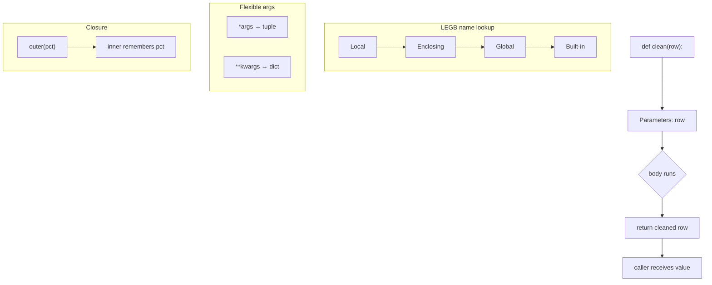

# Topic 5 — Functions (args, `*args`/`**kwargs`, scope, closures)

> **Phase 0 · Foundations · Lesson 5 of 5** — the last one before your first revision + challenge.

---

## 0. WHY this exists (read this first)

You have written the same 5 lines to "clean a phone number" in three different
notebooks. One day the rule changes (India adds a new prefix). Now you must find
and fix all three copies. You miss one. Production breaks at 2 AM.

**A function is a named box of logic you write once and call everywhere.**
Fix the box once → every caller is fixed.

🗣️ **In plain words:** a function is a recipe. You write "how to make chai" once.
After that you just say "make chai" — you don't re-explain the steps every time.

**Where you use this every single day as a Data Engineer:**

- Every Airflow task is a Python function.
- Every dbt macro, every Spark UDF, every transformation step — a function.
- A pipeline is just **small functions wired together**: `extract()` → `clean()` → `load()`.
- Reusable cleaning logic (`clean_email`, `normalize_city`, `parse_amount`) lives in one function and is imported across the whole codebase.

If you cannot write clean functions, you cannot write a pipeline. This is the
join between "I know Python syntax" and "I build data systems."

---

## 1. The absolute basics — `def`, arguments, `return`

```python
def net_revenue(price, quantity):
    return price * quantity

total = net_revenue(250, 3)
print(total)          # 750
```

Three parts to name correctly (interviewers test this):

| Word | Meaning | In the example |
|------|---------|----------------|
| **Parameter** | the variable in the *definition* | `price`, `quantity` |
| **Argument** | the real value you *pass in* | `250`, `3` |
| **Return value** | what the function hands back | `750` |

### `return` vs `print` — the #1 beginner bug

```python
def bad(price, qty):
    print(price * qty)      # shows on screen, hands back NOTHING

def good(price, qty):
    return price * qty      # hands the value back to the caller

x = bad(250, 3)             # prints 750...
print(x)                    # None  ← the value is GONE, you can't use it

y = good(250, 3)
print(y * 2)                # 1500  ← you can keep working with it
```

🗣️ **In plain words:** `print` = say the answer out loud. `return` = put the
answer in your hand so you can use it next. In a pipeline you almost always
`return` — the next step needs the value, not a message on screen.

**A function with no `return` returns `None`.** Remember this — it causes silent
bugs when someone does `total = clean(row)` and `clean` forgot to return.

---

## 2. Default arguments — sensible fallbacks

```python
def apply_discount(price, pct=10):     # pct defaults to 10 if not given
    return price - (price * pct / 100)

print(apply_discount(1000))       # 900.0   → used default 10%
print(apply_discount(1000, 25))   # 750.0   → overrode with 25%
```

**Rule:** parameters *with* defaults must come *after* parameters without them.

```python
def f(a, b=2):   ...   # ✅ ok
def f(a=1, b):   ...   # ❌ SyntaxError
```

### 🔴 The mutable default trap (senior interviewers LOVE this one)

```python
def add_item(item, cart=[]):      # ❌ DANGER: list created ONCE, shared forever
    cart.append(item)
    return cart

print(add_item("apple"))    # ['apple']
print(add_item("banana"))   # ['apple', 'banana']  ← WHY is apple still here?!
```

The default `[]` is created **one time**, when the function is defined — not on
each call. Every call that uses the default shares the **same** list.

**The fix — use `None` as the sentinel:**

```python
def add_item(item, cart=None):
    if cart is None:
        cart = []             # fresh list on every call
    cart.append(item)
    return cart

print(add_item("apple"))    # ['apple']
print(add_item("banana"))   # ['banana']  ✅ correct
```

🗣️ **In plain words:** writing `cart=[]` is like giving every customer the *same*
physical shopping cart. Use `None` → hand each customer a brand-new cart.

---

## 3. `*args` and `**kwargs` — accept any number of arguments

### `*args` → extra **positional** args become a tuple

```python
def total(*prices):            # collect all positional args into a tuple
    return sum(prices)

print(total(100, 200))         # 300
print(total(100, 200, 50, 9))  # 359   ← any count works
```

### `**kwargs` → extra **keyword** args become a dict

```python
def make_order(**fields):      # collect all keyword args into a dict
    return fields

print(make_order(id=1, city="Pune", amount=999))
# {'id': 1, 'city': 'Pune', 'amount': 999}
```

### The full ordering (memorize this shape)

```python
def f(a, b, *args, key=0, **kwargs):
    ...
#     ^  ^   ^        ^      ^
#     |  |   |        |      └ leftover keyword args → dict
#     |  |   |        └ keyword-only arg with default
#     |  |   └ leftover positional args → tuple
#     └──┴ normal positional args
```

🗣️ **In plain words:** `*args` = "give me the rest of the loose values in a bag."
`**kwargs` = "give me the rest of the labelled values in a box." The `*` means
*pack many into one*.

### Why a DE actually cares

Decorators, logging wrappers, and Airflow's `**context` all rely on this. When
you write a retry wrapper that must work for *any* function, you write
`def wrapper(*args, **kwargs): return fn(*args, **kwargs)` — it forwards
whatever it got, unchanged.

### The mirror trick — **unpacking** with `*` and `**`

```python
row   = (250, 3)
info  = {"pct": 25}

print(net_revenue(*row))        # same as net_revenue(250, 3)  → 750
print(apply_discount(1000, **info))   # same as apply_discount(1000, pct=25) → 750.0
```

`*` in a **call** = spread a list/tuple into positional args.
`**` in a **call** = spread a dict into keyword args. You will see this constantly.

---

## 4. Scope — where a variable lives (the **LEGB** rule)

When Python sees a name, it searches in this order and stops at the first hit:

```
L → Local      (inside the current function)
E → Enclosing  (an outer function wrapping this one)
G → Global     (top level of the file/module)
B → Built-in   (print, len, sum, ...)
```

```python
tax = 18                       # Global

def price_with_tax(base):
    extra = base * tax / 100   # 'base','extra' = Local ; 'tax' found in Global
    return base + extra

print(price_with_tax(1000))    # 1180.0
print(extra)                   # ❌ NameError: 'extra' only lives inside the function
```

🗣️ **In plain words:** what happens in the function stays in the function. Locals
are born when the function starts and die when it returns.

### Reading global = fine. Rebinding global = needs `global` (and usually a smell)

```python
counter = 0

def bad_increment():
    counter = counter + 1      # ❌ UnboundLocalError — Python thinks counter is local

def ok_increment():
    global counter             # "I mean the outer one"
    counter += 1
```

**DE guidance:** using `global` to mutate shared state is a red flag in pipeline
code — it makes tasks non-repeatable and hard to test. Prefer *passing values in*
and *returning values out*. Know `global` exists; reach for it rarely.

---

## 5. Closures — a function that remembers

A **closure** is an inner function that captures variables from the function that
made it — and keeps them alive after the outer function has returned.

```python
def discount_of(pct):              # outer: takes the rule
    def apply(price):              # inner: remembers pct
        return price - price * pct / 100
    return apply                   # hand back the configured function

festive = discount_of(30)          # a 30%-off machine
clearance = discount_of(50)        # a 50%-off machine

print(festive(1000))      # 700.0
print(clearance(1000))    # 500.0
```

`festive` still knows `pct == 30` even though `discount_of` already finished.
That remembered value is the **closure**.

🗣️ **In plain words:** it's a function with a backpack. `discount_of(30)` packs
`30` into the backpack and hands you a ready-to-use tool. You don't pass the rule
again — the tool carries it.

**Where a DE meets closures:** configurable transforms (`parser = make_parser(schema)`),
decorators, and anywhere you want "build the function once with settings, reuse
it many times." It's the same idea as a factory.

---

## 6. Type hints + docstring — what production functions look like

Hints don't change behaviour (Python won't enforce them), but every serious DE
codebase uses them — your editor, `mypy`, and your teammates read them.

```python
def clean_amount(raw: str | float | None) -> float:
    """Turn a messy amount into a float. Bad/missing values become 0.0.

    Args:
        raw: value from the source row (may be None, "", "1,299", 999.0).
    Returns:
        A non-negative float. Unparseable input -> 0.0.
    """
    if raw is None:
        return 0.0
    try:
        value = float(str(raw).replace(",", "").strip())
    except ValueError:
        return 0.0
    return value if value >= 0 else 0.0

print(clean_amount("1,299"))   # 1299.0
print(clean_amount(None))      # 0.0
print(clean_amount("oops"))    # 0.0
print(clean_amount(-5))        # 0.0
```

This is the shape of a real cleaning function you'll write hundreds of times:
**typed input → guard the bad cases → return a clean, predictable output.**

---

## 7. The 3-step example — from mechanic to real DE work

### Step 1 — tiny mechanic

```python
def double(x):
    return x * 2
print(double(21))   # 42
```

### Step 2 — e-commerce

```python
def order_revenue(price, qty, discount_pct=0):
    gross = price * qty
    return gross - gross * discount_pct / 100

print(order_revenue(500, 2))         # 1000.0
print(order_revenue(500, 2, 10))     # 900.0
```

### Step 3 — the pipeline shape (functions wired together)

```python
def clean(row: dict) -> dict:
    row["city"] = (row.get("city") or "UNKNOWN").strip().title()
    row["amount"] = max(float(row.get("amount") or 0), 0.0)
    return row

def is_valid(row: dict) -> bool:
    return row["amount"] > 0

def pipeline(rows: list[dict]) -> list[dict]:
    cleaned = [clean(r) for r in rows]
    return [r for r in cleaned if is_valid(r)]

raw = [
    {"id": 1, "city": " pune ", "amount": "999"},
    {"id": 2, "city": None,     "amount": None},   # gets dropped
]
for r in pipeline(raw):
    print(r)
# {'id': 1, 'city': 'Pune', 'amount': 999.0}
```

Read Step 3 again. That `extract → clean → validate → load` shape, built from
small named functions, **is** what every real pipeline looks like. Everything
after this (Airflow, Spark, dbt) is just running these functions at scale.

---

## 8. Mental model — the whole topic in one diagram



---

## 9. 🗣️ Plain-words recap

- **Function** = a named recipe. Write once, call anywhere.
- **`return`** hands a value back; **`print`** just shows it. No return → `None`.
- **Default args** give fallbacks — but never default to a mutable (`[]`/`{}`);
  use `None` and create it inside.
- **`*args`** packs loose values into a tuple; **`**kwargs`** packs labelled ones
  into a dict. A single `*`/`**` in a *call* spreads them back out.
- **Scope (LEGB):** Python looks Local → Enclosing → Global → Built-in. Locals
  die when the function ends. Avoid `global`.
- **Closure** = a function with a backpack: it remembers values from where it was
  made. Great for "configure once, reuse."
- Real DE functions are **typed, guarded, and return a predictable value** — that's
  the atom of every pipeline.

---

## 10. Revision — read before you close this file

You now have the last Phase-0 skill. A pipeline is not magic; it is **small,
well-named functions passing clean values to each other**. The two traps that
will actually bite you in production: (1) the **mutable default argument** sharing
state across calls, and (2) forgetting to **`return`** so the caller silently gets
`None`. Everything else — `*args`, closures, LEGB — is about writing functions
that are flexible and predictable. When you can look at any 5-line block and ask
"should this be its own function?" and answer well, you write like an engineer,
not a scripter.

**Next:** you've finished Phase 0. Do the [practice](./practice.md), then run your
first **Phase-0 revision + challenge** (all 5 topics combined on the e-commerce
data). After that → **Phase 1: working with files, JSON/CSV, and real data.**

---

## 11. Test yourself — 10 questions (answers hidden — think first)

<details>
<summary>1. What is the difference between a parameter and an argument?</summary>

Parameter = the name in the `def` line (`def f(price)` → `price`). Argument = the
actual value you pass when calling (`f(250)` → `250`).
</details>

<details>
<summary>2. What does a function return if it has no `return` statement?</summary>

`None`. This causes silent bugs when a caller stores the result and uses it later.
</details>

<details>
<summary>3. Why is <code>def add(x, cart=[])</code> dangerous?</summary>

The default list is created once at definition time and shared across all calls
that use the default. Appends leak between calls. Fix: default to `None`, create
`[]` inside the function.
</details>

<details>
<summary>4. What type is <code>args</code> inside <code>def f(*args)</code>? And <code>kwargs</code> in <code>**kwargs</code>?</summary>

`args` is a **tuple**. `kwargs` is a **dict**.
</details>

<details>
<summary>5. What does <code>*</code> do in a function <em>call</em>, e.g. <code>f(*mylist)</code>?</summary>

It **unpacks** (spreads) the list/tuple into separate positional arguments.
`**mydict` spreads a dict into keyword arguments.
</details>

<details>
<summary>6. Spell out LEGB and its order.</summary>

Local → Enclosing → Global → Built-in. Python searches a name in that order and
stops at the first match.
</details>

<details>
<summary>7. Why does <code>counter += 1</code> raise <code>UnboundLocalError</code> if <code>counter</code> is global?</summary>

Assigning to a name inside a function makes Python treat it as local for the
whole function. Reading it before assignment (which `+=` does) fails. Fix: declare
`global counter` (or better, pass it in and return it).
</details>

<details>
<summary>8. What is a closure, in one sentence?</summary>

An inner function that remembers variables from its enclosing function even after
that outer function has returned.
</details>

<details>
<summary>9. In <code>discount_of(30)</code> returning <code>apply</code>, what value does the returned function remember?</summary>

`pct == 30`. Each call to `discount_of` makes a new `apply` with its own captured
`pct`.
</details>

<details>
<summary>10. Why do DEs prefer passing values in and returning them out over using <code>global</code>?</summary>

It makes functions pure, testable, and repeatable — critical for pipeline tasks
that may retry. `global` hides shared state and breaks idempotency.
</details>

---

*Next: [Phase-0 Revision + Challenge](../../revision/) → then Phase 1 — Files, CSV, JSON.*
