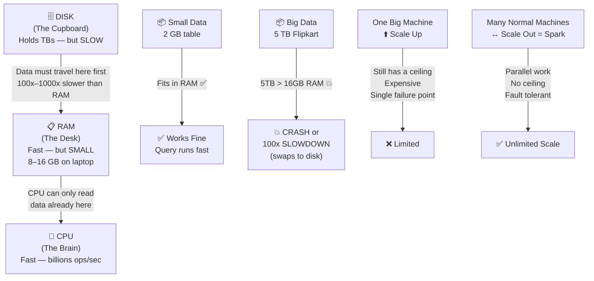

# Phase 0 · Topic 1 — Why One Machine Breaks on Big Data

> **DE-2026 Spark Series** · Phase 0 of 5 · Topic 1 of 3

---

## 1. CONCEPT — Deep Dive

### The Core Problem

Every tool in data engineering — Spark, Kafka, Airflow, dbt, Delta Lake — exists because of one single problem:

> **Data is bigger than one machine can handle.**

Understand this deeply and everything else clicks.

---

### ① Anatomy of One Computer

Before big data, understand how ONE computer works. Three parts matter:

#### 🧠 CPU — The Brain
Does all calculations. Filters rows, adds numbers, sorts data. Extremely fast — billions of operations per second.

**BUT: can only process data that is already in RAM.**

#### 📋 RAM — The Desk
This is the working space. When your computer does ANYTHING — runs a query, opens Excel, plays a video — the data comes here first. CPU reads from the desk, writes to the desk.

- Fast to read/write
- **Small — typical laptop: 8–16 GB. Biggest servers: up to ~6 TB.**
- Has a hard ceiling — you cannot add infinite RAM

#### 🗄️ Disk (SSD/HDD) — The Cupboard
Permanent storage. Holds TBs of data. Your files, your database, everything lives here.

- Holds a LOT of data
- **Slow — 100x to 1000x slower than RAM**
- Data must travel from Disk → RAM before CPU can use it

#### 🔑 The Golden Rule

```
Disk → RAM → CPU
```

Data must follow this exact path. CPU cannot touch disk directly. **RAM is the only gateway. And RAM is small.**

---

### ② The Problem — When Data is Bigger Than the Desk

#### Small Job — Fits on the desk ✅
Example: You run a SQL query on a 2 GB table. Your laptop has 16 GB RAM.
- Data loads from disk → RAM. CPU processes it. Done in seconds. Life is good.

#### Big Job — Data overflows the desk 💥
Example: You try to process 5 TB of Flipkart orders on one machine with 16 GB RAM.
- 5 TB cannot fit in 16 GB RAM
- System tries to **swap** — moves excess data back to disk temporarily
- Processing slows down **100x** (disk is slow, remember?)
- Eventually: **crash or timeout**

This is not a bug. This is a fundamental hardware limit.

---

### ③ Real Numbers — Feel the Scale

| Company | Data per day | Laptop RAM |
|---------|-------------|------------|
| Your laptop | ~0.001 TB | 16 GB |
| Swiggy | ~500 GB | 16 GB |
| Flipkart | ~5 TB | 16 GB |
| IRCTC | ~10 TB (peak) | 16 GB |
| Netflix | ~500 TB | 16 GB |

**The math that makes it real:**
```
Flipkart daily data : 5 TB
Your laptop RAM     : 16 GB
5 TB ÷ 16 GB        = 312 laptops just to HOLD the data
```
And you don't just hold it — you need to filter, join, sort, aggregate it. One machine cannot do this.

---

### ④ Two Solutions — Scale Up vs Scale Out

#### ⬆️ Scale Up (Vertical Scaling)
Buy a bigger, more powerful single machine — more RAM, more CPU cores.

| Pros | Cons |
|------|------|
| Simple to manage | Very expensive (₹20–50 lakh+) |
| No network needed | Hard ceiling — can't buy infinite RAM |
| — | Single point of failure — it dies, everything stops |
| — | Cannot handle Netflix/Flipkart scale ever |

#### ↔️ Scale Out (Horizontal Scaling) ← Spark's way
Buy many normal cheap machines. Connect them. Split the work. All run in parallel.

| Pros |
|------|
| ✅ Cheap — normal cloud machines |
| ✅ No ceiling — add more machines as data grows |
| ✅ Fault tolerant — one machine fails, others continue |
| ✅ All machines work in parallel = fast |
| ✅ Handles petabyte scale (Netflix, Amazon, Flipkart) |

---

### ⑤ Where Spark Fits

**Apache Spark is a Scale Out engine.** Simple version of what it does:

```
1. Take your huge data
2. Split it into chunks
3. Send each chunk to a different machine
4. Each machine processes its chunk in parallel
5. Combine the results
6. Return the answer
```

Everything complex in Spark — RDDs, partitions, executors, DAGs, shuffles — is just the details of how it does steps 1–6 safely, fast, and correctly.

---

## 2. DIAGRAM



---

## 3. REVISION

### 🔁 Key Ideas — Read This When You Come Back Later

**CPU cannot work on disk data directly.**
Every piece of data must travel from the disk (cupboard) to RAM (desk) before the CPU (brain) can even touch it. This journey happens every single time a query runs, a file is processed, or any computation happens. There is no shortcut — this is how computer hardware is designed.

**RAM is fast but has a hard size limit.**
RAM is where all active processing happens, and it is very fast. But it is physically small — a typical laptop has 8–16 GB, and even the most expensive servers max out around 6 TB. Once your data is larger than the available RAM, the machine starts struggling immediately.

**When data overflows RAM, the system swaps to disk — and becomes 100x slower.**
The OS tries to help by moving some RAM contents back to disk to make room. This is called "swapping" or "paging." But since disk is 100–1000x slower than RAM, this kills performance. Large enough data = crash or timeout, not just slowness.

**Scale Up hits a wall. Scale Out has no wall.**
You can buy a bigger machine (Scale Up), but there is always a ceiling — both in RAM size and in price (₹50 lakh+ for serious servers). Scale Out (many machines working together) has no such ceiling. If you need more capacity, just add more machines. This is why every big data system — Spark, Hadoop, Kafka — is built on Scale Out.

**Spark's core job is simple: split, distribute, parallel-process, collect.**
All the complexity of Spark (which you will learn in the next phases) is just the engineering detail of how to do this one thing reliably, fast, and correctly at any scale.

---

## 4. PRACTICE QUESTIONS

> All answers hidden. Try the question first, then click to reveal.

---

### 🟢 Easy

**E1. What are the three main parts of a computer that matter for data processing? Describe each in one sentence.**

<details>
<summary>▶ Click to see answer</summary>

**CPU (The Brain):** Does all calculations — filtering, sorting, aggregating — but can only work on data already in RAM.

**RAM (The Desk):** The active working space. All data must come here from disk before the CPU can process it. Fast but small.

**Disk (The Cupboard):** Permanent storage. Holds TBs of data but is 100–1000x slower than RAM. Data must travel Disk → RAM → CPU.

</details>

---

**E2. What is the Golden Rule of data processing in a computer?**

<details>
<summary>▶ Click to see answer</summary>

Data must always follow this path: **Disk → RAM → CPU**

The CPU cannot read data directly from disk. RAM is the only gateway. If data doesn't fit in RAM, the machine struggles or crashes.

</details>

---

**E3. What is the difference between Scale Up and Scale Out? Give one example of each.**

<details>
<summary>▶ Click to see answer</summary>

**Scale Up (Vertical):** Make one machine bigger — add more RAM, faster CPU, bigger disk. Example: upgrading from a 16 GB laptop to a ₹50 lakh server with 1 TB RAM.

**Scale Out (Horizontal):** Add more machines and split the work between them. Example: 100 normal cloud machines each handling 1/100th of the data in parallel. This is what Spark does.

</details>

---

### 🟡 Medium

**M1. Zomato has 800 GB of order history data. You have a machine with 64 GB RAM. You try to run an aggregation query (total orders per city per month). What happens? What should you do instead?**

<details>
<summary>▶ Click to see answer</summary>

**What happens:** 800 GB cannot fit into 64 GB RAM. The OS starts swapping — moving chunks of data back to disk to free RAM. Since disk is 100–1000x slower than RAM, the query becomes extremely slow. It may take hours instead of seconds, or crash with an out-of-memory error.

**What you should do:** Use a Scale Out system like Spark. Spark splits the 800 GB into smaller chunks, sends each chunk to a different machine (each with its own 64 GB RAM), all machines process their chunk in parallel, and the results are combined. The job runs fast because no single machine has to hold all 800 GB.

</details>

---

**M2. Your company is growing. Today you have 500 GB of data and one powerful server handles it fine. Next year you will have 5 TB. The year after, 50 TB. Why is Scale Up a bad long-term strategy here?**

<details>
<summary>▶ Click to see answer</summary>

Three reasons Scale Up fails long-term:

1. **Cost grows faster than data.** A server with 10x more RAM doesn't cost 10x more — it costs 50–100x more because high-RAM hardware is specialty equipment.

2. **There is a hard ceiling.** Even the most expensive servers max out (around 6 TB RAM today). When your data hits 50 TB, no single machine can handle it — period.

3. **Single point of failure.** If that one big server goes down, your entire system stops. With Scale Out, one machine failing out of 100 means you lose 1% capacity, not 100%.

Scale Out grows linearly with your data — add more machines as needed. Cost stays predictable.

</details>

---

**M3. IRCTC handles ~10 TB of data during peak Tatkal booking (8–10 AM). Outside peak hours, data is only ~200 GB. How would Scale Out help IRCTC handle this? Can Scale Up do the same?**

<details>
<summary>▶ Click to see answer</summary>

**Scale Out handles this perfectly:** During peak hours, IRCTC can spin up 100 machines on the cloud to handle the 10 TB load. After 10 AM, they shut down 90 machines and pay for only 10. This is called **elastic scaling** — you grow and shrink the cluster based on demand.

**Scale Up cannot do this:** You buy one big server for peak load (10 TB), but it sits idle at 2% capacity during off-peak hours. You still pay the full cost of the big server 24/7. You cannot "un-buy" hardware to save money.

This is why cloud platforms (AWS, Azure, GCP) all use Scale Out — you pay only for what you use, when you use it.

</details>

---

**M4. A junior DE says: "Our data is only 300 GB and our server has 512 GB RAM. We don't need Spark." Is he right or wrong? Explain.**

<details>
<summary>▶ Click to see answer</summary>

**He could be right — for now.** If 300 GB fits comfortably in 512 GB RAM, a single machine with good SQL/Python tooling can handle it fine. Spark adds complexity (cluster management, distributed debugging) that is unnecessary when data fits on one machine.

**But he is thinking short-term.** Questions to ask:
- Is the data growing? If it doubles every year, you hit the limit in 1–2 years.
- How fast does processing need to be? Single machine is slower than a cluster even if data fits.
- What happens if the server goes down?

**Rule of thumb used in the industry:** Start using distributed processing (Spark) when data consistently exceeds ~1 TB or when processing time on a single machine becomes unacceptably slow.

</details>

---

### 🔴 Hard

**H1. Someone argues: "Scale Up is better because there is no network between machines — so no delays. Scale Out has network overhead which makes it slower." What is fundamentally wrong with this argument?**

<details>
<summary>▶ Click to see answer</summary>

The argument is true but irrelevant at scale. Here's why:

**The network overhead argument only holds when data fits on one machine.** When data is 5 TB and you have 16 GB RAM, the Scale Up machine isn't "faster with no network" — it is either crashing or taking 100x longer due to disk swapping. A 100-machine Scale Out cluster, even with network overhead, finishes in minutes. The Scale Up machine never finishes.

**Two things Scale Up cannot solve no matter how fast the network is:**
1. **RAM ceiling:** No single machine can hold petabyte-scale data in RAM. Network speed is irrelevant — the bottleneck is RAM, not network.
2. **Parallel processing:** 100 machines working simultaneously do 100x the work in the same time. One machine, no matter how fast, does 1x the work. You cannot parallelize on a single machine beyond its core count (typically 8–128 cores), while a cluster can have thousands.

Network overhead in modern data centers is ~1–10 Gbps — fast enough that the parallelism gain far outweighs the cost.

</details>

---

**H2. You have a 1,000-machine Spark cluster. One machine crashes mid-job while processing Flipkart's 5 TB daily data. What do you think happens to the job? Does it fail completely? Why or why not? (Think about this before reading the answer — it tests a core Spark concept you'll learn in Phase 1.)**

<details>
<summary>▶ Click to see answer</summary>

**The job does NOT fail completely.** Spark is designed for exactly this scenario.

Spark knows that machines fail — this is normal in large clusters. So it tracks exactly what each machine was doing. When a machine crashes, Spark detects it, and **re-runs only that machine's chunk of work on a different healthy machine.** The other 999 machines continue working uninterrupted.

This is called **fault tolerance** and it is one of Spark's core features. You will learn the exact mechanism (called "lineage") in Phase 1 — it is one of the most elegant ideas in distributed computing.

**The key insight:** In Scale Up, one machine crashing = total failure. In Scale Out, one machine crashing = 0.1% setback, automatically recovered.

</details>

---

**H3. If Scale Out is so much better, why doesn't every company use it for everything — even small 10 GB datasets?**

<details>
<summary>▶ Click to see answer</summary>

Because Scale Out has real costs that make it wrong for small data:

1. **Complexity:** A Spark cluster has dozens of moving parts — Driver, Executors, Cluster Manager, network configuration. Debugging a distributed system is much harder than debugging a single machine. A single-machine SQL query that fails gives you one error message. A Spark job that fails on machine #47 of 100 requires distributed log analysis.

2. **Startup overhead:** Spinning up a cluster, distributing data across machines, and coordinating results takes time. For a 10 GB dataset, a single machine finishes in 2 seconds. Spark might take 30 seconds just to start before processing even begins.

3. **Cost:** Even cheap cloud machines cost money. Running 100 machines for 1 minute costs more than running 1 machine for 5 minutes — and for small data, the 1 machine is faster anyway.

4. **Network shuffling:** When machines need to share data with each other (joins, aggregations), data travels across the network. For large data, this is worth it. For small data, it is pure overhead with no benefit.

**Rule used in practice:** Use single-machine tools (pandas, SQL, DuckDB) for data under ~1 TB. Use Spark when single-machine tools are too slow or run out of memory.

</details>
