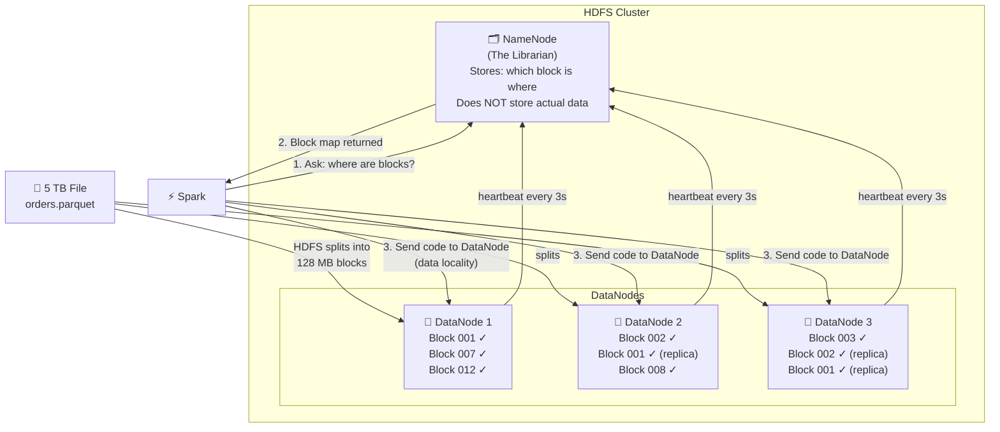

# Phase 0 · Topic 2 — HDFS: How Files Are Stored Across Many Machines

> **DE-2026 Spark Series** · Phase 0 of 5 · Topic 2 of 3

---

## 1. CONCEPT — Deep Dive

### The New Problem

Topic 1 taught you: one machine breaks when data is too big. Solution: many machines working together.

But this creates an immediate new problem:

> If your 5 TB Flipkart file sits on ONE machine’s disk — how do the other 99 machines in your cluster access it?

They can’t. Copying a 5 TB file over the network to 99 machines every time you want to process it is slow, wasteful, and defeats the purpose of having a cluster. You need a smarter solution.

That solution is **HDFS — Hadoop Distributed File System.**

---

### What HDFS Is

HDFS is a file system — just like the file system on your laptop that organizes your files into folders. The difference: HDFS spreads your files across **many machines’ disks simultaneously**, and makes it look like one single unified file system to anyone using it.

You save one 5 TB file. HDFS automatically cuts it into pieces and stores those pieces across 50 different machines. When you read it back, HDFS collects all the pieces and gives you the complete file. You don’t see any of this complexity happening underneath.

---

### How HDFS Works — The Two Roles

HDFS has exactly two types of machines:

#### 🗂️ NameNode — The Librarian (1 machine only)

The NameNode does **not** store your actual data. It stores the **map** — which file is split into which blocks, and which DataNode holds each block.

Think of an old library’s index card system. The index card doesn’t contain the book. It just says: “Book X is on shelf 4, row 2.” The NameNode is that index card system for your entire distributed file system. It knows the location of every single block of every single file.

When any program (like Spark) wants to read a file, it asks the NameNode first: “Where are the blocks for this file?” The NameNode replies with the map, and then the program goes directly to the right DataNodes.

#### 💾 DataNodes — The Shelves (many machines)

DataNodes actually store your data on their local disks. Each DataNode holds some blocks of your files. They regularly send a **heartbeat** signal to the NameNode every few seconds saying: “I’m alive, and I’m holding these blocks.”

If the NameNode stops receiving heartbeats from a DataNode, it marks that machine as dead and triggers replication of the missing blocks on other DataNodes.

---

### The Block System

HDFS does not store files as single units. It cuts every file into fixed-size **blocks** — each block is typically **128 MB**.

```
5 TB file = 5,000,000 MB ÷ 128 MB = ~39,000 blocks
```

Each block is stored as a separate piece on a DataNode’s disk. The NameNode tracks every block’s location. This means:

- A 5 TB file is never on one machine’s disk — it’s spread across many
- Multiple machines can read different blocks of the same file simultaneously
- Processing is parallelized naturally — each machine works on its own blocks

---

### Replication — The Safety Net

What happens if a DataNode crashes and you lose the blocks it was holding?

HDFS solves this with **replication**. By default, every block is copied **3 times** across 3 different DataNodes. This is called the **replication factor** (default = 3).

```
Block 001 → DataNode 1, DataNode 4, DataNode 7  (3 copies)
Block 002 → DataNode 2, DataNode 5, DataNode 9  (3 copies)
Block 003 → DataNode 3, DataNode 6, DataNode 8  (3 copies)
```

If DataNode 1 crashes — Block 001 is still safe on DataNode 4 and DataNode 7. The NameNode detects the missing copy via missed heartbeats, and automatically instructs another DataNode to make a new copy. This happens without any human intervention.

Replication factor 3 means you can lose 2 machines simultaneously and still have all your data safe.

---

### Data Locality — The Key Insight for Spark

In traditional systems:
```
Data lives on Server A.
You want to process it on Server B.
Solution: Copy data from A to B, then process.
Problem: Copying 128 MB (or 128 GB) across network is slow.
```

HDFS + Spark flips this completely:
```
Data lives on DataNode 1.
Spark sends the processing CODE to DataNode 1.
DataNode 1 processes its own data locally.
Only the small result travels across the network.
```

This is called **data locality** — move computation to data, not data to computation. A 128 MB block processed locally is instant. Copying 128 MB across a network adds latency. At 39,000 blocks (5 TB), this difference is enormous.

Spark is designed to always try to run computation on the same machine that holds the data. It asks the NameNode for block locations and assigns tasks accordingly.

---

### Why Spark Uses HDFS (and What Replaced It)

Spark itself **does not store data**. Spark is a processing engine only. It needs somewhere to read input from and write output to. HDFS was the original storage layer.

Today in 2026, many companies use cloud object storage instead:

| Storage | Where used |
|---------|------------|
| **HDFS** | On-premise clusters, legacy Hadoop setups |
| **AWS S3** | Spark on AWS / Databricks on AWS |
| **Azure Blob / ADLS** | Spark on Azure / Databricks on Azure |
| **Google GCS** | Spark on GCP |

The concepts are identical — files split into chunks, metadata tracked centrally, data locality optimized. HDFS taught the world this pattern. Cloud storage adopted it. Understanding HDFS means understanding all of them.

---

### The Full Flow: How Spark Reads 5 TB from HDFS

```
1. Spark asks NameNode: "Where are the blocks of file /data/flipkart/orders.parquet?"
2. NameNode returns: Block 001 → DN1, Block 002 → DN2, ... Block 39000 → DN50
3. Spark assigns each Executor to read blocks from nearby DataNodes
4. Each Executor reads its blocks locally (data locality — no network copy)
5. Each Executor processes its blocks in parallel
6. Results are combined and returned
```

No single machine ever touches all 5 TB. Every machine works on its own 128 MB slices. This is the entire foundation of distributed data processing.

---

## 2. DIAGRAM



---

## 3. REVISION

### 🔁 Key Ideas — Read This When You Come Back Later

**HDFS solves the “where does the data live” problem in a cluster.**
When you have 100 machines, your data cannot sit on just one of them. HDFS spreads your file across all machines automatically. Each machine stores a piece, and together they hold the whole file. To anyone reading the file, it looks like one normal file — the distribution is invisible.

**The NameNode is the brain, DataNodes are the storage.**
The NameNode is a single machine that holds the complete map of where every block of every file is stored. It never holds actual data — only the index. DataNodes are the machines that actually store blocks on their local disks. Every few seconds, DataNodes tell the NameNode they’re still alive (heartbeat). If a DataNode goes silent, the NameNode knows it died and takes action.

**Files are cut into 128 MB blocks — and every block is copied 3 times.**
No file is stored whole. A 5 TB file becomes ~39,000 blocks of 128 MB each. Every block is replicated 3 times on 3 different DataNodes. This means 2 machines can die simultaneously and you lose zero data. The replication is automatic — HDFS maintains the target number of copies at all times.

**Data locality is why HDFS + Spark is fast.**
Instead of copying data to where computation happens, Spark sends the computation code to where data already lives. A DataNode reads its own blocks and processes them locally. Only the small result (not the raw 128 MB block) travels across the network. At petabyte scale, this design difference makes the system 10–100x faster than naive approaches.

**HDFS is the pattern. Cloud storage is the modern implementation.**
Today most Spark jobs read from S3, Azure Blob, or GCS instead of HDFS — but all of these follow the same principle: files are split into chunks, a metadata service tracks locations, and Spark tries to process data locally. Learning HDFS means you understand all of them.

---

## 4. PRACTICE QUESTIONS

> All answers hidden. Try the question first, then click to reveal.

---

### 🟢 Easy

**E1. What are the two types of nodes in HDFS? What does each one do?**

<details>
<summary>▶ Click to see answer</summary>

**NameNode (1 machine):** Stores the metadata — the map of which file is split into which blocks, and which DataNode holds each block. Does NOT store actual data.

**DataNodes (many machines):** Actually store the data blocks on their local disks. Send heartbeats to the NameNode every few seconds to confirm they’re alive.

</details>

---

**E2. What is a “block” in HDFS? What is the default block size?**

<details>
<summary>▶ Click to see answer</summary>

A block is a fixed-size chunk of a file. HDFS cuts every file into blocks before storing them.

Default block size = **128 MB**.

A 5 TB file becomes ~39,000 blocks of 128 MB each, distributed across many DataNodes.

</details>

---

**E3. What is replication in HDFS and why does it exist?**

<details>
<summary>▶ Click to see answer</summary>

Replication means every block is copied and stored on multiple DataNodes. The default replication factor is **3** — meaning each block exists on 3 different machines.

It exists for **fault tolerance** — if a DataNode crashes, the data is not lost because 2 more copies exist on other machines. HDFS automatically detects the lost copy and creates a new replica on a healthy DataNode.

</details>

---

### 🟡 Medium

**M1. A Spark job needs to process a 1 TB log file stored in HDFS. Walk through exactly what happens step by step — from Spark asking for the file to the data being processed.**

<details>
<summary>▶ Click to see answer</summary>

1. Spark asks the **NameNode**: “Where are all the blocks of /logs/app.log?”
2. NameNode returns the **block map**: Block 001 → DataNode 3, Block 002 → DataNode 7, … and so on for all ~8,000 blocks.
3. Spark assigns each **Executor** to read specific blocks from the DataNodes that hold them.
4. Each Executor reads its blocks **locally** (data locality — code goes to data, not data to code).
5. Each Executor processes its blocks **in parallel**.
6. Results from all Executors are **combined** and returned.

No single machine ever holds the full 1 TB. Each machine works on its own 128 MB slices simultaneously.

</details>

---

**M2. Your HDFS cluster has 10 DataNodes. One DataNode crashes completely. Your file has replication factor 3. What happens to your data? What does the NameNode do?**

<details>
<summary>▶ Click to see answer</summary>

**Your data is safe.** Because replication factor = 3, every block that was on the crashed DataNode also exists on 2 other DataNodes.

**What NameNode does:**
1. Detects the DataNode is dead (missed heartbeats).
2. Identifies which blocks now have only 2 copies instead of 3.
3. Instructs other healthy DataNodes to copy those blocks to a new DataNode.
4. Replication factor of 3 is restored automatically.

This entire recovery happens without any human action and without any data loss.

</details>

---

**M3. Why does HDFS use a block size of 128 MB instead of something smaller like 1 MB? What would go wrong with 1 MB blocks?**

<details>
<summary>▶ Click to see answer</summary>

If block size were 1 MB, a 5 TB file would create **5,000,000 blocks** instead of 39,000.

Problems with tiny blocks:
1. **NameNode memory overload:** The NameNode must store metadata for every block in RAM. 5 million block entries takes enormous RAM. The NameNode becomes a bottleneck.
2. **Too many small reads:** Each block requires a separate disk read operation. Millions of tiny reads are slower than thousands of large reads (disk seeks are expensive).
3. **Network overhead:** Each block assignment requires coordination between Spark and the NameNode. 5 million assignments vs 39,000 — massive coordination overhead.

128 MB is a balance: large enough to keep NameNode metadata manageable and disk reads efficient, small enough to distribute work across many machines.

</details>

---

**M4. Spark is running on a 50-machine cluster. HDFS has a file with 200 blocks. Spark has 50 Executors. How many blocks does each Executor process? What happens if Spark has only 10 Executors?**

<details>
<summary>▶ Click to see answer</summary>

**50 Executors, 200 blocks:** Each Executor gets 200 ÷ 50 = **4 blocks** to process. All 50 Executors run in parallel — total time ≈ time to process 4 blocks.

**10 Executors, 200 blocks:** Each Executor gets 200 ÷ 10 = **20 blocks**. Executors process their 20 blocks sequentially (one at a time). Total time ≈ time to process 20 blocks — **5x slower** than the 50-Executor case.

Key insight: more Executors = more parallelism = faster. But you need enough machines in the cluster to run those Executors. This is why cluster sizing matters in real DE work.

</details>

---

### 🔴 Hard

**H1. HDFS has only ONE NameNode. This means if the NameNode crashes, the entire HDFS cluster becomes inaccessible — even if all DataNodes are healthy. This is called the “Single Point of Failure” problem. How do you think modern HDFS solves this? (Think before reading the answer.)**

<details>
<summary>▶ Click to see answer</summary>

Modern HDFS (Hadoop 2.x+) solves this with **NameNode High Availability (HA)**:

- Two NameNodes run simultaneously: one **Active**, one **Standby**.
- Both NameNodes share the same metadata via a **shared edit log** (stored on separate JournalNodes).
- DataNodes send heartbeats to **both** NameNodes.
- If the Active NameNode crashes, the Standby detects it and automatically becomes Active in seconds.
- Users/Spark see zero downtime — they reconnect to the new Active NameNode.

Cloud storage (S3, Azure Blob) solves this differently: the metadata service is fully managed by the cloud provider with built-in redundancy. You never deal with NameNode HA when using S3.

</details>

---

**H2. Data locality means Spark runs computation on the machine that holds the data. But what happens when the machine holding Block 001 is already busy running 5 other tasks? Spark can’t achieve data locality for this block. What does Spark do, and what is the performance cost?**

<details>
<summary>▶ Click to see answer</summary>

Spark has a **locality preference hierarchy** it falls back through:

1. **PROCESS_LOCAL:** Data is in the same JVM process. (Best — in-memory, no network)
2. **NODE_LOCAL:** Data is on the same machine but different process. (Very fast — local disk read)
3. **RACK_LOCAL:** Data is on a different machine but same network rack. (Fast — short network hop)
4. **ANY:** Data is anywhere in the cluster. (Slowest — full network transfer)

When the ideal machine is busy, Spark **waits briefly** (configurable, default ~3 seconds) hoping the machine frees up. If it doesn’t, Spark falls back to the next level — fetching the block from a replica on another machine via network.

**Performance cost:** A full network transfer of a 128 MB block adds latency. In a well-tuned cluster, this is rare because the cluster is sized to avoid overloading individual nodes. But in an undersized cluster, frequent locality misses are a major performance bottleneck.

</details>

---

**H3. Today in 2026, most Spark jobs on Databricks use cloud storage (S3 / Azure Blob / GCS) instead of HDFS. Does data locality still apply? Is Spark slower on cloud storage than on HDFS?**

<details>
<summary>▶ Click to see answer</summary>

**Data locality mostly does NOT apply with cloud storage.** In HDFS, data lives on the same physical machines as the Spark Executors — so code can run right next to the data. In cloud storage, data lives in a separate storage service (S3, Azure Blob) completely independent of the compute cluster. Every block read requires a network call.

**Is Spark slower?** It depends:

- **Network bandwidth in cloud is very high** (10–25 Gbps between compute and storage within same region). Reading 128 MB blocks from S3 is fast — often 100–500 ms per block.
- **Modern cloud Spark (Databricks, EMR) uses caching layers** (Delta Cache, local SSD caching) to bring frequently accessed data close to Executors, partially restoring data locality benefits.
- **The decoupling of compute and storage is actually an advantage:** You can scale storage and compute independently. With HDFS, adding storage meant adding machines (even if you didn’t need more compute).

**The verdict:** Cloud storage Spark is slightly slower on raw read throughput vs HDFS with perfect data locality, but the operational simplicity, elastic scaling, and cost efficiency make it the dominant pattern in 2026. Most modern DE jobs run on cloud storage, not HDFS.

</details>
