# Phase 0 · Topic 3 — MapReduce & Why It Was Slow → Spark Is Born

> **DE-2026 Spark Series** · Phase 0 of 5 · Topic 3 of 3 · Final topic of Phase 0

---

## 1. CONCEPT — Deep Dive

### The Story So Far

- **Topic 1:** One machine breaks. We need many machines.
- **Topic 2:** HDFS stores files across many machines.
- **Topic 3:** Now we have data stored across many machines — but HOW do we actually process it? Who coordinates which machine does what? Who collects the results?

The first answer the world came up with was **MapReduce**. It worked. But it was painfully slow. Understanding WHY it was slow is exactly what makes Spark’s design click.

---

### What is MapReduce?

MapReduce is a **programming model** invented by Google in 2004 and then open-sourced as part of Hadoop. It gives you a way to process massive datasets across a cluster by breaking every job into two simple steps:

1. **Map** — each machine processes its own slice of data independently
2. **Reduce** — results from all machines are collected and combined into a final answer

That’s it. Every big data problem was expressed as Map + Reduce.

---

### The CA Office Analogy

Imagine you have 1 million tax filing documents spread across 100 offices across India.

**Map step:** You call every office and say: “Look at YOUR documents only. Count how many filings are above ₹10 lakh income. Write the count on a piece of paper.” All 100 offices do this simultaneously. Each office writes its count on paper and hands it to a courier.

**Reduce step:** One central office collects all 100 pieces of paper and adds up all the counts. That’s your national total.

This is MapReduce. Simple, elegant, and it works.

---

### The MapReduce Flow in Detail

```
Input Data (in HDFS)
        ↓
   [Split into chunks, one per machine]
        ↓
   MAP PHASE
   Machine 1: reads Block 001 → outputs key-value pairs
   Machine 2: reads Block 002 → outputs key-value pairs
   Machine 3: reads Block 003 → outputs key-value pairs
        ↓
   [Shuffle: sort and group key-value pairs by key]
   [Results written to DISK]
        ↓
   REDUCE PHASE
   Reducer 1: reads all values for Key A → computes final result
   Reducer 2: reads all values for Key B → computes final result
        ↓
   Output written back to HDFS (DISK)
```

**Example — Count total sales per city from 1 billion order records:**
- Map: each machine reads its orders, emits (city, sale_amount) pairs
- Shuffle: all Mumbai pairs go to Reducer 1, all Delhi pairs go to Reducer 2, etc.
- Reduce: Reducer 1 sums all Mumbai sales, Reducer 2 sums all Delhi sales
- Output: (Mumbai, ₹4.2Cr), (Delhi, ₹6.1Cr), …

---

### Why MapReduce Was Slow — The Disk Problem

Here is the fundamental problem with MapReduce:

> **After every single step, MapReduce writes results to disk. Before every single step, it reads from disk.**

Disk is 100–1000x slower than RAM. Remember that from Topic 1?

For a job with 5 steps (which is common in real analytics pipelines), the data travels:

```
Disk → RAM (step 1) → Disk → RAM (step 2) → Disk → RAM (step 3) → Disk → RAM (step 4) → Disk → RAM (step 5) → Disk
```

That is **10 disk read/write operations** for a 5-step job. Each one slow. Each one adding latency.

In practice, a MapReduce job that could logically be done in a few minutes took **hours** because of these constant disk round-trips.

---

### The Real Pain: Multi-Step Jobs

Simple jobs (one Map + one Reduce) were manageable. But real analytics is never one step.

Imagine building a recommendation engine for Flipkart:
1. Filter active users (step 1)
2. Join with purchase history (step 2)
3. Group by product category (step 3)
4. Calculate purchase frequency per user per category (step 4)
5. Rank categories per user (step 5)
6. Join with product catalog (step 6)
7. Output top 10 recommendations (step 7)

With MapReduce: 7 jobs chained together. Every intermediate result written to HDFS disk. Read back for the next step. A job like this took **6–12 hours** at companies like Yahoo and Facebook in 2010.

Data scientists hated this. Iterative algorithms (machine learning, graph processing) were especially brutal — they need to loop over data dozens of times. Each loop = disk write + disk read.

---

### The Other Problems with MapReduce

**1. Only two steps — Map and Reduce.**
Every problem had to be forced into this rigid structure. Complex logic that naturally needed 5 steps required ugly workarounds to fit into Map + Reduce.

**2. No interactive queries.**
MapReduce batch jobs took hours. If a data scientist wanted to explore data interactively (run a query, see result, adjust, run again), waiting hours per query was impossible.

**3. Hard to program.**
You wrote Java code for every MapReduce job. No SQL. No DataFrame API. Just low-level Java with explicit map() and reduce() functions. Simple aggregations needed hundreds of lines of code.

**4. Poor reuse of data.**
If you needed to run 10 different queries on the same dataset, MapReduce read the dataset from disk 10 separate times. No concept of caching hot data in memory.

---

### Enter Spark — The Key Insight

In 2009, Matei Zaharia, a PhD student at UC Berkeley, looked at MapReduce and asked one question:

> “What if we kept intermediate data **in RAM** instead of writing it to disk?”

That single idea is the foundation of Apache Spark.

Instead of disk after every step:
```
Disk → RAM → [step 1 → step 2 → step 3 → step 4 → step 5, all IN RAM] → Disk
```

Only ONE disk read at the start, ONE disk write at the end. Everything in between stays in RAM and runs at RAM speed.

Result: Spark is **10–100x faster** than MapReduce for most workloads. For iterative workloads (machine learning), it can be **1000x faster**.

---

### What Else Spark Fixed

| Problem in MapReduce | Spark’s Solution |
|---|---|
| Disk write after every step | In-memory processing — data stays in RAM between steps |
| Only Map + Reduce steps | Rich API — filter, join, groupBy, sort, window functions, etc. |
| Hard to program (Java) | Simple API in Python (PySpark), Scala, Java, R, SQL |
| No interactive queries | Spark SQL — run queries interactively, results in seconds |
| No data reuse | `cache()` / `persist()` — keep hot datasets in RAM across multiple queries |
| Bad for ML (iterative) | Spark MLlib — loops over data in RAM, not disk |

---

### The Timeline: How We Got Here

```
2004 — Google publishes MapReduce paper
2006 — Yahoo open-sources Hadoop (HDFS + MapReduce)
2008 — Hadoop widely adopted. Data grows. MapReduce slowness becomes painful.
2009 — Matei Zaharia starts Spark project at UC Berkeley
2010 — Spark paper published. 10–100x faster than MapReduce shown.
2013 — Spark donated to Apache Foundation. Community explodes.
2014 — Spark 1.0 released. DataFrames introduced.
2016 — Spark 2.0. Structured Streaming. Catalyst optimizer.
2020 — Spark 3.0. Adaptive Query Execution (AQE). Python type hints.
2024 — Spark on Databricks = dominant DE stack in India and globally.
2026 — YOU are learning it. It is the #1 skill in Indian DE job listings.
```

---

### Why This Matters for Your Career

Every Indian company with more than ~500 GB of data uses Spark or will use it. The tools change (Hadoop → Spark → Databricks → Delta Lake) but the underlying engine is always Spark. Job listings on Naukri and LinkedIn India for Data Engineer roles consistently list PySpark as the #1 required skill.

You now understand WHY Spark exists. From Topic 1 to Topic 3:
- One machine breaks → need a cluster
- HDFS stores data across the cluster
- MapReduce processed it but was slow because of disk
- Spark replaced disk with RAM → 10–100x faster

Phase 0 is complete. Phase 1 is where the real depth begins: HOW does Spark actually work inside?

---

## 2. DIAGRAM

```mermaid
graph TD
    subgraph MapReduce - The Old Way
        A1["🗄️ HDFS Disk\nInput Data"] -->|read| B1["📋 RAM\nMAP step"]
        B1 -->|write to disk| C1["🗄️ HDFS Disk\nIntermediate"]
        C1 -->|read from disk| D1["📋 RAM\nSHUFFLE"]
        D1 -->|write to disk| E1["🗄️ HDFS Disk\nIntermediate"]
        E1 -->|read from disk| F1["📋 RAM\nREDUCE step"]
        F1 -->|write| G1["🗄️ HDFS Disk\nOutput"]
    end

    subgraph Spark - The New Way
        A2["🗄️ Disk\nInput"] -->|read ONCE| B2["📋 RAM\nStep 1 → Step 2 → Step 3\n→ Step 4 → Step 5\nAll in RAM"]
        B2 -->|write ONCE| G2["🗄️ Disk\nOutput"]
    end

    SPEED["⚡ Result: Spark is 10–100x faster\nFor ML: up to 1000x faster"]
```



---

## 3. REVISION

### 🔁 Key Ideas — Read This When You Come Back Later

**MapReduce was the first solution for distributed data processing.**
Invented by Google in 2004, it worked by splitting every job into two steps: Map (each machine processes its own data slice) and Reduce (results are collected and combined). It ran on HDFS and allowed companies like Yahoo and Facebook to process terabytes of data for the first time. It was a revolutionary idea — but it had a fatal flaw.

**The fatal flaw: MapReduce wrote to disk after every single step.**
Disk is 100–1000x slower than RAM. For a 7-step analytics pipeline, MapReduce did 14 disk operations (7 reads + 7 writes). A job that logically takes a few minutes took 6–12 hours in practice. Data scientists couldn’t iterate quickly. Machine learning was especially painful because iterative algorithms had to re-read data from disk on every loop.

**Spark’s core insight: keep intermediate data in RAM.**
Matei Zaharia at UC Berkeley asked: what if we never wrote intermediate results to disk? Instead of disk → RAM → disk → RAM between every step, Spark does disk → RAM → [all steps in RAM] → disk. One read, one write, everything else at RAM speed. This single idea made Spark 10–100x faster than MapReduce.

**Spark also fixed everything else MapReduce got wrong.**
Not just speed — Spark introduced a rich API (filter, join, groupBy, window functions, SQL) instead of rigid Map + Reduce. It added Python and SQL support so data scientists didn’t need to write Java. It added caching so hot datasets could stay in RAM across multiple queries. It made iterative ML practical. It is a complete rewrite of how distributed data processing should work.

**The history matters because it explains every design choice in Spark.**
Why does Spark cache? Because MapReduce had no caching. Why does Spark have lazy evaluation? To optimize the full pipeline before touching disk. Why does Spark have a rich transformation API? Because MapReduce forced everything into Map + Reduce and it was painful. Every Spark feature solves a specific MapReduce pain.

---

## 4. PRACTICE QUESTIONS

> All answers hidden. Try the question first, then click to reveal.

---

### 🟢 Easy

**E1. What are the two steps in MapReduce? Describe each in one sentence.**

<details>
<summary>▶ Click to see answer</summary>

**Map:** Each machine reads its own slice of data and emits key-value pairs independently (parallel processing across all machines).

**Reduce:** All key-value pairs with the same key are grouped together and processed by one reducer to produce the final result.

</details>

---

**E2. What is the single biggest reason MapReduce was slow?**

<details>
<summary>▶ Click to see answer</summary>

MapReduce **wrote intermediate results to disk after every step** and read them back before the next step. Disk is 100–1000x slower than RAM. For a multi-step job, this added enormous latency — turning minutes of actual computation into hours of disk I/O.

</details>

---

**E3. What was Spark’s core idea that made it faster than MapReduce?**

<details>
<summary>▶ Click to see answer</summary>

Keep intermediate data **in RAM** between processing steps instead of writing to disk.

Spark reads from disk once at the start and writes to disk once at the end. Everything in between stays in RAM and runs at RAM speed. This makes Spark 10–100x faster than MapReduce for most workloads.

</details>

---

### 🟡 Medium

**M1. Flipkart runs a 7-step analytics pipeline on MapReduce. How many disk read/write operations happen? Now run the same pipeline on Spark. How many disk operations?**

<details>
<summary>▶ Click to see answer</summary>

**MapReduce:** Each step writes output to disk and the next step reads it back.
- 7 disk writes (one per step output) + 7 disk reads (one per step input) = **14 disk operations**
- Plus the initial input read and final output write = actually 1 read + 7 writes + 7 reads + 1 write = **16 disk operations total**

**Spark:** Read input from disk once, run all 7 steps in RAM, write output to disk once.
- **2 disk operations total** (1 read + 1 write)

The difference is why a 6-hour MapReduce job becomes a 10-minute Spark job.

</details>

---

**M2. A data scientist at Swiggy wants to run 20 different exploratory queries on the same 500 GB dataset to understand customer behavior. How does MapReduce handle this vs Spark?**

<details>
<summary>▶ Answer</summary>

**MapReduce:** Each of the 20 queries is a separate job. Each job reads the 500 GB dataset from HDFS disk from scratch. 20 queries = 20 full disk reads of 500 GB = 10 TB of disk I/O. At 100 MB/s disk speed, each query takes ~83 minutes. 20 queries = 27+ hours of waiting.

**Spark:** Run the first query, then call `dataset.cache()`. Spark keeps the 500 GB in RAM across the cluster. All remaining 19 queries read from RAM — no disk. Each subsequent query runs in seconds instead of 83 minutes.

This is why Spark transformed data science workflows. Interactive exploration became possible.

</details>

---

**M3. MapReduce only has Map and Reduce steps. A DE needs to: filter rows → join two tables → group by city → calculate average → sort by average. How painful is this in MapReduce vs Spark?**

<details>
<summary>▶ Click to see answer</summary>

**MapReduce:** Each logical step (filter, join, group, average, sort) must be expressed as a separate MapReduce job. Each job writes to HDFS disk and the next reads it back. You write hundreds of lines of Java for each job. A 5-step pipeline = 5 MapReduce jobs chained together = 5x disk round-trips + enormous boilerplate code.

**Spark (PySpark):**
```python
df.filter(df.active == True)\
  .join(other_df, 'city_id')\
  .groupBy('city')\
  .agg(avg('sale_amount'))\
  .sort('avg(sale_amount)', ascending=False)
```
5 lines of Python. One job. All steps run in RAM. Spark’s Catalyst optimizer figures out the most efficient execution plan automatically.

</details>

---

**M4. Why was MapReduce especially bad for machine learning algorithms like k-means clustering or logistic regression?**

<details>
<summary>▶ Click to see answer</summary>

Machine learning algorithms are **iterative** — they loop over the same dataset dozens or hundreds of times, updating model parameters each iteration until convergence.

**In MapReduce:** Each iteration = one full MapReduce job = full disk read of the training data + full disk write of intermediate results. 100 iterations of k-means on a 100 GB dataset = 100 full disk reads = 10 TB of disk I/O just for one model training run. At real disk speeds, this took many hours.

**In Spark:** Load training data into RAM once with `cache()`. Each iteration reads from RAM. 100 iterations = 100 RAM reads. RAM is 1000x faster than disk. The same training job that took hours in MapReduce takes minutes in Spark. This is why Spark is described as up to **1000x faster** for iterative ML workloads.

</details>

---

### 🔴 Hard

**H1. MapReduce is “dead” in most modern stacks. But the Map and Reduce concepts are not — Spark uses them internally. Explain how Spark’s transformations relate to Map and Reduce under the hood.**

<details>
<summary>▶ Click to see answer</summary>

Spark’s high-level API (filter, map, groupBy, join) is built on the same fundamental Map and Reduce concepts:

**Map = Narrow transformations in Spark**
Operations like `filter()`, `map()`, `select()` — each record is processed independently on the machine that holds it. No data moves between machines. This is the Map concept: local, parallel, independent processing.

**Reduce = Wide transformations in Spark**
Operations like `groupBy()`, `join()`, `orderBy()` — data from different machines must be combined. This requires a **shuffle** (data moves across the network to be grouped by key). This is the Reduce concept: aggregation across partitions.

**The key difference from MapReduce:** In MapReduce, the boundary between Map and Reduce is rigid and always involves disk. In Spark, you chain many narrow transformations (all in RAM) and only trigger a shuffle when truly needed. The Catalyst optimizer decides when shuffles are unavoidable and minimizes them.

</details>

---

**H2. If Spark keeps data in RAM and RAM is small (16–64 GB per machine), what happens when the data being processed is larger than the total RAM of the entire cluster? Does Spark crash?**

<details>
<summary>▶ Click to see answer</summary>

**Spark does not crash.** It has a fallback mechanism called **spilling to disk**.

When Spark runs out of RAM during a computation, it writes some of the in-memory data to local disk (not HDFS — local disk on the Executor machine) to free up RAM. It then continues processing. When it needs the spilled data again, it reads it back from local disk.

**The cost:** Spilling is slow — it brings back the disk penalty that Spark was designed to avoid. A job with frequent spilling can be nearly as slow as MapReduce.

**What causes spilling in practice:**
- Cluster undersized for the data volume
- Too few partitions (large partitions that don’t fit in one Executor’s RAM)
- Cartesian joins or large shuffles
- Caching too much data

**How to fix it:** Add more Executors, increase partition count (`repartition()`), tune Executor memory settings, or avoid caching data that doesn’t need to be cached. You’ll learn all of this in Phase 4 (Performance & Production).

</details>

---

**H3. Google invented MapReduce in 2004 and kept it internal. They published the paper but never open-sourced the code. Yet Hadoop (open-source MapReduce) became dominant. Then Google internally moved on to systems like Dremel, Pregel, and Flume — much faster systems. Spark was inspired by these Google papers. What does this tell you about how the big data industry evolves?**

<details>
<summary>▶ Click to see answer</summary>

Several important lessons about the industry:

**1. Google is always 5–10 years ahead of the public stack.**
By the time Hadoop MapReduce was the dominant open-source tool (2010–2014), Google had already moved to faster systems internally. They published research papers about these systems, and the open-source community (including Matei Zaharia/Spark) read those papers and built open-source equivalents.

**2. Academic research → open-source → industry adoption is the pattern.**
Spark came from a UC Berkeley PhD thesis. Kafka came from LinkedIn research. Flink came from a Berlin university. The cutting edge starts in research papers, gets built in open source, then becomes standard industry practice 3–5 years later.

**3. The tools you learn today will be replaced — the concepts won’t.**
MapReduce → Spark → (next thing). But the core concepts (distributed storage, parallel processing, fault tolerance, data locality) remain constant. Learning Spark deeply means you can pick up whatever comes next quickly, because you understand the WHY, not just the HOW.

**4. For your career in 2026:** Spark is the current standard. Delta Lake + Databricks is the current premium stack. The next evolution is already happening in research labs. But Spark will be relevant for at least 5–7 more years in India, which covers your entire early career.

</details>
