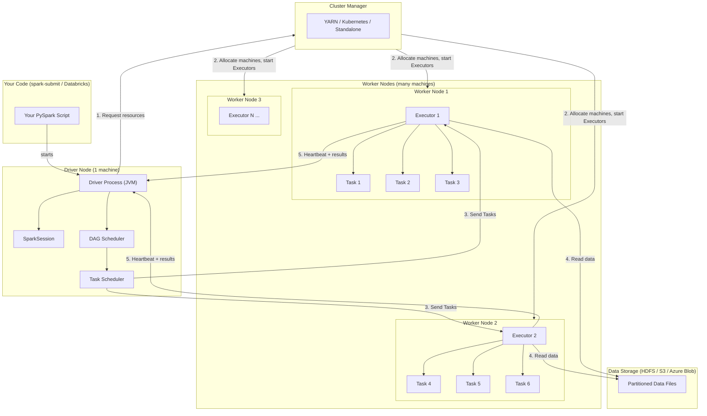

# Phase 1 · Topic 1 — Driver, Executors & Cluster Manager

> **The three-part engine behind every Spark job.**
> Understand this and you understand WHY Spark behaves the way it does — forever.

---

## Why This Exists

You now know Spark distributes work across many machines. But you haven't asked the important question yet:

**Who decides which machine does what?**

When you run a Spark job on a 100-machine cluster, someone has to:
- Break your code into small pieces of work
- Find machines that have free CPU and RAM
- Send each piece of work to the right machine
- Watch that all machines are still alive
- Collect the results and put them together

That "someone" is not magic. It is three separate roles working together: the **Driver**, the **Cluster Manager**, and the **Executors**.

Every single Spark job — from a 10-line script on Databricks to a 5 TB Flipkart pipeline — runs through this exact three-role system. There are no exceptions.

---

## The Big Picture First

Before details, here is the whole system in one sentence:

> **The Driver plans the job. The Cluster Manager provides the machines. The Executors do the work.**

Think of building a large apartment complex in Mumbai:

- **Driver = Project Architect** — Has the full blueprint. Decides which team builds which floor. Monitors progress. Checks quality.
- **Cluster Manager = Construction Company Owner** — Owns all the workers and equipment. When Architect says "I need 50 workers and 10 cranes", the Owner finds them and assigns them.
- **Executors = Construction Workers** — Do the actual physical work (digging, laying bricks, installing plumbing). Don't know the full plan — just know their specific task.

None of them can work without the others. Remove any one → the building doesn't get built.

---

## 1. The Driver

### What It Is

The Driver is a single JVM process that runs your Spark application code. It is the **brain** of the entire job.

When you write a Spark program and run it, the very first thing that starts is the Driver. Everything else — Cluster Manager, Executors — comes after the Driver has started and made requests.

### What the Driver Does (Step by Step)

1. **Runs your code** — Your Python or Scala or Java code runs inside the Driver process.
2. **Creates SparkSession** — The entry point to all Spark functionality (you'll learn this in the next topic).
3. **Builds an execution plan** — When you write `df.filter(...).groupBy(...).agg(...)`, the Driver analyzes all your transformations and builds a plan for how to execute them efficiently.
4. **Talks to Cluster Manager** — Asks for resources: "I need 50 Executors, each with 8 cores and 32 GB RAM."
5. **Breaks work into Tasks** — Divides the job into the smallest units of work called **Tasks** (one Task = one partition of data). A 5 TB file might become 40,000 Tasks.
6. **Schedules Tasks on Executors** — Sends each Task to an available Executor. Tracks which Executor has which Task.
7. **Monitors Executors** — Receives heartbeats from all Executors. If a heartbeat stops, the Driver knows that Executor died and reschedules its Tasks elsewhere.
8. **Collects final results** — Gathers the output from all Executors and either writes it to storage or returns it to your program.

### The Driver's Critical Weakness

The Driver is a **single point of failure**. If it crashes, the entire job fails — even if all 100 Executors are still healthy and working.

This is a known architectural trade-off. In return for this limitation, the design is simple and predictable. In production, teams:
- Run Driver on reliable, dedicated machines
- Use Databricks or cloud-managed Spark (which handle Driver restarts automatically)
- Keep the Driver's workload light — the Driver coordinates, it does NOT process data itself

**Important rule you must remember:** Never collect large datasets to the Driver. If you call `.collect()` on a 5 TB DataFrame, it tries to bring 5 TB into the Driver's RAM → Driver crashes. The Driver is a coordinator, not a data processor.

### Where the Driver Runs

In **client mode** (default on local machines, Jupyter notebooks): Driver runs on your laptop or the machine you submit from. If you close your laptop → job fails.

In **cluster mode** (production): Driver runs on one of the cluster's worker machines. You submit the job and disconnect — Driver continues running inside the cluster. This is how production jobs run.

You will learn the full detail of client vs cluster mode in Topic 12.

---

## 2. The Cluster Manager

### What It Is

The Cluster Manager manages the physical resources of the entire cluster — all the machines, CPUs, and RAM available. It does not know anything about Spark specifically. It just knows: "I have 100 machines. How much of them do you need?"

Think of the Cluster Manager as a hotel front desk. The hotel has 200 rooms. When a guest (Driver) arrives and says "I need 50 rooms for 3 hours", the front desk checks availability, assigns 50 rooms, and tells the guest which rooms. The front desk doesn't know what the guest will do in those rooms — sleep, work, cook. It just manages room availability.

### What the Cluster Manager Does

1. **Tracks all available machines and their resources** (CPU cores, RAM, disk)
2. **Receives resource requests from the Driver** ("Give me N Executors with X cores and Y GB RAM each")
3. **Allocates machines and starts Executor processes** on those machines
4. **Releases resources** when the job finishes so other jobs can use them

### Types of Cluster Managers

There are four types of Cluster Managers Spark supports. You need to know all four:

#### a) Spark Standalone

Spark's own built-in Cluster Manager. No external dependency.

- **Good for:** Learning, small teams, simple setups
- **How to use:** Start a Standalone master and worker processes yourself
- **Limitation:** Less efficient resource sharing — can't run non-Spark jobs on the same cluster

**When you'll see it:** Local learning environments, small on-premise setups.

#### b) YARN (Yet Another Resource Negotiator)

Hadoop's resource manager. The most common Cluster Manager in on-premise enterprise setups in India.

- **Good for:** When a company already has a Hadoop cluster (common in banks, telecom, large enterprises in India)
- **How to use:** Submit Spark jobs to YARN — it handles resource allocation
- **Advantage:** Can run Spark jobs and MapReduce jobs and other Hadoop tools on the same cluster — shared resource pool

**When you'll see it:** Large Indian banks (SBI, HDFC), telecom companies, any company with on-premise Hadoop. Also AWS EMR uses YARN by default.

#### c) Kubernetes

Container-based Cluster Manager. The fastest-growing option in 2026.

- **Good for:** Cloud-native setups, teams already using Kubernetes for other services
- **How it works:** Each Executor runs inside a Docker container. Kubernetes manages the containers.
- **Advantage:** Excellent resource isolation, works with any cloud, integrates with modern DevOps pipelines

**When you'll see it:** Startups and modern tech companies (Zomato, Meesho, CRED), cloud-native Spark deployments, Databricks on Kubernetes.

#### d) Apache Mesos

Older general-purpose Cluster Manager. Largely deprecated in 2026.

**When you'll see it:** Legacy systems only. Don't invest time here for India 2026 jobs.

### What You Actually Use in 2026 India DE Jobs

| Environment | What You Use | Cluster Manager Behind the Scenes |
|---|---|---|
| Databricks (Azure/AWS) | Databricks UI | Databricks manages it — you don't configure |
| AWS EMR | EMR Console | YARN |
| Azure HDInsight | Azure Portal | YARN |
| Google Dataproc | GCP Console | YARN |
| On-premise Hadoop cluster | spark-submit to YARN | YARN |
| Local learning | Databricks Community / local mode | Spark Standalone (single machine) |

**Key insight for your career:** In most jobs, you will NOT configure the Cluster Manager directly. Databricks or the cloud platform does it for you. But you MUST understand how it works — because when a job fails due to "not enough resources" or "Executor allocation timeout", you need to know what's happening and what to tune.

---

## 3. The Executors

### What They Are

Executors are JVM processes that run on the worker machines of the cluster. They are the actual laborers — the ones that read data, process it, and produce output.

Each Executor:
- Runs on a **separate machine** (worker node)
- Has its own **CPU cores** (each core runs one Task at a time)
- Has its own **RAM** (for processing data and for caching)
- Lives for the **entire duration of one Spark job** (started when job begins, terminated when job finishes)

### What One Executor Does

Imagine an Executor as one dedicated team of workers assigned to one floor of the construction site:

1. **Receives a Task from the Driver** — "Process partition 47 of the orders data"
2. **Reads the data** — Goes to HDFS or S3 and reads the specific blocks it needs
3. **Runs the code** — Executes your filter, join, groupBy, map, etc. on that partition
4. **Stores intermediate results in RAM** — If you cached a DataFrame, it lives here
5. **Returns output to Driver or writes to storage** — Sends results back or writes final output to disk
6. **Sends heartbeats to Driver** — Every few seconds, "I'm still alive and here's my progress"

### Executor Slots (Cores)

Each Executor has multiple **slots** equal to its number of CPU cores. Each slot can run one Task simultaneously.

Example: An Executor with 8 cores can run **8 Tasks in parallel at the same time**.

So when people say "I have a 100-machine cluster with 8-core Executors" — that means 100 × 8 = **800 Tasks can run in parallel** across the entire cluster at any moment.

This is why cluster sizing matters so much. More cores = more parallelism = faster jobs (up to a point).

### Executor Memory — How It Is Split

Each Executor's RAM is divided into regions. You will learn the full memory model in Topic 9, but here is the overview:

```
Total Executor RAM (e.g., 32 GB)
├── Reserved Memory (300 MB)        ← Spark system overhead, never touch this
├── Spark Memory (60% of remaining) ← For both processing AND caching
│   ├── Execution Memory            ← Used during shuffle, sort, join, aggregation
│   └── Storage Memory              ← Used when you cache/persist a DataFrame
└── User Memory (40% of remaining)  ← Your variables, UDF data, user-defined objects
```

These regions are not fixed walls — Spark's unified memory management lets Execution and Storage borrow from each other when one is idle. You'll learn exactly when and why this matters in Topic 9.

### What Happens When an Executor Fails

An Executor can die for many reasons: machine crash, out-of-memory (OOM) error, network timeout.

When this happens:
1. Driver stops receiving heartbeats from that Executor
2. Driver marks all Tasks assigned to that Executor as "failed"
3. Driver reschedules those Tasks on other healthy Executors
4. Job continues — only those specific Tasks are re-run, not the whole job

This is Spark's **fault tolerance** — you'll learn the exact mechanism (lineage recompute) in Topic 11.

---

## 4. How All Three Work Together — Full Flow

Let's trace a real job from start to finish. You work at Swiggy. You write a Spark job to find the top 10 restaurant categories by order value for every city in India. The dataset is 2 TB of order data in S3.

**Step 1 — Submit the job**
You run `spark-submit` from your terminal or click "Run" in Databricks. Your Python code starts running in the **Driver** process.

**Step 2 — Driver requests resources**
Driver contacts the **Cluster Manager**: "I need 20 Executors, each with 8 cores and 16 GB RAM."

**Step 3 — Cluster Manager allocates machines**
Cluster Manager finds 20 available worker machines in the cluster. It starts an **Executor** process on each one. Sends back the list of Executor addresses to the Driver.

**Step 4 — Driver builds the execution plan**
Driver analyzes your code (read S3 → filter → groupBy city → groupBy category → sum order_value → rank → take top 10). It builds an optimized plan.

**Step 5 — Driver creates Tasks**
2 TB ÷ 128 MB per partition = ~16,000 partitions = **16,000 Tasks**. Each Task will process one 128 MB chunk of data.

**Step 6 — Driver assigns Tasks to Executors**
20 Executors × 8 cores = 160 Tasks running in parallel at once. Driver sends the first 160 Tasks to the Executors, 8 Tasks per Executor.

**Step 7 — Executors work**
Each Executor reads its assigned S3 partitions, runs the filter and groupBy logic in RAM, produces partial results.

**Step 8 — Shuffle (when needed)**
For the `groupBy city` operation, all data for "Mumbai" must be on the same Executor to be aggregated. Executors exchange data with each other over the network. This is called a **shuffle** — you will learn the full details in Topic 6.

**Step 9 — Executors complete Tasks**
As each Executor finishes a Task, Driver assigns it the next Task. This continues until all 16,000 Tasks are done.

**Step 10 — Driver collects final results**
The top 10 per city results (small data) are collected by the Driver and either written to S3 or returned to your program.

Total clock time: a job that would take 12 hours on one machine runs in minutes on 20 Executors.

---

## 5. Key Numbers to Remember

| Concept | Typical Value | Why It Matters |
|---|---|---|
| Executors per job | 5–500 (varies widely) | More Executors = more parallelism |
| Cores per Executor | 4–8 | Number of Tasks per Executor running in parallel |
| RAM per Executor | 8–64 GB | More RAM = can process bigger partitions, more caching |
| Tasks per partition | 1:1 | One Task processes one partition — always |
| Driver RAM needed | 4–16 GB | Driver coordinates, doesn't process data — keep it lean |
| Partition size target | 100–200 MB | Too small = too many Tasks; too large = spilling |

---

## Diagram — The Three-Role Architecture



---

## Revision

### The Three Roles

Every Spark job has exactly three roles: Driver, Cluster Manager, Executors. The Driver plans the job and schedules Tasks. The Cluster Manager provides machines and starts Executor processes on them. The Executors read data, run Tasks, and return results. Remove any one of these three and the job cannot run.

### The Driver Is the Brain — And the Bottleneck

The Driver is a single JVM process. It runs your code, builds the execution plan, breaks the job into Tasks, and schedules them across Executors. The Driver is also the single point of failure — if it crashes, the job fails. This is why you never bring large amounts of data back to the Driver (no `.collect()` on big datasets). The Driver coordinates; it does not process data.

### Cluster Manager = Resource Allocator, Not Spark-Specific

The Cluster Manager knows nothing about Spark. It just manages machines and RAM across the cluster. Spark supports four types: Standalone (simple, built-in), YARN (most common in Indian enterprises), Kubernetes (cloud-native, growing fast), Mesos (legacy, ignore). In Databricks, the Cluster Manager is fully managed — you never configure it directly.

### Executors Are the Workers

Executors run on worker machines, one per machine typically. Each Executor has multiple cores (slots) — each core runs one Task in parallel. Each Executor has its own RAM split between execution (shuffle/join/sort) and storage (caching). When an Executor fails, the Driver reschedules its Tasks on other healthy Executors — the job continues.

### The Full Flow

You submit code → Driver starts → Driver asks Cluster Manager for resources → Cluster Manager starts Executors on worker machines → Driver creates Tasks (one per partition) → Driver sends Tasks to Executors → Executors read data from storage, process it, return results → Driver collects final output. This loop happens for every Spark job, every time, with no exceptions.

---

## Practice Questions

### 🟢 Easy

**E1. What is the role of the Driver in a Spark job? Name three things it does.**

<details>
<summary>▶ Answer</summary>

The Driver is the brain of a Spark job. Three things it does:

1. **Runs your application code** — Your Python/Scala/Java code executes inside the Driver process.
2. **Breaks the job into Tasks** — Divides the work into small units (one Task per data partition) and schedules them on Executors.
3. **Monitors Executors** — Receives heartbeats from all Executors. If one dies, the Driver reschedules its Tasks on another healthy Executor.

Other things it does: builds the execution plan, talks to Cluster Manager to request resources, collects final results.

</details>

---

**E2. What is an Executor? If an Executor has 8 cores, how many Tasks can it run at the same time?**

<details>
<summary>▶ Answer</summary>

An Executor is a JVM process that runs on a worker machine in the cluster. It is the actual laborer — it reads data, runs the computation, and returns results.

With 8 cores, an Executor can run **8 Tasks simultaneously** — one Task per core at any given moment.

If a cluster has 20 Executors with 8 cores each → 20 × 8 = **160 Tasks can run in parallel** across the entire cluster at the same time.

</details>

---

**E3. Name the four types of Cluster Managers Spark supports. Which one is most commonly used in Indian enterprise setups?**

<details>
<summary>▶ Answer</summary>

1. **Standalone** — Spark's own built-in manager. Simple, no external dependencies.
2. **YARN** — Hadoop's resource manager. Most common in Indian enterprise setups (banks, telecom, large companies with on-premise Hadoop).
3. **Kubernetes** — Container-based. Modern cloud-native setups. Growing fast.
4. **Mesos** — Legacy, mostly deprecated.

**Most common in Indian enterprise setups: YARN.** Banks like HDFC, SBI, and large companies running on-premise Hadoop clusters all use YARN. Cloud platforms (EMR, HDInsight) also use YARN under the hood.

</details>

---

### 🟡 Medium

**M1. You work at Flipkart. A Spark job processes a 4 TB orders file. The cluster has 50 Executors, each with 8 cores. Each partition is 128 MB. How many Tasks will be created? How many run in parallel at once?**

<details>
<summary>▶ Answer</summary>

**Number of partitions (= number of Tasks):**
4 TB = 4,000 GB = 4,096,000 MB ÷ 128 MB = **32,000 Tasks**

**Parallel Tasks at one time:**
50 Executors × 8 cores = **400 Tasks running in parallel simultaneously**

**How the job runs:**
Driver sends the first 400 Tasks to Executors. As each Task finishes, Driver sends the next one. The cluster processes Tasks in waves of 400 until all 32,000 are done.

At 400 Tasks/wave: 32,000 ÷ 400 = **80 waves of parallel execution**.

</details>

---

**M2. Your Spark job's Driver crashes mid-way through processing. The 100 Executors are still healthy and have completed 60% of the Tasks. What happens?**

<details>
<summary>▶ Answer</summary>

**The entire job fails.** The Driver is the single point of failure. When it crashes:

- All Executors lose their connection to the Driver
- Cluster Manager detects the Driver is dead
- All Executor processes are terminated (their resources released back to the cluster)
- The 60% completed work is lost — partial results in Executor RAM are gone

**To restart:** You must re-submit the entire job. It starts from scratch.

**How production teams handle this:**
- Run Driver in **cluster mode** on a reliable, managed machine (not your laptop)
- Use Databricks or cloud-managed Spark which can auto-restart the Driver
- Design jobs with **checkpointing** — periodic snapshots of intermediate results to disk so a restart can resume from the last checkpoint, not from scratch (you'll learn this in streaming topics)

</details>

---

**M3. An Executor on Worker Node 7 dies mid-job. It was running Tasks 201 through 208 (8 Tasks, one per core). What exactly happens next? Does the job fail?**

<details>
<summary>▶ Answer</summary>

**No — the job does NOT fail.** Only those 8 Tasks are affected.

Here is what happens step by step:

1. Driver stops receiving heartbeats from Executor on Worker Node 7
2. After a timeout (~60 seconds by default), Driver marks Executor 7 as dead
3. Driver marks Tasks 201–208 as "failed" and adds them back to the pending Task queue
4. Driver reschedules all 8 Tasks on other healthy Executors that have free slots
5. Those Executors re-read the data for those 8 partitions from HDFS/S3 and re-process them
6. Job continues — only these 8 Tasks were lost; all others proceed normally

**The cost:** Some slowdown because of the timeout wait and re-execution. If the Executor died because of a systematic issue (bad data partition causing OOM), it may fail repeatedly — and Spark will retry a limited number of times before truly failing the job.

</details>

---

**M4. A junior DE says: "Why do we need the Cluster Manager? Can't the Driver just directly start Executors on machines?" What's the problem with skipping the Cluster Manager?**

<details>
<summary>▶ Answer</summary>

In theory, yes — and Spark Standalone actually does something close to this. But in a real multi-tenant environment, skipping the Cluster Manager causes serious problems:

**Problem 1 — Resource conflicts:** Multiple Spark jobs run on the same cluster simultaneously (your job + your colleague's job + the nightly ETL). Without a Cluster Manager, every Driver would try to use every machine → all jobs starve each other or crash.

**Problem 2 — No resource tracking:** The Cluster Manager knows which machines have 20 free cores vs 0 free cores. Without it, the Driver has no way to know what's available — it would have to guess.

**Problem 3 — No fair sharing:** YARN implements resource queues — "team A gets 40% of the cluster, team B gets 60%". Without a Cluster Manager, no way to enforce this policy.

**Problem 4 — Non-Spark workloads:** In a company, the same machines run Spark jobs, MapReduce jobs, Python scripts, ML training. YARN/Kubernetes manages ALL of them together. If Spark bypassed the Cluster Manager, it would fight with these other workloads.

The Cluster Manager is the referee that makes a multi-tenant cluster work predictably.

</details>

---

### 🔴 Hard

**H1. You run `.collect()` on a 500 GB DataFrame in production. The Driver has 16 GB RAM. Walk through exactly what happens and why this is dangerous.**

<details>
<summary>▶ Answer</summary>

`.collect()` is an Action that tells Spark: "Bring ALL rows of this DataFrame back to the Driver as a Python list."

Here is what happens step by step:

1. Driver sends Tasks to Executors to process the 500 GB data
2. All Executors produce their results and start streaming them back to the Driver over the network
3. Driver starts receiving rows and accumulating them in its JVM heap memory
4. Driver's 16 GB RAM fills up — it has received maybe 50 GB of the 500 GB
5. JVM heap overflows → **OutOfMemoryError (OOM)** → Driver process crashes
6. **Entire job fails.** All 50 Executors are terminated. 450 GB of data never processed.

**Why this is dangerous in production:**
- The job crashes after running for hours — wasted compute cost
- If it's a scheduled pipeline, downstream jobs waiting for this output also fail
- Recovery requires re-running the entire job

**What to do instead:**
- Write output to storage: `.write.parquet("s3://bucket/output/")` — Executors write directly to S3, nothing goes to Driver
- Take a sample: `.limit(1000).collect()` or `.sample(0.001).collect()` for inspection
- Use `.show(20)` to view a few rows — only sends 20 rows to Driver, safe

**The rule:** The Driver coordinates. It never processes or holds large data. Everything large goes directly to storage.

</details>

---

**H2. On Databricks, you don't configure YARN or Kubernetes directly. Does that mean understanding Cluster Managers is irrelevant for Databricks users? Argue for and against.**

<details>
<summary>▶ Answer</summary>

**For (irrelevant):** In Databricks, you configure a cluster via UI: "I want 8 worker nodes, each Standard_DS3_v2 (4 cores, 14 GB RAM)". Databricks handles the rest — starts Executors, manages node failures, auto-scales. You never write a YARN config file.

**Against (absolutely relevant) — and this wins:**

**1. Resource request tuning:** When your job shows "Executor allocation timeout" or "not enough resources", you need to know what's happening at the Cluster Manager level to fix it. "Add more workers" or "change the cluster config" requires understanding what you're actually changing.

**2. Spark UI interpretation:** Databricks gives you full Spark UI. The Executors tab shows each Executor, its cores, its memory usage, its Tasks completed. If you don't know what an Executor is, you can't diagnose performance issues.

**3. `spark.executor.memory`, `spark.executor.cores`, `spark.driver.memory`:** These are configs you set in Databricks cluster settings or in `SparkConf`. If you don't know what Executor memory does, you can't tune them — and untuned jobs spill, OOM, and run 10x slower than they should.

**4. Understanding job failures:** "Executor killed by YARN for exceeding memory limits" — this error message only makes sense if you know what YARN and Executors are.

**Verdict:** Databricks abstracts the operations. It does not abstract the concepts. You still need to understand Driver/Executor/Cluster Manager to configure clusters correctly, tune performance, and diagnose failures. The abstraction removes configuration work, not conceptual understanding.

</details>

---

**H3. A Spark cluster has 10 Executors with 10 cores each = 100 parallel Tasks. A job has 50 partitions (= 50 Tasks). Only 50 Tasks ever run in parallel even though 100 slots are available. Then someone says: "Increase partitions to 1000." Will the job run faster? When does more partitions stop helping?**

<details>
<summary>▶ Answer</summary>

**Will 1000 partitions run faster than 50 partitions on this 100-slot cluster?**

Yes, likely — up to a point. Here's why:

With 50 partitions and 100 slots:
- Only 50 Tasks run at the same time (50 partitions = max 50 Tasks)
- 50 slots are always idle — half the cluster is wasted
- Each Task processes `total_data / 50` of data

With 1000 partitions and 100 slots:
- 100 Tasks run in parallel (full cluster utilized)
- 1000 ÷ 100 = 10 waves of Tasks
- Each Task processes `total_data / 1000` = smaller, faster per Task
- Cluster utilization: 100% (100 slots / 100 slots)

**So yes — more partitions → better parallelism → faster.**

**But: when does more partitions stop helping?**

**Too many partitions causes its own problems:**

1. **Task scheduling overhead:** The Driver must schedule, track, and monitor 1,000,000 Tasks (if you went extreme). The Driver itself becomes a bottleneck — scheduling overhead exceeds processing time.

2. **Too-small partitions:** If each partition is 1 KB, the Task startup overhead (JVM initialization, network comm, serialization) is larger than the actual work. You waste more time on overhead than computation.

3. **Shuffle amplification:** Operations like `groupBy` require shuffling data between Executors. With 1M partitions, the shuffle creates 1M × 1M possible network connections — impractical.

**The sweet spot:**
- Target **100–200 MB per partition** for general workloads
- Target **2–4× the number of available cores** as number of partitions for maximum parallelism with minimal overhead
- For this 100-slot cluster: 200–400 partitions is a reasonable range

**The formula you'll use in Phase 4 (Performance):**
```
ideal_partitions = max(2 × total_executor_cores, total_data_size_MB / 200)
```

This is called **repartitioning strategy** — one of the most important tuning levers for Spark performance.

</details>

---

*Next: [Topic 2 — SparkSession & SparkContext](../topic-2-sparksession-sparkcontext/)*
