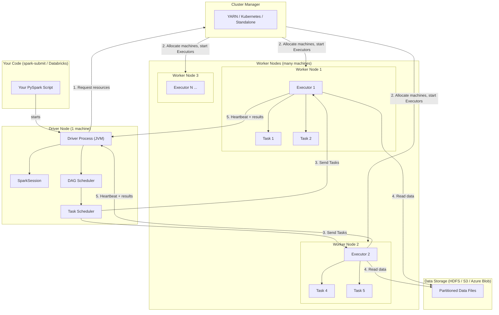

# Phase 1 · Topic 1 — Driver, Executors & Cluster Manager

> **The three-part engine behind every Spark job.**
> Understand this and you understand WHY Spark behaves the way it does — forever.

> 🎯 **First principle (DE-2026):** you don't truly know this topic until you can
> **BUILD it** (start a SparkSession and see the Driver + Executors in the Spark
> UI on the OrderIQ data), **BREAK it** (crash the Driver with `.collect()`, kill
> an Executor and watch recovery), and **EXPLAIN it** (say who did what and why).
> The [`practice.md`](./practice.md) makes you do all three on real data.

---

## Why This Exists

You now know Spark distributes work across many machines. But you haven't asked the important question yet:

**Who decides which machine does what?**

When you run a Spark job on a 100-machine cluster, someone has to:
- Break your code into small pieces of work
- Find machines that have free CPU and RAM
- Send each piece of work to the right machine
- Watch that all machines are still alive
- Collect the results and put them together

That "someone" is not magic. It is three separate roles working together: the **Driver**, the **Cluster Manager**, and the **Executors**.

Every single Spark job — from a 10-line script on Databricks to a 5 TB Flipkart pipeline — runs through this exact three-role system. There are no exceptions.

🗣️ **In plain words:** Spark is not one program on one machine. It's a small
*company*: a boss who plans (Driver), an HR/facilities dept that hands out
machines (Cluster Manager), and workers who actually do the labour (Executors).
Nothing runs until all three show up.

---

## The Big Picture First

Before details, here is the whole system in one sentence:

> **The Driver plans the job. The Cluster Manager provides the machines. The Executors do the work.**

Think of building a large apartment complex in Mumbai:

- **Driver = Project Architect** — Has the full blueprint. Decides which team builds which floor. Monitors progress. Checks quality.
- **Cluster Manager = Construction Company Owner** — Owns all the workers and equipment. When Architect says "I need 50 workers and 10 cranes", the Owner finds them and assigns them.
- **Executors = Construction Workers** — Do the actual physical work (digging, laying bricks, installing plumbing). Don't know the full plan — just know their specific task.

None of them can work without the others. Remove any one → the building doesn't get built.

---

## 1. The Driver

### What It Is

The Driver is a single JVM process that runs your Spark application code. It is the **brain** of the entire job.

When you write a Spark program and run it, the very first thing that starts is the Driver. Everything else — Cluster Manager, Executors — comes after the Driver has started and made requests.

### What the Driver Does (Step by Step)

1. **Runs your code** — Your Python or Scala or Java code runs inside the Driver process.
2. **Creates SparkSession** — The entry point to all Spark functionality (you'll learn this in the next topic).
3. **Builds an execution plan** — When you write `df.filter(...).groupBy(...).agg(...)`, the Driver analyzes all your transformations and builds a plan for how to execute them efficiently.
4. **Talks to Cluster Manager** — Asks for resources: "I need 50 Executors, each with 8 cores and 32 GB RAM."
5. **Breaks work into Tasks** — Divides the job into the smallest units of work called **Tasks** (one Task = one partition of data). A 5 TB file might become 40,000 Tasks.
6. **Schedules Tasks on Executors** — Sends each Task to an available Executor. Tracks which Executor has which Task.
7. **Monitors Executors** — Receives heartbeats from all Executors. If a heartbeat stops, the Driver knows that Executor died and reschedules its Tasks elsewhere.
8. **Collects final results** — Gathers the output from all Executors and either writes it to storage or returns it to your program.

🗣️ **In plain words:** the Driver *thinks and directs* but does not do the heavy
lifting. It's the site architect with the blueprint — pointing, scheduling,
checking — never carrying bricks.

### The Driver's Critical Weakness

The Driver is a **single point of failure**. If it crashes, the entire job fails — even if all 100 Executors are still healthy and working.

This is a known architectural trade-off. In return for this limitation, the design is simple and predictable. In production, teams:
- Run Driver on reliable, dedicated machines
- Use Databricks or cloud-managed Spark (which handle Driver restarts automatically)
- Keep the Driver's workload light — the Driver coordinates, it does NOT process data itself

**Important rule you must remember:** Never collect large datasets to the Driver. If you call `.collect()` on a 5 TB DataFrame, it tries to bring 5 TB into the Driver's RAM → Driver crashes. The Driver is a coordinator, not a data processor.

🗣️ **In plain words:** `.collect()` = "everybody bring all your work to the boss's
tiny desk." On big data the desk overflows and the boss faints (OOM), and with the
boss down, the whole company stops. You'll actually trigger this in the practice.

### Where the Driver Runs

In **client mode** (default on local machines, Jupyter notebooks): Driver runs on your laptop or the machine you submit from. If you close your laptop → job fails.

In **cluster mode** (production): Driver runs on one of the cluster's worker machines. You submit the job and disconnect — Driver continues running inside the cluster. This is how production jobs run.

You will learn the full detail of client vs cluster mode in Topic 12.

---

## 2. The Cluster Manager

### What It Is

The Cluster Manager manages the physical resources of the entire cluster — all the machines, CPUs, and RAM available. It does not know anything about Spark specifically. It just knows: "I have 100 machines. How much of them do you need?"

Think of the Cluster Manager as a hotel front desk. The hotel has 200 rooms. When a guest (Driver) arrives and says "I need 50 rooms for 3 hours", the front desk checks availability, assigns 50 rooms, and tells the guest which rooms. The front desk doesn't know what the guest will do in those rooms — sleep, work, cook. It just manages room availability.

🗣️ **In plain words:** the Cluster Manager doesn't care about your data or your
query. It only hands out machines and takes them back when you're done — like a
landlord renting rooms, indifferent to what you do inside.

### What the Cluster Manager Does

1. **Tracks all available machines and their resources** (CPU cores, RAM, disk)
2. **Receives resource requests from the Driver** ("Give me N Executors with X cores and Y GB RAM each")
3. **Allocates machines and starts Executor processes** on those machines
4. **Releases resources** when the job finishes so other jobs can use them

### Types of Cluster Managers

There are four types of Cluster Managers Spark supports. You need to know all four:

#### a) Spark Standalone
Spark's own built-in Cluster Manager. No external dependency.
- **Good for:** Learning, small teams, simple setups. **This is what runs when you do `SparkSession.builder.master("local[*]")` on your laptop for the practice.**
- **Limitation:** Less efficient resource sharing — can't run non-Spark jobs on the same cluster.

#### b) YARN (Yet Another Resource Negotiator)
Hadoop's resource manager. The most common Cluster Manager in on-premise enterprise setups in India.
- **Good for:** Companies that already have a Hadoop cluster (banks, telecom, large enterprises).
- **Advantage:** Can run Spark + MapReduce + other Hadoop tools on one shared cluster.
- **When you'll see it:** SBI, HDFC, telecom; AWS EMR uses YARN by default.

#### c) Kubernetes
Container-based Cluster Manager. The fastest-growing option in 2026.
- **How it works:** Each Executor runs inside a Docker container; Kubernetes manages the containers.
- **When you'll see it:** Startups and modern tech companies (Zomato, Meesho, CRED), cloud-native Spark, Databricks on K8s.

#### d) Apache Mesos
Older general-purpose Cluster Manager. Largely deprecated in 2026. Legacy only — don't invest time here.

### What You Actually Use in 2026 India DE Jobs

| Environment | What You Use | Cluster Manager Behind the Scenes |
|---|---|---|
| Databricks (Azure/AWS) | Databricks UI | Databricks manages it — you don't configure |
| AWS EMR | EMR Console | YARN |
| Azure HDInsight | Azure Portal | YARN |
| Google Dataproc | GCP Console | YARN |
| On-premise Hadoop cluster | spark-submit to YARN | YARN |
| Local learning | local mode | Spark Standalone (single machine) |

**Key insight for your career:** In most jobs, you will NOT configure the Cluster Manager directly. Databricks or the cloud platform does it for you. But you MUST understand how it works — because when a job fails due to "not enough resources" or "Executor allocation timeout", you need to know what's happening and what to tune.

---

## 3. The Executors

### What They Are

Executors are JVM processes that run on the worker machines of the cluster. They are the actual laborers — the ones that read data, process it, and produce output.

Each Executor:
- Runs on a **separate machine** (worker node)
- Has its own **CPU cores** (each core runs one Task at a time)
- Has its own **RAM** (for processing data and for caching)
- Lives for the **entire duration of one Spark job** (started when job begins, terminated when job finishes)

### What One Executor Does

Imagine an Executor as one dedicated team of workers assigned to one floor of the construction site:

1. **Receives a Task from the Driver** — "Process partition 47 of the orders data"
2. **Reads the data** — Goes to HDFS or S3 and reads the specific blocks it needs
3. **Runs the code** — Executes your filter, join, groupBy, map, etc. on that partition
4. **Stores intermediate results in RAM** — If you cached a DataFrame, it lives here
5. **Returns output to Driver or writes to storage** — Sends results back or writes final output to disk
6. **Sends heartbeats to Driver** — Every few seconds, "I'm still alive and here's my progress"

### Executor Slots (Cores)

Each Executor has multiple **slots** equal to its number of CPU cores. Each slot can run one Task simultaneously.

Example: An Executor with 8 cores can run **8 Tasks in parallel at the same time**.

So when people say "I have a 100-machine cluster with 8-core Executors" — that means 100 × 8 = **800 Tasks can run in parallel** across the entire cluster at any moment.

🗣️ **In plain words:** one Executor = one worker with several hands (cores). Each
hand can carry exactly one box (Task) at a time. Total hands across the cluster =
how many boxes move at once = your real speed.

### Executor Memory — How It Is Split

Each Executor's RAM is divided into regions. You will learn the full memory model in Topic 9, but here is the overview:

```
Total Executor RAM (e.g., 32 GB)
├── Reserved Memory (300 MB)        ← Spark system overhead, never touch this
├── Spark Memory (60% of remaining) ← For both processing AND caching
│   ├── Execution Memory            ← Used during shuffle, sort, join, aggregation
│   └── Storage Memory              ← Used when you cache/persist a DataFrame
└── User Memory (40% of remaining)  ← Your variables, UDF data, user-defined objects
```

These regions are not fixed walls — Spark's unified memory management lets Execution and Storage borrow from each other when one is idle. You'll learn exactly when and why this matters in Topic 9.

### What Happens When an Executor Fails

An Executor can die for many reasons: machine crash, out-of-memory (OOM) error, network timeout.

When this happens:
1. Driver stops receiving heartbeats from that Executor
2. Driver marks all Tasks assigned to that Executor as "failed"
3. Driver reschedules those Tasks on other healthy Executors
4. Job continues — only those specific Tasks are re-run, not the whole job

This is Spark's **fault tolerance** — you'll learn the exact mechanism (lineage recompute) in Topic 11.

🗣️ **In plain words:** if one worker collapses, the boss just hands that worker's
unfinished boxes to others. The company keeps running. But if the *boss* collapses
(Driver), everyone goes home. That asymmetry is the whole safety story of Spark.

---

## 4. The 3-Step Example — from tiny to real

### Step 1 — the tiny mechanic (what actually starts)

```python
from pyspark.sql import SparkSession
spark = SparkSession.builder.master("local[4]").appName("demo").getOrCreate()
# local[4] = 1 machine pretending to be a cluster with 4 cores (4 parallel Tasks)
# Driver = this Python process. Executor = also this process (local mode).
print(spark.sparkContext.defaultParallelism)   # 4  → 4 slots
```

### Step 2 — OrderIQ e-commerce (the roles doing real work)

```python
orders = spark.read.csv("datasets/data/orders.csv", header=True, inferSchema=True)
# Driver: builds the plan, splits orders.csv into partitions → Tasks
# Executors (your 4 local cores): each reads a chunk, filters it
delivered = orders.filter(orders.status == "delivered")
delivered.groupBy("city").count().show()   # groupBy = work that needs a shuffle
```

Open the Spark UI (printed URL, usually `localhost:4040`) → **Executors** tab shows
the Executor(s); **Jobs/Stages** shows the Tasks. You are *seeing* the three roles.

### Step 3 — production shape (same roles, 1000× bigger)

```python
# On Databricks / EMR, the ONLY thing that changes is master + scale:
#   .master("yarn")  and a 50-node cluster
# Driver still plans, Cluster Manager (YARN) hands out 50 machines,
# Executors read 2 TB from S3 in parallel. Identical mental model.
orders = spark.read.parquet("s3://orderiq/orders/")
orders.filter("status='delivered'").groupBy("city").count().write.parquet("s3://orderiq/out/")
```

The lesson: **local[4] on your laptop and a 50-node EMR cluster run the exact same
three-role architecture.** Learn it small, it scales unchanged.

---

## 5. Key Numbers to Remember

| Concept | Typical Value | Why It Matters |
|---|---|---|
| Executors per job | 5–500 (varies widely) | More Executors = more parallelism |
| Cores per Executor | 4–8 | Number of Tasks per Executor running in parallel |
| RAM per Executor | 8–64 GB | More RAM = bigger partitions, more caching |
| Tasks per partition | 1:1 | One Task processes one partition — always |
| Driver RAM needed | 4–16 GB | Driver coordinates, doesn't process data — keep it lean |
| Partition size target | 100–200 MB | Too small = too many Tasks; too large = spilling |

---

## Diagram — The Three-Role Architecture



---

## Revision

### The Three Roles
Every Spark job has exactly three roles: Driver, Cluster Manager, Executors. The Driver plans the job and schedules Tasks. The Cluster Manager provides machines and starts Executor processes. The Executors read data, run Tasks, and return results. Remove any one and the job cannot run.

### The Driver Is the Brain — And the Bottleneck
The Driver is a single JVM process. It runs your code, builds the plan, breaks the job into Tasks, and schedules them. It is also the single point of failure — if it crashes, the job fails. This is why you never bring large data back to the Driver (no `.collect()` on big datasets). The Driver coordinates; it does not process data.

### Cluster Manager = Resource Allocator, Not Spark-Specific
The Cluster Manager knows nothing about Spark. It just manages machines and RAM. Four types: Standalone (simple/local), YARN (most common in Indian enterprises), Kubernetes (cloud-native, growing), Mesos (legacy). In Databricks it's fully managed.

### Executors Are the Workers
Executors run on worker machines. Each has cores (slots) — each core runs one Task in parallel — and RAM split between execution (shuffle/join/sort) and storage (caching). When an Executor fails, the Driver reschedules its Tasks on healthy Executors — the job continues.

### The Full Flow
Submit code → Driver starts → Driver asks Cluster Manager for resources → Cluster Manager starts Executors → Driver creates Tasks (one per partition) → Driver sends Tasks to Executors → Executors read, process, return → Driver collects final output. Every Spark job, every time.

---

## Test yourself — quick recall (full hands-on set in `practice.md`)

<details><summary>1. One-line job of each of the three roles?</summary>
Driver plans + schedules; Cluster Manager provides machines; Executors do the work.
</details>
<details><summary>2. Why is <code>.collect()</code> on 500 GB dangerous?</summary>
It streams all rows into the Driver's small RAM → OOM → Driver dies → whole job fails. Write to storage or sample instead.
</details>
<details><summary>3. Executor with 8 cores runs how many Tasks at once?</summary>
8 — one Task per core.
</details>
<details><summary>4. Driver crash vs Executor crash — what's the difference?</summary>
Executor crash = its Tasks rescheduled elsewhere, job continues. Driver crash = whole job fails.
</details>
<details><summary>5. Which Cluster Manager is most common in Indian enterprises?</summary>
YARN.
</details>

---

## Practice

👉 Do [`practice.md`](./practice.md) — you'll **start a real local SparkSession on
the OrderIQ dataset**, read the Executors/Stages tabs in the Spark UI, **crash the
Driver on purpose** with `.collect()`, reason about Task/partition math, and fix a
Driver-OOM pipeline. BUILD → BREAK → EXPLAIN.

---

*Next: [Topic 2 — SparkSession & SparkContext](../topic-2-sparksession-sparkcontext/)*
