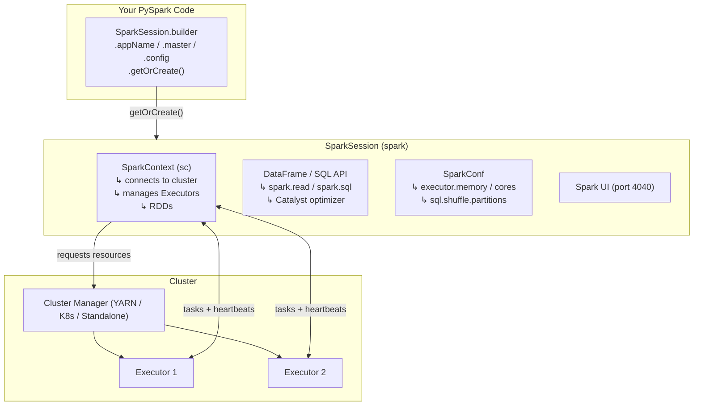

# Phase 1 · Topic 2 — SparkSession & SparkContext

> **Your application's front door into Spark.**
> Before you can read a file, run a query, or process a single row — you need one of these.

> 🎯 **First principle (DE-2026):** you don't own this until you can **BUILD it**
> (create a `SparkSession` on your laptop and read OrderIQ), **BREAK it** (start
> with a 1-core `local`, leave shuffle partitions at 200 on tiny data, watch it
> crawl), and **EXPLAIN it** (say what `.getOrCreate()` actually does under the
> hood). [`practice.md`](./practice.md) drives all three.

---

## Why This Exists

When you write a Spark program, you need a way to tell Spark:

- "I am starting a new application"
- "Here is the name of my app"
- "Here is how much memory and how many cores I need"
- "Here is what cluster to connect to"
- "Now give me the ability to read data, run SQL, and write results"

That connection between your code and the Spark engine is what **SparkSession** (and its older sibling **SparkContext**) gives you.

Without one of these — you cannot do anything in Spark. No reading. No writing. No processing.

🗣️ **In plain words:** SparkSession is the ignition key of the car. The engine
(cluster), the fuel (data) all exist — but nothing moves until you turn the key.
`spark = SparkSession.builder...getOrCreate()` **is** turning the key.

---

## 1. SparkContext — The Original (Spark 1.x)

SparkContext was Spark's original entry point. It connected your application to the cluster and let you work with RDDs (the original Spark data structure — next topic).

```python
from pyspark import SparkContext, SparkConf
conf = SparkConf().setAppName("OrderAnalysis").setMaster("yarn")
sc = SparkContext(conf=conf)
data = sc.textFile("hdfs:///data/orders.csv")   # RDD
```

### The Problem That Grew

As Spark added DataFrames, SQL, Hive, and Streaming, each feature needed its own entry point:
- `SparkContext` → RDDs
- `SQLContext` → DataFrames and SQL
- `HiveContext` → Hive-compatible SQL
- `StreamingContext` → streaming

A developer using all of Spark had to create and juggle 4 different context objects. Messy and error-prone. Spark 2.0 fixed this.

🗣️ **In plain words:** the old Spark made you carry four different keys for four
doors of the same house. Spark 2.0 gave you one master key.

---

## 2. SparkSession — The Modern Entry Point (Spark 2.0+)

SparkSession is a **unified entry point** for everything: reading data, SQL, DataFrames, RDDs (via `spark.sparkContext`), config, streaming. One object. All features.

```python
from pyspark.sql import SparkSession

spark = (SparkSession.builder
    .appName("FlipkartOrderAnalysis")
    .master("yarn")
    .config("spark.executor.memory", "8g")
    .config("spark.executor.cores", "4")
    .getOrCreate())
```

| Part | What It Does |
|------|-------------|
| `SparkSession.builder` | Starts building the configuration |
| `.appName(...)` | Names your job — shows in Spark UI |
| `.master(...)` | Which Cluster Manager to use |
| `.config(...)` | Sets a Spark config key |
| `.getOrCreate()` | Builds the session (or returns the existing one) |

### SparkContext Still Lives Inside SparkSession

```python
sc = spark.sparkContext        # the underlying cluster connection
spark.read.csv(...)            # modern DataFrame API
sc.textFile("hdfs://...")      # old RDD API
```

In 2026 you almost always use `spark`, not `sc` directly. But knowing `sc` is *inside* `spark` explains what's happening.

🗣️ **In plain words:** SparkSession is a nice modern wrapper around the old
SparkContext engine. The engine never left — it's under the hood.

---

## 3. What `.getOrCreate()` Actually Does (the important part)

**Step 1 — Singleton check:** if a SparkSession already exists in this JVM, return it. Do NOT create a second.

**Step 2 — SparkContext is created:** contacts the **Cluster Manager**, requests the Executors you configured, waits for them to start, opens communication channels.

**Step 3 — Internal components init:** **Catalyst** (query optimizer), **Tungsten** (memory layout), **Spark UI** (port 4040) all start.

**Step 4 — SparkSession returned:** you get `spark`, connected and ready.

This takes a few seconds — the "startup overhead." Spark isn't instant like pandas; the first seconds are setup cost, then the cluster is ready.

🗣️ **In plain words:** `.getOrCreate()` is not "make an object." It's "phone the
landlord (Cluster Manager), rent the workers (Executors), boot the optimizer, and
open the dashboard." That's why it takes a few seconds.

---

## 4. SparkConf — Configuring Spark

SparkConf is key-value settings that control how Spark behaves.

```python
# Method 1 — in code (highest priority)
spark = (SparkSession.builder
    .config("spark.executor.memory", "16g")
    .config("spark.sql.shuffle.partitions", "400")
    .getOrCreate())

# Method 2 — after creation
spark.conf.set("spark.sql.shuffle.partitions", "200")
```

Also via `spark-submit --conf ...` and `spark-defaults.conf`.

**Priority:** `code (.config) > spark-submit --conf > spark-defaults.conf > built-in defaults`. Code always wins.

### Configs to Know

| Config Key | Controls | Typical |
|---|---|---|
| `spark.app.name` | Job name in UI | your pipeline |
| `spark.master` | which Cluster Manager | `yarn`, `local[*]` |
| `spark.executor.memory` | RAM per Executor | `8g`–`32g` |
| `spark.executor.cores` | cores per Executor | `4`–`8` |
| `spark.driver.memory` | Driver RAM | `4g`–`8g` |
| `spark.executor.instances` | number of Executors | `10`–`200` |
| `spark.sql.shuffle.partitions` | partitions after a shuffle | default 200; tune to 2–4× cores |

🗣️ **In plain words:** the one config you'll touch most is
`spark.sql.shuffle.partitions`. Default 200 = too many for small data (hundreds of
tiny files), too few for huge data (giant partitions that spill). Always right-size it.

---

## 5. master() — Where Spark Runs

```python
.master("local")      # 1 core on your machine
.master("local[4]")   # 4 cores
.master("local[*]")   # ALL your cores — best for local dev
.master("yarn")       # Hadoop cluster
.master("k8s://https://k8s-api:443")   # Kubernetes
```

In local mode, Driver and Executors are the same JVM on your machine — no cluster needed. **On Databricks you don't set `.master()` at all** — `spark` is already created and managed for you; just use it.

---

## 6. The getOrCreate() Singleton — Why It Matters

Only **one active SparkContext per JVM**. Spark errors if you try to create a second (two contexts would both claim Executors from the same pool → conflicts).

```python
spark1 = SparkSession.builder.appName("Job1").getOrCreate()
spark2 = SparkSession.builder.appName("Job2").getOrCreate()
print(spark1 is spark2)   # True — same object; "Job2" appName ignored
```

🗣️ **In plain words:** ask for a session twice, you get the *same* one back — not a
copy. On Databricks that's exactly why `getOrCreate()` returns the cluster's shared
session.

---

## 7. Spark UI, Stopping, and Common Mistakes

The UI (`localhost:4040` in local mode) has tabs: **Jobs · Stages · Tasks · Executors · SQL · Environment**. You'll live here in Phase 4 to diagnose slow jobs.

Stop with `spark.stop()` (releases Executors, closes UI). **Never call `spark.stop()` in Databricks** — it crashes the shared cluster.

**Common mistakes:** no `.build()`/`.create()` exists (always `.getOrCreate()`); don't create SparkSession inside a loop (create once, reuse); don't set `.master()` or call `.stop()` on Databricks; don't leave `spark.sql.shuffle.partitions` at 200 for very large or very small data.

---

## 8. The 3-Step Example — from tiny to real

### Step 1 — the tiny mechanic (turn the key)

```python
from pyspark.sql import SparkSession
spark = SparkSession.builder.master("local[*]").appName("t2").getOrCreate()
print(spark.version)                       # engine is on
print(spark is SparkSession.builder.getOrCreate())   # True — singleton
```

### Step 2 — OrderIQ e-commerce (use the session for real work)

```python
# right-size shuffle partitions for tiny local data BEFORE the groupBy shuffle
spark.conf.set("spark.sql.shuffle.partitions", "8")
orders = spark.read.csv("datasets/data/orders.csv", header=True, inferSchema=True)
orders.createOrReplaceTempView("orders")           # now SQL works too
spark.sql("SELECT city, COUNT(*) FROM orders GROUP BY city").show()
```

One `spark` object gave you **both** the DataFrame API and SQL — that's the "unified entry point" in action.

### Step 3 — production shape (same code, different config)

```python
# On Databricks: delete the builder entirely — 'spark' already exists.
# On EMR/YARN: .master("yarn"), bigger executors, 50000 shuffle partitions for TBs.
spark.conf.set("spark.sql.shuffle.partitions", "50000")
orders = spark.read.parquet("s3://orderiq/orders/")
spark.sql("SELECT city, COUNT(*) c FROM orders GROUP BY city").write.parquet("s3://orderiq/out/")
```

The mental model never changes — only `master` and a couple of configs do.

---

## Diagram — SparkSession Architecture



---

## Revision

### SparkContext Was First, SparkSession Replaced It
SparkContext was Spark 1.x's entry point for RDDs. As DataFrames/SQL/Hive/streaming arrived, each got its own context — messy. Spark 2.0 unified them into SparkSession. SparkContext still lives inside (`spark.sparkContext`). In 2026 you always start with SparkSession.

### SparkSession Is the Key — Turn It to Start Everything
`getOrCreate()` connects to the Cluster Manager, requests Executors, starts the UI, and boots Catalyst + Tungsten. The `spark` object is your gateway to reading, SQL, writing, and config. Create it once at the top; reuse everywhere.

### getOrCreate() Enforces One Context Per JVM
Only one active SparkContext per JVM. `getOrCreate()` returns the existing session if present, else creates one — so calling it repeatedly is safe. On Databricks it returns the pre-created shared session.

### SparkConf Controls How Spark Runs
Every tunable — executor memory/cores, shuffle partitions — is a config. Set via `.config()` or `spark.conf.set()`. Priority: code > spark-submit > conf file > defaults. Most-tuned in production: `spark.sql.shuffle.partitions`.

### Databricks Is a Special Case
`spark` and `sc` are pre-created. Don't set `.master()`, don't call `.stop()`. Outside Databricks (local, spark-submit) you always create the session yourself.

---

## Test yourself — quick recall (full hands-on set in `practice.md`)

<details><summary>1. Why did SparkSession replace the multiple 1.x contexts?</summary>
One unified entry point instead of juggling SparkContext + SQLContext + HiveContext + StreamingContext.</details>
<details><summary>2. What are the 4 things getOrCreate() does under the hood?</summary>
Singleton check → create SparkContext (contact Cluster Manager, request Executors) → init Catalyst/Tungsten/UI → return spark.</details>
<details><summary>3. Two getOrCreate() calls with different appNames — what do you get?</summary>
The same session object; the second appName is ignored.</details>
<details><summary>4. local vs local[4] vs local[*]?</summary>
1 core / 4 cores / all cores — Driver+Executor in one JVM.</details>
<details><summary>5. Two things you must NOT do on Databricks?</summary>
Don't set .master(); don't call spark.stop().</details>

---

## Practice

👉 [`practice.md`](./practice.md) — build a SparkSession on OrderIQ, prove the
singleton, use one `spark` for **both** DataFrame + SQL, and **break it** by
leaving shuffle partitions at 200 on tiny data (then fix it). BUILD → BREAK → EXPLAIN.

---

*Next: [Topic 3 — RDD: Partitions, Immutability & Lineage](../topic-3-rdd-partitions-immutability-lineage/)*
