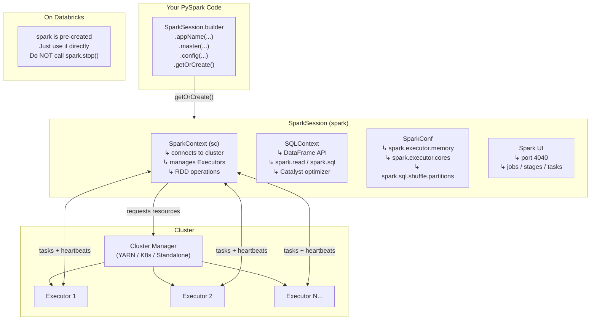

# Phase 1 · Topic 2 — SparkSession & SparkContext

> **Your application's front door into Spark.**
> Before you can read a file, run a query, or process a single row — you need one of these.

---

## Why This Exists

When you write a Spark program, you need a way to tell Spark:

- "I am starting a new application"
- "Here is the name of my app"
- "Here is how much memory and how many cores I need"
- "Here is what cluster to connect to"
- "Now give me the ability to read data, run SQL, and write results"

That connection between your code and the Spark engine is what **SparkSession** (and its older sibling **SparkContext**) gives you.

Without one of these — you cannot do anything in Spark. No reading. No writing. No processing.

Think of SparkSession like turning the key in a car's ignition. The engine exists. The fuel exists. But nothing works until you turn the key.

---

## 1. SparkContext — The Original (Spark 1.x)

### What It Is

SparkContext was Spark's original entry point. It was introduced when Spark was first built. It connected your application to the cluster and allowed you to work with RDDs (the original Spark data structure — you will learn RDDs in the next topic).

In Spark 1.x, you started every application like this:

```python
from pyspark import SparkContext, SparkConf

conf = SparkConf().setAppName("OrderAnalysis").setMaster("yarn")
sc = SparkContext(conf=conf)

# Now you can work with RDDs
data = sc.textFile("hdfs:///data/orders.csv")
```

### The Problem That Grew

As Spark became more powerful, it added more features:
- DataFrames (for structured data — like tables)
- SQL support
- Hive integration
- Streaming

Each feature needed its own entry point:
- `SparkContext` → for RDDs
- `SQLContext` → for DataFrames and SQL
- `HiveContext` → for Hive-compatible SQL
- `StreamingContext` → for streaming

A developer using all of Spark had to create and manage 4 different context objects. That was messy, confusing, and easy to get wrong.

Spark 2.0 fixed this.

---

## 2. SparkSession — The Modern Entry Point (Spark 2.0+)

### What It Is

SparkSession was introduced in Spark 2.0 as a **unified entry point** for everything. One object. All features.

You use SparkSession for:
- Reading data (CSV, Parquet, JSON, Delta, databases)
- Running SQL queries
- Working with DataFrames
- Accessing RDDs (via `spark.sparkContext`)
- Configuring Spark
- Streaming setup

### How to Create It

```python
from pyspark.sql import SparkSession

spark = SparkSession.builder \
    .appName("FlipkartOrderAnalysis") \
    .master("yarn") \
    .config("spark.executor.memory", "8g") \
    .config("spark.executor.cores", "4") \
    .getOrCreate()
```

Let's read each part:

| Part | What It Does |
|------|-------------|
| `SparkSession.builder` | Starts building the configuration |
| `.appName("FlipkartOrderAnalysis")` | Names your job — shows up in Spark UI |
| `.master("yarn")` | Tells Spark which Cluster Manager to use |
| `.config("spark.executor.memory", "8g")` | Sets 8 GB RAM per Executor |
| `.config("spark.executor.cores", "4")` | Sets 4 cores per Executor |
| `.getOrCreate()` | Builds the session (or returns existing one) |

### SparkContext Still Exists Inside SparkSession

SparkSession wraps SparkContext. SparkContext didn't disappear — it's still there doing the actual cluster connection. You can access it like this:

```python
sc = spark.sparkContext  # Get the underlying SparkContext

# Both of these are available:
spark.read.csv(...)         # SparkSession API (modern, DataFrames)
sc.textFile("hdfs://...")   # SparkContext API (old, RDDs)
```

For real work in 2026, you almost always use `spark` (SparkSession), not `sc` directly. But knowing that SparkContext is inside helps you understand what's happening.

---

## 3. What Actually Happens When You Call `.getOrCreate()`

This is the important part. When `SparkSession.builder.getOrCreate()` runs, a lot happens under the hood:

**Step 1 — Singleton check:**
Spark checks if a SparkSession already exists in this JVM. If yes, it returns the existing one. It does NOT create a second one. (More on why this matters shortly.)

**Step 2 — SparkContext is created:**
A SparkContext is created, which:
- Contacts the **Cluster Manager** (YARN/Kubernetes/Standalone)
- Requests the number of Executors you configured
- Waits for Executors to start on worker machines
- Opens communication channels to all Executors

**Step 3 — Internal components initialize:**
- **Catalyst Optimizer** starts — will optimize your DataFrame queries
- **Tungsten** starts — manages memory layout for fast processing
- **SparkUI** starts on port 4040 — the web interface where you can watch your jobs run

**Step 4 — SparkSession returned:**
You get back the `spark` object. Now you're connected to the cluster and ready to work.

The whole process takes a few seconds. This is the "startup overhead" you'll notice — Spark isn't instant like pandas. The first few seconds are startup cost. After that, the cluster is ready.

---

## 4. SparkConf — Configuring Spark

### What Is SparkConf

SparkConf is a collection of key-value pairs that control how Spark behaves. You pass these configurations when creating SparkSession.

### How to Set Configuration

**Method 1 — In code (highest priority):**
```python
spark = SparkSession.builder \
    .config("spark.executor.memory", "16g") \
    .config("spark.executor.cores", "8") \
    .config("spark.driver.memory", "4g") \
    .config("spark.sql.shuffle.partitions", "400") \
    .getOrCreate()
```

**Method 2 — After session created:**
```python
spark.conf.set("spark.sql.shuffle.partitions", "200")
```

**Method 3 — spark-submit command (overrides conf file):**
```bash
spark-submit \
  --conf spark.executor.memory=16g \
  --conf spark.executor.cores=8 \
  my_script.py
```

**Method 4 — spark-defaults.conf file (cluster-wide defaults, lowest priority):**
```
spark.executor.memory    8g
spark.executor.cores     4
```

### Priority Order (Important)

When the same config is set in multiple places, Spark follows this priority:

```
Code (.config())  >  spark-submit --conf  >  spark-defaults.conf  >  Spark built-in defaults
   (highest)                                                              (lowest)
```

Code always wins. This means you can override cluster defaults in your application code.

### The Most Important Configs to Know

| Config Key | What It Controls | Typical Value |
|---|---|---|
| `spark.app.name` | Job name — shows in Spark UI | Your pipeline name |
| `spark.master` | Which Cluster Manager to connect to | `yarn`, `local[*]`, `k8s://...` |
| `spark.executor.memory` | RAM per Executor | `8g`, `16g`, `32g` |
| `spark.executor.cores` | CPU cores per Executor | `4`, `8` |
| `spark.driver.memory` | RAM for the Driver process | `4g`, `8g` |
| `spark.executor.instances` | How many Executors to request | `10`, `50`, `200` |
| `spark.sql.shuffle.partitions` | Number of partitions after a shuffle (groupBy, join) | Default 200; tune to `2-4x cores` |
| `spark.default.parallelism` | Default parallelism for RDD operations | Set to `2x total cores` |

The most commonly tuned config in real DE jobs is `spark.sql.shuffle.partitions`. The default is 200 — which is too many for small data (hundreds of tiny files) and too few for very large data (creates huge partitions that spill). You'll learn exactly how to tune this in Phase 4.

---

## 5. master() — How to Tell Spark Which Cluster to Use

The `.master()` setting is critical. It tells Spark WHERE to run.

### Local Mode (for learning and testing)

```python
# Use 1 core on your local machine — slowest, for quick tests
spark = SparkSession.builder.master("local").getOrCreate()

# Use 4 cores on your local machine
spark = SparkSession.builder.master("local[4]").getOrCreate()

# Use ALL available cores on your local machine — best for local dev
spark = SparkSession.builder.master("local[*]").getOrCreate()
```

In local mode, the Driver and Executors are all the same JVM process on your machine. No cluster needed. Perfect for Databricks Community Edition, local Jupyter notebooks, or unit tests.

### YARN (on-premise Hadoop cluster)

```python
spark = SparkSession.builder.master("yarn").getOrCreate()
```

Spark connects to YARN. YARN allocates machines on the Hadoop cluster.

### Kubernetes

```python
spark = SparkSession.builder.master("k8s://https://k8s-api-server:443").getOrCreate()
```

### Databricks (special case — master is managed for you)

In Databricks, you don't set `.master()` at all. Databricks controls it. `spark` is already created and waiting for you. You just use it:

```python
# In any Databricks notebook — this just works:
df = spark.read.parquet("/mnt/data/orders/")
spark.sql("SELECT city, COUNT(*) FROM orders GROUP BY city").show()
```

---

## 6. The getOrCreate() Singleton — Why It Matters

`.getOrCreate()` enforces an important rule: **only one active SparkContext per JVM at a time**.

This is not just a convention — Spark throws an error if you try to create a second SparkContext while one is running. Here's why this rule exists:

- Each SparkContext connects to the Cluster Manager and claims Executors
- Two SparkContexts in the same JVM would both try to claim Executors from the same pool — causing conflicts, double-counting, and unpredictable behavior

The `.getOrCreate()` pattern safely handles this:

```python
# First call — creates SparkSession
spark1 = SparkSession.builder.appName("Job1").getOrCreate()

# Second call anywhere in your code — returns the SAME SparkSession, no new one created
spark2 = SparkSession.builder.appName("Job2").getOrCreate()

# spark1 and spark2 are the exact same object
print(spark1 is spark2)  # True
```

In Databricks, `spark` is already created when your notebook starts. So calling `SparkSession.builder.getOrCreate()` in a Databricks notebook just returns the existing Databricks-managed session — which is exactly what you want.

---

## 7. Reading the Spark UI

When you create a SparkSession, Spark starts a web UI at `http://localhost:4040` (in local mode) or accessible through Databricks' cluster UI.

The Spark UI shows you:
- **Jobs tab** — every Action you've triggered
- **Stages tab** — breakdown of each Job into Stages
- **Tasks tab** — individual Tasks and how long each took
- **Executors tab** — all Executors, their memory, cores, Tasks completed
- **SQL tab** — query plans for DataFrame operations
- **Environment tab** — all your SparkConf settings

You will use the Spark UI constantly in Phase 4 to diagnose slow jobs. Get comfortable opening it.

---

## 8. Stopping Spark

When your application finishes:

```python
spark.stop()
```

This:
- Releases all Executor processes (Cluster Manager gets resources back)
- Closes connection to Cluster Manager
- Shuts down Spark UI
- Closes SparkContext

**Important:** In Databricks, **never call `spark.stop()`**. Databricks manages the cluster lifecycle. Stopping Spark in a notebook will crash the cluster for everyone sharing it.

---

## 9. Common Mistakes

**Mistake 1 — Forgetting `.getOrCreate()` and using `.build()` or `.create()`:**
There is no `.build()` or `.create()`. Always use `.getOrCreate()`.

**Mistake 2 — Creating SparkSession inside a loop:**
```python
# WRONG — creates/retrieves SparkSession on every iteration
for file in files:
    spark = SparkSession.builder.getOrCreate()  # wasteful, confusing
    spark.read.parquet(file)...

# RIGHT — create once, reuse everywhere
spark = SparkSession.builder.appName("MyPipeline").getOrCreate()
for file in files:
    spark.read.parquet(file)...
```

**Mistake 3 — Calling `spark.stop()` in Databricks:**
Will kill the cluster. Don't do it.

**Mistake 4 — Setting `spark.master` in Databricks:**
Databricks ignores it or throws an error. Master is managed. Just omit `.master()`.

**Mistake 5 — Leaving `spark.sql.shuffle.partitions` at default 200 forever:**
For a job processing 10 GB, 200 partitions may create 50 MB partitions — fine.
For a job processing 5 TB, 200 partitions creates 25 GB partitions — guaranteed OOM and spilling.
Always tune this config for your data size in production.

---

## Diagram — SparkSession Architecture



---

## Revision

### SparkContext Was First, SparkSession Replaced It

SparkContext was Spark's original entry point in Spark 1.x. It connected your code to the cluster and let you work with RDDs. But as Spark added DataFrames, SQL, Hive, and streaming — each feature got its own entry point (SQLContext, HiveContext, StreamingContext). This became messy. Spark 2.0 introduced SparkSession as one single entry point for everything. SparkContext still exists inside SparkSession — accessible via `spark.sparkContext`. In 2026, you always start with SparkSession.

### SparkSession Is the Key — Turn It to Start Everything

When you call `SparkSession.builder.getOrCreate()`, Spark connects to the Cluster Manager, requests Executors, starts the Spark UI, and initializes the Catalyst optimizer and Tungsten memory manager. The `spark` object you get back is your gateway to everything: reading files, running SQL, writing output, checking configuration. Without a SparkSession, your Spark code cannot run. Create it once at the top of your application. Reuse it everywhere.

### getOrCreate() Enforces One Context Per JVM

Only one SparkContext can be active per JVM at a time — Spark throws an error if you try to create a second. `.getOrCreate()` solves this safely: if a SparkSession already exists, it returns that one; if not, it creates a new one. This means calling `.getOrCreate()` multiple times in your code is safe and idiomatic. In Databricks, `spark` is pre-created — calling `getOrCreate()` returns the existing Databricks session.

### SparkConf Controls How Spark Runs

Every tunable aspect of Spark — executor memory, executor cores, number of partitions, shuffle behavior — is a key-value config. You set these via `.config("key", "value")` in the builder, or after the session via `spark.conf.set()`. Priority: code > spark-submit > conf file > defaults. The most important config to tune in production is `spark.sql.shuffle.partitions` (default 200, must be tuned per data size). You will use SparkConf constantly in Phase 4.

### Databricks Is a Special Case — spark Is Pre-Built

In Databricks Community Edition (where you practice), you never write `SparkSession.builder...`. Databricks creates `spark` and `sc` for you when the cluster starts. Open a notebook and `spark` is already there, connected to the cluster, ready to use. Never call `spark.stop()` in Databricks — it will crash the cluster. Outside Databricks (local machine, spark-submit to YARN), you always create SparkSession yourself at the top of your script.

---

## Practice Questions

### 🟢 Easy

**E1. What was the problem with SparkContext in Spark 1.x that led to SparkSession being created?**

<details>
<summary>▶ Answer</summary>

In Spark 1.x, different features needed different entry points:
- `SparkContext` for RDD operations
- `SQLContext` for DataFrames and SQL
- `HiveContext` for Hive-compatible SQL
- `StreamingContext` for streaming

Developers had to create and manage multiple context objects for a single application. This was confusing, error-prone, and messy.

Spark 2.0 introduced **SparkSession** as a single unified entry point for all of these. One object gives you access to everything — DataFrames, SQL, RDDs (via `spark.sparkContext`), configuration, and more.

</details>

---

**E2. Write the code to create a SparkSession for a job called "ZomatoOrderPipeline" that runs on YARN with 16 GB RAM and 8 cores per Executor.**

<details>
<summary>▶ Answer</summary>

```python
from pyspark.sql import SparkSession

spark = SparkSession.builder \
    .appName("ZomatoOrderPipeline") \
    .master("yarn") \
    .config("spark.executor.memory", "16g") \
    .config("spark.executor.cores", "8") \
    .getOrCreate()
```

After this, `spark` is connected to the YARN cluster with the requested resources. You can now read files, run SQL, and process data.

</details>

---

**E3. In Databricks, how do you create a SparkSession? What is different from a local machine setup?**

<details>
<summary>▶ Answer</summary>

In Databricks, you **do not create** a SparkSession. Databricks creates it for you when the cluster starts. The variable `spark` is available in every notebook cell automatically.

```python
# On a local machine — you must create it yourself:
from pyspark.sql import SparkSession
spark = SparkSession.builder.appName("MyApp").master("local[*]").getOrCreate()

# On Databricks — spark is already there, just use it:
df = spark.read.csv("/mnt/data/orders.csv")
```

Two other differences:
1. **Do not set `.master()`** in Databricks — Databricks manages it
2. **Do NOT call `spark.stop()`** in Databricks — will crash the cluster

</details>

---

### 🟡 Medium

**M1. What exactly happens under the hood when you call `SparkSession.builder.getOrCreate()` for the first time? List the steps in order.**

<details>
<summary>▶ Answer</summary>

1. **Singleton check** — Spark checks if a SparkSession already exists in this JVM. First time = none exists.

2. **SparkContext is created** — Connects to the Cluster Manager (YARN/K8s/Standalone), requests the configured number of Executors with the requested memory and cores. Waits for Executors to start on worker machines.

3. **Internal components initialize:**
   - **Catalyst Optimizer** — will optimize your DataFrame and SQL query plans
   - **Tungsten** — memory manager for fast, off-heap processing
   - **Spark UI** — web dashboard starts on port 4040 (local) or managed by platform (Databricks)

4. **SparkSession object returned** — You receive the `spark` variable. The cluster is now ready.

Total time: a few seconds to ~30 seconds depending on cluster size and resource availability.

</details>

---

**M2. You set `spark.sql.shuffle.partitions = 200` (the default) and run a groupBy on a 5 TB dataset. Why is this a problem? What value should you use instead?**

<details>
<summary>▶ Answer</summary>

**The problem:**

After a groupBy, Spark creates a new set of partitions for the aggregated result. The number of those partitions = `spark.sql.shuffle.partitions`.

With 200 partitions on 5 TB data:
- Each partition = 5 TB ÷ 200 = **25 GB per partition**
- Each Executor Task must hold 25 GB in RAM to process its partition
- Even a 32 GB Executor runs out of memory → **OOM error** or heavy disk spilling
- Job is extremely slow or fails

**What to use instead:**

Rule of thumb: target **100–200 MB per partition after shuffle**.

```
5 TB = 5,000,000 MB
ideal partitions = 5,000,000 MB ÷ 150 MB = ~33,000 partitions
```

A reasonable starting point: **50,000 partitions** for 5 TB. Then tune down if scheduling overhead becomes visible.

```python
spark.conf.set("spark.sql.shuffle.partitions", "50000")
```

Or set it at session creation:
```python
spark = SparkSession.builder \
    .config("spark.sql.shuffle.partitions", "50000") \
    .getOrCreate()
```

</details>

---

**M3. You call `SparkSession.builder.appName("Job1").getOrCreate()` early in your script. Later, another function calls `SparkSession.builder.appName("Job2").getOrCreate()`. Which app name does Spark use? What object do you get back in the second call?**

<details>
<summary>▶ Answer</summary>

**App name:** "Job1" — the first one created.

**Object returned in second call:** The EXACT SAME SparkSession object that was created the first time. `.getOrCreate()` checks for an existing session first. Since one exists, it returns it immediately without creating anything new.

The `.appName("Job2")` in the second builder call is **ignored** — it has no effect because no new session is being created.

```python
spark1 = SparkSession.builder.appName("Job1").getOrCreate()
spark2 = SparkSession.builder.appName("Job2").getOrCreate()

print(spark1 is spark2)          # True — same object
print(spark2.conf.get("spark.app.name"))  # "Job1" — second appName ignored
```

This is why `.getOrCreate()` is called "singleton" behavior. One SparkSession per JVM, always.

</details>

---

**M4. What is the difference between `local[*]`, `local[4]`, and `local` as master values? When do you use each?**

<details>
<summary>▶ Answer</summary>

All three run Spark on your local machine with no cluster — the entire Spark application (Driver + Executors) runs in one JVM process.

| Master | Cores Used | When to Use |
|---|---|---|
| `local` | 1 core only | Minimal testing — one thing at a time, no parallelism |
| `local[4]` | 4 cores | When you want to test with a fixed level of parallelism |
| `local[*]` | All available cores on your machine | Local development and learning — uses maximum parallelism your machine can provide |

**Practical advice:**
- Learning on Databricks Community → no master setting needed (Databricks handles it)
- Local machine dev/testing → `local[*]` almost always
- CI/CD tests where you want deterministic parallelism → `local[4]` or specific number

```python
# Most common for local learning:
spark = SparkSession.builder \
    .appName("Test") \
    .master("local[*]") \
    .getOrCreate()
```

On a 4-core laptop, `local[*]` = `local[4]`. On a 16-core server, `local[*]` = `local[16]`.

</details>

---

### 🔴 Hard

**H1. A senior DE says: "Never set spark.executor.memory and spark.executor.cores in your application code. Set them at the spark-submit level or in the cluster config." Why might this be good advice in a team environment?**

<details>
<summary>▶ Answer</summary>

This is good advice for several reasons in a shared team environment:

**1. Code configs are hard to change without a deployment:**
If `spark.executor.memory = "8g"` is in Python code in a git repo, changing it requires: code change → PR → review → merge → deploy. Urgent tuning during a production incident is slow.

At the spark-submit level (cluster config or job parameters), a DevOps/DE can change the memory without touching application code — faster response to production issues.

**2. Cluster admins need control:**
A cluster admin needs to ensure no single job hogs all cluster resources. If teams hardcode executor configs in code, the admin loses the ability to enforce resource quotas through queue configs. They can override with higher priority, but it's a cat-and-mouse game.

**3. Same code, different environments:**
Dev cluster has 8 GB executors. Prod cluster has 64 GB executors. If memory is hardcoded in code, you either have wrong settings in one environment, or you need separate code branches. If set externally (spark-submit, cluster config), the same code runs correctly in both environments.

**4. Config drift:**
Over time, 20 different jobs with hardcoded configs become impossible to audit. Which jobs are using how much memory? Finding out requires reading each codebase. With centralized configs, it's one place.

**When to override in code:**
`spark.sql.shuffle.partitions` and job-logic-specific configs (that depend on the data shape your job processes) are reasonable to set in code. Resource sizing (`executor.memory`, `executor.cores`) is better externalized.

</details>

---

**H2. You have a PySpark script that works perfectly on Databricks. You try to run it on your laptop with `master("local[*]")` and it fails with "ModuleNotFoundError: No module named 'pyspark'". You install pyspark via pip and it fails again — this time running out of memory on a 200 MB file. Explain both failures and how to fix them.**

<details>
<summary>▶ Answer</summary>

**Failure 1 — ModuleNotFoundError:**

Your Python environment doesn't have PySpark installed. Databricks pre-installs PySpark as part of the cluster image.

Fix:
```bash
pip install pyspark
```

Or for a specific version matching Databricks:
```bash
pip install pyspark==3.5.0
```

**Failure 2 — Out of memory on 200 MB file:**

This is a configuration mismatch, not a real memory problem. Likely causes:

a) **SparkSession config has no `.master()` set** — Spark can't start in local mode. Error may be misleading.

b) **JVM heap too small** — By default, PySpark starts a JVM with ~1 GB heap. On a 200 MB file with a complex transformation, shuffled intermediate data can exceed 1 GB.

Fix:
```python
spark = SparkSession.builder \
    .appName("LocalTest") \
    .master("local[*]") \
    .config("spark.driver.memory", "4g")  # Give Driver 4 GB heap
    .config("spark.executor.memory", "4g")  # In local mode, Driver IS the Executor
    .getOrCreate()
```

c) **`spark.sql.shuffle.partitions` = 200 on 200 MB data** — creates 200 partitions of 1 MB each. Task scheduling overhead may dominate:

```python
.config("spark.sql.shuffle.partitions", "8")  # Match your local core count
```

**Key lesson:** Databricks has pre-tuned defaults for cluster environments. Local mode needs different tuning. The same code works on both — but configs should be environment-specific.

</details>

---

**H3. SparkSession is a "singleton per JVM." But in production, companies run hundreds of Spark jobs simultaneously. If each job can only have one SparkContext, how do hundreds of jobs run at the same time?**

<details>
<summary>▶ Answer</summary>

The "singleton per JVM" rule applies **within a single JVM process** — not across the entire cluster.

Every Spark job runs as its own separate JVM process (its own Driver process). Each Driver has its own SparkContext. They are completely isolated from each other.

Here is the breakdown:

```
Job 1 (Flipkart ETL)      → Driver JVM process A → SparkContext A → Executors {1,2,3,4,5}
Job 2 (Zomato Analytics)  → Driver JVM process B → SparkContext B → Executors {6,7,8,9,10}
Job 3 (IRCTC Reports)     → Driver JVM process C → SparkContext C → Executors {11,12,13,14}
```

All three run simultaneously. They each have their own SparkContext in their own process. No conflict.

The Cluster Manager (YARN/K8s) manages ALL of them — it tracks which Executor slots are taken by which job, enforces resource limits, and makes sure no single job starves the others.

**The constraint that matters in practice:**
"One SparkContext per JVM" means you cannot have TWO Spark jobs sharing a single Driver process. They must be separate submitted jobs. This is the correct design — isolation between jobs means one job failing doesn't affect others.

**Where this matters for you:**
In Databricks, you might run multiple notebooks on the same cluster. Each notebook shares the SAME SparkSession (same JVM, same cluster). This is why `getOrCreate()` returns the existing session — all notebooks on a cluster share one SparkContext intentionally. They compete for Executor resources within that shared context.

</details>

---

*Next: [Topic 3 — RDD: Partitions, Immutability & Lineage](../topic-3-rdd-partitions-immutability-lineage/)*
