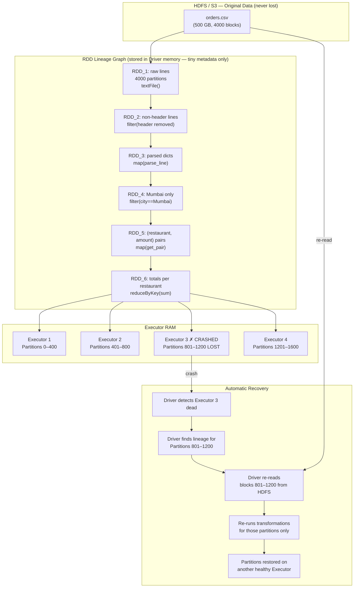

# Phase 1 · Topic 3 — RDD: Partitions, Immutability & Lineage

> **The original Spark data structure. The foundation everything else is built on.**
> Understanding RDDs is understanding HOW Spark thinks about data and fault tolerance.

---

## Why This Exists

When Spark was created at UC Berkeley in 2012, its designers had one core question:

*"How do we keep data in RAM across many machines AND still recover if a machine dies — without copying all the data to multiple places?"*

Copying data everywhere (like HDFS replication) wastes 3x storage and 3x RAM. That defeats the purpose of fast in-memory processing.

Their answer was the **RDD** — a data structure with three specific properties that solve this problem elegantly. Understanding those three properties is the entire goal of this topic.

---

## What Is an RDD?

RDD stands for **Resilient Distributed Dataset**.

Let's break each word:

| Word | Meaning |
|------|---------|
| **Resilient** | Fault-tolerant — can rebuild itself if any piece is lost |
| **Distributed** | Spread across many machines in the cluster |
| **Dataset** | A collection of data records (any type — text, numbers, tuples, Python objects) |

An RDD is the most fundamental data structure in Spark. It is a collection of data that:
- Is split into many pieces (partitions) spread across Executors
- Cannot be modified after creation (immutable)
- Knows exactly how it was created (lineage)

These three properties together make RDDs powerful. Let's understand each one.

---

## Property 1 — Partitions: The Unit of Parallelism

### What Is a Partition?

An RDD is never one big blob of data sitting on one machine. It is always divided into **partitions** — smaller pieces of data, each living on a different Executor.

Think of a 5 TB orders file. Spark doesn't load it as one giant 5 TB object. It splits it into tens of thousands of partitions (each ~128 MB), distributed across all Executors in the cluster.

```
5 TB orders.csv  →  RDD
                     ├── Partition 0  (128 MB) → Executor 1
                     ├── Partition 1  (128 MB) → Executor 2
                     ├── Partition 2  (128 MB) → Executor 3
                     ├── Partition 3  (128 MB) → Executor 4
                     ...
                     └── Partition 39,999 (128 MB) → Executor 47
```

### Why Partitions Matter

**One partition = one Task.** Each Task processes exactly one partition. Tasks run in parallel across Executors.

- 40,000 partitions = 40,000 Tasks
- 100 Executors × 8 cores = 800 Tasks in parallel at once
- 40,000 ÷ 800 = 50 waves of parallel execution

More partitions = more parallelism = faster job (up to cluster capacity).

### How Many Partitions?

When you read a file from HDFS, Spark creates one partition per HDFS block (128 MB) by default:

```python
rdd = sc.textFile("hdfs:///data/orders.csv")
print(rdd.getNumPartitions())  # e.g., 39,000 for a 5 TB file
```

When you create from a Python list, Spark uses a default based on your cluster:

```python
rdd = sc.parallelize([1, 2, 3, 4, 5, 6, 7, 8, 9, 10])
print(rdd.getNumPartitions())  # e.g., 8 on an 8-core local machine
```

You can control partitions explicitly:

```python
# At creation time
rdd = sc.textFile("hdfs:///data/orders.csv", minPartitions=200)
rdd = sc.parallelize(data, numSlices=50)  # 50 partitions

# After creation
rdd_100 = rdd.repartition(100)   # reshuffle to exactly 100 partitions
rdd_50  = rdd.coalesce(50)        # reduce to 50 (no full shuffle, efficient)
```

You will learn when and why to use repartition vs coalesce in Topic 8.

---

## Property 2 — Immutability: RDDs Cannot Be Changed

### What Immutability Means

Once an RDD is created, **it cannot be changed**. You cannot add rows, delete rows, or modify values in place.

Instead, every transformation you apply produces a **brand new RDD**. The original RDD still exists (conceptually) — it was not modified.

```python
numbers = sc.parallelize([1, 2, 3, 4, 5, 6, 7, 8, 9, 10])

# This does NOT change 'numbers' — it creates a new RDD called 'squared'
squared = numbers.map(lambda x: x * x)

# 'numbers' is still [1, 2, 3, 4, 5, 6, 7, 8, 9, 10]
# 'squared' is a new RDD: [1, 4, 9, 16, 25, 36, 49, 64, 81, 100]
```

### Why Immutability Is a Good Design

**Reason 1 — No race conditions:**
In a distributed system, hundreds of Executors run in parallel. If an RDD could be modified, two Executors might try to modify the same partition simultaneously — creating unpredictable, corrupted data. Immutability makes this impossible. No shared mutable state = no race conditions.

**Reason 2 — Enables lineage (fault tolerance):**
If data can be modified in place, there is no clear record of what the data "was" before. But if every transformation creates a new, immutable RDD, Spark has a perfect chain of "this came from that." This chain is called the **lineage** — and it is what makes fault tolerance possible without data replication. (More on this in Property 3.)

**Reason 3 — Predictability:**
Functional programming insight: when functions take an input and produce an output without side effects, they are easy to test, debug, and reason about. If `map(lambda x: x*2)` on RDD_A produces RDD_B, you always get the same RDD_B given the same RDD_A. No surprises.

### The Immutability Chain

Every Spark job is a chain of immutable transformations:

```python
# Each line creates a new RDD from the previous one
rdd1 = sc.textFile("orders.csv")                        # RDD 1: raw lines
rdd2 = rdd1.filter(lambda line: "Mumbai" in line)       # RDD 2: Mumbai lines
rdd3 = rdd2.map(lambda line: line.split(","))           # RDD 3: split lists
rdd4 = rdd3.map(lambda parts: (parts[2], float(parts[4])))  # RDD 4: (restaurant, amount)
rdd5 = rdd4.reduceByKey(lambda a, b: a + b)            # RDD 5: totals per restaurant

# rdd1, rdd2, rdd3, rdd4 — all still "exist" (as lineage graph nodes)
# none were modified
```

---

## Property 3 — Lineage: The Fault Tolerance Superpower

### What Is Lineage?

Lineage is Spark's record of **how each RDD was created from its parent(s)**.

When you create a chain of transformations, Spark doesn't just produce a result. It remembers the full transformation history — the complete recipe for how to recreate any RDD from scratch.

```
textFile("orders.csv")      ← SOURCE (reads from disk)
        ↓
filter(city == "Mumbai")    ← RDD_2 came from RDD_1 via filter
        ↓
map(parse_line)             ← RDD_3 came from RDD_2 via map
        ↓
map(get_restaurant)         ← RDD_4 came from RDD_3 via map
        ↓
reduceByKey(sum)            ← RDD_5 came from RDD_4 via reduceByKey
```

This chain is called the **lineage graph** — also known as the **DAG (Directed Acyclic Graph)**. You will explore the full DAG in Topic 7.

### How Lineage Enables Fault Tolerance

Now here is the magic.

Your cluster is processing a 5 TB file. 40,000 partitions. Half an hour into the job, Executor 7 crashes. It was working on Partitions 500–508 of RDD_4.

**Without lineage (the old way — like MapReduce):**
You'd need copies of the intermediate data stored on disk. When the machine dies, read the backup from disk.

**With lineage (Spark's way):**
Spark looks at the lineage graph for RDD_4, Partition 505. It knows:
- Partition 505 of RDD_4 came from Partition 505 of RDD_3 via `.map(get_restaurant)`
- Partition 505 of RDD_3 came from Partition 505 of RDD_2 via `.map(parse_line)`
- Partition 505 of RDD_2 came from Partition 505 of RDD_1 via `.filter(city == "Mumbai")`
- Partition 505 of RDD_1 came from Block 505 of the original file on HDFS

So Spark:
1. Re-reads Block 505 from HDFS (data is still there — HDFS replicates file data)
2. Runs filter on it → re-creates Partition 505 of RDD_2
3. Runs map → re-creates Partition 505 of RDD_3
4. Runs map → re-creates Partition 505 of RDD_4

Only Partition 505 is recomputed. The other 39,999 partitions continue unaffected.

**Zero data replication needed. Zero data loss. Automatic recovery.**

This is what "Resilient" in RDD means. Not resilient because the data is copied. Resilient because the recipe to recreate it is always available.

### Recipe Card Analogy

Think of lineage like a recipe card for a dish.

- The recipe card is the **lineage**
- The ingredients are the **original file on HDFS/S3**
- The cooked dish is the **RDD in RAM**

If the dish falls on the floor (Executor crashes, RDD partition lost):
- You don't need a backup dish stored in the fridge (no data replication)
- You just re-read the recipe card and cook the dish again from the same ingredients (lineage recompute)

The recipe card is cheap to store (just metadata). Storing a backup dish (data replication) costs 3x more storage and RAM.

---

## Creating RDDs — The Code

### Method 1: From a Python Collection

```python
# Simple list → RDD
numbers = sc.parallelize([1, 2, 3, 4, 5, 6, 7, 8, 9, 10])

# Specify number of partitions
numbers = sc.parallelize([1, 2, 3, 4, 5, 6, 7, 8, 9, 10], numSlices=4)

# List of tuples (key-value pairs — common in RDD operations)
orders = sc.parallelize([
    ("Mumbai", 1200.0),
    ("Delhi", 850.0),
    ("Bangalore", 2100.0),
    ("Mumbai", 950.0),
])
```

### Method 2: From a File

```python
# Text file — each line becomes one element in the RDD
orders_rdd = sc.textFile("hdfs:///data/orders.csv")
orders_rdd = sc.textFile("s3://my-bucket/data/orders.csv")
orders_rdd = sc.textFile("s3://my-bucket/data/*.csv")  # glob pattern — all CSV files

# Set minimum partitions (useful for small files that would otherwise get 1 partition)
orders_rdd = sc.textFile("hdfs:///data/orders.csv", minPartitions=100)
```

### Method 3: From Transformations on Another RDD

```python
# Every transformation creates a new RDD
raw = sc.textFile("orders.csv")           # RDD of strings
lines = raw.filter(lambda x: len(x) > 0) # RDD of non-empty strings
pairs = lines.map(lambda x: x.split(",")) # RDD of lists
```

---

## Common RDD Operations

### Transformations (create new RDD, lazy — don't run yet)

```python
rdd = sc.parallelize([1, 2, 3, 4, 5, 6, 7, 8, 9, 10])

# map: apply function to every element
squared = rdd.map(lambda x: x * x)
# Result: [1, 4, 9, 16, 25, 36, 49, 64, 81, 100]

# filter: keep only elements where function returns True
evens = rdd.filter(lambda x: x % 2 == 0)
# Result: [2, 4, 6, 8, 10]

# flatMap: map that can return 0 or many elements per input
words = sc.parallelize(["hello world", "spark is fast"])
word_list = words.flatMap(lambda sentence: sentence.split(" "))
# Result: ["hello", "world", "spark", "is", "fast"]

# distinct: remove duplicates
cities = sc.parallelize(["Mumbai", "Delhi", "Mumbai", "Bangalore", "Delhi"])
unique_cities = cities.distinct()
# Result: ["Mumbai", "Delhi", "Bangalore"]

# union: combine two RDDs
rdd1 = sc.parallelize([1, 2, 3])
rdd2 = sc.parallelize([3, 4, 5])
combined = rdd1.union(rdd2)
# Result: [1, 2, 3, 3, 4, 5]  ← note: union keeps duplicates

# reduceByKey: for (key, value) RDDs — combine values with same key
city_amounts = sc.parallelize([("Mumbai", 1200), ("Delhi", 850), ("Mumbai", 950), ("Delhi", 600)])
totals = city_amounts.reduceByKey(lambda a, b: a + b)
# Result: [("Mumbai", 2150), ("Delhi", 1450)]
```

### Actions (trigger execution, return result to Driver)

```python
rdd = sc.parallelize([1, 2, 3, 4, 5])

# count: how many elements
n = rdd.count()
# Result: 5  — integer returned to Driver

# collect: bring ALL elements to Driver as Python list
all_data = rdd.collect()
# Result: [1, 2, 3, 4, 5]  — ⚠️ NEVER on large RDDs

# take: bring first N elements to Driver (safer than collect)
first_3 = rdd.take(3)
# Result: [1, 2, 3]

# first: bring first element
first = rdd.first()
# Result: 1

# reduce: combine all elements with a function
total = rdd.reduce(lambda a, b: a + b)
# Result: 15  — integer returned to Driver

# saveAsTextFile: write RDD to disk (one file per partition)
rdd.saveAsTextFile("hdfs:///output/results/")
```

---

## A Real Swiggy Example — Full RDD Pipeline

You need to find the top 5 restaurants by total order value in Mumbai, from a 500 GB orders CSV file.

```python
from pyspark import SparkContext

sc = SparkContext.getOrCreate()

# Step 1: Load file — creates RDD of raw text lines
# Each line: "order_id,city,restaurant_name,order_amount,status"
raw_lines = sc.textFile("hdfs:///data/swiggy_orders.csv")
# Partition count: ~4,000 (500 GB ÷ 128 MB)

# Step 2: Remove header line
header = raw_lines.first()
data = raw_lines.filter(lambda line: line != header)

# Step 3: Parse each line into structured data
def parse_line(line):
    parts = line.split(",")
    return {
        "order_id":   parts[0],
        "city":       parts[1],
        "restaurant": parts[2],
        "amount":     float(parts[3]),
        "status":     parts[4]
    }

parsed = data.map(parse_line)

# Step 4: Keep only Mumbai, completed orders
mumbai_orders = parsed.filter(
    lambda x: x["city"] == "Mumbai" and x["status"] == "completed"
)

# Step 5: Extract (restaurant_name, amount) pairs
restaurant_pairs = mumbai_orders.map(
    lambda x: (x["restaurant"], x["amount"])
)

# Step 6: Sum total amount per restaurant
totals = restaurant_pairs.reduceByKey(lambda a, b: a + b)

# Step 7: Sort by revenue descending
sorted_totals = totals.sortBy(lambda x: x[1], ascending=False)

# Step 8: Take top 5 — ACTION triggers all computation
top_5 = sorted_totals.take(5)
# NOW Steps 1–7 actually execute, in parallel across 4,000 partitions

print(top_5)
# [('Bade Miya', 4721350.0), ('Khane Ka Adda', 3890120.0), ...]
```

Note that steps 1–7 are all transformations — Spark builds the lineage graph but doesn't execute anything. Step 8 (`.take(5)`) is the Action that triggers execution. This is **lazy evaluation** — the full topic is next.

---

## RDD vs DataFrame: What You Actually Use in 2026

RDDs were Spark's original API. DataFrames (and Datasets in Scala) were added later and are **almost always better** for structured data.

| Feature | RDD | DataFrame |
|---------|-----|-----------|
| Structure | No schema — raw elements (strings, Python objects) | Has schema — columns with types |
| Optimization | No automatic optimization | Catalyst optimizer rewrites your code for efficiency |
| Performance | Slower for structured data | 2–10x faster for same operation |
| Type safety | Python type errors only at runtime | Catches type mismatches earlier |
| When to use | Unstructured data, custom Python objects, legacy code | Almost everything — structured data, SQL, analytics |
| Verbosity | More code needed | Less code, more readable |

```python
# RDD — parse manually, verbose
result = rdd.map(lambda line: line.split(",")) \
            .filter(lambda x: x[1] == "Mumbai") \
            .map(lambda x: (x[2], float(x[3]))) \
            .reduceByKey(lambda a, b: a + b)

# DataFrame — same logic, much cleaner
df = spark.read.csv("orders.csv", header=True, inferSchema=True)
result = df.filter(df.city == "Mumbai") \
           .groupBy("restaurant") \
           .sum("amount")
```

**In 2026 production code, you will almost always use DataFrames.** You will rarely write raw RDD code. But understanding RDDs is not optional — because:

1. DataFrames are built on top of RDDs internally
2. The Spark UI shows RDD-level operation details
3. RDD concepts (partitions, lineage, immutability, lazy eval) are the foundation of everything
4. Some complex operations still require dropping to RDD level
5. Job interviews will ask you how Spark works internally — and the answer involves RDDs

---

## Diagram — RDD Lineage and Partition Recovery



---

## Revision

### RDD = Resilient Distributed Dataset

RDD is Spark's original data structure. "Resilient" means fault-tolerant — it can rebuild itself without data replication. "Distributed" means it is split into partitions spread across many Executors. "Dataset" means it is a collection of data records — strings, numbers, tuples, Python objects, anything. Every other Spark data structure (DataFrame, Dataset) is built on top of RDDs.

### Partitions Are the Unit of Parallelism

An RDD is always split into partitions. One partition = one Task = one Executor core working on it. More partitions = more Tasks = more parallelism. The default partition size when reading a file is one HDFS block (128 MB). For a 5 TB file, that's ~40,000 partitions and 40,000 Tasks that can run in parallel. This is why Spark is fast — not one machine doing everything, but thousands of Tasks doing small pieces simultaneously.

### Immutability Means No In-Place Changes — Ever

You cannot modify an RDD after it is created. Every transformation (map, filter, flatMap, reduceByKey) creates a brand new RDD from the previous one. The original stays intact. This is not a limitation — it is a design choice that prevents race conditions in distributed code and enables lineage-based fault tolerance. If data could be changed in place, Spark would have no reliable way to rebuild it if a machine crashed.

### Lineage Is the Fault Tolerance Mechanism

Spark records exactly how every RDD was created — which transformation, from which parent. This full chain of transformations is the lineage. When an Executor crashes and its partitions are lost, Spark reads the lineage to find out how to recreate just those partitions. It re-reads the relevant blocks from the original file and replays the transformations. No backup copies of intermediate data needed. This is cheaper (saves RAM and storage) and more flexible than replication.

### RDD API Is the Foundation — DataFrame API Is What You Use

In production 2026 Spark code, you use DataFrames, not raw RDDs. DataFrames have schema, get automatically optimized by Catalyst, and require less code. But DataFrames are built on RDDs internally. Understanding partitions (why parallelism works), immutability (why transformations are always safe), and lineage (how fault tolerance works) is mandatory — because these concepts apply to DataFrames too. They are just hidden one layer below the surface you see every day.

---

## Practice Questions

### 🟢 Easy

**E1. What do the three words in "Resilient Distributed Dataset" each mean? Explain in simple terms.**

<details>
<summary>▶ Answer</summary>

**Resilient:** Fault-tolerant. If any part of an RDD is lost (because an Executor crashed), Spark can rebuild that part automatically using the lineage — the record of how it was created. No backup copies needed.

**Distributed:** Split across many machines. An RDD is never one big chunk on one machine. It is divided into partitions, each living on a different Executor in the cluster. This is what enables parallel processing.

**Dataset:** A collection of data records. The records can be any type — text strings, numbers, Python tuples, dictionaries, custom objects. RDD makes no assumption about the structure of your data.

</details>

---

**E2. What is a partition? Why does the number of partitions matter for performance?**

<details>
<summary>▶ Answer</summary>

A partition is one chunk of an RDD's data that lives on one Executor. When Spark reads a 5 TB file, it doesn't load it as one giant object. It splits it into tens of thousands of partitions (each ~128 MB) spread across all Executors.

**Why it matters for performance:**
- One partition = one Task
- Tasks run in parallel, one per Executor core
- More partitions = more Tasks = more parallelism = faster job

If your 5 TB file produces 40,000 partitions and you have 800 available cores (100 Executors × 8 cores), then 800 Tasks run at the same time. The whole file gets processed in about 50 parallel waves.

If the file had only 10 partitions, only 10 Tasks would ever run in parallel, leaving 790 cores idle — 98% of your cluster wasted.

</details>

---

**E3. What does "immutable" mean for an RDD? Does calling `.filter()` on an RDD change it?**

<details>
<summary>▶ Answer</summary>

Immutable means an RDD cannot be changed after it is created. No adding rows, no deleting rows, no modifying values in place.

Calling `.filter()` does NOT change the original RDD. It creates a **brand new RDD** containing only the filtered elements. The original RDD still exists exactly as it was.

```python
cities = sc.parallelize(["Mumbai", "Delhi", "Mumbai", "Bangalore"])

# filter creates a NEW RDD — 'cities' is unchanged
delhi_only = cities.filter(lambda x: x == "Delhi")

# cities still has: ["Mumbai", "Delhi", "Mumbai", "Bangalore"]
# delhi_only has: ["Delhi"]
```

Every transformation in Spark (map, filter, flatMap, reduceByKey, etc.) follows this rule — original RDD unchanged, new RDD created.

</details>

---

### 🟡 Medium

**M1. Your Spark job is processing a 1 TB file with 8,000 partitions. Executor 12 crashes halfway through. It held Partitions 700–715. Walk through exactly what Spark does to recover.**

<details>
<summary>▶ Answer</summary>

1. **Detection:** Driver stops receiving heartbeats from Executor 12. After ~60 seconds timeout, Driver marks it as dead.

2. **Identify lost partitions:** Driver knows Executor 12 was holding Partitions 700–715 of various RDDs. Those 16 partitions are now lost from RAM.

3. **Lineage lookup:** Driver checks the lineage graph. For each lost partition, it traces back:
   - Which transformation produced it?
   - From which parent RDD's partition?
   - All the way back to the original source (HDFS/S3 file — never lost, always on disk with replication)

4. **Re-schedule Tasks:** Driver creates 16 new Tasks (one per lost partition) and sends them to healthy Executors that have free slots.

5. **Re-execute transformations:** Those Executors re-read the relevant blocks from HDFS (Blocks 700–715) and re-run all transformations in the lineage chain for those partitions.

6. **Job continues:** The other 7,984 partitions were never affected. The whole job continues — just those 16 Tasks re-run.

**No data replication was needed. No backup copies of intermediate data. Just replay from source + lineage.**

</details>

---

**M2. What is the difference between `.map()` and `.flatMap()`? Give a real example where flatMap is the right choice and map would give the wrong result.**

<details>
<summary>▶ Answer</summary>

**`.map(f)`:** Applies `f` to each element. One input → exactly one output. Output RDD has the same number of elements as the input.

**`.flatMap(f)`:** Applies `f` to each element, then flattens the result. One input → zero or more outputs. Output RDD can have a different number of elements.

**Real example — word count from Swiggy restaurant reviews:**

```python
reviews = sc.parallelize([
    "great food nice service",
    "fast delivery excellent taste",
    "average food okay service"
])

# Using map — WRONG:
result = reviews.map(lambda x: x.split(" "))
# Result: [["great", "food", "nice", "service"],
#          ["fast", "delivery", "excellent", "taste"],
#          ["average", "food", "okay", "service"]]
# 3 elements — each element is a LIST, not individual words
# You can't count word frequencies from this

# Using flatMap — CORRECT:
result = reviews.flatMap(lambda x: x.split(" "))
# Result: ["great", "food", "nice", "service",
#          "fast", "delivery", "excellent", "taste",
#          "average", "food", "okay", "service"]
# 12 elements — individual words, ready for word count
```

**Rule:** If your function returns a list/iterable and you want each item in that list to be a separate RDD element → use `flatMap`. If your function returns a single value → use `map`.

</details>

---

**M3. You have a (restaurant, revenue) RDD with 10 million rows. You need total revenue per restaurant. Why is `reduceByKey` much better than `groupByKey` + sum for this?**

<details>
<summary>▶ Answer</summary>

Both give the correct answer. But `reduceByKey` is dramatically faster for large data.

**`groupByKey` approach:**
```python
# groupByKey: first collects ALL values for each key on one Executor, then applies function
totals = restaurant_pairs.groupByKey().mapValues(sum)
```

What happens: For "McDonald's" with 500,000 order amounts — ALL 500,000 floats are shuffled to ONE Executor. That Executor must hold all 500,000 values in memory simultaneously before summing.

**`reduceByKey` approach:**
```python
# reduceByKey: reduces BEFORE shuffling (map-side combine)
totals = restaurant_pairs.reduceByKey(lambda a, b: a + b)
```

What happens: On each Executor, values for the same key are partially summed FIRST. Executor 1 might have 50,000 McDonald's orders — it sums them to one number (e.g., 2,400,000.0). Then only ONE number per key per Executor crosses the network in the shuffle.

**Impact:**
- `groupByKey` shuffles: 10M floats across the network (10M × 8 bytes = 80 MB per key if popular key)
- `reduceByKey` shuffles: 1 partial sum per key per Executor (tiny — maybe 100 numbers per key total)

At scale, this can be the difference between a job completing in 5 minutes vs. running out of memory and failing.

**Rule:** When you need to aggregate values for a key, always prefer `reduceByKey`, `aggregateByKey`, or `combineByKey` over `groupByKey`. They reduce data before the shuffle.

</details>

---

**M4. RDDs are described as "lazy." You write this code:**

```python
rdd1 = sc.textFile("hdfs:///data/orders.csv")
rdd2 = rdd1.filter(lambda x: "Mumbai" in x)
rdd3 = rdd2.map(lambda x: x.split(","))
print("Done building pipeline")
```

**After the `print` statement, how much data has been read from HDFS? What would you add to actually trigger computation?**

<details>
<summary>▶ Answer</summary>

**After the `print` — zero bytes have been read from HDFS.** No computation has happened at all.

`textFile()`, `filter()`, and `map()` are all **Transformations** — they don't execute. They just tell Spark "here is what I want to do." Spark builds the lineage graph in memory (tiny metadata) but doesn't touch the file.

The `print("Done building pipeline")` just proves the Python statements ran — not that Spark processed any data.

**To trigger actual computation, add an Action:**

```python
# Action: count elements — triggers all 3 transformations
count = rdd3.count()
print(f"Mumbai orders: {count}")  # NOW computation runs

# Or: take a sample
sample = rdd3.take(5)

# Or: save to disk
rdd3.saveAsTextFile("hdfs:///output/mumbai_orders/")
```

As soon as `.count()`, `.take()`, `.collect()`, or `.saveAsTextFile()` is called, Spark:
1. Takes the lineage graph (rdd1 → rdd2 → rdd3)
2. Optimizes the execution plan
3. Creates Tasks (one per partition)
4. Sends Tasks to Executors
5. Executors read HDFS blocks, run filter and map, return results

**This "lazy" design is intentional** — it lets Spark optimize the full pipeline before running. You'll learn all the benefits in the next topic (Transformations vs Actions & Lazy Evaluation).

</details>

---

### 🔴 Hard

**H1. Two scenarios: (A) You cache RDD_3 midway through a 10-step lineage. Executor with cached data crashes. (B) You don't cache anything. Executor crashes. How does recovery differ between the two?**

<details>
<summary>▶ Answer</summary>

**Scenario B (no cache):**
Executor crashes. Driver traces lineage all the way back to the source file (HDFS). Re-reads original file blocks. Re-runs ALL 10 transformations to recover the lost partitions. If each step takes 30 seconds: 300 seconds of recomputation.

**Scenario A (cached at step 3):**
Executor crashes. The cache for RDD_3 is also lost (it was in that Executor's RAM).

- Driver traces lineage back to the last reliable checkpoint — the cache at RDD_3.
- Wait — the cache IS lost. So Spark traces back further... to the original file.
- Re-reads original file blocks. Re-runs steps 1–3 to recreate RDD_3.
- Then re-runs steps 4–10 from there.

**The result is the same — full recomputation from source.**

**Why?** Because the cache is stored in Executor RAM — which is exactly what was lost. Caching helps performance (avoids re-running transformations on subsequent Actions), but it does NOT improve fault tolerance on its own. If you want genuine fault tolerance checkpointing that survives Executor death, you need `rdd.checkpoint()` — which writes to disk (HDFS/S3) and breaks the lineage at that point.

```python
sc.setCheckpointDir("hdfs:///checkpoints/")
rdd3.checkpoint()  # Writes RDD_3 to HDFS — survives Executor crashes
rdd3.count()  # Action needed to trigger checkpoint write
```

After checkpointing, if Executor crashes while computing later steps: Spark re-reads from the HDFS checkpoint instead of going all the way back to the source file.

**Rule:** Cache = performance optimization (RAM). Checkpoint = fault tolerance (disk).

</details>

---

**H2. An RDD with 1,000 partitions has a 10-step lineage. Partition 500 fails and must be recomputed. Explain why this could trigger a cascade of recomputations — and when it DOESN'T cascade.**

<details>
<summary>▶ Answer</summary>

Whether recomputation cascades depends on the type of transformation in the lineage — specifically whether it is a **narrow** or **wide** transformation.

**Narrow transformation (no shuffle — no cascade):**
Operations like `map`, `filter`, `flatMap` — each output partition depends on exactly ONE input partition. Partition 500 of RDD_5 depends only on Partition 500 of RDD_4. To recover Partition 500 of the final RDD, Spark re-runs the chain on Partition 500 only. Only one partition's worth of data is re-read from source. No other partitions affected.

**Wide transformation (shuffle — potential cascade):**
Operations like `reduceByKey`, `groupByKey`, `join`, `sortBy` — output partitions depend on data from MANY input partitions (because data was redistributed by key).

Example: After a `reduceByKey`:
- Partition 500 of the output holds keys whose hash maps to reducer 500
- Those keys were in partitions 0, 7, 23, 156, 499, 501, 788, ... before the shuffle
- To recompute output Partition 500, Spark needs to re-read ALL those input partitions

In the worst case (a wide transformation at step 3 in a 10-step chain), recovering one lost output partition could require re-reading ALL source partitions.

**This is why**:
1. Wide transformations are expensive — they are "stage boundaries" in Spark's DAG
2. Checkpointing after expensive wide transformations (groupBy, join) breaks the recomputation chain
3. Minimizing shuffles is one of the core performance principles you'll learn in Phase 4

You will learn narrow vs wide transformations in full detail in Topic 5.

</details>

---

**H3. RDDs store their data in JVM objects (Java/Scala objects in the JVM heap). DataFrames use Tungsten's off-heap binary format. Why does this make DataFrames faster than RDDs even for the same transformation — and what does it have to do with garbage collection?**

<details>
<summary>▶ Answer</summary>

This is one of the key reasons DataFrames exist and why they outperform RDDs for structured data.

**RDD storage — JVM objects on heap:**

When you have an RDD of Python dicts (or Java objects in Scala), each record is a full JVM object:
- An object header (~16 bytes overhead)
- Each field as a separate JVM object (a Java String for city name takes 40+ bytes for a 6-char string)
- Object reference pointers in the JVM heap

A CSV row like `"Mumbai,McDonald's,1200.00"` becomes many interconnected JVM objects — bloated, pointer-heavy, non-contiguous in memory. A single "row" might occupy 300–400 bytes in the JVM heap for 30 bytes of actual data.

**The garbage collection problem:**
JVM heap objects are managed by the Garbage Collector (GC). When RAM fills up with millions of bloated objects, the GC runs to free up space — and it can PAUSE the entire JVM for seconds or even minutes during a full GC cycle. A 5-second GC pause on every Executor in a cluster of 100 = chaos. Spark job progress stops completely during GC pauses.

**DataFrame (Tungsten) storage — off-heap binary:**

DataFrames use Tungsten, which stores data in a compact binary format OUTSIDE the JVM heap (off-heap memory, directly managed by Spark — no GC):
- Fixed-width columns stored contiguously
- Strings stored as raw bytes with length prefix
- No JVM object overhead
- CPU cache-friendly (sequential memory access)

The same row `"Mumbai,McDonald's,1200.00"` in Tungsten binary: ~30 bytes. No GC ever touches it.

**The result:**
- 5–10x less memory per record
- No GC pauses → consistent, predictable performance
- CPU cache hits (sequential memory = SIMD instructions work)
- Catalyst can push computations down into the binary format (vectorized execution)

**This is why DataFrames are faster even for the "same" transformation** — they process compact binary data with no GC overhead vs. bloated JVM objects with frequent GC pauses.

Understanding this helps you know when to avoid `.rdd` conversion in production code — every time you call `df.rdd`, you materialize all rows as JVM objects, lose Tungsten's binary format, and expose yourself to GC pressure.

</details>

---

*Next: [Topic 4 — Transformations vs Actions & Lazy Evaluation](../topic-4-transformations-actions-lazy-eval/)*
