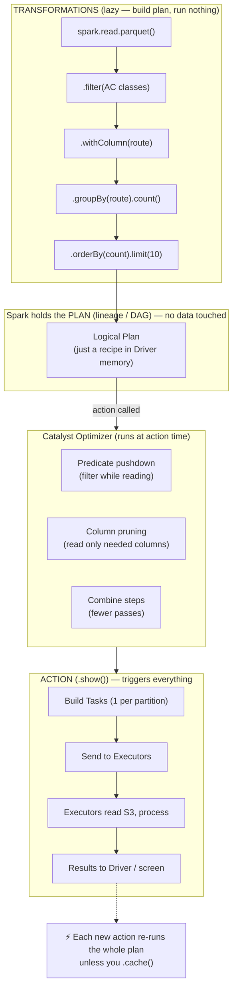

# Phase 1 · Topic 3b — Transformations vs Actions & Lazy Evaluation

> **The single most important behavior to understand about Spark.**
> If you don't get this, Spark will surprise you constantly. If you do get it, Spark becomes predictable.

---

## Why This Exists

New Spark users write code like this and get confused:

```python
df = spark.read.csv("orders.csv")     # takes 0.1 seconds — feels instant
df2 = df.filter(df.city == "Mumbai")  # takes 0.1 seconds — instant again
df3 = df2.groupBy("restaurant").sum() # instant again!
df3.show()                            # suddenly takes 4 minutes
```

"Why did `show()` take 4 minutes when everything before it was instant?"

The answer is **lazy evaluation** — the core behavior of Spark. The first three lines didn't actually do anything. They only built a *plan*. The `show()` is what actually ran the whole plan.

Understanding exactly which operations are "build a plan" (Transformations) vs "run the plan" (Actions) is the goal of this topic. Once you understand this, Spark stops surprising you.

---

## Two Types of Operations — That's It

Every operation you can do in Spark falls into exactly one of two categories:

| Type | What It Does | Runs Immediately? | Returns |
|------|-------------|-------------------|---------|
| **Transformation** | Describes a new dataset from an existing one | ❌ No — lazy | A new RDD/DataFrame |
| **Action** | Triggers computation, produces a result | ✅ Yes — runs everything | A value to Driver, or writes to storage |

The rule is simple:
- **Transformations are lazy.** They build a plan. Nothing runs.
- **Actions are eager.** They execute the whole plan built so far.

---

## 1. Transformations — Building the Plan

A transformation takes a DataFrame (or RDD) and describes a NEW one. It does **not** run. It just adds a step to the plan.

### Common Transformations

```python
df.select("city", "amount")           # pick columns
df.filter(df.amount > 1000)           # keep matching rows
df.where(df.city == "Mumbai")         # same as filter
df.withColumn("tax", df.amount * 0.18) # add a column
df.groupBy("city")                    # group (returns grouped object)
df.orderBy("amount")                  # sort
df.distinct()                         # remove duplicates
df.drop("unused_column")              # remove a column
df.join(other_df, "city")             # join two DataFrames
df.union(other_df)                    # stack two DataFrames
df.limit(100)                         # keep first 100 rows
```

Every single one of these returns a new DataFrame and runs **nothing**. You can chain 50 of them and Spark still hasn't touched your data.

```python
# This entire chain runs ZERO computation
result = (
    spark.read.csv("orders.csv", header=True)
    .filter(df.city == "Mumbai")
    .withColumn("tax", df.amount * 0.18)
    .groupBy("restaurant")
    .sum("amount")
    .orderBy("sum(amount)", ascending=False)
    .limit(10)
)
# Nothing has executed yet. 'result' is just a recipe.
```

---

## 2. Actions — Running the Plan

An action says: "OK, now actually compute everything and give me a result."

The moment you call an action, Spark takes the entire plan you built with transformations, optimizes it, breaks it into Tasks, sends them to Executors, and runs them.

### Common Actions

```python
df.show()              # display first 20 rows (runs the plan)
df.show(50)            # display first 50 rows
df.count()             # count all rows — returns a number
df.collect()           # bring ALL rows to Driver — ⚠️ dangerous on big data
df.take(5)             # bring first 5 rows to Driver
df.first()             # bring first row
df.head(10)            # bring first 10 rows
df.write.parquet(...)  # write output to storage
df.foreach(func)       # run a function on each row
df.toPandas()          # convert to pandas DataFrame — ⚠️ brings all to Driver
```

### The Key Difference in Practice

```python
df2 = df.filter(df.amount > 1000)   # Transformation — instant, nothing runs

df2.count()                          # Action — NOW it reads data, filters, counts
df2.show()                           # Action — runs the WHOLE plan AGAIN
```

Notice something important: **each action runs the plan from scratch.** `count()` ran it once. `show()` ran it again — re-reading the file, re-filtering. Spark does not remember results between actions unless you explicitly `cache()` (Topic on Cache & Persist).

---

## 3. How to Tell Them Apart — The Mental Test

Ask yourself: **"Does this operation need to produce a final answer, or just describe a new dataset?"**

- **Returns another DataFrame/RDD** → Transformation (lazy)
- **Returns a number, a list, rows to your screen, or writes a file** → Action (runs everything)

| Operation | Returns | Type |
|-----------|---------|------|
| `.filter()` | DataFrame | Transformation |
| `.select()` | DataFrame | Transformation |
| `.groupBy().sum()` | DataFrame | Transformation |
| `.count()` | a number (int) | **Action** |
| `.show()` | nothing (prints) | **Action** |
| `.collect()` | a Python list | **Action** |
| `.write.parquet()` | nothing (writes file) | **Action** |

If it gives you back something you can keep chaining `.something()` on as a DataFrame → it's a transformation. If it gives you a final value, prints, or saves → it's an action.

---

## 4. Lazy Evaluation — Why Spark Waits

This "build a plan, run it only at the action" behavior is called **lazy evaluation**. It is not laziness for the sake of being lazy — it is a powerful optimization strategy.

### Why Lazy Is Brilliant — 4 Real Benefits

**Benefit 1 — Spark optimizes the WHOLE pipeline before running.**

Because Spark sees all your transformations before running anything, it can rearrange them for efficiency.

```python
df = spark.read.csv("orders.csv")     # 500 GB file
df2 = df.select("city", "amount", "restaurant", "status", "order_id")  # all columns
df3 = df2.filter(df.city == "Mumbai")  # only Mumbai
df4 = df3.select("restaurant", "amount")  # only 2 columns
df4.show()
```

A naive system would: read all 500 GB → select 5 columns → filter Mumbai → select 2 columns.

Spark's optimizer (Catalyst) sees the whole plan and rewrites it:
- **Predicate pushdown:** Apply the Mumbai filter while READING the file — never load non-Mumbai rows
- **Column pruning:** Only read `restaurant`, `amount`, `city` columns from disk — skip the rest

Result: instead of reading 500 GB, Spark might read only 20 GB. **25x less I/O — for free, automatically.** This is only possible because Spark waited and saw the whole plan.

**Benefit 2 — Avoids wasted work.**

```python
df2 = df.filter(df.amount > 1000)
df3 = df2.withColumn("big_tax", df2.amount * 0.30)
# ... 20 more transformations ...
df_final.take(5)   # only need 5 rows
```

Because you only asked for 5 rows (`take(5)`), Spark doesn't process the whole 500 GB. It processes just enough partitions to produce 5 rows, then stops. An eager system would have computed everything.

**Benefit 3 — Fewer passes over the data.**

Spark can combine multiple transformations into a single pass. `filter` + `map` + `withColumn` on the same data don't require three separate scans — Spark fuses them into one scan (called "whole-stage code generation" — Phase 2 topic).

**Benefit 4 — Better fault tolerance.**

The plan IS the lineage. Because Spark holds the full transformation plan, it knows exactly how to recompute any lost partition (as you learned in the RDD topic).

---

## 5. The Gotcha — Lazy Evaluation Surprises

Lazy evaluation is great, but it confuses beginners. Here are the classic traps.

### Gotcha 1 — Errors appear "late"

```python
df = spark.read.csv("orders.csv")
df2 = df.filter(df.nonexistent_column > 5)   # bug here — but NO error yet!
print("Still running fine...")               # this prints!
df2.show()                                    # ERROR finally thrown HERE
```

The bad column reference doesn't error where you wrote it. It errors at the action — because that's when Spark actually analyzes and runs the plan. This makes debugging confusing until you understand lazy eval. (Note: some errors are caught earlier during analysis, but the *execution* errors surface at the action.)

### Gotcha 2 — The same work runs multiple times

```python
df2 = df.filter(df.city == "Mumbai")   # expensive: reads 500 GB

count = df2.count()    # Action 1 — reads 500 GB, filters
df2.show()             # Action 2 — reads 500 GB AGAIN, filters AGAIN
total = df2.agg(...)   # Action 3 — reads 500 GB a THIRD time
```

Three actions = three full reads of 500 GB. Spark does NOT cache automatically. If you use a DataFrame in multiple actions, you should `cache()` it:

```python
df2 = df.filter(df.city == "Mumbai").cache()   # cache after first computation
df2.count()    # reads 500 GB once, stores result in RAM
df2.show()     # reads from RAM — fast
df2.agg(...)   # reads from RAM — fast
```

(Full caching detail in the Cache & Persist topic.)

### Gotcha 3 — `count()` to "check progress" is expensive

Beginners scatter `print(df.count())` everywhere to "see how many rows so far." Each `count()` is a full action that runs the entire upstream plan. In a pipeline, this can multiply your runtime several times. Use `count()` deliberately, not as a debugging reflex.

---

## 6. See the Plan Without Running It — `.explain()`

You can ask Spark to SHOW you the plan it built — without running it. This is how you verify optimizations like predicate pushdown happened.

```python
df = spark.read.parquet("orders.parquet")
result = df.filter(df.city == "Mumbai").select("restaurant", "amount")

result.explain()   # prints the plan — does NOT run it (explain is special)
```

Output (simplified):
```
== Physical Plan ==
*(1) Project [restaurant, amount]
+- *(1) Filter (city = Mumbai)
   +- FileScan parquet [restaurant, amount, city]
        PushedFilters: [EqualTo(city, Mumbai)]    ← filter pushed to file read!
        ReadSchema: struct<restaurant, amount, city>  ← only 3 columns read!
```

The `PushedFilters` line proves Spark will filter while reading. The `ReadSchema` proves column pruning. You'll read `.explain()` output constantly in Phase 4.

---

## 7. A Real IRCTC Example — Watching Lazy Eval

You analyze IRCTC booking data — find top 10 routes by bookings, for AC classes only, from a 2 TB file.

```python
# ===== TRANSFORMATIONS — building the plan, nothing runs =====
bookings = spark.read.parquet("s3://irctc/bookings/")   # lazy
ac_only = bookings.filter(bookings.coach_class.isin("1A", "2A", "3A"))  # lazy
routes = ac_only.withColumn("route", 
    concat_ws("-", bookings.source, bookings.destination))  # lazy
grouped = routes.groupBy("route").count()               # lazy
top_routes = grouped.orderBy("count", ascending=False).limit(10)  # lazy

print("Plan built. Zero data read so far.")   # this prints instantly

# Let's inspect the plan without running it
top_routes.explain()   # shows predicate pushdown + column pruning

# ===== ACTION — NOW everything runs =====
top_routes.show()   # Spark reads 2 TB, but thanks to pushdown only reads
                    # AC bookings + needed columns → maybe 300 GB actually read
```

Everything before `.show()` was instant — just plan-building. The `.show()` triggered the full distributed computation. Because Spark saw the whole plan, it pushed the AC filter into the Parquet read and only pulled the columns it needed.

---

## Diagram — Lazy Evaluation Flow



---

## Revision

### Two Operation Types — Transformations and Actions

Every Spark operation is either a transformation or an action. A transformation describes a new dataset from an existing one and returns a new DataFrame/RDD — it runs nothing. An action triggers actual computation and returns a final result (a number, a list, printed rows) or writes to storage. The simple test: if the operation returns something you can keep chaining `.filter().select()` on, it's a transformation; if it returns a value, prints, or saves a file, it's an action.

### Lazy Evaluation — Spark Waits Until the Action

Spark does not run transformations when you write them. It collects them into a plan (the lineage/DAG) and runs nothing. Only when you call an action does Spark execute the entire plan built so far. This is why `read`, `filter`, and `groupBy` feel instant while `show()` suddenly takes minutes — the `show()` is what actually ran everything. The transformations were just building the recipe.

### Why Lazy Is Powerful

Because Spark sees the whole plan before running, it optimizes it. Predicate pushdown applies filters while reading the file (read 20 GB instead of 500 GB). Column pruning reads only needed columns. Multiple transformations fuse into a single pass over the data. And if you only asked for 5 rows via `take(5)`, Spark processes just enough to produce them and stops. An eager system that runs each line immediately cannot do any of these — it has already committed to the work.

### The Gotchas

Lazy evaluation surprises beginners three ways. First, errors surface at the action, not where you wrote the buggy transformation. Second, Spark does not cache automatically — every action re-runs the entire upstream plan from scratch, so using one DataFrame in three actions means three full reads unless you `cache()`. Third, scattering `count()` calls to "check progress" is expensive because each one is a full action that re-runs everything upstream.

### Inspect Without Running — explain()

`.explain()` prints the execution plan Spark built without running it. You use it to verify that optimizations like predicate pushdown (`PushedFilters` in the output) and column pruning (`ReadSchema` showing fewer columns) actually happened. Reading `.explain()` output is a core Phase 4 performance skill — it tells you what Spark will really do before you pay to run it.

---

## Practice Questions

### 🟢 Easy

**E1. What is the difference between a transformation and an action? Give two examples of each.**

<details>
<summary>▶ Answer</summary>

**Transformation:** Describes a new dataset from an existing one. Lazy — runs nothing. Returns a new DataFrame/RDD.
Examples: `.filter()`, `.select()`, `.groupBy()`, `.withColumn()`, `.join()`

**Action:** Triggers actual computation. Runs the whole plan built so far. Returns a final value, prints, or writes a file.
Examples: `.count()`, `.show()`, `.collect()`, `.take()`, `.write.parquet()`

**The test:** If it returns a DataFrame you can keep chaining on → transformation. If it returns a number/list/prints/saves → action.

</details>

---

**E2. This code runs instantly with no errors. Then `.show()` takes 3 minutes. Why?**

```python
df = spark.read.parquet("big_file.parquet")
df2 = df.filter(df.amount > 5000)
df3 = df2.groupBy("city").count()
df3.show()
```

<details>
<summary>▶ Answer</summary>

Because of **lazy evaluation**.

The first three lines (`read`, `filter`, `groupBy().count()`) are all **transformations**. They don't run — they only build a plan. That's why they're instant.

`.show()` is an **action**. It triggers Spark to actually execute the entire plan: read the file, filter rows, group by city, count, and display results. All the real work — reading the big file and processing it across the cluster — happens at `.show()`. That's why it takes 3 minutes.

The work didn't disappear in the first three lines — it was just deferred until the action.

</details>

---

**E3. Which of these are actions and which are transformations? `.select()`, `.count()`, `.withColumn()`, `.collect()`, `.orderBy()`, `.write.csv()`**

<details>
<summary>▶ Answer</summary>

| Operation | Type | Why |
|-----------|------|-----|
| `.select()` | Transformation | Returns a new DataFrame |
| `.count()` | **Action** | Returns a number |
| `.withColumn()` | Transformation | Returns a new DataFrame |
| `.collect()` | **Action** | Returns a Python list of all rows |
| `.orderBy()` | Transformation | Returns a new DataFrame |
| `.write.csv()` | **Action** | Writes a file to storage |

**Pattern:** select, withColumn, orderBy all return DataFrames → transformations. count, collect, write produce a final result → actions.

</details>

---

### 🟡 Medium

**M1. This code reads a 1 TB file three times instead of once. Find the problem and fix it.**

```python
df = spark.read.parquet("s3://data/1tb_orders/")
mumbai = df.filter(df.city == "Mumbai")

print("Count:", mumbai.count())
mumbai.show(20)
mumbai.write.parquet("s3://output/mumbai/")
```

<details>
<summary>▶ Answer</summary>

**The problem:** `mumbai` is used in three actions — `.count()`, `.show(20)`, and `.write.parquet()`. Because Spark is lazy and does NOT cache automatically, each action re-runs the entire upstream plan from scratch. That means the 1 TB file is read and filtered **three separate times**.

**The fix:** Cache `mumbai` after its first computation so the result stays in RAM for the next actions.

```python
df = spark.read.parquet("s3://data/1tb_orders/")
mumbai = df.filter(df.city == "Mumbai").cache()   # ← add cache

print("Count:", mumbai.count())      # reads 1 TB once, stores filtered result in RAM
mumbai.show(20)                       # reads from RAM — fast
mumbai.write.parquet("s3://output/mumbai/")  # reads from RAM — fast
```

**One nuance:** the very first action (`count()`) is what actually triggers the read AND populates the cache. After that, `show()` and `write` use the cached data. So 1 read instead of 3.

**Even better** if you only needed the write: skip count/show in production, or compute the count from the cached data. Caching pays off precisely because the DataFrame is reused across multiple actions.

</details>

---

**M2. Explain "predicate pushdown" and "column pruning." How does lazy evaluation make them possible?**

<details>
<summary>▶ Answer</summary>

**Predicate pushdown:** Spark applies your filter WHILE reading the file, not after. If you filter `city == "Mumbai"`, Spark pushes that condition down to the file reader (especially Parquet, which stores min/max stats per chunk). Non-Mumbai data is never loaded into memory at all.

**Column pruning:** Spark reads only the columns you actually use. If your file has 50 columns but your query only touches `city`, `restaurant`, `amount`, Spark reads just those 3 columns from disk and skips the other 47 (Parquet is columnar, so it can do this physically).

**How lazy evaluation enables both:**

Because Spark is lazy, it sees your ENTIRE query before running anything:

```python
df = spark.read.parquet("orders.parquet")  # 50 columns, 500 GB
df.filter(df.city == "Mumbai").select("restaurant", "amount").show()
```

When `.show()` triggers execution, Spark already knows:
- "The user only wants `restaurant`, `amount` (and `city` for filtering)" → prune other 47 columns
- "The user only wants Mumbai" → push that filter into the read

If Spark were eager (ran each line immediately), it would have already read all 50 columns and all 500 GB at `spark.read` — before it ever knew about the filter and select. Lazy evaluation is what gives Spark the foresight to optimize. Reading 500 GB can become reading 15 GB — automatically.

</details>

---

**M3. A junior DE puts `print(df.count())` after every transformation to "monitor progress" in a 15-step pipeline. The job is 8x slower than expected. Explain why.**

<details>
<summary>▶ Answer</summary>

Each `df.count()` is an **action**. Every action triggers Spark to execute the entire plan built up to that point — from the original file read forward.

In a 15-step pipeline with a `count()` after each step:
- `count()` after step 1 → runs steps 1
- `count()` after step 2 → runs steps 1–2 (from scratch — no automatic caching)
- `count()` after step 3 → runs steps 1–3 (from scratch)
- ...
- `count()` after step 15 → runs steps 1–15

Total work = 1 + 2 + 3 + ... + 15 = **120 step-executions** instead of the 15 the pipeline actually needs. The file gets read 15 times. The early transformations run 15 times.

This is why it's ~8x slower (the exact multiple depends on where the expensive steps sit).

**Fix:**
- Remove the `count()` calls — they aren't needed for the pipeline logic
- If progress monitoring is truly needed, use the **Spark UI** (jobs/stages tab) to watch progress instead of forcing actions
- If you must inspect intermediate data, `cache()` that DataFrame first so the count reads from RAM

**Lesson:** Actions are not free probes. Each one re-runs the upstream plan. Use them deliberately.

</details>

---

**M4. Does `.cache()` count as a transformation or an action? What actually happens when you call it?**

<details>
<summary>▶ Answer</summary>

`.cache()` is a **transformation** — it is lazy. Calling `.cache()` does NOT immediately store anything in memory.

What `.cache()` does: it **marks** the DataFrame as "should be cached." It tells Spark "the next time you compute this, keep the result in RAM."

The actual caching happens at the **next action**:

```python
df2 = df.filter(df.amount > 1000).cache()   # marks for caching — nothing stored yet

df2.count()   # ACTION — NOW Spark computes df2 AND stores it in RAM
df2.show()    # reads from the cached RAM copy — fast
```

So the sequence is:
1. `.cache()` → marks the DataFrame (lazy, instant, nothing cached)
2. First action after cache → computes the data AND populates the cache
3. Subsequent actions → read from cache (fast)

**Common mistake:** People call `.cache()` and expect instant caching, then are surprised the first action is still slow. The first action is slow because that's when the cache actually gets filled. Every action after that is fast.

A related method `.persist()` works the same way but lets you choose the storage level (memory, disk, both). Full detail in the Cache & Persist topic.

</details>

---

### 🔴 Hard

**H1. `df.write.parquet(...)` is an action. But you have a pipeline that writes to 3 different outputs from the same source DataFrame. Without caching, how many times is the source read? With caching? Show the code for both.**

<details>
<summary>▶ Answer</summary>

**Without caching — source read 3 times:**

```python
source = spark.read.parquet("s3://data/orders/")  # transformation (lazy)
cleaned = source.filter(source.status == "completed")  # transformation (lazy)

# Each write is a separate action → each re-runs the full plan from source
cleaned.filter(cleaned.city == "Mumbai").write.parquet("s3://out/mumbai/")    # read #1
cleaned.filter(cleaned.city == "Delhi").write.parquet("s3://out/delhi/")      # read #2
cleaned.filter(cleaned.city == "Bangalore").write.parquet("s3://out/blr/")    # read #3
```

The `cleaned` DataFrame (read + filter completed) is recomputed for every write. Source read 3 times.

**With caching — source read 1 time:**

```python
source = spark.read.parquet("s3://data/orders/")
cleaned = source.filter(source.status == "completed").cache()  # mark for cache

cleaned.count()   # ACTION — reads source once, fills cache with cleaned data

# All three writes now read from the cached 'cleaned' in RAM
cleaned.filter(cleaned.city == "Mumbai").write.parquet("s3://out/mumbai/")
cleaned.filter(cleaned.city == "Delhi").write.parquet("s3://out/delhi/")
cleaned.filter(cleaned.city == "Bangalore").write.parquet("s3://out/blr/")
```

Source read once (during `count()`), cached in RAM, then all three writes read from cache.

**The nuance about that `count()`:** You need one action to trigger the cache population before the writes benefit. Without it, the first write would fill the cache (and still read source once) and only writes 2 and 3 would benefit — so even without the explicit `count()`, you'd read source roughly once, not three times, because the first write populates the cache. But adding `count()` makes the caching intent explicit and guarantees the cache is warm before all writes.

**Production reality:** If the cached data is too big for RAM, use `.persist(StorageLevel.MEMORY_AND_DISK)` so it spills to disk instead of recomputing. Covered in Cache & Persist topic.

</details>

---

**H2. You run `df.explain()` and see `PushedFilters: []` (empty) even though your code has a `.filter()`. The filter is NOT being pushed down. Give two reasons this can happen and why it matters.**

<details>
<summary>▶ Answer</summary>

`PushedFilters: []` means Spark could not push your filter into the file scan — so it reads ALL the data, then filters in memory afterward. This is much slower than pushdown. Two common reasons:

**Reason 1 — The file format doesn't support pushdown.**
Predicate pushdown works great with **Parquet**, ORC, and Delta (columnar formats with embedded statistics). It does NOT work well with raw **CSV** or **JSON** — those are row-based text with no per-column statistics, so Spark must read the whole file regardless.

```python
# CSV — no pushdown possible, reads entire file
df = spark.read.csv("orders.csv").filter(...)  # PushedFilters: []

# Parquet — pushdown works
df = spark.read.parquet("orders.parquet").filter(...)  # PushedFilters: [EqualTo(...)]
```

Fix: convert raw data to Parquet/Delta early in your pipeline.

**Reason 2 — The filter uses a non-pushable expression.**
Filters on a UDF, a complex function, or a derived column cannot be pushed down because the file reader doesn't know how to evaluate them at scan time.

```python
# Pushable — simple column comparison
df.filter(df.amount > 1000)   # pushes down

# NOT pushable — UDF can't be evaluated during scan
df.filter(my_python_udf(df.amount) > 1000)   # PushedFilters: []

# NOT pushable — filter on a column computed AFTER read
df.withColumn("tax", df.amount * 0.18).filter(df.tax > 100)  # tax doesn't exist in file
```

Fix: filter on raw file columns with simple comparisons BEFORE adding computed columns or applying UDFs.

**Why it matters:** Without pushdown on a 2 TB file, Spark reads all 2 TB into the cluster, THEN filters — wasting massive I/O and network. With pushdown, it might read 100 GB. On large data this is the difference between a 5-minute job and a 2-hour job. Checking `PushedFilters` in `.explain()` is a standard performance audit step.

</details>

---

**H3. Lazy evaluation means transformations don't run until an action. But `spark.read.csv("file.csv", inferSchema=True)` seems to read the file immediately (it figures out column types before any action). Is this a violation of lazy evaluation? Explain what's really happening.**

<details>
<summary>▶ Answer</summary>

This is a sharp observation — and the answer reveals an important subtlety.

**Yes, `inferSchema=True` does trigger an actual read — and it is technically an exception to pure lazy evaluation.**

Here's what's happening: to infer the schema (figure out that `amount` is a double, `order_id` is an integer, etc.), Spark must actually look at the data. There's no way to know the types without reading rows. So `inferSchema=True` launches a **separate, eager job** that scans the file (or a sample of it) to determine column types — BEFORE you call any action on the DataFrame.

You can even see this in the Spark UI: a job appears the moment you call `spark.read.csv(..., inferSchema=True)`, before any `.show()` or `.count()`.

**Why this is "allowed":**
The schema is **metadata about the DataFrame's structure** — Spark needs it to build any plan at all. A DataFrame without a known schema can't be planned (Spark wouldn't know what columns exist or their types). So schema inference is a necessary upfront cost, separate from the lazy data-processing pipeline.

**The deeper point — schema inference is expensive and you should usually avoid it:**

```python
# Eager schema scan — reads file/sample just to infer types (extra job)
df = spark.read.csv("orders.csv", header=True, inferSchema=True)

# No eager scan — you provide the schema, Spark trusts it (truly lazy)
from pyspark.sql.types import StructType, StructField, StringType, DoubleType, IntegerType

schema = StructType([
    StructField("order_id", IntegerType()),
    StructField("city", StringType()),
    StructField("amount", DoubleType()),
])
df = spark.read.csv("orders.csv", header=True, schema=schema)  # no extra read
```

Providing an explicit schema:
1. Avoids the eager inference scan (faster, especially on huge files)
2. Prevents wrong type guesses (inferSchema sometimes guesses string when you wanted double)
3. Is the production best practice — always define schemas explicitly

**Other operations that break pure laziness similarly:** Some pivot operations and certain ML operations also peek at data eagerly because they need to know distinct values or statistics to build the plan. These are pragmatic exceptions — the *bulk* data processing stays lazy; only small metadata-gathering steps run eagerly.

</details>

---

*Next: [Topic 3c — Narrow vs Wide Transformations](../topic-3c-narrow-vs-wide-transformations/)*
