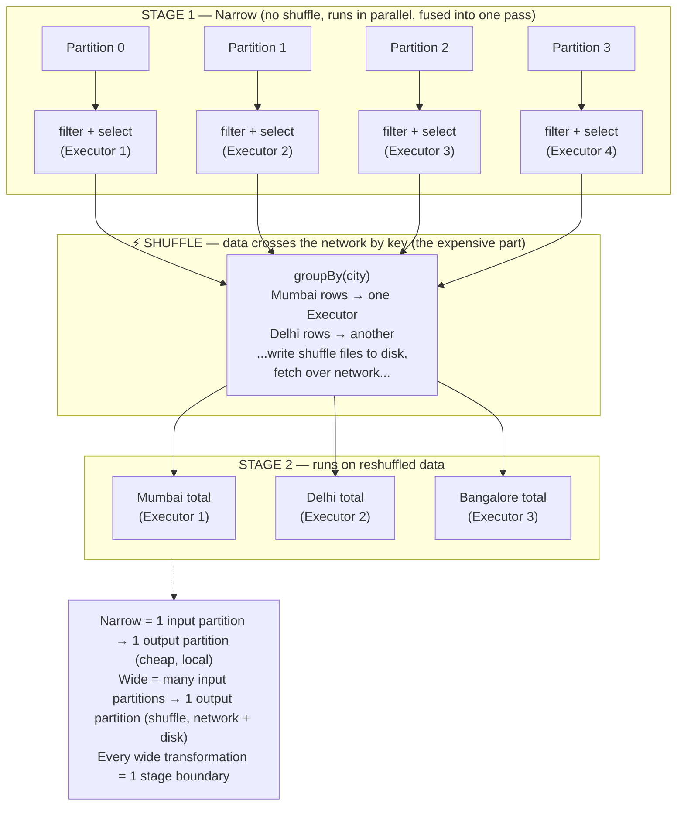

# Phase 1 · Topic 3c — Narrow vs Wide Transformations

> **The single distinction that decides whether your Spark job is fast or slow.**
> Every transformation is either narrow or wide. Wide ones cost 100x more. Knowing which is which is the foundation of all Spark performance.

---

## Why This Exists

You now know transformations are lazy and build a plan. But not all transformations are equal. Some are cheap. Some are extremely expensive.

The difference comes down to one question:

**"To compute one output partition, does Spark need data from ONE input partition, or from MANY input partitions?"**

- If one output partition needs only one input partition → **narrow** → cheap, fast, stays on the same machine
- If one output partition needs data from many input partitions → **wide** → expensive, requires moving data across the network (a "shuffle")

This single distinction explains why `filter` runs in seconds but `groupBy` on the same data takes minutes. It explains where your job spends 90% of its time. It is the most important performance concept in all of Spark.

---

## The Core Idea — Dependencies Between Partitions

Remember: an RDD/DataFrame is split into partitions, each on a different Executor. When you apply a transformation, Spark creates new partitions from old partitions. The question is: **which old partitions feed each new partition?**

### Narrow Dependency

Each output partition depends on **exactly one** input partition. Data never moves between machines.

```
Input partitions          Output partitions
   Partition 0   ───────►   Partition 0     (1 → 1)
   Partition 1   ───────►   Partition 1     (1 → 1)
   Partition 2   ───────►   Partition 2     (1 → 1)
   Partition 3   ───────►   Partition 3     (1 → 1)
```

Each Executor processes its own partition independently. No communication with other Executors. This is fast.

### Wide Dependency

Each output partition depends on **many** input partitions. Data must be moved across the network so that related records end up together. This movement is the **shuffle**.

```
Input partitions               Output partitions
   Partition 0  ──┐ ┌────────►   Partition 0   (Mumbai data)
   Partition 1  ──┼─┼────────►   Partition 1   (Delhi data)
   Partition 2  ──┼─┼────────►   Partition 2   (Bangalore data)
   Partition 3  ──┘ └────────►   Partition 3   (Chennai data)
        (every input feeds every output — data crosses the network)
```

To group all "Mumbai" rows together, Spark must take Mumbai rows from EVERY input partition and send them all to one output partition. That requires every machine to send data to every other machine. This is expensive.

---

## Why the Difference Matters So Much

### Narrow — Cheap

- **No network movement.** Each Executor works on data it already holds in its own RAM.
- **No waiting.** All Executors run independently and in parallel.
- **Easy recovery.** If a partition is lost, recompute it from its single parent — no other partitions involved.
- **Pipelined.** Multiple narrow transformations fuse into one pass over the data (e.g., `filter` + `map` + `withColumn` run together in a single scan).

### Wide — Expensive

- **Network movement.** Data is serialized, sent over the network, deserialized on the receiving Executor. Network is far slower than RAM.
- **Disk writes.** Shuffle data is written to local disk first (shuffle files), then fetched. Disk is slow.
- **Synchronization barrier.** ALL input partitions must finish their part before ANY output partition can be built. The whole cluster waits for the slowest one.
- **Memory pressure.** Receiving Executors must hold incoming data — can cause spilling or OOM.
- **Hard recovery.** If a shuffled partition is lost, recovery may require re-reading many parent partitions (as you saw in the RDD topic).

A rough mental model: a wide transformation can be **10x to 100x more expensive** than a narrow one on the same data, because it involves the network and disk, not just RAM.

---

## The Lists — Memorize These

### Narrow Transformations (no shuffle, cheap)

| Operation | What It Does |
|-----------|-------------|
| `map()` | Transform each row independently |
| `filter()` / `where()` | Keep rows matching a condition |
| `flatMap()` | Map that can produce 0+ rows per input |
| `select()` | Pick columns |
| `withColumn()` | Add/modify a column |
| `drop()` | Remove a column |
| `union()` | Stack two DataFrames (just concatenates partitions) |
| `sample()` | Take a random sample |
| `mapPartitions()` | Transform each partition as a whole |

**Common thread:** each row (or each partition) is processed independently. No row needs to "find" related rows elsewhere.

### Wide Transformations (shuffle, expensive)

| Operation | What It Does | Why It Shuffles |
|-----------|-------------|-----------------|
| `groupBy()` / `groupByKey()` | Group rows by key | All rows with same key must meet on one Executor |
| `reduceByKey()` | Aggregate values per key | Same key's values must be combined together |
| `join()` | Combine two DataFrames on a key | Matching keys from both sides must meet |
| `distinct()` | Remove duplicates | Must compare rows across all partitions |
| `orderBy()` / `sort()` | Sort all data | Global ordering requires redistributing data |
| `repartition()` | Change partition count | Redistributes all data across new partitions |
| `intersection()` | Common rows of two DataFrames | Must compare across partitions |
| Window functions with `partitionBy` | Per-group calculations | Rows of each window-group must meet |

**Common thread:** the operation needs to bring related rows together — by key, by sort order, or by comparing everything. That "bringing together" is the shuffle.

---

## How to Recognize Wide vs Narrow Yourself

Ask: **"Does this operation need a row to interact with OTHER rows that might be on different machines?"**

- `filter(amount > 1000)` — each row decides on its own. No other rows needed. → **Narrow**
- `groupBy("city").sum()` — to sum Mumbai's amounts, you need ALL Mumbai rows together, which are scattered across machines. → **Wide**
- `withColumn("tax", amount * 0.18)` — each row computes its own tax. → **Narrow**
- `join(orders, customers, "customer_id")` — to match a customer, you need rows from both tables with the same id, scattered everywhere. → **Wide**
- `orderBy("amount")` — to sort globally, the smallest values must move to the first partition, largest to the last. Data must be redistributed. → **Wide**

If a row's output depends only on itself → narrow. If it depends on finding other rows → wide.

---

## Wide Transformations Create Stage Boundaries

This is the bridge to the next topics. When Spark builds its execution plan (the DAG), it splits the work into **stages**. The boundary between stages is **exactly** at each wide transformation (shuffle).

```python
df = spark.read.parquet("orders.parquet")   # 
df2 = df.filter(df.amount > 100)             # narrow ─┐
df3 = df2.withColumn("tax", df.amount*0.18)  # narrow ─┤ STAGE 1 (all narrow, fused)
df4 = df3.select("city", "tax")              # narrow ─┘
                                             # ───── SHUFFLE BOUNDARY ─────
df5 = df4.groupBy("city").sum("tax")         # WIDE  ─┐ STAGE 2
df5.show()                                   # action
```

- **Stage 1:** all the narrow transformations (filter, withColumn, select) — they run together in one pass, each Executor on its own partition.
- **Shuffle:** at the `groupBy`, data is reshuffled by city across the network.
- **Stage 2:** the aggregation runs on the reshuffled data.

The number of wide transformations in your job ≈ the number of shuffle boundaries ≈ the number of stages. **Fewer shuffles = fewer stages = faster job.** This is the core principle behind almost all Spark performance tuning. You'll see the full DAG → Stages → Tasks breakdown in the next topic.

---

## The Performance Lesson — Minimize Shuffles

Because wide transformations are so expensive, good Spark engineers structure their code to minimize shuffles. Some real techniques (full detail in Phase 4):

**1. Filter BEFORE you shuffle, not after.**
```python
# BAD — shuffle all 500 GB, then throw most away
df.groupBy("city").sum("amount").filter("city = 'Mumbai'")

# GOOD — filter to Mumbai first (narrow), then shuffle only Mumbai data
df.filter("city = 'Mumbai'").groupBy("city").sum("amount")
```

**2. Use `reduceByKey` over `groupByKey`** (reduces data before the shuffle — you saw this in the RDD topic).

**3. Use broadcast joins for small tables** — avoids shuffling the big table entirely (Phase 3/4 topic).

**4. Avoid unnecessary `repartition()`, `distinct()`, `orderBy()`** — each one is a full shuffle. Only use them when truly needed.

**5. Chain narrow transformations freely** — they're cheap and get fused into one pass. The cost is the wide ones.

---

## A Real Zomato Example — Counting Stages

You analyze Zomato data: for completed orders above ₹200, find total revenue per city, sorted high to low.

```python
orders = spark.read.parquet("s3://zomato/orders/")  # read

# ----- STAGE 1: all narrow, one pass over data -----
completed = orders.filter(orders.status == "completed")   # narrow
big = completed.filter(orders.amount > 200)               # narrow
trimmed = big.select("city", "amount")                    # narrow

# ----- SHUFFLE 1 → STAGE 2 -----
totals = trimmed.groupBy("city").sum("amount")            # WIDE (shuffle by city)

# ----- SHUFFLE 2 → STAGE 3 -----
ranked = totals.orderBy("sum(amount)", ascending=False)   # WIDE (shuffle for sort)

ranked.show()   # action triggers all 3 stages
```

**Stage count: 3.** Two wide transformations (`groupBy`, `orderBy`) = two shuffles = three stages.

In the Spark UI, you would see this job split into exactly 3 stages. The two shuffle boundaries are where Spark writes shuffle files to disk and moves data across the network. If this job is slow, those two shuffles are where to look first.

Could we reduce it? The `groupBy` is necessary (we need per-city totals). The `orderBy` is necessary (we want it sorted). Both shuffles are justified here. But note we correctly did all filtering FIRST (narrow, Stage 1) so the shuffles move as little data as possible.

---

## Diagram — Narrow vs Wide & Stage Boundaries



---

## Revision

### Narrow vs Wide — The One Distinction

Every transformation is either narrow or wide. Narrow means each output partition depends on exactly one input partition — the work stays on the same Executor, no data moves. Wide means each output partition depends on many input partitions — data must move across the network so related rows meet. This single difference is the biggest factor in Spark performance, because moving data over the network and disk is 10–100x slower than processing data already in an Executor's RAM.

### Narrow Transformations Are Cheap

map, filter, select, withColumn, drop, union, flatMap — these are all narrow. Each row (or each partition) is processed independently. No row needs to find related rows elsewhere. Narrow transformations run in parallel with no communication between Executors, recover easily from failure (just one parent partition), and fuse together into a single pass over the data. Chain as many as you like — they're cheap.

### Wide Transformations Are Expensive — They Shuffle

groupBy, reduceByKey, join, distinct, orderBy, repartition — these are wide. They need to bring related rows together (by key, by sort order, or by comparing everything), which requires a shuffle: data is serialized, written to local disk as shuffle files, sent across the network, and read by receiving Executors. The whole cluster synchronizes at a shuffle — all input partitions must finish before any output partition starts. This is where slow jobs spend most of their time.

### Wide Transformations Create Stage Boundaries

Spark splits a job into stages, and the boundary between stages is exactly each wide transformation (shuffle). All the narrow transformations between two shuffles run together in one stage, one pass over the data. The number of shuffles ≈ the number of stages. Fewer shuffles = fewer stages = faster job. This is the foundation of the DAG → Jobs → Stages → Tasks breakdown you'll learn next.

### The Performance Rule — Minimize and Shrink Shuffles

Because shuffles dominate cost, the core tuning principle is: minimize the number of shuffles, and shrink the data each shuffle moves. Filter before grouping (so the shuffle carries less data). Prefer reduceByKey over groupByKey (reduces before shuffling). Use broadcast joins for small tables (avoids shuffling the big one). Avoid needless repartition, distinct, and orderBy. Chain narrow transformations freely — the cost is always in the wide ones.

---

## Practice Questions

### 🟢 Easy

**E1. In simple words, what is the difference between a narrow and a wide transformation?**

<details>
<summary>▶ Answer</summary>

**Narrow transformation:** Each output partition is built from exactly ONE input partition. The data stays on the same Executor — nothing moves across the network. Cheap and fast. Examples: `map`, `filter`, `select`, `withColumn`.

**Wide transformation:** Each output partition is built from MANY input partitions. Data must move across the network so related rows (same key, or sorted order) end up together. This movement is the **shuffle** — expensive and slow. Examples: `groupBy`, `join`, `orderBy`, `distinct`.

**Simple test:** If a row can be processed alone → narrow. If a row needs to find other rows (possibly on other machines) → wide.

</details>

---

**E2. Label each as narrow or wide: `filter()`, `groupBy()`, `withColumn()`, `join()`, `select()`, `orderBy()`.**

<details>
<summary>▶ Answer</summary>

| Operation | Type | Why |
|-----------|------|-----|
| `filter()` | **Narrow** | Each row decides on its own — no other rows needed |
| `groupBy()` | **Wide** | All rows with same key must meet on one Executor |
| `withColumn()` | **Narrow** | Each row computes its own new value |
| `join()` | **Wide** | Matching keys from both tables must meet |
| `select()` | **Narrow** | Just picks columns, row by row |
| `orderBy()` | **Wide** | Global sort requires redistributing data across partitions |

**Pattern:** filter, withColumn, select all process rows independently → narrow. groupBy, join, orderBy all need rows to "find each other" → wide.

</details>

---

**E3. Why is a wide transformation slower than a narrow one? Name two reasons.**

<details>
<summary>▶ Answer</summary>

A wide transformation is slower because of the **shuffle** — moving data across the cluster. Two key reasons:

1. **Network movement:** Data is serialized, sent over the network to other Executors, and deserialized. The network is far slower than reading data already in an Executor's RAM (which is what narrow transformations do).

2. **Disk writes:** Before sending, Spark writes shuffle data to local disk (shuffle files). Disk is much slower than RAM. The receiving Executors then read these files over the network.

Other valid reasons:
- **Synchronization barrier:** all input partitions must finish before any output partition can start — the cluster waits for the slowest one.
- **Memory pressure:** receiving Executors must hold incoming data, which can cause spilling or out-of-memory errors.

A narrow transformation has none of these — it just processes data already sitting in the Executor's RAM.

</details>

---

### 🟡 Medium

**M1. How many shuffles and how many stages does this code have? Identify each wide transformation.**

```python
df = spark.read.parquet("orders.parquet")
df2 = df.filter(df.amount > 500)
df3 = df2.groupBy("city").sum("amount")
df4 = df3.join(city_info, "city")
df5 = df4.orderBy("sum(amount)")
df5.show()
```

<details>
<summary>▶ Answer</summary>

**Wide transformations (shuffles): 3**
1. `groupBy("city").sum("amount")` — shuffle by city
2. `join(city_info, "city")` — shuffle by city to match keys
3. `orderBy("sum(amount)")` — shuffle for global sort

**Narrow transformations: 2** (`read` setup + `filter`) — these don't shuffle.

**Stages: 4**
- Stage 1: read + filter (narrow) → up to the first shuffle
- Stage 2: after groupBy shuffle
- Stage 3: after join shuffle
- Stage 4: after orderBy shuffle

Rule of thumb: number of stages ≈ number of shuffles + 1. Three shuffles → roughly four stages.

**Note on the join:** if `city_info` is small, Spark might use a **broadcast join** instead — which avoids the shuffle entirely by copying the small table to every Executor. In that case you'd have only 2 shuffles and 3 stages. You'll learn broadcast joins in Phase 3/4.

</details>

---

**M2. Rewrite this code to move LESS data through the shuffle. Explain your change.**

```python
# Original
result = df.groupBy("city").sum("amount").filter("city = 'Mumbai'")
```

<details>
<summary>▶ Answer</summary>

**Problem:** The original groups ALL cities first (a shuffle that moves the entire dataset — all cities' data crosses the network), then throws away everything except Mumbai. You shuffled 50 cities' worth of data to keep 1.

**Fix — filter BEFORE the shuffle:**

```python
result = df.filter("city = 'Mumbai'").groupBy("city").sum("amount")
```

**Why this is better:**
- `filter("city = 'Mumbai'")` is a **narrow** transformation — it runs locally on each Executor with no data movement, keeping only Mumbai rows.
- Now the `groupBy` shuffle only moves Mumbai data across the network — maybe 2% of the original data.
- The aggregation result is identical, but the expensive shuffle carries far less data.

**The principle:** Always filter (narrow, cheap) before you group/join/sort (wide, expensive). Shrink the data before it hits the shuffle. This is one of the most impactful Spark optimizations — and the Catalyst optimizer often does it automatically (predicate pushdown), but writing it correctly yourself guarantees it.

</details>

---

**M3. Your colleague says: "I'll add `.repartition(500)` before my `groupBy` to make it faster." Is repartition narrow or wide? Will this actually help?**

<details>
<summary>▶ Answer</summary>

**`repartition()` is a WIDE transformation.** It does a full shuffle — redistributing ALL data across the new number of partitions. It is NOT free.

**Will adding it before a groupBy help? Usually NO — it makes things worse:**

- The `groupBy` ALREADY does a shuffle. Adding `repartition(500)` before it means you now do **TWO shuffles** instead of one — the repartition shuffle, then the groupBy shuffle. You doubled the most expensive operation.

**When does explicit repartition actually help?**

1. **Before a wide op when data is badly skewed** — but even then, the groupBy's own shuffle handles redistribution; manual repartition rarely helps here.
2. **To increase parallelism when you have too few partitions** — e.g., after reading a few large files that produced only 4 partitions, but you have 200 cores. Here `repartition(200)` spreads work across all cores. But this is a separate concern from groupBy.
3. **Before writing output** — to control the number of output files.
4. **The right lever for groupBy partition count is `spark.sql.shuffle.partitions`**, not a manual repartition. Set that config and the groupBy shuffle produces the right number of partitions directly — no extra shuffle.

**Verdict:** Adding `repartition(500)` before `groupBy` adds a redundant shuffle. Instead, set `spark.conf.set("spark.sql.shuffle.partitions", "500")` — that controls the groupBy's output partition count with no extra shuffle.

</details>

---

**M4. Why can multiple narrow transformations in a row be "fused" into a single pass over the data, but a wide transformation cannot be fused with what comes after it?**

<details>
<summary>▶ Answer</summary>

**Narrow transformations can be fused** because each one processes a row using only that row (or its own partition). So Spark can chain them per-row:

```python
df.filter(amount > 100).withColumn("tax", amount*0.18).select("city", "tax")
```

For each row, in ONE pass, the Executor can: check `amount > 100`, then compute `tax`, then keep `city, tax` — all in a single trip through the data, on the same Executor, without writing intermediate results anywhere. This is called **whole-stage code generation** (Phase 2 topic). One scan does all three operations.

**A wide transformation cannot be fused with what follows** because it needs a complete picture before producing any output. Consider `groupBy("city").sum()`:
- To compute Mumbai's sum, the Executor needs ALL Mumbai rows.
- But Mumbai rows are scattered across every partition on every machine.
- So Spark MUST stop, shuffle all data by city across the network, and only THEN can it start summing.

The shuffle is a hard wall — a **synchronization barrier**. Everything before it must complete and be redistributed before anything after it can begin. You cannot fuse across this wall, because the operation after the shuffle depends on data that hasn't arrived yet. This is exactly why wide transformations create **stage boundaries** — a stage is the largest chunk of work Spark can pipeline without hitting a shuffle wall.

</details>

---

### 🔴 Hard

**H1. Two joins on a 1 TB orders table: (A) join with a 10 GB customers table, (B) join with a 5 MB city-codes table. Both are "wide" transformations. Should they be treated the same way? Explain.**

<details>
<summary>▶ Answer</summary>

**No — they should be treated very differently, even though both are logically "wide."**

**Join A (orders 1 TB ⋈ customers 10 GB) — true shuffle join:**
Both tables are large. Spark must shuffle BOTH by `customer_id`: all orders for customer 12345 and the customer-12345 row must land on the same Executor. This means shuffling 1 TB + 10 GB across the network. Genuinely expensive. This is a **sort-merge join** (Spark's default for two large tables) — both sides shuffled and sorted by key.

**Join B (orders 1 TB ⋈ city-codes 5 MB) — should be a broadcast join:**
The city-codes table is tiny (5 MB). Instead of shuffling 1 TB of orders, Spark can **broadcast** the 5 MB table — send a full copy to every Executor's RAM. Then each Executor joins its local orders partition against the in-memory copy. **The 1 TB table never moves.** No shuffle of the big table at all.

```python
from pyspark.sql.functions import broadcast

# Force broadcast of the small table (Spark often auto-detects this)
result = orders.join(broadcast(city_codes), "city_id")
```

**Why this matters:**
- Join A: ~1 TB shuffled → minutes to hours
- Join B as shuffle join: ~1 TB shuffled → also slow (and wasteful — pointless to shuffle 1 TB to match a 5 MB table)
- Join B as broadcast join: only 5 MB sent to each Executor → seconds, the big table stays put

**The lesson:** "Wide" is not one cost. The cost depends on what gets shuffled. Spark's `spark.sql.autoBroadcastJoinThreshold` (default 10 MB) automatically broadcasts tables below the threshold. Knowing when a wide join can become an (almost free) broadcast join is one of the highest-impact Spark skills. Full detail in the Joins topic (Phase 3) and AQE (Phase 4).

</details>

---

**H2. A job has this lineage: `read → filter → map → groupByKey → map → filter → join → orderBy`. A partition fails during the final `orderBy` stage. Explain why recovery cost depends on WHERE the narrow vs wide transformations sit in the chain.**

<details>
<summary>▶ Answer</summary>

Recovery cost depends on how far back Spark must go to rebuild the lost partition — and wide transformations (shuffles) act as both **expensive recompute points** and potential **recovery checkpoints**.

**The chain with stage boundaries marked:**
```
read → filter → map          | STAGE 1 (narrow)
   ─── shuffle (groupByKey) ───
map → filter                 | STAGE 2 (narrow)
   ─── shuffle (join) ───
                             | STAGE 3
   ─── shuffle (orderBy) ───
                             | STAGE 4 (where failure happens)
```

**What happens when an orderBy-stage partition fails:**

Spark needs to rebuild that partition. It looks at the lineage. The key insight: **shuffle outputs are written to disk (shuffle files) and persist on the Executors that produced them.** So Spark does NOT always recompute from the original file.

- If the shuffle files from the `join` stage (Stage 3 output) are still available on disk → Spark only re-runs the `orderBy` shuffle reading those existing shuffle files. **Cheap recovery** — just redo the last shuffle.

- If those shuffle files were ALSO lost (e.g., the Executor holding them died) → Spark must go back further, to the `groupByKey` shuffle files. If those are gone too → all the way back to reading the original file and replaying everything.

**Why narrow vs wide placement matters:**

- **Narrow transformations are cheap to replay** — recomputing `filter → map` on one partition is fast and touches only one parent partition.
- **Wide transformations are expensive to replay** — re-running a `groupByKey` or `join` requires re-reading MANY parent partitions (because the shuffle gathered data from everywhere). If recovery must cross a wide boundary, it can cascade into re-reading large amounts of data.

**The practical consequence:**
- A failure that only needs to replay narrow transformations → fast recovery.
- A failure that forces re-execution of an upstream wide transformation → slow recovery, possibly re-reading the whole dataset for the affected partitions.

This is exactly why, in long pipelines with multiple expensive shuffles, engineers use **`checkpoint()`** after a costly wide transformation. Checkpoint writes the data to reliable storage (HDFS/S3) and truncates the lineage — so a later failure recovers from the checkpoint instead of replaying expensive shuffles from the beginning. (Cache helps performance but, as you learned, doesn't survive Executor death; checkpoint does.)

</details>

---

**H3. Spark's Catalyst optimizer can sometimes ELIMINATE a shuffle that your code implies. Give an example where two wide operations collapse into one shuffle — and explain the concept of "partitioning awareness."**

<details>
<summary>▶ Answer</summary>

Spark tracks how data is **already partitioned** after a shuffle, and can skip a second shuffle if the data is already partitioned the right way. This is **partitioning awareness** (formally, Spark tracks each plan's `outputPartitioning`).

**Example — two wide operations, but only ONE shuffle:**

```python
df.groupBy("city").sum("amount") \
  .groupBy("city").count()
```

Naively this looks like two shuffles (two groupBys). But after the first `groupBy("city")`, the data is **already partitioned by city** — all rows for each city are already together on the same Executor. The second `groupBy("city")` needs data partitioned by city... which it already is! Spark recognizes this and **skips the second shuffle**. The second aggregation runs locally on the already-correctly-partitioned data. One shuffle, not two.

**Another classic example — join then aggregate on the same key:**

```python
orders.join(customers, "customer_id") \
      .groupBy("customer_id").sum("amount")
```

The `join` shuffles both tables by `customer_id`. After the join, the result is already partitioned by `customer_id`. The following `groupBy("customer_id")` needs exactly that partitioning — so Spark **reuses it and skips the groupBy's shuffle.** Two wide operations, one shuffle.

**The opposite — when partitioning DOESN'T match, the shuffle stays:**

```python
orders.join(customers, "customer_id") \
      .groupBy("city").sum("amount")   # different key!
```

Here the data is partitioned by `customer_id` after the join, but the `groupBy` needs it partitioned by `city`. Different keys → Spark MUST shuffle again. Two shuffles.

**Why this matters for you:**
1. **Join and aggregate on the SAME key when possible** — Spark fuses the shuffles.
2. This is also why **bucketing** (pre-partitioning data on disk by a key) can eliminate shuffles entirely for repeated joins on that key (Phase 4 topic).
3. When you read `.explain()` output, you'll see `Exchange` nodes — each `Exchange` is a shuffle. Partitioning awareness is why you sometimes see fewer `Exchange` nodes than you have wide operations in your code.

**The deeper lesson:** "every wide transformation = one shuffle" is the right mental model to start with, but Spark is smarter than that. It eliminates redundant shuffles when the data is already partitioned correctly. Structuring your keys consistently lets the optimizer collapse multiple wide operations into a single shuffle — a major performance win.

</details>

---

*Topic 3 (RDD & The Programming Model) complete ✅*
*Next: [Topic 4 — The Shuffle (Deep Dive)](../topic-4-the-shuffle-deep-dive/)*
