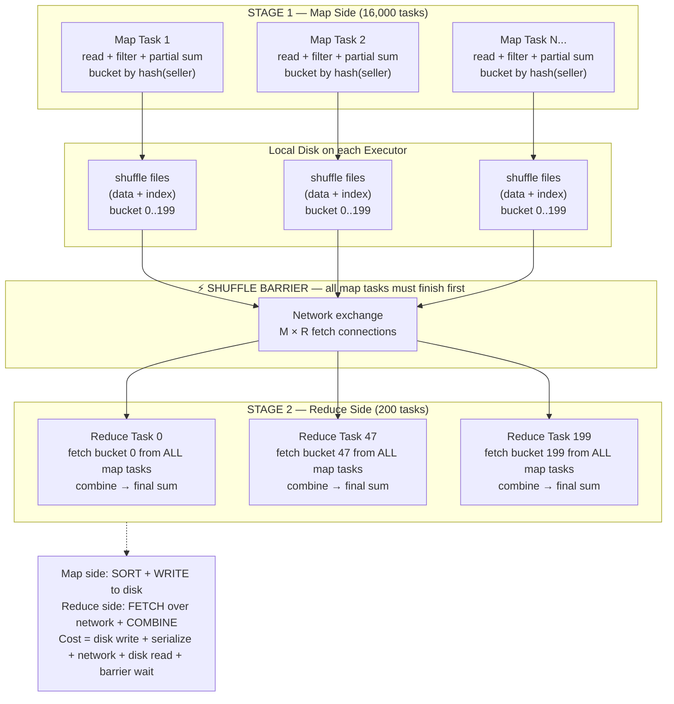

# Phase 1 · Topic 4a — The Shuffle (Deep Dive)

> **The single most expensive thing Spark ever does.**
> 90% of slow Spark jobs are slow because of the shuffle. This lesson opens it up completely.

---

## Why This Exists

In the last lesson you learned that wide transformations (groupBy, join, orderBy) trigger a **shuffle** — data moving across the network. You learned it's expensive. But you don't yet know *what actually happens* during a shuffle.

This matters enormously, because:

- The shuffle is where almost all Spark performance problems live
- Every Phase 4 tuning technique (skew handling, AQE, broadcast joins, partition sizing) exists to fix shuffle problems
- In a job interview, "explain what happens during a shuffle" is the question that separates people who *use* Spark from people who *understand* Spark

So this lesson goes under the hood. By the end you'll know exactly what Spark does, byte by byte, when you call `groupBy`.

---

## What Is a Shuffle, Really?

A shuffle is the process of **redistributing data across the cluster so that records which belong together end up on the same Executor.**

"Belong together" depends on the operation:
- `groupBy("city")` → all rows with the same city must meet
- `join(df2, "customer_id")` → all rows with the same customer_id from both sides must meet
- `orderBy("amount")` → smallest values must move to the first partition, largest to the last

The problem: before the shuffle, the rows you need are scattered across every partition on every machine. The Mumbai rows are spread across all 4,000 partitions. To sum Mumbai's revenue, Spark must gather all of them onto one Executor first.

That gathering — moving data from "where it currently is" to "where it needs to be" — is the shuffle.

---

## The Restaurant Kitchen Analogy

Imagine 100 chefs (Executors) in a huge kitchen. Each chef has a random pile of mixed ingredients on their station (their partition).

You ask: "Make me one big pot of each dish — all the biryani together, all the dosa together, all the paneer together."

The problem: biryani ingredients are scattered across all 100 stations. So is dosa. So is paneer.

To make this work, every chef must:
1. **Sort their pile** into separate baskets — biryani basket, dosa basket, paneer basket (this is the **shuffle write**)
2. **Send** each basket to the chef assigned to that dish — biryani baskets all go to Chef 1, dosa baskets all go to Chef 2 (this is the **network transfer**)
3. The receiving chef **collects** all the biryani baskets from all 100 stations and combines them (this is the **shuffle read**)

This sorting, sending, and collecting is slow — far slower than each chef just cooking their own pile. That's the shuffle. And notice: **every chef sends to every other chef.** 100 chefs × 100 = 10,000 basket transfers. This "everyone talks to everyone" is why shuffles get expensive fast.

---

## The Two Sides of a Shuffle

Every shuffle has exactly two phases, split across a stage boundary:

```
   STAGE 1 (Map side)              STAGE 2 (Reduce side)
   ┌──────────────────┐           ┌──────────────────┐
   │  SHUFFLE WRITE   │  network  │  SHUFFLE READ    │
   │  - sort by key   │ ════════► │  - fetch blocks  │
   │  - write to disk │           │  - combine       │
   └──────────────────┘           └──────────────────┘
```

> **Important terminology:** Spark borrows "map" and "reduce" from MapReduce. The **map side** is the tasks that produce shuffle data (Stage 1). The **reduce side** is the tasks that consume it (Stage 2). Don't confuse this with the `.map()` transformation — different meaning.

### Phase 1 — Shuffle Write (the map side)

Each task in Stage 1 processes its partition and prepares data for the shuffle:

1. **Compute the target partition for each row.** Spark applies a partitioner — usually a hash: `target_partition = hash(key) % numShufflePartitions`. So `hash("Mumbai") % 200` might give partition 47 — every "Mumbai" row anywhere in the cluster will be assigned to reduce-partition 47.

2. **Sort/bucket rows by target partition.** The task organizes its rows into buckets — one per reduce partition.

3. **Write to local disk as shuffle files.** This is critical: **shuffle data is written to the Executor's local disk, not kept in RAM.** Each map task writes one data file (with all buckets) + one index file (where each bucket starts). These are the **shuffle files**.

Why disk? Because the reduce side might not be ready yet, and there could be far more shuffle data than fits in RAM. Disk is the safe staging area. This disk write is a big part of why shuffles are slow.

### Phase 2 — Shuffle Read (the reduce side)

Each task in Stage 2 builds one reduce partition:

1. **Fetch its blocks from every map task.** Reduce task 47 contacts all Stage-1 Executors and says "give me bucket 47 from your shuffle files." It pulls bucket 47 from all 4,000 map tasks over the network.

2. **Combine the fetched data.** Now reduce task 47 has all the Mumbai rows. It runs the actual aggregation (sum, count) or join.

3. **Produce the output partition.** Reduce-partition 47 now holds Mumbai's final result.

The "fetch from everyone" step is the network-heavy part. If there are M map tasks and R reduce tasks, there are up to **M × R** fetch connections. With 4,000 map tasks and 200 reduce tasks = 800,000 fetch operations. This is the combinatorial cost of shuffling.

---

## Why the Shuffle Is So Expensive — The Full List

| Cost | What Happens | Why It Hurts |
|------|-------------|--------------|
| **Disk write** | Map side writes all shuffle data to local disk | Disk is 100x slower than RAM |
| **Serialization** | Data converted to bytes for network/disk | CPU cost to serialize + deserialize every row |
| **Network transfer** | Reduce side fetches from all map tasks | Network is slower than local RAM; M×R connections |
| **Disk read** | Reduce side reads fetched blocks | More disk I/O |
| **Synchronization barrier** | ALL map tasks must finish before ANY reduce task starts | Whole cluster waits for the slowest map task |
| **Memory pressure** | Reduce side holds incoming data to combine | Can cause spilling or OOM |
| **Sorting** | Data often sorted by key on both sides | CPU + memory cost |

Compare this to a narrow transformation, which just processes data already in the Executor's RAM — none of the above. That's the 10–100x difference.

---

## `spark.sql.shuffle.partitions` — The Most Important Config

When a shuffle happens, how many reduce partitions does it produce? That's controlled by:

```python
spark.conf.set("spark.sql.shuffle.partitions", "200")  # default is 200
```

This single config has huge impact:

**Too few partitions (e.g., 200 for 5 TB):**
- Each reduce partition = 5 TB ÷ 200 = 25 GB
- No Executor can hold 25 GB in a task → massive spilling to disk or OOM
- Job crawls or crashes

**Too many partitions (e.g., 100,000 for 10 GB):**
- Each reduce partition = 10 GB ÷ 100,000 = 100 KB
- 100,000 tiny tasks → scheduling overhead dominates
- The Driver chokes managing 100,000 tasks; each task's startup cost exceeds its work

**The sweet spot:** aim for **~128–200 MB per reduce partition.**

```
ideal shuffle partitions = total_shuffle_data_MB / 150
```

For 5 TB shuffle data: 5,000,000 MB ÷ 150 ≈ 33,000 partitions.

> **In modern Spark (3.0+), Adaptive Query Execution (AQE) tunes this automatically at runtime** — it coalesces too-many small partitions and splits skewed ones. You'll learn AQE in Phase 4. But understanding the manual config is essential, because AQE works *from* it and you still tune it for older clusters and edge cases.

---

## How to SEE Shuffles — `.explain()` and the Spark UI

### In `.explain()` — look for `Exchange`

Every shuffle shows up as an **`Exchange`** node in the physical plan:

```python
df.groupBy("city").sum("amount").explain()
```

```
== Physical Plan ==
*(2) HashAggregate(keys=[city], functions=[sum(amount)])
+- Exchange hashpartitioning(city, 200)        ← THE SHUFFLE
   +- *(1) HashAggregate(keys=[city], functions=[partial_sum(amount)])  ← map-side partial agg
      +- FileScan parquet [city, amount]
```

Two things to notice:
1. **`Exchange hashpartitioning(city, 200)`** — this is the shuffle, partitioning by city into 200 partitions.
2. **`partial_sum`** below the Exchange — Spark does a **map-side partial aggregation** (combine) BEFORE the shuffle, so less data crosses the network. (This is the DataFrame equivalent of `reduceByKey` beating `groupByKey`.)

Counting `Exchange` nodes = counting shuffles. Fewer is better.

### In the Spark UI — the Stages tab

- Each shuffle creates a **stage boundary** — you'll see your job split into stages.
- Each stage shows **"Shuffle Write"** (bytes written by map side) and **"Shuffle Read"** (bytes fetched by reduce side).
- **"Spill (Memory)" and "Spill (Disk)"** columns — non-zero means a task ran out of RAM and spilled. A red flag.

You'll live in this tab during Phase 4. For now, just know: big Shuffle Read/Write numbers = where your time goes.

---

## A Real Flipkart Example — Watching a Shuffle

You compute total order value per seller from 2 TB of orders.

```python
orders = spark.read.parquet("s3://flipkart/orders/")   # 2 TB, ~16,000 partitions

# narrow — runs map-side, no shuffle yet
completed = orders.filter(orders.status == "delivered")

# WIDE — this triggers the shuffle
seller_totals = completed.groupBy("seller_id").sum("order_value")

seller_totals.write.parquet("s3://flipkart/seller_totals/")  # action
```

What actually happens, step by step:

**Stage 1 (map side) — 16,000 tasks:**
1. Each task reads its ~128 MB Parquet block
2. Filters to delivered orders (narrow)
3. **Partial aggregation:** within its own partition, sums order_value per seller_id (so if seller 88 appears 500 times in this partition, it becomes ONE partial sum). This map-side combine shrinks the data dramatically.
4. Computes `hash(seller_id) % 200` for each seller, buckets the partial sums, writes shuffle files to local disk.

**⚡ Shuffle (the wall):** all 16,000 map tasks must finish writing before reduce starts.

**Stage 2 (reduce side) — 200 tasks (default):**
1. Reduce task R fetches bucket R from all 16,000 map tasks over the network
2. Combines: adds up all partial sums for each seller_id assigned to it
3. Writes final per-seller totals to S3

**The performance reality:** Because of map-side partial aggregation, the shuffle might move only a few GB (one partial sum per seller per partition) instead of 2 TB of raw rows. That's why `groupBy().sum()` is far cheaper than it could be — Spark combines before shuffling. But the shuffle is still the most expensive part of this job, and the 200 default reduce partitions might be too few if there are millions of sellers (→ tune `spark.sql.shuffle.partitions`).

---

## Diagram — Anatomy of a Shuffle



---

## Revision

### A Shuffle Redistributes Data So Related Rows Meet

A shuffle moves data across the cluster so that records belonging together (same key, or sorted order) end up on the same Executor. Before the shuffle, the rows you need are scattered across every partition on every machine. To group, join, or sort, Spark must first gather related rows together — that gathering is the shuffle. It is triggered by every wide transformation (groupBy, join, orderBy, distinct, repartition).

### Two Phases — Shuffle Write (Map) and Shuffle Read (Reduce)

The map side (Stage 1) computes a target reduce-partition for each row using a hash of the key, buckets rows accordingly, and writes them to local disk as shuffle files. Then a synchronization barrier: all map tasks must finish. The reduce side (Stage 2) fetches its assigned bucket from every map task over the network, combines the data, and produces the final output partition. With M map tasks and R reduce tasks, there are up to M×R fetch connections — the combinatorial cost that makes shuffles expensive.

### Why the Shuffle Is the #1 Performance Killer

A shuffle pays every expensive cost Spark has: writing data to disk (100x slower than RAM), serializing every row to bytes, transferring over the network, reading back from disk, a barrier where the whole cluster waits for the slowest map task, and memory pressure on the reduce side that can cause spilling or OOM. A narrow transformation has none of these — it just processes RAM-resident data. This is the 10–100x difference, and why 90% of slow jobs are slow at a shuffle.

### Tune `spark.sql.shuffle.partitions`

This config sets how many reduce partitions a shuffle produces (default 200). Too few → giant partitions that spill or OOM (200 partitions on 5 TB = 25 GB each). Too many → millions of tiny tasks where scheduling overhead dominates. Target ~128–200 MB per reduce partition: `data_MB / 150`. Modern Spark's Adaptive Query Execution (AQE) auto-tunes this at runtime, but you must understand the manual lever because AQE builds from it and older clusters need it set by hand.

### See Shuffles in explain() and the Spark UI

In `.explain()`, every shuffle is an `Exchange` node — count them to count your shuffles, and look for `partial_sum`/`partial_count` below the Exchange (proof Spark combines map-side before shuffling, like reduceByKey). In the Spark UI Stages tab, each shuffle is a stage boundary showing "Shuffle Write" and "Shuffle Read" byte counts, plus "Spill" columns that flag memory problems. Reading these is the core Phase 4 performance skill — they tell you exactly where your job spends its time.

---

## Practice Questions

### 🟢 Easy

**E1. In simple words, what is a shuffle and what triggers it?**

<details>
<summary>▶ Answer</summary>

A **shuffle** is when Spark moves data across the cluster so that records belonging together end up on the same Executor. Before the shuffle, related rows (e.g., all "Mumbai" rows) are scattered across every partition on every machine. To group/join/sort them, Spark must first gather them together — that movement is the shuffle.

**What triggers it:** every **wide transformation**:
- `groupBy()` / `reduceByKey()` — gather rows by key
- `join()` — match keys from two tables
- `orderBy()` / `sort()` — redistribute for global ordering
- `distinct()` — compare rows across partitions
- `repartition()` — redistribute all data

Narrow transformations (map, filter, select, withColumn) never shuffle — they process data already on the Executor.

</details>

---

**E2. A shuffle has two sides. Name them and say what each does in one line.**

<details>
<summary>▶ Answer</summary>

**Map side (Shuffle Write):** Each Stage-1 task computes which reduce partition each row belongs to (via `hash(key) % numPartitions`), buckets the rows, and **writes them to local disk** as shuffle files.

**Reduce side (Shuffle Read):** Each Stage-2 task **fetches its assigned bucket from every map task** over the network, then combines the data (sum, count, join) to produce its final output partition.

In between is a **barrier**: all map tasks must finish writing before any reduce task can start fetching.

</details>

---

**E3. Where does shuffle data get written — RAM or disk? Why does that matter for speed?**

<details>
<summary>▶ Answer</summary>

Shuffle data is written to the Executor's **local disk** (as shuffle files), not kept in RAM.

**Why disk:** The reduce side may not be ready yet, and there may be far more shuffle data than fits in RAM. Disk is the safe staging area that can't overflow.

**Why it matters for speed:** Disk is roughly 100x slower than RAM. So every shuffle pays a disk-write cost (map side) and a disk-read cost (reduce side) that narrow transformations never pay. This disk I/O is a big reason shuffles are the slowest part of most Spark jobs.

</details>

---

### 🟡 Medium

**M1. Your job has 10,000 map tasks and 200 reduce tasks. Roughly how many fetch connections does the shuffle create? Why does this number explain why shuffles get expensive as clusters grow?**

<details>
<summary>▶ Answer</summary>

**Fetch connections ≈ M × R = 10,000 × 200 = 2,000,000 fetch operations.**

Each of the 200 reduce tasks must fetch its bucket from each of the 10,000 map tasks. That's 200 × 10,000 = 2 million block fetches across the network.

**Why this explains the scaling cost:**

The shuffle cost grows with the *product* of map and reduce task counts, not the sum. As data grows:
- More data → more map tasks (more partitions)
- To keep partition sizes reasonable → more reduce tasks
- So both M and R grow → M×R grows roughly quadratically

This is why a shuffle that's fine at 100 GB can become a bottleneck at 10 TB — the connection count explodes. It's also why techniques that *avoid* shuffles entirely (broadcast joins, bucketing, partitioning awareness) matter so much at scale: removing one shuffle removes an entire M×R explosion.

(Modern Spark mitigates this with optimizations like push-based shuffle, but the fundamental M×R cost is why "minimize shuffles" is rule #1.)

</details>

---

**M2. You set `spark.sql.shuffle.partitions = 200` and run a groupBy on 6 TB of data. The job is extremely slow and the Spark UI shows huge "Spill (Disk)" values. Explain the cause and the fix.**

<details>
<summary>▶ Answer</summary>

**The cause:**

200 reduce partitions on 6 TB means each reduce partition = 6 TB ÷ 200 = **30 GB per partition**.

No Executor task can hold 30 GB in memory. So during the reduce-side combine, each task fills its available RAM, then **spills the overflow to disk** — repeatedly. The "Spill (Disk)" values in the UI are huge because tasks are constantly writing overflow to disk and reading it back. This turns an in-memory operation into a disk-bound crawl. The job might take hours instead of minutes, or eventually OOM.

**The fix:**

Increase the shuffle partition count so each partition is ~128–200 MB:

```
6 TB = 6,000,000 MB
ideal partitions = 6,000,000 / 150 ≈ 40,000
```

```python
spark.conf.set("spark.sql.shuffle.partitions", "40000")
```

Now each reduce partition ≈ 150 MB — fits comfortably in a task's memory, no spilling, full parallelism.

**Better still:** Enable Adaptive Query Execution (AQE), which sizes shuffle partitions automatically at runtime based on actual data:
```python
spark.conf.set("spark.sql.adaptive.enabled", "true")
```

**Lesson:** the default 200 is tuned for small/medium data. For big data, it's almost always wrong — too few partitions → giant partitions → spill. Always size it to your data.

</details>

---

**M3. When you `.explain()` a `groupBy("city").sum("amount")`, you see a `partial_sum` BELOW the `Exchange` and a full `sum` ABOVE it. What is Spark doing, and why does it make the shuffle cheaper?**

<details>
<summary>▶ Answer</summary>

Spark is doing a **map-side partial aggregation (combine)** before the shuffle — the DataFrame equivalent of `reduceByKey` beating `groupByKey`.

**What the two levels mean:**
- **`partial_sum` (below Exchange, map side):** Before shuffling, each map task sums `amount` per city *within its own partition*. If "Mumbai" appears 50,000 times in one partition, those 50,000 rows collapse into ONE partial sum: `("Mumbai", 4_200_000.0)`.
- **`Exchange` (the shuffle):** Only the small partial sums cross the network — one per city per partition, not all 50,000 raw rows.
- **`sum` (above Exchange, reduce side):** The reduce task adds up the partial sums from all map tasks to get each city's final total.

**Why it makes the shuffle cheaper:**

Without partial aggregation, the shuffle would move every raw row — say 2 TB of order rows. With partial aggregation, it moves only one partial sum per city per partition — maybe a few MB (there are only ~50 cities). The shuffle data shrinks by orders of magnitude.

This is automatic for DataFrame aggregations (Spark's optimizer inserts it). It's exactly why DataFrame `groupBy().sum()` is efficient, and why on raw RDDs you should prefer `reduceByKey` (which combines map-side) over `groupByKey` (which doesn't).

</details>

---

**M4. Why does the "synchronization barrier" between map and reduce sides make a single slow Executor (a "straggler") hurt the whole job?**

<details>
<summary>▶ Answer</summary>

The barrier rule: **ALL map tasks must finish writing their shuffle files before ANY reduce task can start fetching.**

This means the reduce stage cannot begin until the *slowest* map task completes. If 9,999 map tasks finish in 1 minute but 1 straggler takes 10 minutes, the entire reduce stage waits 10 minutes. The 9,999 fast Executors sit idle, doing nothing, waiting for the one slow task.

**Why a task might straggle:**
- **Data skew** — that task got a much larger partition than others (e.g., one partition has all the "null" keys or one mega-customer's data)
- **Slow hardware** — a degraded disk or noisy-neighbor VM
- **GC pauses** — that Executor is stuck in garbage collection
- **Locality miss** — that task had to fetch its input over the network

**Why it hurts so much:** A distributed job is only as fast as its slowest task at each barrier. One straggler at a shuffle barrier can double or 10x your job time, even though the *average* task was fast.

**Fixes (Phase 4):**
- **Speculative execution** — Spark re-launches suspiciously slow tasks on another Executor and uses whichever finishes first
- **Skew handling / AQE skew join** — splits oversized partitions
- **Salting** — artificially spread a hot key across multiple partitions

This is why "skew" and "stragglers" are core Phase 4 diagnosis topics — they attack exactly this barrier problem.

</details>

---

### 🔴 Hard

**H1. Two ways to reduce shuffle cost: (1) reduce the AMOUNT of data shuffled, (2) reduce the NUMBER of shuffles. Give a concrete technique for each, and explain a case where you can eliminate a shuffle entirely.**

<details>
<summary>▶ Answer</summary>

**Way 1 — Reduce the AMOUNT of data shuffled:**

*Technique: filter and pre-aggregate before the shuffle.*

```python
# BAD — shuffles all 2 TB, then filters
orders.groupBy("city").sum("amount").filter("city = 'Mumbai'")

# GOOD — filter first (narrow), shuffle only Mumbai's data
orders.filter("city = 'Mumbai'").groupBy("city").sum("amount")
```

Also: map-side partial aggregation (automatic for DataFrames) shrinks the data before it crosses the network. The less data at the shuffle, the cheaper every cost (disk, network, serialization).

**Way 2 — Reduce the NUMBER of shuffles:**

*Technique: join and aggregate on the same key so Spark reuses the partitioning.*

```python
# Two wide ops, but ONE shuffle — both keyed on customer_id
orders.join(customers, "customer_id").groupBy("customer_id").sum("amount")
```

After the join shuffles by `customer_id`, the data is already partitioned by `customer_id`, so the `groupBy("customer_id")` needs no second shuffle (partitioning awareness). Keep keys consistent and the optimizer collapses shuffles.

**Eliminating a shuffle entirely — the broadcast join:**

When joining a huge table with a small one (< ~10 MB, or the broadcast threshold), Spark can **broadcast** the small table — send a full copy to every Executor's RAM. Then each Executor joins its local partition of the big table against the in-memory copy. **The big table never moves. Zero shuffle.**

```python
from pyspark.sql.functions import broadcast
result = big_orders.join(broadcast(small_city_codes), "city_id")  # no shuffle of big_orders
```

A normal join would shuffle both tables by key (expensive). The broadcast join replaces that with a one-time small copy to each Executor — turning an expensive wide operation into something nearly as cheap as a narrow one. This is one of the highest-impact optimizations in Spark, and AQE can apply it automatically at runtime when it detects a small side (Phase 4).

</details>

---

**H2. Shuffle files are written to local disk on the map-side Executors. What happens to a running job if a map-side Executor dies AFTER it finished writing shuffle files but BEFORE the reduce side fetched them? Trace the recovery.**

<details>
<summary>▶ Answer</summary>

This is a real and important failure mode, because **shuffle files live on the local disk of the Executor that produced them.** If that Executor dies, its shuffle files die with it — even though the map task "succeeded."

**The trace:**

1. Map task 500 completed successfully and wrote its shuffle files to Executor A's local disk. Spark marked map task 500 as "done."
2. Before the reduce stage fetched bucket-X from Executor A, **Executor A crashes** (machine failure, OOM from another task, spot-instance reclaim).
3. Reduce task X tries to fetch its bucket from Executor A → **fetch fails** (`FetchFailedException`). Executor A is gone; its disk is gone.
4. Spark's DAGScheduler catches the `FetchFailedException`. It recognizes that map task 500's output is **lost**, not just unreachable.
5. **Spark re-runs the lost map task.** It re-schedules map task 500 on a healthy Executor, which re-reads the source data and regenerates the shuffle files.
6. Once the missing shuffle output is regenerated, the reduce task retries its fetch and proceeds.

**The key insight:** A "completed" map task is NOT permanently safe — its output lives only on local disk. Losing the Executor means losing the shuffle output, which forces **recomputation of that map task** (and potentially a partial re-run of the map stage). This is more expensive than a normal task retry because it cascades back through the lineage to regenerate shuffle data.

**Why this matters in practice:**
- On **spot/preemptible instances** (cheap but reclaimable), Executors die often → frequent `FetchFailedException` → repeated shuffle recompute → slow, unstable jobs. This is why critical shuffle-heavy jobs sometimes use on-demand instances for stability.
- **External Shuffle Service** decouples shuffle files from the Executor: a separate long-running service on each node serves shuffle files even after the Executor that wrote them is gone. This lets Executors be removed (e.g., by dynamic allocation) without losing shuffle data. On Databricks/YARN this is often enabled by default.
- **Push-based shuffle** (Spark 3.2+) replicates shuffle blocks to reduce this fragility.

**The big lesson:** Shuffle output durability is a real concern. "The map stage finished" doesn't mean it can't be forced to re-run — and shuffle recompute after Executor loss is a common cause of mysteriously slow jobs.

</details>

---

**H3. Spark's default shuffle hash-partitions by key: `partition = hash(key) % numPartitions`. Explain how this causes "data skew," why skew is catastrophic at a shuffle, and two ways to fix a single hot key.**

<details>
<summary>▶ Answer</summary>

**How hash partitioning causes skew:**

`partition = hash(key) % numPartitions` sends every row with the same key to the same reduce partition. This is correct — it's how grouping works. But it assumes keys are roughly evenly distributed. In real data, they often aren't:

- An e-commerce `seller_id` where one mega-seller (e.g., a big brand) has 40% of all orders
- A `city` column where "Mumbai" + "Delhi" dwarf small towns
- A join key with a `null` or `"unknown"` default that millions of rows share

When one key is "hot," ALL its rows hash to ONE reduce partition. That single partition becomes enormous while others are tiny.

**Why skew is catastrophic at a shuffle:**

Remember the barrier — the stage finishes only when its slowest task finishes. With skew:
- 199 reduce tasks process 100 MB each → done in seconds
- 1 reduce task (the hot key) processes 50 GB → spills to disk, maybe OOMs, takes 30 minutes
- All 199 fast Executors sit **idle**, waiting for the 1 straggler
- Your 200-way parallel job effectively runs at the speed of 1 task

Worse, that one giant partition may not fit in memory → spilling or an OOM crash that fails the whole job. Skew turns the cluster's parallelism into a single-machine bottleneck.

**Two fixes for a single hot key:**

**Fix 1 — Salting (spread the hot key across partitions):**
Add a random suffix to the hot key so it spreads across many partitions, aggregate in two stages:

```python
from pyspark.sql.functions import concat, lit, rand, floor

# Stage 1: salt the key with a random number 0–99, aggregate per salted key
salted = df.withColumn("salted_key",
    concat(df.seller_id, lit("_"), floor(rand() * 100)))
partial = salted.groupBy("salted_key").sum("amount")  # hot key now spread over 100 partitions

# Stage 2: strip the salt, aggregate the partials to the true total
partial = partial.withColumn("seller_id", split(partial.salted_key, "_")[0])
final = partial.groupBy("seller_id").sum("sum(amount)")
```

The hot key's work now spreads across 100 reduce tasks instead of crushing 1.

**Fix 2 — AQE Skew Join (automatic, Spark 3.0+):**
Enable Adaptive Query Execution. At runtime, Spark detects a reduce partition that's far larger than the others and **automatically splits it** into multiple sub-partitions processed in parallel:

```python
spark.conf.set("spark.sql.adaptive.enabled", "true")
spark.conf.set("spark.sql.adaptive.skewJoin.enabled", "true")
```

No code change — Spark measures actual partition sizes mid-job and rebalances the skewed one.

**Other approaches:** isolate the hot key (process it separately with a broadcast), or filter known junk keys (nulls/defaults) before the shuffle.

**The deep point:** The shuffle assumes even key distribution; real data violates this; and at a barrier, one oversized partition penalizes everyone. Diagnosing and fixing skew is one of the most valuable Phase 4 / interview skills in all of Spark.

</details>

---

*Next: [Topic 4b — DAG → Jobs → Stages → Tasks](../topic-4b-dag-jobs-stages-tasks/)*
