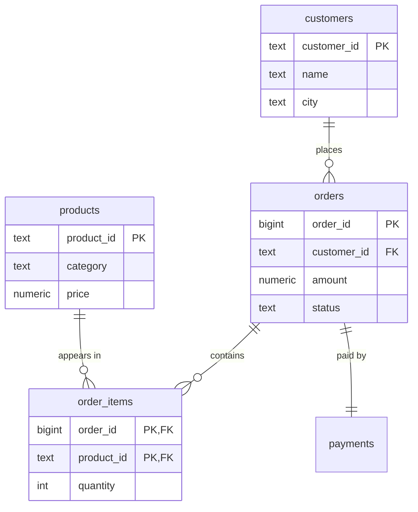

# Topic 1 — What SQL Is + The Relational Model

> **SQL · Phase 0 · Foundations · Lesson 1 of 4** — the mental model everything
> else stands on. You "know SQL functionally," so read fast where it's obvious —
> but do **not** skip §4 (keys) and §6 (relationships). That's where the holes are.

---

## 0. WHY this exists (read first)

You already write `SELECT ... WHERE ...`. So why start here?

Because interviewers and slow queries both punish the same gap: people who write
SQL but don't *think in the relational model*. They don't know why a JOIN can
suddenly double their row count, why a `NULL` breaks a filter, or why "one order
has many items" must be two tables, not one wide sheet.

🗣️ **In plain words:** SQL is the language. The **relational model** is the way of
thinking that makes the language make sense. Learn the thinking, and every JOIN,
GROUP BY, and window function later becomes obvious instead of memorized.

**Where a DE lives in this every day:**

- You design the tables data lands in (`orders`, `order_items`, `payments`).
- You decide the **keys** that keep data correct and joins fast.
- You reason about **relationships** (1-to-many) so pipelines don't silently
  duplicate or drop rows.
- 100% of DE job postings require SQL. This is the ground floor.

---

## 1. What SQL actually is

**SQL = Structured Query Language.** You tell the database *what* you want; the
database figures out *how* to get it.

```sql
SELECT city, COUNT(*) AS order_count
FROM orders
WHERE status = 'delivered'
GROUP BY city;
```

You never wrote a loop, opened a file, or said "scan row by row." That's the
whole point:

| Python (imperative) | SQL (declarative) |
|---------------------|-------------------|
| *how*: "loop over rows, add to a dict" | *what*: "count orders per city" |
| you control the steps | the **query optimizer** picks the steps |

🗣️ **In plain words:** in Python you're the cook following each step. In SQL you're
the customer — you order the dish, the kitchen (optimizer) decides how to make it.
That's why SQL can be *rewritten by the engine* to run faster without you changing
the result. Remember this — it's the seed of the whole Performance phase later.

### The families of SQL commands (know the names — interviews ask)

| Family | Full name | Commands | What it does |
|--------|-----------|----------|--------------|
| **DQL** | Data Query | `SELECT` | read data |
| **DML** | Data Manipulation | `INSERT`, `UPDATE`, `DELETE` | change rows |
| **DDL** | Data Definition | `CREATE`, `ALTER`, `DROP`, `TRUNCATE` | change *structure* (tables) |
| **DCL** | Data Control | `GRANT`, `REVOKE` | permissions |
| **TCL** | Transaction Control | `COMMIT`, `ROLLBACK`, `SAVEPOINT` | group changes safely |

As a DE you use **all five** — `DDL` to build tables, `DML` to load, `DQL` to
transform, `DCL` for access, `TCL` for safe writes. (Analysts mostly live in `DQL`.)

---

## 2. What "relational" means

A **relational database** stores data in **relations** — which is the formal word
for **tables**. That's it. The name isn't about tables "relating" to each other
(though they do) — it's from the math (*relational algebra*) the model is built on.

A table has:

```
            ┌──── columns (attributes) ────┐
            order_id | customer_id | amount | status
   rows ┌─   1001    |   C-17      | 1299   | delivered
 (tuples)│   1002    |   C-04      |    0   | delivered
        └─   1003    |   C-17      |  899   | cancelled
```

| Term (formal) | Term (everyday) | Meaning |
|---------------|-----------------|---------|
| Relation | Table | the whole grid |
| Tuple | Row / record | one entity instance (one order) |
| Attribute | Column / field | one property (amount) |
| Domain | Data type | allowed values for a column (integer, text, date) |
| Degree | — | number of columns |
| Cardinality | — | number of rows |

**Two rules the model promises (and why they matter):**

1. **Every value is atomic** — one cell holds *one* value, never a list. (No
   `items = "shoes, socks, cap"` in a single cell. That breaks querying.)
2. **Row order is not guaranteed** — the DB may store/return rows in any order
   unless you `ORDER BY`. Never assume "the first row." (This bites people who
   think a table is like an Excel sheet with fixed row positions.)

🗣️ **In plain words:** a relational table is a strict spreadsheet — every cell one
value, every column one type, and no guaranteed row order. The strictness is a
feature: it's what lets the engine query billions of rows correctly and fast.

---

## 3. Schema — the blueprint (this is DDL)

A **schema** is the table's design: its columns, their types, and its rules. Here
is a slice of your **OrderIQ** dataset expressed as real Postgres DDL:

```sql
CREATE TABLE customers (
    customer_id   TEXT PRIMARY KEY,        -- unique id for each customer
    name          TEXT NOT NULL,
    city          TEXT,                    -- nullable: some rows have no city
    signup_date   DATE
);

CREATE TABLE orders (
    order_id      BIGINT PRIMARY KEY,
    customer_id   TEXT NOT NULL REFERENCES customers(customer_id),
    order_date    DATE NOT NULL,
    status        TEXT NOT NULL,
    amount        NUMERIC(10,2)            -- money: fixed precision, NOT float
);
```

Read what the schema is *enforcing*:

- **Types** (`TEXT`, `BIGINT`, `DATE`, `NUMERIC`) — the *domain*. You cannot put
  `"hello"` in `amount`. The DB rejects bad data at the door.
- **`PRIMARY KEY`** — this column uniquely identifies a row (more in §4).
- **`NOT NULL`** — this value is mandatory.
- **`REFERENCES`** — a foreign key: every `orders.customer_id` must exist in
  `customers`. The DB *guarantees* no orphan orders (§5).
- **`NUMERIC(10,2)` for money** — a DE detail: never store money as `FLOAT`.
  `0.1 + 0.2 != 0.3` in float. `NUMERIC` is exact. Interviewers notice this.

🗣️ **In plain words:** the schema is the contract. It says exactly what shape the
data must be, and the database refuses anything that breaks the contract. Good
schema = bad data can't get in.

---

## 4. Keys — the heart of correctness ⭐

This is the section most "functional SQL" people are fuzzy on. Slow down.

### Primary Key (PK)
The column (or set of columns) that **uniquely identifies each row**. Must be
**unique** and **never NULL**.

```sql
order_id BIGINT PRIMARY KEY   -- no two orders share an id; every order has one
```

Why it matters to a DE: the PK is how you dedup, how you upsert (`ON CONFLICT`),
and what the DB indexes automatically for fast lookups.

### Composite (Compound) Key
A PK made of **multiple columns together** — needed when no single column is
unique. In `order_items`, one order has many lines; the *same* product could even
appear on two orders — so neither `order_id` nor `product_id` alone is unique, but
the **pair** is:

```sql
CREATE TABLE order_items (
    order_id    BIGINT REFERENCES orders(order_id),
    product_id  TEXT   REFERENCES products(product_id),
    quantity    INT NOT NULL,
    unit_price  NUMERIC(10,2) NOT NULL,
    PRIMARY KEY (order_id, product_id)     -- composite: the PAIR is unique
);
```

### Foreign Key (FK)
A column that **points to a PK in another table**. It enforces
**referential integrity** — you can't insert an `order_items` row for an
`order_id` that doesn't exist.

```sql
order_id BIGINT REFERENCES orders(order_id)   -- FK → orders.order_id
```

### Natural vs Surrogate key (DE decision — interviews probe this)

| | Natural key | Surrogate key |
|--|-------------|---------------|
| What | a real-world unique value (email, GSTIN) | a system-generated id (auto-increment, UUID) |
| Pro | meaningful, no extra column | stable, never changes, compact |
| Con | can change (email changes!), can be big | meaningless on its own |
| DE default | rarely for PK | **usually preferred** — warehouses lean on surrogate keys for dimensions |

### Candidate & Unique keys
A **candidate key** is any column(s) that *could* serve as PK (e.g. `email` is
unique and could identify a customer). You pick one candidate as the PK; others
you can enforce with `UNIQUE`. A **`UNIQUE` constraint** = "no duplicates" but
(unlike PK) *may* allow one NULL.

🗣️ **In plain words:** the primary key is the row's fingerprint — one per row,
never blank. A foreign key is a rowʼs pointer to another tableʼs fingerprint.
Composite key = fingerprint made of two columns together. Get keys right and your
joins, dedups, and upserts all just work.

---

## 5. Referential integrity — why FKs save your pipeline

An FK means the DB **refuses** to create orphans:

```sql
-- customers has no 'C-99'
INSERT INTO orders (order_id, customer_id, order_date, status, amount)
VALUES (9999, 'C-99', '2026-06-01', 'delivered', 500);
-- ERROR: insert or update violates foreign key constraint
--        Key (customer_id)=(C-99) is not present in table "customers".
```

Without this, an ETL bug could load 10,000 orders pointing at customers that don't
exist — and no one notices until a report is wrong. The FK turns a silent data-
quality disaster into a loud, immediate error. That's *defensive data engineering*.

> **Warehouse caveat (know this):** Snowflake/BigQuery/Redshift accept FK
> definitions but **don't enforce** them (for load speed). So in warehouses,
> integrity becomes *your* job — via dbt tests, `not_null`/`relationships` checks.
> This is exactly the "SQL as judgment" theme of 2026 DE.

---

## 6. Relationships — the shapes your data comes in ⭐

Tables connect in three cardinalities. Getting these right is *modeling*, and
modeling errors are the most expensive kind.

### One-to-Many (1:N) — the workhorse
One customer has many orders. One order has many order_items.

```
customers  1 ────< N  orders  1 ────< N  order_items >──── 1  products
```

The "many" side holds the FK. `orders.customer_id` points back to the "one."

### One-to-One (1:1)
One order has exactly one payment record. Rare; often could be one table, but
split for security or optional data.

### Many-to-Many (M:N) — needs a bridge table
Orders and products: one order has many products, one product is in many orders.
You **cannot** model M:N directly — you use a **junction / bridge table**
(`order_items`) that turns one M:N into two 1:N.

```
orders  1 ───< N  order_items  N >─── 1  products
```

🗣️ **In plain words:** "one has many" → the *many* side stores the pointer.
"Many to many" → you *must* invent a middle table to hold the pairs. `order_items`
isn't just line-items — it's the bridge that makes the whole model work.

### 🔴 Why this matters at query time (the fan-out trap)

Because one order has many items, joining `orders` to `order_items` **multiplies
rows**:

```sql
-- orders has 1 row for order 1001; order_items has 3 lines for it
SELECT o.order_id, o.amount, i.product_id
FROM orders o
JOIN order_items i ON i.order_id = o.order_id
WHERE o.order_id = 1001;
-- returns 3 rows — o.amount is REPEATED on each
```

Now `SUM(o.amount)` after that join = **3 × the real order amount**. This "fan-out"
double-counting bug is one of the most common real DE mistakes. You avoid it *only*
by understanding the 1:N relationship before you join. (We go deep on this in the
JOINs lesson.)

---

## 7. The mental model in one diagram



Read the crow's-foot: `||--o{` = one-to-many. `order_items` sits between `orders`
and `products` as the M:N bridge, with a **composite PK** of both FKs.

---

## 8. 🗣️ Plain-words recap

- **SQL** = you say *what* you want; the engine decides *how*. Declarative.
- **Relational DB** = data in **tables** (relations). Rows = records, columns =
  fields, each cell one value, no guaranteed row order.
- **Schema** = the blueprint/contract (types + constraints). Bad data can't enter.
- **Primary key** = the row's unique fingerprint (unique + not null).
  **Composite key** = fingerprint from 2+ columns. **Foreign key** = pointer to
  another table's PK.
- **Referential integrity** = FKs refuse orphan rows (but warehouses don't enforce
  — that becomes your dbt tests).
- **Relationships:** 1:N (many side holds FK), 1:1, and M:N (needs a bridge table
  like `order_items`).
- **Fan-out trap:** joining across a 1:N relationship multiplies rows — `SUM` after
  the join double-counts. Understand the shape *before* you join.

---

## 9. Revision — read before closing

The whole point of Phase 0 is to stop treating a table like an Excel sheet and
start treating it like a **typed, keyed relation with guaranteed rules**. The two
ideas that pay off forever: (1) **keys** — the PK identifies a row, the FK links
rows, and composite keys handle the "no single column is unique" cases like
`order_items`; and (2) **relationships** — almost all real data is 1-to-many, the
many-side carries the foreign key, and many-to-many always needs a bridge table.
Hold those two and the fan-out double-counting trap, and you already think about
data more correctly than most people writing SQL daily. Next lesson is the single
highest-leverage foundation topic: **the logical order a query actually executes
in** — the thing that explains why `WHERE` can't see a `SELECT` alias and why
`GROUP BY` happens before `SELECT`.

---

## 10. Test yourself — 10 questions (answers hidden — think first)

<details><summary>1. "Declarative vs imperative" — which is SQL, and what does that let the engine do?</summary>

SQL is **declarative** (you state *what*, not *how*). This lets the query optimizer
choose and rewrite the execution plan for speed without changing your result.
</details>

<details><summary>2. Name the 5 SQL command families and one command from each.</summary>

DQL (`SELECT`), DML (`INSERT`/`UPDATE`/`DELETE`), DDL (`CREATE`/`ALTER`/`DROP`),
DCL (`GRANT`/`REVOKE`), TCL (`COMMIT`/`ROLLBACK`).
</details>

<details><summary>3. Two guarantees the relational model makes about a table's cells and row order?</summary>

Every cell is **atomic** (one value, no lists). **Row order is not guaranteed** —
use `ORDER BY` if you need one.
</details>

<details><summary>4. What two rules must a PRIMARY KEY satisfy?</summary>

**Unique** across all rows and **never NULL**.
</details>

<details><summary>5. Why does <code>order_items</code> need a composite primary key?</summary>

Neither `order_id` nor `product_id` alone is unique (an order has many products; a
product appears in many orders). The **pair** `(order_id, product_id)` is unique.
</details>

<details><summary>6. What does a FOREIGN KEY enforce, and what error prevents?</summary>

Referential integrity — the referenced value must exist in the parent table. It
prevents **orphan rows** (e.g. an order for a non-existent customer).
</details>

<details><summary>7. Surrogate vs natural key — which do DEs usually prefer for a PK and why?</summary>

**Surrogate** (system-generated id). It's stable (never changes like an email
might), compact, and meaningless — ideal for warehouse dimension keys.
</details>

<details><summary>8. How do you model a many-to-many relationship? Give the OrderIQ example.</summary>

With a **junction/bridge table** that splits M:N into two 1:N. Orders ↔ products
via `order_items`.
</details>

<details><summary>9. In a 1:N relationship, which table holds the foreign key?</summary>

The **"many"** side. `orders.customer_id` (many) → `customers.customer_id` (one).
</details>

<details><summary>10. You JOIN <code>orders</code> to <code>order_items</code> then <code>SUM(orders.amount)</code>. Why is the total wrong?</summary>

The 1:N join **fans out** — each order row repeats once per item, so `amount` is
counted multiple times. Aggregate on `order_items` separately, or sum a
deduplicated order amount. (Deep dive in the JOINs lesson.)
</details>

---

## 11. Practice

👉 Do [`practice.md`](./practice.md) — you'll set up PostgreSQL/DuckDB with the
OrderIQ dataset and answer schema/key/relationship questions on real tables. No
heavy querying yet (that starts Topic 3) — this cements the *model*.

---

*Next: [Topic 2 — How a Query Actually Executes (logical order of operations)](../topic-2-query-execution-order/) ⭐ — the highest-leverage foundation lesson.*
