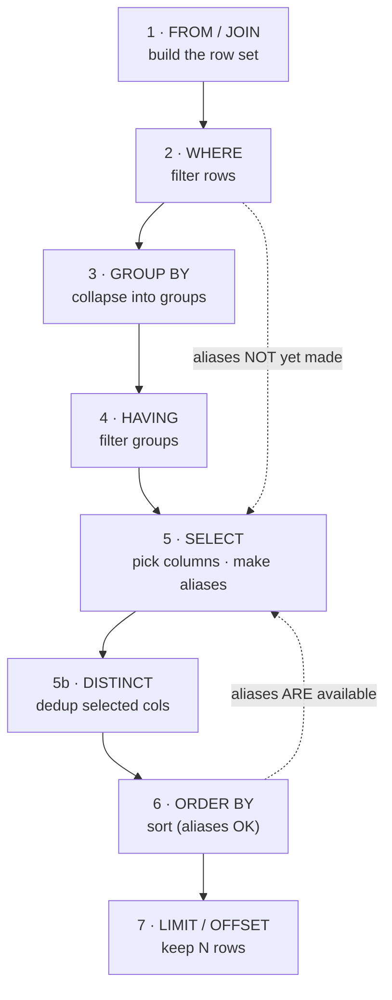

# Topic 2 — How a Query Actually Executes (the logical order of operations) ⭐

> **SQL · Phase 0 · Foundations · Lesson 2 of 4.** The 2026 research flags this as
> the **most-missed foundation** — and the reason "functional SQL" people hit walls.
> If you learn one thing in Phase 0, learn this.

---

## 0. WHY this exists (read first)

You write a query top-to-bottom: `SELECT` first, `FROM` next, `WHERE`, `GROUP BY`…
So you *assume* the database runs it in that order too.

**It doesn't.** SQL is executed in a completely different order than it's written.
This single fact explains a whole cluster of "why doesn't this work?!" errors:

- Why `WHERE` can't use a column alias you defined in `SELECT`.
- Why you must use `HAVING` (not `WHERE`) to filter an aggregate.
- Why `SELECT DISTINCT` + `ORDER BY` on a non-selected column fails.
- Why `GROUP BY` "loses" columns you didn't group or aggregate.

🗣️ **In plain words:** the order you *type* SQL is for humans. The order the
database *runs* it is different. Once you know the real order, half of SQL's
"weird rules" stop being weird — they become obvious.

**Where a DE uses this:** every day. Debugging a failing query, understanding why
a filter didn't apply, knowing where to put a condition for correctness *and*
speed — all flow from execution order.

---

## 1. Written order vs logical execution order

Here's a full query and the two orders side by side:

```sql
SELECT   city, COUNT(*) AS order_count          -- 5 (SELECT)  + aliases
FROM     orders                                 -- 1 (FROM)
WHERE    amount > 0                              -- 2 (WHERE)
GROUP BY city                                    -- 3 (GROUP BY)
HAVING   COUNT(*) > 10                            -- 4 (HAVING)
ORDER BY order_count DESC                         -- 6 (ORDER BY)
LIMIT    5;                                        -- 7 (LIMIT)
```

| Step | Clause | What it does |
|------|--------|--------------|
| **1** | `FROM` / `JOIN` | pick the tables, combine them → a working row set |
| **2** | `WHERE` | filter **individual rows** (no aggregates allowed yet) |
| **3** | `GROUP BY` | collapse rows into groups |
| **4** | `HAVING` | filter **groups** (aggregates allowed here) |
| **5** | `SELECT` | pick columns, compute expressions, **assign aliases** |
| **6** | `ORDER BY` | sort the final rows (can use `SELECT` aliases) |
| **7** | `LIMIT` / `OFFSET` | keep only N rows |

**The key jump:** `SELECT` is step **5**, but it's written **first**. That gap is
the source of almost every beginner error.

🗣️ **In plain words:** the database first *gathers* rows (`FROM`), *throws some
away* (`WHERE`), *groups* the rest (`GROUP BY`), *throws away* some groups
(`HAVING`), *then* decides what columns to show (`SELECT`), *then* sorts and cuts.
Naming the columns happens near the **end**, not the start.

---

## 2. Consequence #1 — `WHERE` can't see a `SELECT` alias

```sql
-- ❌ FAILS
SELECT amount * 0.18 AS gst
FROM orders
WHERE gst > 100;          -- ERROR: column "gst" does not exist
```

Why: `WHERE` runs at **step 2**. The alias `gst` isn't created until `SELECT` at
**step 5**. At step 2, `gst` literally doesn't exist yet.

**Fixes:**

```sql
-- Option A: repeat the expression (WHERE understands raw columns)
SELECT amount * 0.18 AS gst
FROM orders
WHERE amount * 0.18 > 100;

-- Option B: compute it first in a subquery/CTE, then filter the alias outside
WITH calc AS (
    SELECT amount * 0.18 AS gst FROM orders
)
SELECT gst FROM calc WHERE gst > 100;
```

🗣️ **In plain words:** you can't use a nickname before you've given it. `WHERE`
speaks before `SELECT` names anything, so `WHERE` only knows the raw column names.

---

## 3. Consequence #2 — `WHERE` vs `HAVING` (the classic interview question)

Both filter — but at **different steps**, so they filter different things.

```sql
SELECT   city, COUNT(*) AS n, SUM(amount) AS revenue
FROM     orders
WHERE    status = 'delivered'    -- step 2: filter ROWS (before grouping)
GROUP BY city                     -- step 3
HAVING   SUM(amount) > 50000;     -- step 4: filter GROUPS (after aggregation)
```

| | `WHERE` | `HAVING` |
|--|--------|----------|
| Runs at | step 2 (before GROUP BY) | step 4 (after GROUP BY) |
| Filters | individual **rows** | aggregated **groups** |
| Can use aggregates? | ❌ no (`SUM()` doesn't exist yet) | ✅ yes |
| Can use raw columns? | ✅ yes | only grouped ones |

```sql
WHERE COUNT(*) > 5   -- ❌ ERROR: aggregates not allowed in WHERE
HAVING COUNT(*) > 5  -- ✅ correct
```

**DE performance note:** put a condition in `WHERE` whenever you can — filtering
rows *before* grouping means fewer rows to group = faster. Only use `HAVING` for
conditions that genuinely need the aggregate. (Filtering early = less work is a
theme you'll see all through the Performance phase.)

🗣️ **In plain words:** `WHERE` filters the raw ingredients *before* cooking.
`HAVING` filters the finished dishes *after* cooking. You can't taste the soup
(`SUM`) before it's made — so aggregate filters must wait for `HAVING`.

---

## 4. Consequence #3 — `GROUP BY` and the "you must group or aggregate" rule

Once you `GROUP BY`, each group becomes **one output row**. So every column in
`SELECT` must be either:

- a column you **grouped by**, or
- wrapped in an **aggregate** (`COUNT`, `SUM`, `AVG`, `MAX`, `MIN`).

```sql
-- ❌ FAILS in Postgres
SELECT city, status, COUNT(*)
FROM orders
GROUP BY city;      -- ERROR: "status" must appear in GROUP BY or an aggregate
```

Why: the group `city='Pune'` may contain many different `status` values. Which one
should the single output row show? The DB refuses to guess.

```sql
-- ✅ either group by it too...
SELECT city, status, COUNT(*) FROM orders GROUP BY city, status;
-- ✅ ...or aggregate it
SELECT city, MAX(status) AS a_status, COUNT(*) FROM orders GROUP BY city;
```

🗣️ **In plain words:** after grouping, a group is one row. Every column must have
exactly one clear value for that row — so it's either the thing you grouped on, or
a summary (count/sum/etc.). No loose columns allowed.

> **Dialect note:** MySQL historically let you select ungrouped columns (returning
> a random value) — a footgun. Postgres, Snowflake, BigQuery reject it. Write the
> strict, correct version always.

---

## 5. Consequence #4 — `ORDER BY` **can** use a `SELECT` alias

`ORDER BY` is step **6**, *after* `SELECT` (step 5). So by then, aliases exist:

```sql
-- ✅ WORKS — ORDER BY sees the alias
SELECT city, COUNT(*) AS order_count
FROM orders
GROUP BY city
ORDER BY order_count DESC;    -- fine: 'order_count' created in step 5
```

This is the mirror image of §2. Same alias, different clause, different answer —
purely because of *when* each clause runs. This is the "aha" of the whole lesson:
**the same alias is invisible to `WHERE` but visible to `ORDER BY`.**

---

## 6. Where `SELECT DISTINCT` fits

`DISTINCT` runs **after** `SELECT` (step 5) and **before** `ORDER BY` (step 6). So
it dedupes the *selected* columns. This causes a subtle error:

```sql
-- ❌ FAILS
SELECT DISTINCT city
FROM orders
ORDER BY amount;    -- ERROR: ORDER BY 'amount' not in the DISTINCT select list
```

After `DISTINCT city`, the only column that survives is `city`. `amount` was
thrown away, so you can't sort by it. You can only `ORDER BY` columns that are in
the `DISTINCT` list.

---

## 7. The full picture in one diagram



The dotted lines are the whole lesson: `WHERE` runs before aliases exist;
`ORDER BY` runs after.

---

## 8. 🗣️ Plain-words recap

- SQL is **written** `SELECT…FROM…WHERE…` but **runs**
  `FROM → WHERE → GROUP BY → HAVING → SELECT → DISTINCT → ORDER BY → LIMIT`.
- `SELECT` (and its aliases) happens **near the end** (step 5).
- `WHERE` (step 2) **can't** use a `SELECT` alias or an aggregate — repeat the
  expression or use a CTE.
- `HAVING` (step 4) filters **groups** and **can** use aggregates; `WHERE` filters
  **rows** and can't. Filter early in `WHERE` for speed.
- After `GROUP BY`, every `SELECT` column must be **grouped or aggregated**.
- `ORDER BY` (step 6) **can** use `SELECT` aliases — the mirror image of `WHERE`.
- `SELECT DISTINCT` can only `ORDER BY` columns it kept.

---

## 9. Revision — read before closing

Memorize the running order like a phone number:
**FROM → WHERE → GROUP BY → HAVING → SELECT → ORDER BY → LIMIT.** Everything
confusing about SQL syntax falls out of it. `WHERE` can't see aliases or
aggregates because it runs *before* `SELECT` creates them; `HAVING` can, because it
runs *after* grouping; `ORDER BY` can use aliases because it runs *after* `SELECT`.
The `GROUP BY` "must group or aggregate" rule is just the DB refusing to guess a
value for a collapsed group. When a query throws "column does not exist" or "must
appear in GROUP BY," don't guess — **ask which step that clause runs in, and what
exists at that step.** That single habit makes you debug SQL like an engineer.
Next lesson turns this into daily practice: `SELECT`, `WHERE`, operators, and the
`NULL` traps that even experienced people get wrong.

---

## 10. Test yourself — 10 questions (answers hidden — think first)

<details><summary>1. Write the 7-step logical execution order from memory.</summary>

FROM/JOIN → WHERE → GROUP BY → HAVING → SELECT (+DISTINCT) → ORDER BY → LIMIT.
</details>

<details><summary>2. Why does <code>WHERE gst > 100</code> fail when <code>gst</code> is a SELECT alias?</summary>

`WHERE` (step 2) runs before `SELECT` (step 5) creates the alias, so `gst` doesn't
exist yet. Repeat the expression or wrap in a CTE.
</details>

<details><summary>3. Why does <code>ORDER BY order_count</code> succeed with the same kind of alias?</summary>

`ORDER BY` (step 6) runs *after* `SELECT` (step 5), so the alias already exists.
</details>

<details><summary>4. State the difference between WHERE and HAVING in one line each.</summary>

`WHERE` filters **rows before grouping** (no aggregates). `HAVING` filters
**groups after aggregation** (aggregates allowed).
</details>

<details><summary>5. Why does <code>WHERE COUNT(*) > 5</code> error?</summary>

Aggregates don't exist at step 2 (`WHERE`); grouping/aggregation happen at steps
3–4. Use `HAVING COUNT(*) > 5`.
</details>

<details><summary>6. After <code>GROUP BY city</code>, why can't you also SELECT a raw <code>status</code>?</summary>

The group may contain many `status` values; the single output row has no unique
value to show. Group by it too, or aggregate it.
</details>

<details><summary>7. For performance, should a non-aggregate filter go in WHERE or HAVING? Why?</summary>

`WHERE` — it removes rows *before* grouping, so there's less data to aggregate =
faster.
</details>

<details><summary>8. Why does <code>SELECT DISTINCT city ... ORDER BY amount</code> fail?</summary>

`DISTINCT` keeps only `city`; `amount` was dropped, so `ORDER BY` can't reference
it. Order only by columns in the DISTINCT list.
</details>

<details><summary>9. Where does JOIN happen in the order, and why does that matter for filtering?</summary>

At step 1 (`FROM`/`JOIN`), before `WHERE`. A condition in the `JOIN ... ON` vs in
`WHERE` can change results for outer joins (covered in the JOINs lesson).
</details>

<details><summary>10. A query errors with "column must appear in GROUP BY." What's your debugging thought?</summary>

"Which step runs this, and what values exist there?" After grouping, every SELECT
column must be grouped or aggregated — add it to `GROUP BY` or wrap it in an
aggregate.
</details>

---

## 11. Practice

👉 [`practice.md`](./practice.md) — you'll *deliberately trigger* each error on the
OrderIQ tables in DuckDB, then fix it, and predict output before running. Breaking
it on purpose is how this becomes permanent.

---

*Next: [Topic 3 — SELECT, WHERE, filtering, operators & NULL basics](../topic-3-select-where-null/).*
