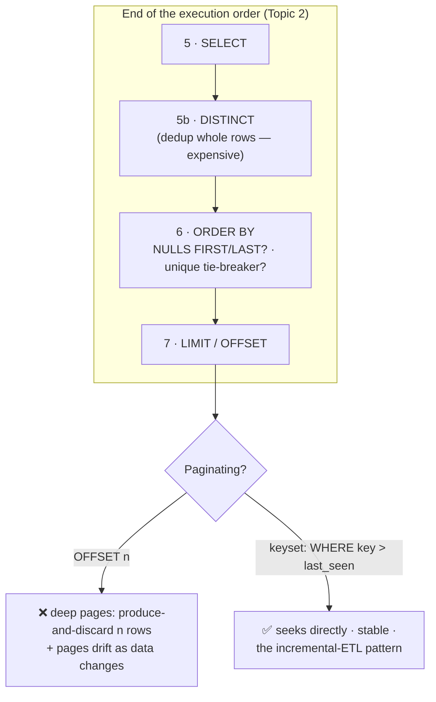

# Topic 4 — Sorting · DISTINCT · LIMIT · Pagination

> **SQL · Phase 0 · Foundations · Lesson 4 of 4 — finishes Phase 0.** These look
> like the "easy" clauses. The hidden depth: where NULLs sort, why ties make your
> "top 10" random, why DISTINCT is expensive, and why page-500 pagination kills
> databases.

> 🎯 **First principle:** you don't own this until you can **BUILD** (top-N and
> paginated queries on OrderIQ), **BREAK** (unstable ties, the OFFSET cliff), and
> **EXPLAIN** why row order doesn't exist without ORDER BY. [`practice.md`](./practice.md) drives it.

---

## 0. WHY this exists

Remember Topic 1: **a table has no guaranteed row order.** The database returns
rows in whatever order is fastest *today* — which can change tomorrow after an
update or a version upgrade. So any time order matters — "top 10 cities," "latest
orders," "page 3 of results" — **you** must impose the order explicitly.

🗣️ **In plain words:** a table is a bag, not a list. If you want the contents in a
line, you must line them up yourself (`ORDER BY`) — every single time. "It came out
sorted yesterday" means nothing.

**Where a DE uses this:** every ranking ("top sellers"), every export ("latest 1000
rows"), every API/dashboard page, every dedup. And the traps here produce bugs that
*look* random — the worst kind.

---

## 1. ORDER BY — imposing order

```sql
SELECT order_id, city, amount
FROM orders
ORDER BY amount DESC;            -- highest first (ASC is the default)
```

### Multi-column sort — tie-breakers

```sql
ORDER BY city ASC, amount DESC
-- sort by city A→Z; WITHIN each city, highest amount first
```

Read it as: first column sorts; the next column only breaks ties within equal
values of the previous one.

### Sort by expression or alias

```sql
SELECT city, SUM(amount) AS revenue
FROM orders
GROUP BY city
ORDER BY revenue DESC;        -- alias works: ORDER BY runs AFTER SELECT (Topic 2!)
ORDER BY SUM(amount) DESC;    -- expression works too — same thing
```

> Avoid `ORDER BY 2` (positional). It silently changes meaning when someone edits
> the SELECT list. Name what you sort by.

### 🔴 Trap 1 — where do NULLs sort?

`NULL` is "unknown," so where does it go in a sort? **Engines disagree:**

| Engine | `ORDER BY x ASC` puts NULLs… | `DESC` |
|--------|------------------------------|--------|
| PostgreSQL / DuckDB / Oracle | **last** | first |
| MySQL / SQL Server | **first** | last |

So `ORDER BY amount DESC LIMIT 10` in Postgres puts **NULL amounts at the top of
your "top 10"** — garbage rows above your real biggest orders.

**Fix — say it explicitly, always, when NULLs exist:**

```sql
ORDER BY amount DESC NULLS LAST     -- Postgres/DuckDB: real values first
```

🗣️ **In plain words:** NULLs are gatecrashers with no ticket — each database seats
them differently (front row or back row). If your column can be NULL, *tell* the
database where to seat them (`NULLS LAST`), or they'll photobomb your top-10.

### 🔴 Trap 2 — ties make results non-deterministic

```sql
SELECT order_id, amount FROM orders
ORDER BY order_date DESC
LIMIT 10;
```

If 30 orders share the latest date, **which 10 you get is arbitrary** — and can
change between runs. Your "same" query returns different rows today vs tomorrow;
your dashboard flickers; your incremental export skips rows.

**Fix — always add a unique tie-breaker:**

```sql
ORDER BY order_date DESC, order_id DESC    -- order_id (PK) makes it deterministic
LIMIT 10;
```

**Rule:** any `ORDER BY` used with `LIMIT`/pagination must end in a **unique
column**. This is a real production-bug class, not pedantry.

---

## 2. DISTINCT — dedup, at a price

```sql
SELECT DISTINCT city FROM orders;            -- each city once
SELECT DISTINCT city, status FROM orders;    -- each (city,status) COMBINATION once
```

Note: `DISTINCT` applies to the **whole row**, not just the first column.
`DISTINCT city, status` ≠ "distinct cities."

### Count distinct — the everyday form

```sql
SELECT COUNT(DISTINCT customer_id) AS unique_customers FROM orders;
```

### Why DISTINCT is expensive (DE lens)

To dedup, the engine must **compare every row against every other** — via sort or
hash across the whole result. Small data: fine. Billions of rows: a heavy
operation (in Spark, it's a full shuffle — you saw this in the Spark series; same
reason here).

**Habits:**
- Don't sprinkle `DISTINCT` on "just in case." If duplicates appear, first ask
  **why** — usually a join fanned out (Topic 1!). `DISTINCT` there is a band-aid
  hiding a modeling bug.
- `DISTINCT` and `GROUP BY` with no aggregates do the same thing:
  `SELECT DISTINCT city FROM orders` ≡ `SELECT city FROM orders GROUP BY city`.

🗣️ **In plain words:** `DISTINCT` means "check every row against every other row" —
that's expensive, and it often just hides the real bug (a fan-out join upstream).
Reach for *why are there duplicates* before reaching for `DISTINCT`.

### From Topic 2 (still true): `SELECT DISTINCT city ... ORDER BY amount` fails —
you can only sort by columns that survived the DISTINCT.

---

## 3. LIMIT & OFFSET — taking a slice

```sql
SELECT * FROM orders ORDER BY amount DESC NULLS LAST, order_id LIMIT 10;      -- top 10
SELECT * FROM orders ORDER BY order_id LIMIT 20 OFFSET 40;                     -- rows 41–60 ("page 3")
```

- `LIMIT n` — keep n rows (runs **last**, step 7 in the execution order).
- `OFFSET m` — skip m rows first.
- **`LIMIT` without `ORDER BY` = arbitrary rows.** Fine for "peek at the data,"
  meaningless for "top" anything.

> Dialects: Postgres/DuckDB/MySQL use `LIMIT/OFFSET`; SQL Server uses
> `TOP n` / `OFFSET … FETCH`; BigQuery/Snowflake support `LIMIT`. Same concept.

---

## 4. Pagination — the two patterns ⭐

Every dashboard, API, and export pages through data. Two ways to do it:

### Pattern A — OFFSET pagination (simple, degrades badly)

```sql
-- page N (100 rows/page):
SELECT * FROM orders ORDER BY order_id LIMIT 100 OFFSET (N-1)*100;
```

**The OFFSET cliff:** `OFFSET 100000` doesn't *jump* to row 100,001 — the engine
must **produce and throw away** 100,000 rows first, every request. Page 1 is
instant; page 1000 crawls; deep pages hammer the database.

**Second problem — drifting pages:** if new orders arrive between your page-2 and
page-3 requests, rows shift → you see duplicates or miss rows across pages.

### Pattern B — Keyset (cursor / seek) pagination — the DE way

Remember the last value you saw; ask for rows *after* it:

```sql
-- first page:
SELECT * FROM orders ORDER BY order_id LIMIT 100;
-- next page (last order_id seen was 4520):
SELECT * FROM orders WHERE order_id > 4520 ORDER BY order_id LIMIT 100;
```

- **Fast at any depth** — `WHERE order_id > 4520` seeks directly (index-friendly);
  nothing is produced-and-discarded.
- **Stable** — new rows don't shift your position.
- Requirement: a **unique, ordered key** to seek on (another reason ORDER BY must
  end in a unique column).

🗣️ **In plain words:** OFFSET is like finding page 500 of a book by turning pages
one by one from page 1 — every time. Keyset is a **bookmark**: "continue after
order 4520." This exact pattern is also how incremental ETL pulls work: "give me
everything after the last ID/timestamp I loaded." Learn it here, reuse it forever.

---

## 5. The 3-step example — mechanic → OrderIQ → production

### Step 1 — tiny mechanic

```sql
SELECT * FROM (VALUES (1),(3),(NULL),(2)) t(x)
ORDER BY x DESC;             -- where did NULL go? (DuckDB: first!)
ORDER BY x DESC NULLS LAST;  -- now it's controlled
```

### Step 2 — OrderIQ: a correct top-10

```sql
-- Top 10 delivered orders by amount — deterministic, NULL-safe:
SELECT order_id, city, amount
FROM orders
WHERE status = 'delivered' AND amount IS NOT NULL
ORDER BY amount DESC, order_id            -- unique tie-breaker
LIMIT 10;
```

### Step 3 — production: incremental export via keyset

```sql
-- Nightly job exports new orders since the last run (bookmark = max id loaded):
SELECT * FROM orders
WHERE order_id > :last_loaded_id          -- seek, not skip
ORDER BY order_id
LIMIT 50000;
-- Load them, save the new max(order_id) as tomorrow's bookmark.
-- This IS incremental ingestion — ADF/Airflow jobs do exactly this.
```

---

## 6. Diagram — where these run + the pagination fork



---

## 7. 🗣️ Plain-words recap

- Tables are **bags** — no order exists until `ORDER BY` imposes it, every time.
- Multi-column sort = first column sorts, later columns break ties.
- **NULLs sort differently per engine** — say `NULLS LAST` explicitly when the
  column can be NULL.
- **Ties + LIMIT = random results.** End every ranking/pagination `ORDER BY` with a
  **unique column** (the PK).
- `DISTINCT` dedups **whole rows** and is expensive; duplicates usually mean a
  fan-out join upstream — fix the cause, don't band-aid.
- `LIMIT` slices; **without ORDER BY it's arbitrary rows**.
- Pagination: **OFFSET** = turn pages from the start every time (deep pages crawl,
  pages drift). **Keyset** (`WHERE key > last_seen`) = bookmark — fast, stable, and
  the same pattern as incremental ETL.

---

## 8. Revision — read before closing

Order does not exist until you create it — and creating it *correctly* means
handling the two silent killers: **NULLs** (each engine seats them differently;
write `NULLS LAST` yourself) and **ties** (equal sort values + `LIMIT` = arbitrary,
changing results; always end the sort with a unique key). `DISTINCT` is a
whole-row dedup that costs a full compare of the result — and if you feel the urge
to add it, first check whether a fan-out join upstream is the real bug. For slicing,
`LIMIT` is honest only with an `ORDER BY`; for paging, `OFFSET` re-produces and
throws away everything before your page while **keyset pagination** bookmarks the
last key and seeks past it — the same "give me rows after X" idea that powers
incremental ETL loads. **Phase 0 is done**: you now hold the relational model,
the execution order, NULL logic, and deterministic ordering — the four mental
models everything else (JOINs next) stands on.

---

## 9. Test yourself — 10 questions (answers hidden — think first)

<details><summary>1. Why must you write ORDER BY even if results "came out sorted" without it?</summary>
Row order is never guaranteed — it's an accident of storage/plan and can change any time. Only ORDER BY imposes order.
</details>
<details><summary>2. In <code>ORDER BY city, amount DESC</code>, what does <code>amount DESC</code> apply to?</summary>
It breaks ties *within* each city — rows with equal city sort by amount, highest first. (And DESC applies only to amount; city is still ASC.)
</details>
<details><summary>3. Where do NULLs go in Postgres/DuckDB with <code>ORDER BY x DESC</code>? Fix?</summary>
First — above all real values (they sort as "largest"). Fix: <code>ORDER BY x DESC NULLS LAST</code>.
</details>
<details><summary>4. Your "top 10 by date" returns different rows on each run. Why, and fix?</summary>
Ties on the date — which 10 of the tied rows you get is arbitrary. Add a unique tie-breaker: <code>ORDER BY order_date DESC, order_id DESC</code>.
</details>
<details><summary>5. <code>SELECT DISTINCT city, status</code> — distinct what?</summary>
Distinct **combinations** of (city, status) — not distinct cities. DISTINCT is whole-row.
</details>
<details><summary>6. You see duplicates after a join and want to add DISTINCT. What should you check first?</summary>
Whether the join fanned out (1:N multiplying rows). DISTINCT would hide the modeling bug and cost a full dedup.
</details>
<details><summary>7. What's wrong with <code>LIMIT 10</code> and no ORDER BY for "10 biggest orders"?</summary>
LIMIT without ORDER BY returns 10 *arbitrary* rows — it slices whatever order the engine happened to produce.
</details>
<details><summary>8. Why is <code>OFFSET 100000</code> slow?</summary>
The engine must generate and discard 100,000 rows before returning yours — every request, over and over.
</details>
<details><summary>9. Write the keyset version of "next 100 after order_id 4520."</summary>
<code>SELECT … WHERE order_id > 4520 ORDER BY order_id LIMIT 100</code> — seeks directly, stable under inserts.
</details>
<details><summary>10. How does keyset pagination relate to incremental ETL?</summary>
Same pattern: remember a bookmark (last id/timestamp loaded), then "give me everything after it." That's how nightly incremental pulls work.
</details>

---

## 10. Practice

👉 [`practice.md`](./practice.md) — on OrderIQ you'll watch NULLs crash a top-10,
make ties flip results, race OFFSET vs keyset on deep pages, and build the
incremental-export query. Then take the **Phase-0 gate**. BUILD → BREAK → EXPLAIN.

---

*Phase 0 complete → do the Phase-0 revision, then: [Phase 1 Topic 1 — JOINs Deep](../../phase-1-core-querying/topic-1-joins-deep/).*
